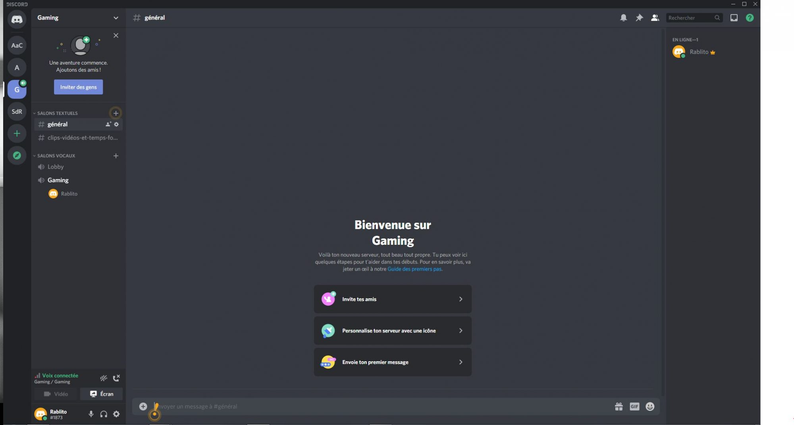
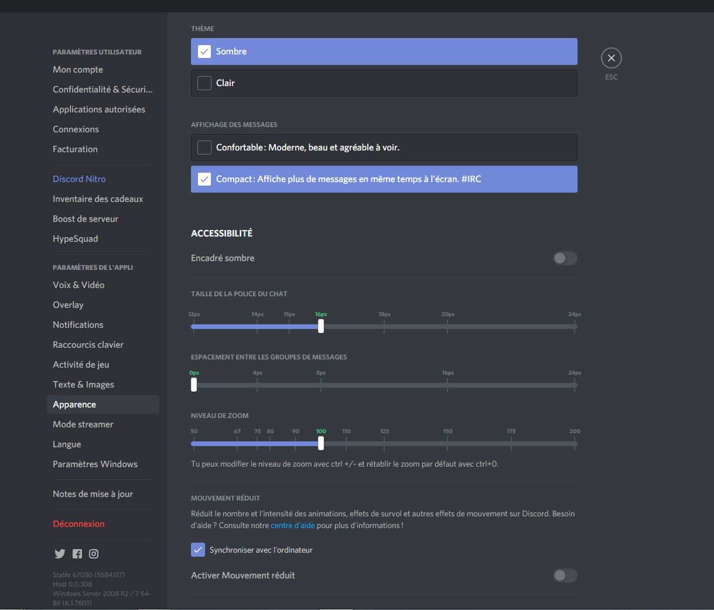
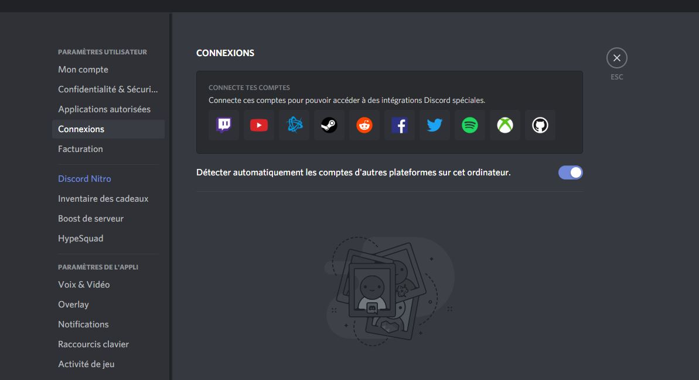
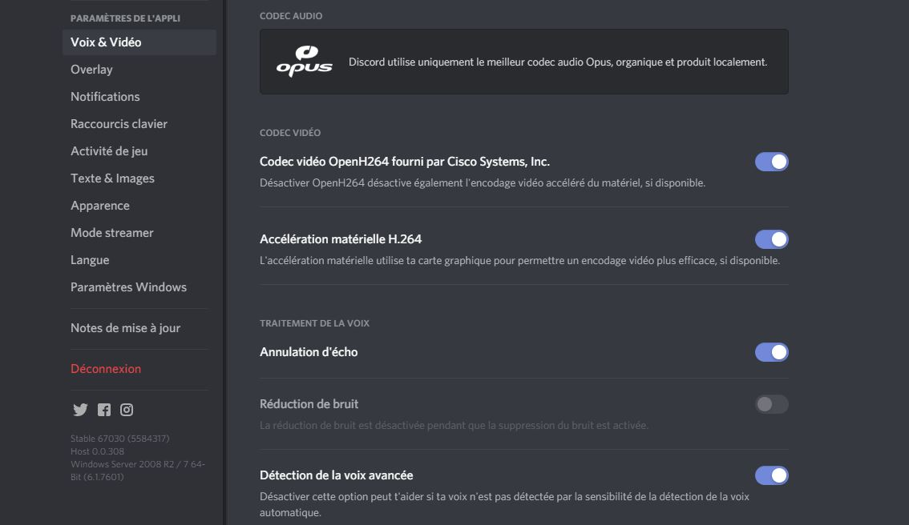
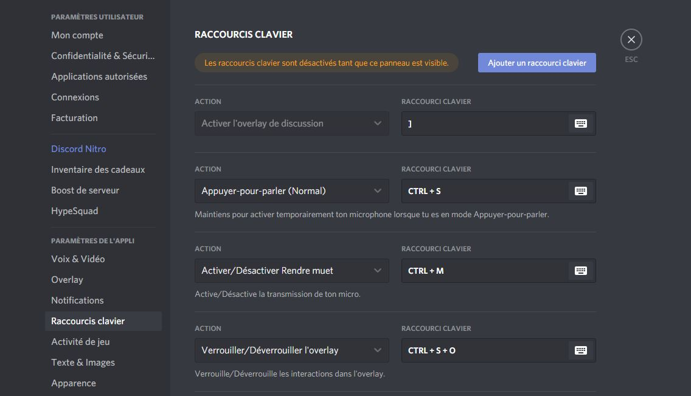
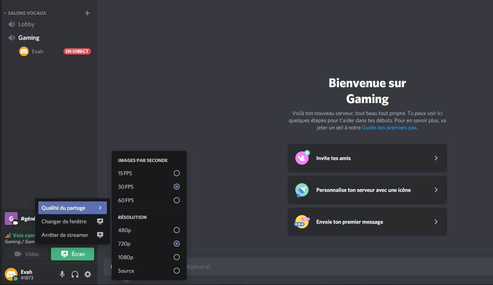
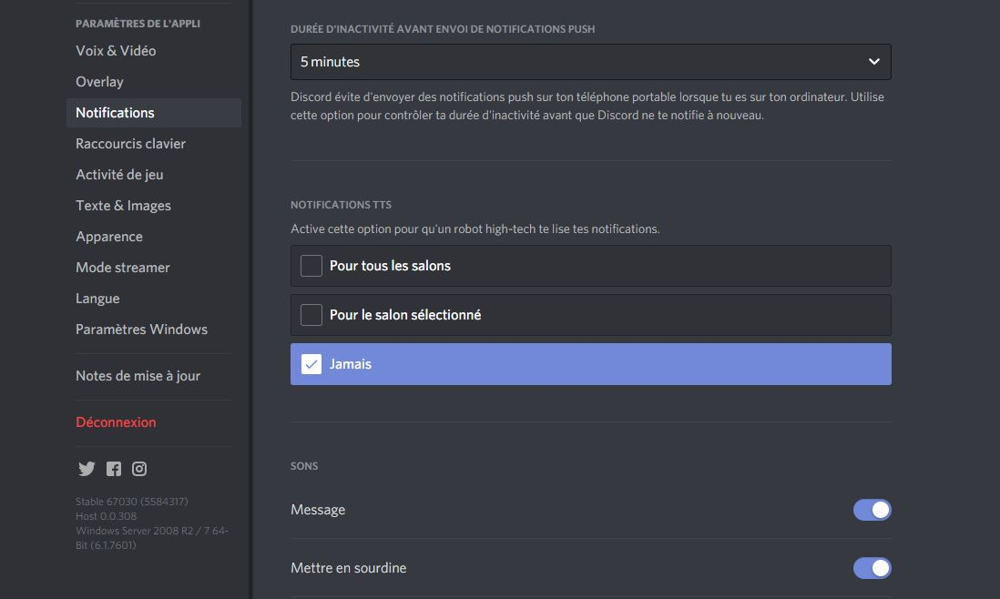

Le logiciel [Discord](https://discord.com/) est basée sur la messagerie numérique sous toutes ses formes. Bien qu'il soit peut-être plus connu des joueurs, il peut alimenter les groupes de discussions pour une foule de raisons, comme un [Slack](https://slack.com/intl/en-fr/) plus cool et moins formel. Que tu sois sur Discord depuis des années ou que tu viennes d'ouvrir l'application pour la première fois, ces conseils peuvent t’aider à tirer le meilleur parti de la plateforme.

<!--more-->

## **1) Place tes serveurs dans des dossiers**

Une application Discord bien organisée mène à une vie plus heureuse et plus épanouie. C'est ce qu’on a entendu dire. Et, le logiciel te permet maintenant d'organiser tous les serveurs dont tu fais partie en dossiers. Si tu es impliqué dans un grand nombre de serveurs, cela peut être un moyen vraiment utile de les trier.

**Pour créer un dossier**, il suffit de glisser et de déposer un serveur sur un autre ; tu peux ensuite ajouter d'autres serveurs si besoin, en faisant le même geste. Tu peux donner aux dossiers les noms que tu veux, les marquer comme étant lus en groupe, ajouter un code couleur et classer les serveurs bien plus facilement.

## **2) Garder Discord compact**

L'interface de Discord peut être très chargée, mais tu as plusieurs façons de gérer cela. Tout d'abord, va dans les **Paramètres utilisateur** (via l'icône en forme de roue dentée, en bas à gauche) puis dans **Apparence** pour passer à un mode compact qui supprime une partie de l'espacement. D'ailleurs, cela te permet d'adopter un look [IRC](https://fr.wikipedia.org/wiki/Internet_Relay_Chat) plus old-school.

Si tu vas dans le **panneau Texte & Images** juste au-dessus, tu peux réduire davantage la quantité de distractions à l'écran. Ces paramètres-ci te permettent de désactiver les aperçus des liens, de désactiver les GIF animés et les réactions des émojis, voire même de supprimer les aperçus des vignettes d'images.

## **3) Ajuster les volumes des utilisateurs individuellement**

Il se peut que certains de tes contacts Discord soient plus silencieux ou simplement plus intéressants que d'autres. Si c'est le cas, tu peux augmenter leur niveau de volume audio, indépendamment des autres. Tu peux également réduire le volume de ceux qui deviennent trop bruyants.

Pour ce faire, tu dois être sur le bureau ou dans une application web. Clique droit avec la souris sur un nom d'utilisateur, n'importe où dans l'interface, et le curseur du volume utilisateur apparaît. Alors, tu peux ajuster selon tes besoins.

Les autres options énumérées ici te permettent de mettre les utilisateurs en sourdine, de leur envoyer directement un message ou de masquer leur flux vidéo.

## **4) Partage tes goûts en matière de musique**

Tu veux faire savoir à tous tes amis de Discord ce que tu écoutes sur [Spotify](https://www.spotify.com/fr/) ? Bien sûr, tu peux le faire. Tu peux même te connecter sur ton compte de streaming musical en cliquant sur **Paramètres utilisateur** (l'icône en forme de roue dentée, en bas à gauche), puis sur **Connexions**. Il ne te reste plus qu'à choisir l'icône Spotify dans la liste.

Ainsi, ta chanson en cours de lecture apparaîtra sur ton profil, si tu le souhaites, et tes amis pourront même l'écouter avec toi (s'ils sont abonnés à Spotify Premium). Tu peux même inviter des contacts et des chaînes à t’écouter à partir de la zone de saisie principale.

## **5) Tirez le meilleur parti de Markdown**

Discord prend en charge [Markdown](https://fr.wikipedia.org/wiki/Markdown), bien connu des codeurs chevronnés et des vétérans de la messagerie instantanée. Dans Discord, Markdown te permet essentiellement d'ajouter un formatage à ton texte à l'aide de codes de style rapides, de sorte que si tu mets des astérisques autour d'une ligne de texte, cela équivaut à une mise en gras instantanée par exemple.

Tu peux obtenir tous les détails sur Markdown inside Discord [ici](https://support.discord.com/hc/fr/articles/210298617-Bases-de-la-mise-en-forme-de-texte-Markdown-mise-en-forme-du-chat-gras-italique-soulign%C3%A9-). En effet, c'est un moyen facile de rendre tes discussions plus lisibles. Tu peux non seulement ajouter des effets de gras, d'italique et de barré au texte que tu saisis, mais aussi créer des citations et des blocs de code.

## **6) Règle tes paramètres audios**

Pour le chat vocal sur Discord, il est essentiel que tu puisses être entendu correctement. L'application t’apporte une aide précieuse à cet égard.

- Clique sur **Paramètres utilisateur** (l'icône en forme de roue dentée, en bas à gauche),
- puis sur **Voix et vidéo**,
- Ensuite, descend jusqu’à **Avancés** pour voir comment Discord traite ton audio.

Les réglages de la qualité audio devraient être activés par défaut. Toutefois, tu peux les utiliser si tu disposes d'un micro de qualité particulièrement bonne ou si tu as ton propre logiciel de réglage audio en place. Utilise le test "Vérifions ça" pour entendre un enregistrement de ta voix.

## **7) Connais tes raccourcis**

Connaître les bons [raccourcis clavier](https://tobal.fr/trouver-rapidement-les-raccourcis-dune-application-sur-mac/) peut te faciliter la vie avec n'importe quelle application et te permettre de t’y retrouver beaucoup plus rapidement. C'est ce que fait Discord- tu peux trouver une liste officielle pour Windows [ici](https://support.discord.com/hc/fr/articles/225977308--Windows-Raccourcis-Discord) et macOS [ici](https://support.discord.com/hc/fr/articles/225878307--macOS-Raccourcis-clavier-Discord), couvrant tout, du changement de chaîne à la mise en sourdine de ton ordinateur.

Nos favoris sont :

- **Shift+Esc** pour marquer tout ce qui est lu sur le serveur actuel,
- **Ctrl+E** (Windows) ou Cmd+E (macOS) pour afficher le sélecteur de GIF et d'emoji,
- **Ctrl+/** (Windows) ou Cmd+/ (macOS) pour afficher tous les raccourcis à l'écran.

## **8) Définis tes raccourcis clavier**

Tu peux également créer tes propres raccourcis clavier, grâce à ce que Discord appelle des [keybinds](https://support.discord.com/hc/fr/articles/217083547-Comment-ajouter-des-raccourcis-clavier-).

Si tu es relativement nouveau dans l'application, tu n'as peut-être pas réalisé que ces raccourcis te font [gagner du temps](https://tobal.fr/comment-gagner-du-temps-dans-la-vie-de-tous-les-jours/), ou que tu peux les personnaliser à ta convenance.

Clique sur l'icône **Paramètre utilisateur** située près de ton nom d'utilisateur dans le coin inférieur gauche de l'interface de l'application. Puis, choisis **Raccourcis clavier** pour configurer tes raccourcis. Tu peux assigner des touches à une variété de fonctions. Notamment : la mise en sourdine, le mode "appuyer pour parler", le mode "streamer" et l'activation ou la désactivation de l’overlay.

## **9) Partage ton écran**

Pratique à connaître au cas où tu ne pourrais pas utiliser Zoom. Si tu es dans un appel vidéo fermé, clique sur le bouton **Partage d'écran** sous les vignettes pour partager ton écran. Ce bouton ressemble à une flèche à l'intérieur d'un moniteur. Tu peux partager tout ton bureau ou une fenêtre de programme spécifique.

Tu peux également cliquer sur le bouton "**Go Live**" à côté de ton nom dans un canal vocal (il ressemble au bouton "Screenshare"). Ainsi, tu vas pouvoir lancer un flux avec l'ensemble de ton bureau ou une certaine application. Certains extras, comme le partage audio, sont limités à l'application Windows.

## **10) Vas-y doucement sur les notifications**

En ces temps de surcharge de notifications, Discord te donne un certain niveau de contrôle sur ce qui t’est demandé. En effet, cela s'étend de la [désactivation des notifications](https://tobal.fr/petit-secret-de-productivite-le-mode-avion/) de l'application Discord sur ton téléphone ou ton ordinateur, à la connexion.

Tu peux modifier la durée pendant laquelle Discord attend que tu sois inactif sur l'ordinateur avant de réactiver les alertes sur ton téléphone portable. Sur le bureau, va dans le **panneau des paramètres utilisateur**, et choisis **Notifications** puis « Durée d’inactivité avant envoie de Notifications Push ».
