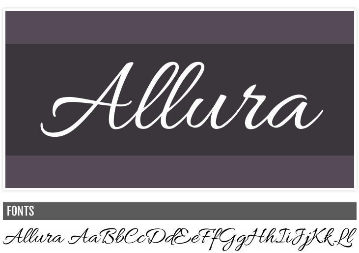

_Mise à jour le 29/05/2020_.

Ah, les polices, toute une histoire. Que ce soit pour vos documents, présentations, designs de flyer ou d'invitation, et vos sites web, elles vous permettent de vraiment personnaliser votre contenu texte.

Il y a des fois où l'on souhaite avoir une effet "manuscrit", comme si on avait écrit le texte au stylo. Les polices manuscrites sont alors la solution idéale pour reproduire cet effet.

<!--more-->

Des polices d'écriture manuscrite, sur internet, il y en a foison. Tellement que, parfois, il est difficile de faire son choix. Heureusement pour vous, voici **une sélection de 20 polices manuscrites** élégantes prêtes à l'emploi, que vous pourrez utiliser gratuitement. Il vous suffit de cliquer sur le nom de la police pour être dirigé vers sa page de téléchargement.

[Allura](http://www.fontsquirrel.com/fonts/allura)

[Amplify](http://www.dafont.com/fr/amplify.font)

[Billion Stars](http://www.fontspace.com/m%C3%A5ns-greb%C3%A4ck/billion-stars-personal-use)

[Black Jack](http://www.fontsquirrel.com/fonts/BlackJack)

[Chocolate Covered Raindrops](http://www.fontspace.com/bythebutterfly/chocolate-covered-raindrops)

[Dancing Script](http://www.fontsquirrel.com/fonts/dancing-script-ot)

[DHF Broffont Script](http://www.fontspace.com/dexsar-harry-anugrah/dhf-broffont-script)

[Echinos Park Script](http://www.fontspace.com/m%C3%A5ns-greb%C3%A4ck/echinos-park-script-personal-us)

[Eternate](https://www.dafont.com/fr/eternate.font?text=eternate)

[Euphoria Script](http://www.fontsquirrel.com/fonts/euphoria-script)

[Grand Hotel](http://www.fontsquirrel.com/fonts/grand-hotel)

[Jenna Sue](http://www.dafont.com/jenna-sue.font)

[Kaushan Script](http://www.fontsquirrel.com/fonts/kaushan-script)

[Learning Curve](http://www.dafont.com/learning-curve.font)

[Mutlu](http://www.fontsquirrel.com/fonts/Mutlu)

[Pacifico](http://www.fontsquirrel.com/fonts/pacifico)

[Reklame Script](http://www.fontsquirrel.com/fonts/reklame-script)

[Remachine Script](http://www.fontspace.com/m%C3%A5ns-greb%C3%A4ck/remachine-script-personal-use)

[Silent Reaction](http://www.fontspace.com/jonathan-s-harris/silent-reaction)

[Windsong](http://www.dafont.com/windsong.font)

Source: [Hongkiat](http://www.hongkiat.com/blog/free-script-fonts/)
