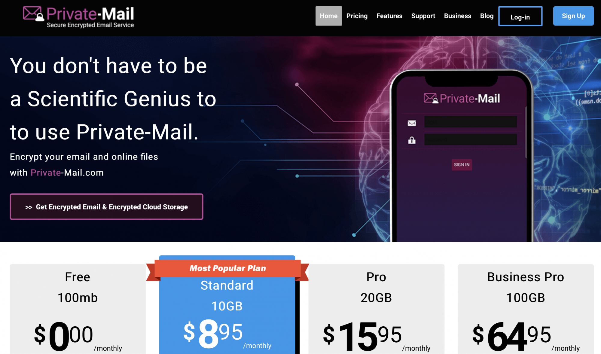
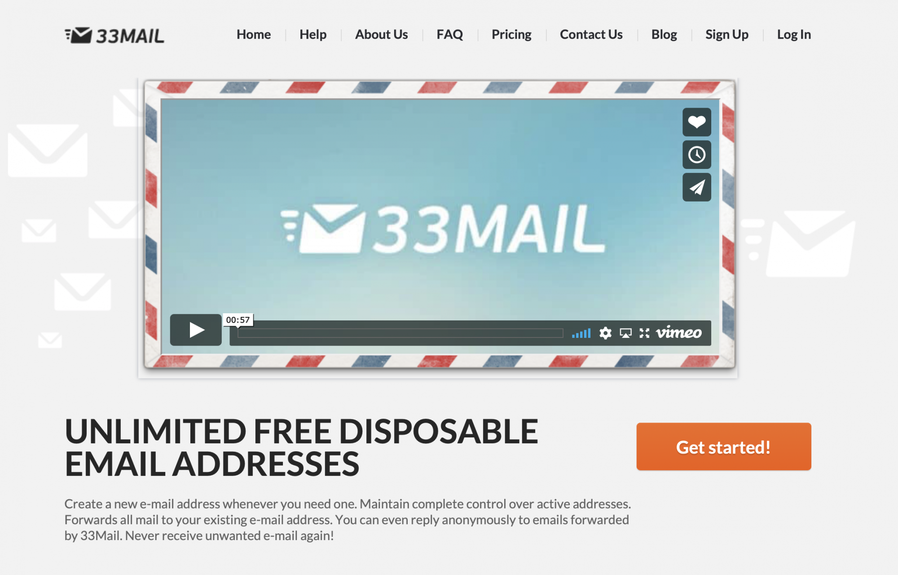

_Mise à jour le 30/05/2020_. L'email reste le moyen de communication le plus utilisé sur internet, et de loin. Loin devant Facebook, Twitter ou autre réseau social, ou encore Skype et consorts. C'est pour cela que les agences de marketing attribuent une vraie valeur monétaire aux emails.

Cet article concerne les fournisseurs d'email anonyme. Si vous cherchez une solution classique, Je viens tout juste de publier un [guide des meilleurs fournisseurs d'email](https://tobal.fr/comparatif-des-meilleurs-fournisseurs-email-en-2020/) classique.

Pourtant, pour la quasi-totalité des services dont on peut se servir sur internet, il faut renseigner son email. Il y a donc tout un tas de raisons à vouloir rester anonyme et ne pas divulguer son email, que ce soit pour éviter de recevoir de la pub/du spam, ou tout simplement parce qu'on a pas envie d'être espionné par la NSA. On peut aussi vouloir rester anonyme pour des raisons plus douteuses, mais ça c'est votre affaire ;).

<!--more-->

Dans tous les cas, il peut être légitime de ne pas vouloir dévoiler son identité, après tout l'anonymat et la vie privée est un droit (digital). Donc si vous voulez donc un moyen d'envoyer ou recevoir des emails de façon anonyme, cet article va vous présenter tous les choix qui s'offrent à vous pour y parvenir. Grâce à ces ressources, vous pourrez masquer votre identité mais aussi chiffrer vos emails pour contrôler qui peut lire vos emails ou non.

_**Note** : L'anonymat total nécessite de masquer votre votre adresse IP, chose que ces services ne feront pas. Pour être 100% anonyme vous devrez utiliser un [service VPN](http://fr.wikipedia.org/wiki/R%C3%A9seau_priv%C3%A9_virtuel) ou passer par [Tor](http://fr.wikipedia.org/wiki/Tor_(r%C3%A9seau))._

## Services Email Anonyme / Crypté

Voici quelques services d'email anonyme qui vous permettent d'envoyer et de recevoir des emails anonymement. Avec certains, vous bénéficierez du cryptage de vos emails, tandis que d'autres sont "jetables" ou s'auto-détruisent après un certain temps.

[PrivateMail](https://tobal.fr/privatemail). _Mise à jour Mai 2020 : ce service a été rebaptisé PrivateMail, et propose une offre gratuite_ . Ce service vous permet de bénéficier d'une boite email anonyme et de nombreuses options de sécurité et de cryptage. Il existe des versions payantes, mais la version gratuite vous offre 100 Mo de stockage, la transmission sécurisée et l'encryptage G/PGP de vos messages.

[GuerillaMail](https://www.guerrillamail.com/). GuerillaMail vous offre une boite mail temporaire, ou jetable si vous préférez. Dès que vous vous connectez au site, une adresse email aléatoire est crée, et vous pouvez vous en servir pour recevoir des mails. Ensuite, les emails sont supprimés après une heure, et la boite est détruite lorsque vous ne vous en servez plus.

[SecureMail](https://www.secure-email.org/index.php) est un service où vous pouvez vous inscrire pour bénéficier d'une boite email, grâce à laquelle vous allez pouvoir envoyer des emails cryptés avec une clé 4096 bits (en gros, ça veut dire illisible pour tout le monde sauf vous et votre destinatire). L'inscription n'enregistre pas votre adresse IP et vous n'avez pas besoin d'entrer des informations personnelles.

## Envoyer Des Emails Sans Devoir S'Inscrire

Parfois, cela peut aussi être bien pratique de pouvoir envoyer un email sans devoir forcément créer un compte ou s'enregistrer sur un site particulier. Si vous avez besoin d'envoyer un email sans attendre de réponse, voici 8 services qui vous permettront d'envoyer des emails juste en remplissant un simple formulaire avec les informations de bases requises (adresse du destinataire, contenu du message, etc...).

Évidemment, en utilisant ces services, les destinataires de vos emails n'auront la plupart du temps aucun moyen de vous répondre, c'est donc une communication dans un seul sens.

_Note: sur les clients email au filtre spam efficace (comme Gmail), les messages envoyés par le biais de ces services atterriront presque tout le temps dans le dossier spam de vos destinataires._

[AnonymousEmail.me](http://www.anonymousemail.me/). Directement sur la page d'accueil de ce site vous trouverez un formulaire simple vous permettant de renseigner le contenu de l'email, les adresses expéditeur et destinataire, et vous pouvez même ajouter une pièce jointe. Vous avez la possibilité de spécifier une adresse **reply-to**, autrement dit une adresse qui sera utilisée pour permettre à votre destinataire de vous répondre.

[5ymail](http://www.5ymail.com/). Ce service, traduit en plusieurs langues, vous permet d'envoyer des emails anonymement, mais la particularité est qu'il vous laisse formater vos emails avec un éditeur WYSIWYG, ce qui vous permet donc d'envoyer des emails un peu plus jolis en HTML. A noter que vous devrez indiquer une vraie adresse e-mail pour recevoir vos identifiants 5ymail.

[CyberAtlantis](http://cyberatlantis.com/anonymous_email.php) propose un formulaire simple pour envoyer rapidement un email anonyme. De plus, **le service supprime automatiquement votre adresse IP**, ce qui vous rend encore plus difficile à tracer. _Note: à l'heure où j'écris ces lignes, le service est désactivé pour cause de reprogrammation_.

[W3 Anonymous Mailer](http://gilc.org/speech/anonymous/remailer.html). Encore plus simple, ce service vous permet d'envoyer un email anonyme juste en remplissant l'adresse du destinataire, le sujet et le corps de votre message.
_Note: Après plusieurs tests, le site semble ne pas fonctionner_.

[Send Anonymous Email](http://www.sendanonymousemail.net/). Ce site, au formulaire tout aussi simple (destinataire + expéditeur + sujet + message), permet aussi d'envoyer des emails. Cependant, votre adresse IP est enregistrée.

[Send Email Message](http://send-email.org/). Comme W3 Anonymous Mailer, le formulaire d'envoi est très simple: renseignez l'email du destinataire, le sujet, votre message, remplissez le captcha et envoyez votre message.

[AnonEmail](http://anonymouse.org/anonemail.html). dans la lignée de Send Email Message, sauf qu'il n'y a pas de captcha.

## Recevoir des Emails Anonymement

J'ai gardé le meilleur pour la fin. Pour beaucoup, c'est sans doute le type de service le plus intéressant. Combien de fois souhaite-t-on s'inscrire à un site ou à un forum sans pour autant donner sa vraie adresse ? Bien souvent, pour confirmer une inscription à un site, on doit cliquer sur un lien figurant dans un mail de confirmation. Mais on n'a peut-être pas envie de recevoir la newsletter qui va avec à chaque fois, ou bien d'autres messages de pub, histoire de [garder sa boite email propre](/comment-nettoyer-sa-boite-email-en-2-minutes/).

Voici donc 7 services d'emails qui vont vous permettre de recevoir des emails sans donner votre vraie adresse email.

[33Mail](https://33mail.com). C'est ce service que j'utilise personnellement. Il est particulièrement pratique car il permet, après inscription, de pouvoir créer autant d'adresse email que l'on souhaite. Le site fonctionne en créant un sous domaine en fonction du pseudo choisi. Par exemple, si vous choisissez _tartampion_, le sous-domaine _@tartampion.33mail.com_ vous sera réservé. Ainsi, vous pourrez donner comme adresse tout ce que vous voulez, du moment que ça termine par @tartampion.33mail.com. Les emails reçus à ces adresses seront automatiquement redirigés vers votre vraie adresse.

[MyTrashMail](http://mytrashmail.com/) va vous permettre également de créer une boite mail qui sera détruite après un certain temps, juste assez pour vous permettre de consulter les mails arrivant sur cette boite.

[Mailnesia](http://mailnesia.com/) permet de créer rapidement (en quelques secondes) une boite email. La chose intéressante avec Mailnesia est que ce service **propose un système de clic automatique sur les liens de validation dans les mails de confirmation**. C'est très pratique par exemple si vous vous inscrivez régulièrement à des sites ou à des forums.

[Mailinator](http://mailinator.com/), comme les autres, vous permet de créer en quelques secondes une adresse email à communiquer aux autres sites. Mention spéciale pour l'interface que je trouve personnellement très sympa (moderne, épurée et agréable).

Le site met en avant les offres payants mais il y a bien une offre gratuite.

[TempInBox](http://tempinbox.com/). Vous pourrez choisir l'email de votre choix (qui se finira par @tempinbox.com ou 4 autres noms de domaines possibles).

[Tempr.email](https://tempr.email/fr/). propose un petit plus par rapport aux autres services. Comme les autres, vous pourrez créer une adresse email jetable (qui dure 7 jours), totalement anonyme, mais en plus de recevoir, vous pourrez aussi répondre aux emails reçus et les transférer. En revanche, vous ne pourrez pas créer ou envoyer des emails à partir de rien.

* * *

Comme vous pouvez le constater, les sites permettant de créer une adresse email ou d'envoyer des emails tout en restant anonymes sont légions, et il y en a encore plein que je n'ai pas listé ici. Vous avez donc un large choix pour ne plus avoir à communiquer votre véritable email aux sites auxquels vous ne faites pas totalement confiance.

Source: [Hongkiat](http://www.hongkiat.com/blog/anonymous-email-providers/).
