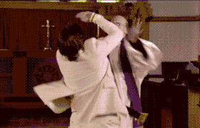

Tous les jours, tu fais des trucs inutiles, sans t'en rendre compte. Si tu cherches comment avoir plus de temps dans la journée, ne cherche pas plus loin : arrête de faire les choses suivantes.<!--more-->

Cette liste n'est bien sûr pas exhaustive, et tu ne fais peut-être pas toutes ces choses à la fois. Mais si tu t'assures de ne plus faire ces choses, ta vie va s'améliorer très vite. Tu vas gagner beaucoup de temps et de l'énergie, afin de pouvoir les consacrer aux choses qui comptent.

## Essayer de convaincre les gens

Laisse tomber. [N'essayes pas de convaincre les gens](https://tobal.fr/comment-gagner-du-temps-dans-la-vie-de-tous-les-jours/) qui ne partagent pas ton point de vue.

> "Mais c'est pas ce que t'es en train de faire ?"

Non. **Ne pas essayer de convaincre, ce n'est pas rien dire**.

C'est comme quand je dis qu'[il ne faut pas forcer les choses](https://tobal.fr/la-loi-du-moindre-effort/). Ça ne veut pas dire qu'il faut rester les bras croisés non plus.

**Tu peux dire ce que tu penses, surtout si ça apporte une solution, si ça peut améliorer la situation**. Mais une fois que tu as dit ce que tu voulais dire, tu as rempli ta tâche. Pas la peine d'insister, de vouloir absolument persuader les gens et leur faire reconnaitre qu'ils ont tort, et que toi tu dis la vérité.

Il n'y a pas de débat plus futile que les conversations autour des convictions politiques ou religieuses. Des vrais dialogue de sourds où chaque partie est campée sur sa position et espère faire changer l'autre d'avis. C'est complètement idiot. **Dans ces débats, les gens n'écoutent pas, ils attendent leur tour pour parler**. Ils veulent _gagner le débat_, tout le contraire d'une vraie discussion, qui doit être un échange, une construction.

Évidemment, si c'est pour un boulot, une vente, ou toute situation dans laquelle tu as un intérêt particulier à convaincre, l'effort est de mise. Mais il s'agit la plupart du temps de situations où l'autre partie est prête à se laisser convaincre. Mais pour tout le reste, s'il s'agit de simplement _avoir raison_, ne te fatigues pas.

## Consulter ton smartphone au réveil ou juste avant d'aller dormir

<iframe class="giphy-embed" src="https://giphy.com/embed/Ii9WFmq5ghBBu" width="480" height="425" frameborder="0" allowfullscreen="allowfullscreen"></iframe>

Au réveil, _prend ton temps_.

Checker tes notifications ne sert qu'à te stresser ou te faire déprimer. C'est adopter un état _réactionnaire_. Dès ton réveil, tu subis le monde extérieur et réagis instinctivement aux stimulus externes. Plutôt que de t'ouvrir au monde, tu te recroqueville sur ce minuscule écran, cette pseudo-fenêtre sur une pseudo-réalité. **Tes premières minutes de la journée méritent mieux que ça**.

À la place, tu peux te réveiller en douceur, faire un peu de gymnastique, marcher, prendre un petit déjeuner, [méditer](https://tobal.fr/comment-se-mettre-a-la-meditation/), bref, prendre ton temps et te préparer tranquillement pour la journée.

Avant d'aller dormir, idem. Tu t'expose à cette lumière bleue, qui t'empêche justement de bien dormir et te reposer. En plus de nuire à ta capacité d'endormissement et ta qualité de sommeil, tu t'exposes à des sources de stress potentiel supplémentaire. Et tu te retrouves sans t'en rendre compte à veiller trop tard.

À la place, lis un livre, écoute de la musique reposante, passe du temps avec ta famille ou ton conjoint, relaxe-toi.

**Dans les deux cas, matin ou soir, tu ne rates rien en te passant de ton smartphone**. Tu as toute la journée pour t'en servir, pas besoin de coller le nez dessus dès le réveil ou juste avant de dormir.

## Regarder la télé

<iframe class="giphy-embed" src="https://giphy.com/embed/Sb7WSbjHFNIL6" width="480" height="345" frameborder="0" allowfullscreen="allowfullscreen"></iframe>

Ça fait 7 ans que je ne regarde plus la télé.

Et je t'encourage vivement à faire pareil. Tu ne rateras rien, rassures-toi. Si il se passe des choses importantes, tu seras rapidement mis au courant par ton entourage ou les réseaux sociaux.

Il n'y a _rien_ d'essentiel à la télé. Et ce n'est pas que la télé-réalité. Tout le reste c'est bon à jeter aussi. Les émissions "culturelles", pas besoin. Toute la culture dont tu as besoin est accessible dans des livres ou sur internet. Les émissions de divertissement, c'est aussi une perte de temps.

**Les infos ? Je crois que c'est le pire**. À chaque fois que je tombe sur les infos (quand je suis chez des amis ou quand mes parents qui regardent la télé) je suis à la fois fasciné et horrifié par les journaux télévisés. **C'est une source de négativité inépuisable**. Scandale par ci, mensonge par là, meurtre, cambriolage, catastrophes, arnaques, et vas-y que je te balance du négatif, de la peur et de l'inquiétude.

Non, crois-moi, tu seras bien mieux sans ta télé.

Voilà 3 choses à arrêter de faire quotidiennement. Si tu le fais, tu vas gagner énormément de temps et d'énergie, que tu pourras utiliser pour toi, ton travail, ta famille, devenir une meilleure personne et faire le bien autour de toi.
