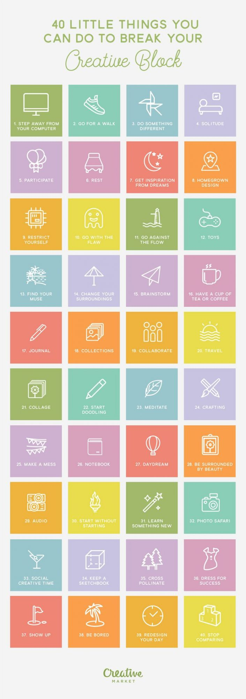

Il arrive parfois qu'on se retrouve dans un "blocage" créatif; on a l'impression d'être à court d'idées, où qu'on en a que des mauvaises.

Si c'est votre cas, voici une infographie qui devrai vous plaire: elle vous propose 40 manières de faire repartir votre créativité. Autant de moyens qui sont bons pour (re)trouver l'inspiration quand vous en avez besoin.<!--more-->

Un fait intéressant à noter: on s'aperçoit que beaucoup de façons de renouer avec votre créativité consistent à... arrêter d'essayer d'être créatif ! En effet, beaucoup de ces actions vous incitent à faire une pause, faire autre chose, ne pas rester devant votre ordinateur... Cela peut sembler paradoxal mais ceux qui suivent ce blog depuis un moment devraient reconnaitre un motif habituel.

Bref, sans plus attendre, voici les 40 choses à faire pour réveiller le génie créatif qui sommeille en vous (et vous allez aimer ce qu'on vous conseille de faire ).

Source: [MakeUseOf](http://www.makeuseof.com/tag/heres-40-things-you-can-do-to-get-your-creativity-going/).
