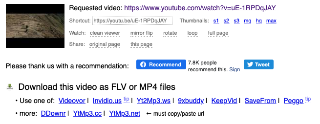

On peut faire un tas de choses depuis l'interface du site YouTube mais voici 5 petits trucs que vous pourrez réaliser simplement en jouant avec les liens YouTube dans votre barre d'adresse.<!--more-->

## 1. Jouer tout ou une partie d'une vidéo en boucle

Si vous aimez avoir un fond sonore en boucle, ou si il y a une chanson que vous adorez tout particulièrement, mais que la vidéo YouTube correspondante n'est pas assez longue, vous pouvez faire jouer en boucle la vidéo automatiquement en ajoutant le mot "**repeater**" dans l'url de la vidéo, après le mot "**youtube**", juste avant le "**.com**".

Par exemple, pour cette vidéo: `http://www.youtube.com/watch?v=uE-1RPDqJAY`

Rentrez l'adresse: `https://www.youtuberepeater.com/watch?v=uE-1RPDqJAY`

## 2\. Télécharger N'importe Quelle Vidéo

Si pour une raison ou une autre, vous souhaitez télécharger une vidéo sur YouTube (si vous avez peur que l'auteur de la vidéo décide de la retirer, ou bien si vous êtes chez Free ;) ), sachez que c'est possible et très facile.

Il vous suffit d'ajouter, dans l'url, juste devant le mot "**youtube**", le mot "**pwn**". Par exemple: `http://www.youtube.com/watch?v=uE-1RPDqJAY`

devient: `http://www.pwnyoutube.com/watch?v=uE-1RPDqJAY`

## 3\. Regarder une vidéo même si elle n'est pas disponible pour votre région

Cela vous est surement déjà arrivé, vous souhaitez voir une vidéo mais vous tombez sur un message vous disant que la vidéo n'est pas disponible dans votre région ou pays. Vous pouvez quand même la regarder, en passant de cet URL: `http://www.youtube.com/watch?v=e99YA7mX1SE`

A celui-ci: `http://www.youtube.com/v/e99YA7mX1SE`

Le seul "souci", c'est que la vidéo se jouera dans la totalité de la fenêtre du navigateur. Mais en contrepartie, plus de blocage régional !

## 4\. Allez directement à un temps précis de la vidéo

Si par exemple, vous souhaitez partager le lien d'une vidéo mais pointer vers à un moment spécifique de la vidéo, il vous suffit de faire un clic droit sur la vidéo, au moment qui vous intéresse, et de cliquer sur "**Copier l'url de la vidéo à partir de cette séquence**".

Vous obtiendrez un URL du type: `https://www.youtube.com/watch?feature=player_detailpage&v=MC8Zvl-8ziA#t=24`

La partie importante à retenir est à la fin: `t=24`. C'est cette partie qui vous permet de spécifier le nombre de secondes depuis lequel la vidéo devra démarrer. Si par exemple vous voulez faire démarrer la vidéo à 1 minute et 47 secondes (107 secondes), vous devrez modifier le paramètre en `t=107`.

## 5\. Désactiver les "vidéos associées" à la fin d'une vidéo

Cette dernière astuce concerne surtout les personnes qui intègrent des vidéos dans leur site, blog ou autres. Si vidéos associées qui apparaissent systématiquement à la fin de votre vidéo vous agaçent, vous pouvez les désactiver simplement en ajoutant "**&rel=0**" à la fin de l'URL de la vidéo.

Cette astuce ne marche que pour le code d'intégration de vidéo. Eelle ne fonctionne pas sur l'url classique dans votre barre d'adresse. Je parle du code récupéré ainsi :

Il vous suffit alors de changer cette partie; `src="//www.youtube.com/embed/RBTBEfd7z_Y"`

comme ceci: `src="//www.youtube.com/embed/RBTBEfd7z_Y&rel=0"`

Source: [LifeHacker](http://lifehacker.com/the-six-best-youtube-url-tricks-1422544868)
