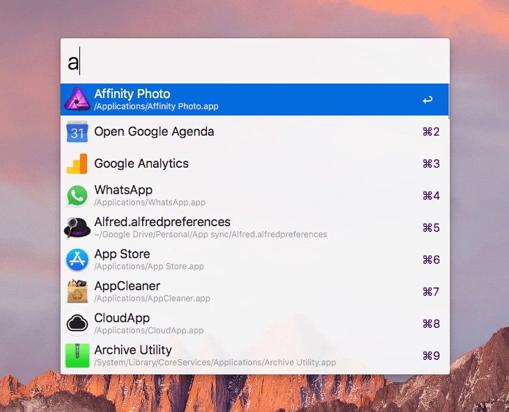
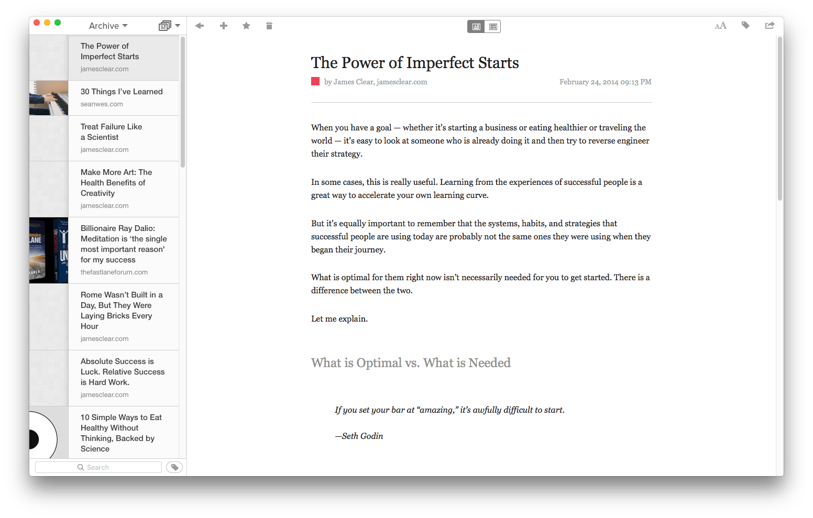

Ce sont à la fois des outils physiques et digitaux. Je les utilise _tous les jours_. Sans ces outils, je serais dans la merde. Enfin, peut-être pas _dans la merde_, mais j'avancerai beaucoup, beaucoup moins vite et moins efficacement dans mon boulot.<!--more-->

## Carnet de notes

Je m'en sers vraiment beaucoup depuis quelque mois seulement. Avant je prenais toutes mes notes au format digital. Mais il y a un truc avec le fait d'écrire au stylo sur du papier qui est différent de tout écrire au clavier comme je l'ai fait longtemps. Je trouve le contact physique plus propice à la réflexion, la clarification et la mémorisation. C'est plus intime, plus naturel.

## Casque Bose QuietComfort 35

Tu ne maitrise pas toujours ton environnement, et quand tu veux t'isoler afin de pouvoir bien te concentrer, méditer ou simplement être tranquille, il n'y a rien de mieux qu'un bon casque à réduction de bruit couplé à de la [musique relaxante](https://tobal.fr/ameliore-ta-concentration-et-ta-productivite-avec-brain-fm/). Ce modèle n'est pas donné (habituellement aux alentours de 380 euros) mais la qualité est fantastique. À la fois pour la réduction de bruit, qui marche très bien et isole comme il faut, et pour la qualité audio qui procure un vrai plaisir d'écoute.

C'est [ce modèle-là](https://amzn.to/2Lcsd3X).

## MacBook Pro

[En 2018 il n'y a plus tant de différence entre PC et Mac](https://tobal.fr/pc-ou-mac-que-faut-il-acheter-et-quel-est-le-meilleur-pour-2017/), c'est surtout une question de goût.

Perso, je suis un fanatique de MacOS, j'ai un peu plus de mal quand j'utilise Windows. Il faut dire qu'il y a pas mal d'applications génialissimes qu'on ne trouve que sur Mac : Alfred, Keyboard Maestro, Logic Pro, iTerm, Affinity Photo, iTunes... Euh non, pas iTunes, c'est de la merde.

Le trackpad des MacBook est aussi incroyablement précis et agréable à utiliser, à des années-lumière de ceux des PC.

J'adore le format portable, vu que je voyage très souvent et que je suis tout le temps en vadrouille, un fixe n'est pas envisageable pour le moment. Donc pour moi c'est MacBook Pro.

## Spotify

Avec mon casque Bose QuietComfort 35, c'est mon top duo pour être productif. Je mets mon casque, je lance Spotify, je sélectionne une de mes playlists de concentration (musique atmosphérique, piano, ou classique), et là plus rien ne m'arrête. Je peux bosser pendant des heures dans une isolation et un confort auditif absolu.

Et quand il y a besoin, je me détends avec un choix interminable de musiques et de podcasts. C'est marrant, je suis passé à Spotify il y a moins d'un an, avant j'étais sceptique du concept. Mais c'est tout simplement génial d'avoir des millions de musiques de tous styles à portée de clic (ou dans sa poche avec son smartphone).

## Evernote

J'ai déjà [parlé d'Evernote à plusieurs reprises](https://tobal.fr/?s=evernote) en long et en large. Je note mes idées rapidement sur mon carnet de notes physique, mais dès que je suis sur mon portable, si j'ai besoin de développer des idées, organiser mes projets, garder des infos ou des documents sous la main, afin qu'ils soient accessibles facilement par recherche, c'est Evernote qui entre en scène.

Je m'en sers aussi comme support de journal quotidien, pour scanner mes papiers, et y garder tout ce que j'aimerai pouvoir consulter plus tard.

[Découvrir Evernote](https://evernote.com/intl/fr/).

## Alfred

C'est un lanceur d'application. Comme Spotlight mais en mieux. Pour les usages basiques, Spotlight fait le boulot. Mais avec Alfred, il y a tellement de trucs géniaux en plus : gestion du presse-papiers jusqu'à 500 copier-coller recherchables, bouts de texte automatiques, recherche rapide sur n'importe quel site, séries d'instructions et interactions avec toutes sortes d'applications...

[Alfred c'est une tuerie](https://www.alfredapp.com/).

## Google Drive

Presque tous mes documents (fichiers texte, docs Excel / Word, photos, PDF, fichiers de travail) sont dans Google Drive. Comme ça, ils sont tout le temps synchronisés et je peux y accéder depuis mon téléphone ou n'importe quel navigateur.

C'est seulement le jour où t'as besoin d'accéder à une info dans un fichier, mais que tu n'as pas ton ordinateur sur toi, que tu te rend compte à quel point c'est pratique.

Et vu que c'est sauvegardé sur le cloud, tous mes documents de travail sont en sécurité. La semaine dernière j'ai déposé mon Mac à l'Apple Store pour réparation. Quand tu le dépose, les mecs te disent "Vous avez bien fait une sauvegarde de vos données ?" car il y a toujours un risque que les données du disque dur soient perdues. Je n'ai pas fait de "sauvegarde" particulière, mais aucun souci puisque c'est géré automatiquement avec Google Drive.

## Pocket

L'outil parfait pour sauvegarder du contenu qui t'intéresse mais que tu veux consulter plus tard n'importe où, grâce à leur super appli smartphone et leur extension navigateur.

Un exemple: je reçois la newsletter de James Clear, un entrepreneur américain que je suis et qui crée du contenu super intéressant. Je suis un fervent pratiquant de la consommation intentionnelle, c'est à dire que je choisis de consommer du contenu délibérément à des moments choisis, pas "quand ça vient". Lorsque je consulte ma boite mail, et que je tombe sur un de ses mails, plutôt que lire le contenu tout de suite, ou de laisser le mail trainer, je sauvegarde l'article dans Pocket pour pouvoir le lire plus tard.

Quand j'ai un moment, ou je suis dans les transport, je lance Pocket et je lis tout le contenu que j'ai sauvegardé. Le petit plus, c'est que le contenu est sauvegardé hors-ligne, donc même si je n'ai pas de connexion internet je peux quand même le consulter.

[Découvrir Pocket](https://getpocket.com/).

## Plus de Todo list

Tu a peut-être remarqué que je n'ai pas mentionné d'outil de todo list. Jusqu'à il n'y a pas si longtemps, j'utilisais [Todoist](https://todoist.com/), qui est un excellent gestionnaire de todo lists.

Mais il y a 2 mois, j'ai tenté l'expérience de me passer de todo lists. Et franchement, je n'ai jamais été aussi efficace. Comme quoi.

Résultat, [je ne me sers plus de gestionnaire de todo list](https://tobal.fr/la-meilleure-facon-de-gerer-sa-todo-list/).

Je fais toujours des todolists de temps à autres sur du papier, ou dans Evernote. Mais seulement quand il y a un contexte particulier. Je me suis rendu compte que, quand j'avais des listes de tâches constamment présentes, enregistrées dans Todoist, elles avaient souvent tendance à trainer sans être vraiment consultées ni traitées. Le fait de créer une liste de tâches uniquement quand il y a un vrai besoin concret, à un moment donné, a beaucoup plus de sens, et c'est ce genre de todolist qu'on complète réellement.
