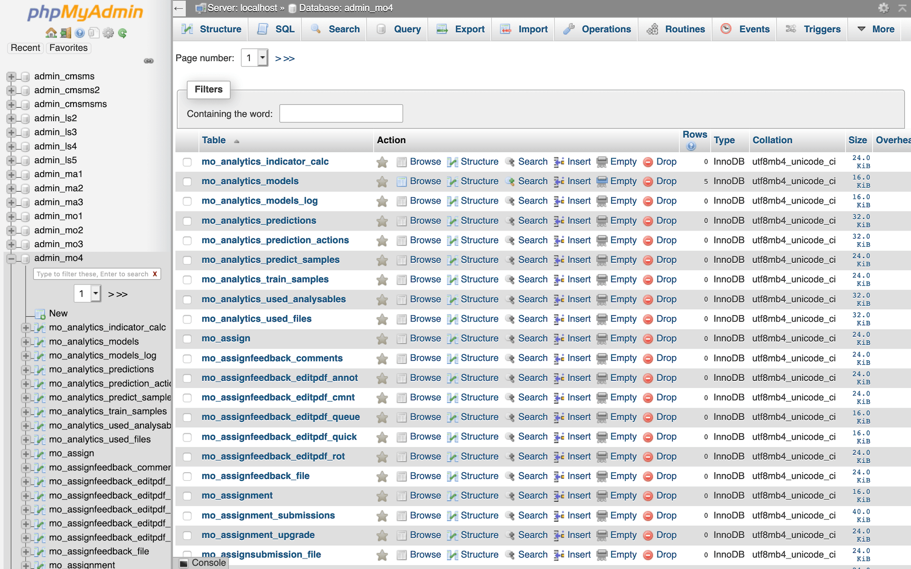
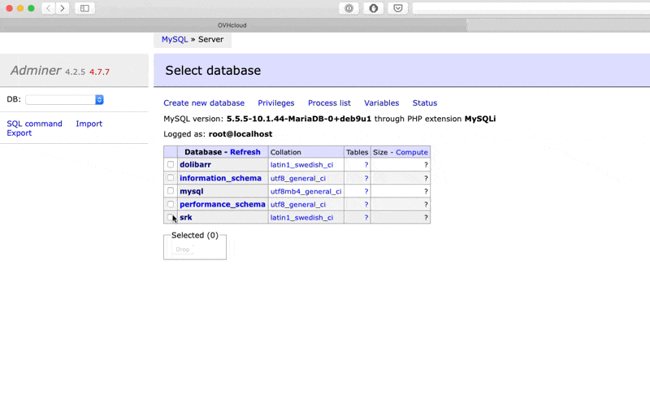
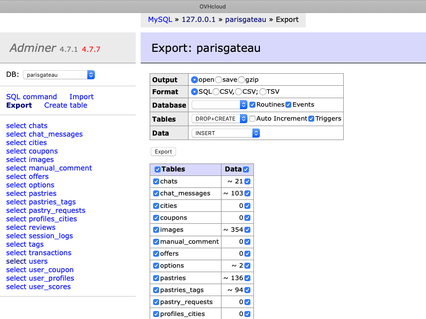
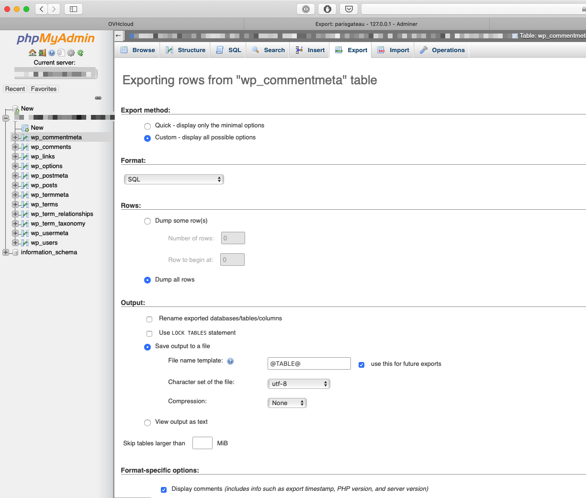
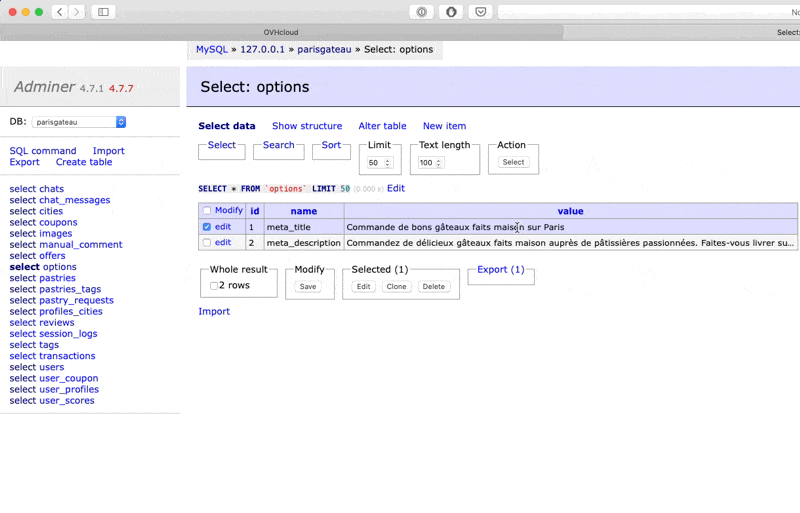
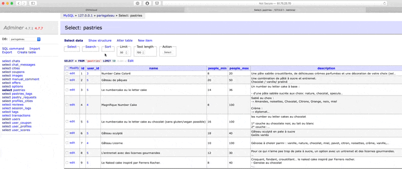
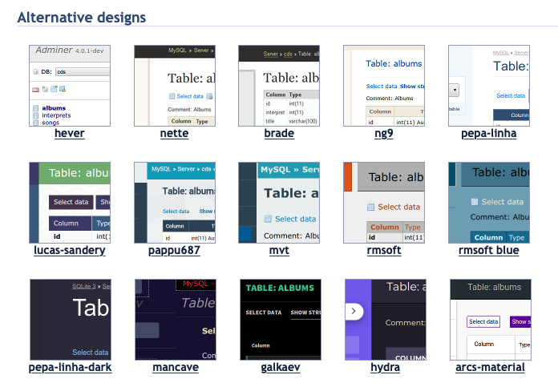
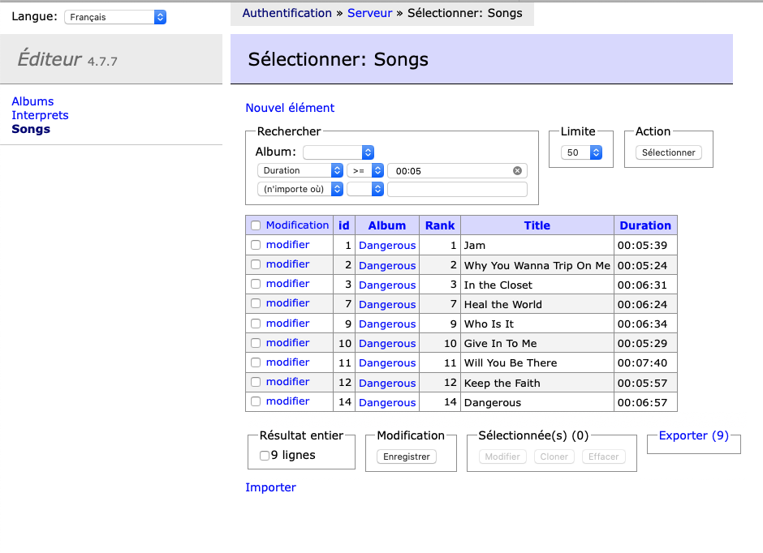

Si tu codes en PHP, tu utilises très probablement [MySQL](https://kinsta.com/fr/base-de-connaissances/qu-est-ce-que-mysql/), et donc [phpMyadmin](https://fr.wikipedia.org/wiki/PhpMyAdmin). Je me trompe ? Si c'est bien le cas, arrête tout de suite, et passe à [Adminer](https://tobal.fr/adminer-la-solution-alternative-a-phpmyadmin-pour-gerer-vos-bases-de-donnees-mysql/). Tu me remercieras plus tard 😁

<!--more-->

En local, je vois souvent les gens utiliser [MySQL Workbench](https://fr.wikipedia.org/wiki/MySQL_Workbench) ou [SequelPro](https://www.sequelpro.com/). Mais quand il s'agit de farfouiller une base de données sur un serveur en ligne, 99% du temps, phpMyAdmin est le client MySQL fourni par défaut par une grande majorité des hébergeurs. Ou bien, si tu utilises une application du style [XAMPP](https://www.apachefriends.org/fr/index.html), c'est aussi ce qui est fourni par défaut.

Alors oui, phpMyAdmin fait le boulot. Mais je trouve l'interface lourde, encombrée, et pas des plus intuitive. Ça fait fouillis :

<figure>

<figcaption>

Source : [Installatron](https://installatron.com/phpmyadmin?locale=fr)

</figcaption>

</figure>

Et l'interface de phpMyAdmin manque cruellement de réactivité. Que ce soit pour éditer des enregistrement, exécuter des requêtes ou simplement pour naviguer dans les données.

Mais surtout, as-tu déjà essayé d'[installer phpMyAdmin](https://docs.phpmyadmin.net/fr/latest/setup.html) toi-même ? Je fais du dev depuis 10 ans et je trouve ça toujours aussi compliqué à installer et configurer.

## 6 raisons pour lesquelles Adminer, c'est vachement mieux que phpMyAdmin

### 1\. L'interface minimaliste, plus simple, plus épurée, et plus rapide

Moi qui adore les interfaces claires et minimalistes, je suis ravi avec Adminer. L'interface est simple. On voit rapidement tout ce dont on a besoin. Les infos sont présentées clairement.

Il est très simple de naviguer avec Adminer. Par exemple, pour voir la structure de la table, il suffit de cliquer sur le nom de la table, et pour voir les données, il n'y à qu'à cliquer sur select.

### 2\. Navigation et interactions rapide et efficace

Dès la première utilisation, on sent que Adminer est plus léger et plus rapide que phpMyAdmin. L'expérience utilisateur est complètement différente. Par exemple, il est très simple d'exporter des données au format CSV, SQL, de choisir une compression ou non, de sauvegarder juste le schéma des tables, les données, ou les deux :

<figure>

<figcaption>

L'export avec Adminer

</figcaption>

</figure>

C'est un peu moins limpide avec phpMyAdmin :

<figure>

<figcaption>

L'export avec phpMyAdmin. Il y a le mode "Simple" aussi sur phpMyAdmin, mais on ne peut plus rien choisir à part le format de l'export

</figcaption>

</figure>

La modification d'une ligne se fait aussi super rapidement. Il suffit de cliquant sur un champ dans n'importe quelle ligne.

Un autre truc génial avec Adminer, ce sont les options de tri et de filtres, qui sont plus simples et plus rapide à utiliser que sur phpMyAdmin. C'est très facile de sélectionner, trier et filtrer rapidement les données des tables MySQL. En 2-3 clics le tour est joué :

### 3\. Même tes grands-parents peuvent l'installer

Mais surtout, **le processus d'installation est on ne peut plus simple** : il suffit de déposer un fichier de moins de 500kb n'importe où sur son serveur, et d'y accéder directement via PHP. Pas de fichier de configuration à modifier à la main, d'archive à extraire, de service à redémarrer... On peut donc le faire tourner avec le serveur local PHP, tout en se connectant à une base de données distante.

Adminer est aussi disponible dans un tas de langues dont le français.

### 4\. Adminer est déjà beau mais tu peux t'amuser à personnaliser encore plus avec des thèmes

Bon ça c'est un peu gadget, cela dit ça reste agréable. Ça permet de changer un peu la routine. Il y a déjà de nombreux thèmes dispos, prêts à l'emploi. Et pour les utiliser, rien de plus simple : il n'y a qu'à déposer un fichier CSS à côté du fichier `adminer.php`.

### 5\. Une version "client' qui peut servir de back-office simplifié

Tu as la flemme de développer une interface d'administration pour un client ou un projet ? Adminer propose une version similaire mais simplifiée, facilement configurable, que tu pourras confier à un non-développeur pour qu'il puisse administrer les données sans faire de conneries.

<figure>

<figcaption>

L'interface de la version Éditeur est simplifiée par rapport à la version complète 

</figcaption>

</figure>

### 6\. Adminer marche avec d'autres systèmes de base de données

phpMyadmin se connecte au bases MySQL et ... c'est tout. Adminer, lui, te permet de gérer un tas d'autres base de données, en plus de MySQL :

- PostgreSQL
- MSSQL
- SQLite
- Oracle
- SimpleDB
- MongoDB
- ElasticSearch

Et si tu es un maniaque de l'espace disque, tu peux télécharger une version qui ne fonctionne que pour MySQL, histoire de gagner 250 ko. Waouh !

Sur le site d'Adminer, tu peux voir un [tableau comparatif complet](https://www.adminer.org/en/phpmyadmin/) qui te montre tous les points sur lesquels Adminer déchire fait mieux que phpMyAdmin.

Bien sûr, Adminer est 100% gratuit.

## Quand rester sur phpMyAdmin ?

La seule raison de rester sur phpMyAdmin, c'est si tu y es obligé. Par exemple, si ton site est sur un hébergement mutualisé, et que tu ne peux pas déposer de fichier PHP. Ce qui est de plus en plus rare, de nos jours un hébergeur qui se respecte propose au moins de pouvoir déposer des fichiers par FTP, à défaut d'avoir un accès SSH.

Ça fait des années que je ne me sers plus de phpMyAdmin, ni de logiciel client MySQL. À la place, j'utilise Adminer. C'est beaucoup plus simple, léger, et rapide.

[Découvrir et télécharger Adminer](https://www.adminer.org/).
