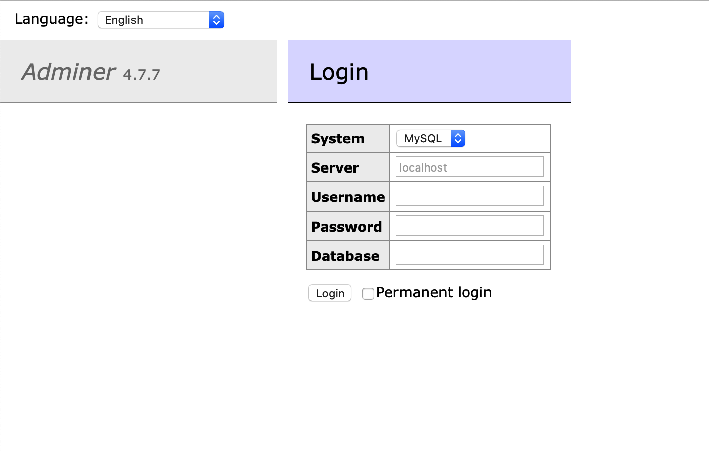

Vous administrez des sites web dynamiques en PHP ? Alors il y a fort à parier que vous utilisez des bases de données, très probablement sous MySQL, et que vous avez donc sans doute déjà utilisé [phpMyadmin](http://www.phpmyadmin.net/home_page/index.php).

Aujourd’hui je vous propose de découvrir un outil beaucoup moins connu que phpMyadmin, mais tout aussi efficace: [Adminer](https://tobal.fr/adminer-alternative-a-phpmyadmin-mais-en-mieux/).<!--more-->

**Adminer** est outil léger et pratique qui remplit exactement le même rôle que phpMyadmin: vous permettre de gérer vos bases et tables MySQL en passant par une interface web (parce que la ligne de commande, c’est pour les barbus).

Là où Adminer se démarque de phpMyAdmin, c’est par sa légèreté et sa simplicité d’installation. Contrairement à phpMyadmin, qui nécessite un peu d’effort à l’installation et un minimum de configuration, Adminer se compose d’un unique fichier php qu’il vous suffit de déposer dans n’importe quel répertoire accessible sur le web.

D’ailleurs, pour guider votre main frêle, je vais vous expliquer étape par étape comment installer Adminer.

## Étape 1: Télécharger Adminer

[Télécharger le seul et unique fichier PHP d’Adminer](http://downloads.sourceforge.net/adminer/adminer-4.1.0.php).

## Étape 2: Déposer le fichier par FTP

À l’aide de Filezilla par exemple, envoyez le fichier fraîchement télécharger vers votre espace d’hébergement. Pour plus de commodité, j’aime renommer le fichier en `adminer.php`. C’est plus sympa et plus facile à taper que `adminer-4.1.0.php`.

## Étape 3: C’est tout

Rendez-vous à l’adresse **www.votresite.com/adminer.php**. Vous devriez être accueilli par cet écran:

Il vous suffit alors de renseigner votre identifiant et mot de passe MySQL (et accessoirement un nom de base de données, mais ce n’est pas obligatoire) et de vous authentifier. Vous serez alors sur l’écran principal:

Cerise sur le gâteau, l’interface est disponible en plusieurs langues dont le Français. Si vous vous serviez de phpMyadmin auparavant, vous ne serez pas dépaysé.

Toutes les fonctions qu’on peut attendre sont là: gestion (création, édition et suppression) de base de données, gestion des tables, des champs, importation de fichier SQL, exécution de requête SQL directe, gestion des utilisateurs MySQL, privilèges…

Alors, me direz-vous, quel intérêt par rapport à phpMyadmin ? Comme je l’ai dit au début, **la simplicité d’installation**. Un fichier php à déposer, et hop, c’est fini.

Ensuite, vous n’avez pas de configuration à faire. C’est fonctionnel immédiatement, et ça rempli son job. Niveau rapidité/fluidité, c’est peut-être psychologique, mais personnellement je trouve Adminer plus réactif et rapide, à l’utilisation, que phpMyadmin.

Certes, il n’y a pas certains petits détails de confort propres à phpMyadmin, comme par exemple l’édition AJAX des champs. Mais l’interface est tellement fluide qu’aucun manque ne se fait ressentir.

Bref, à l’utilisation, ça fait tout ce que fait phpMyadmin, en un peu plus rapide et avec une interface plus épurée.

[Télécharger Adminer](https://www.adminer.org/).
