Beaucoup de gens que je connais utilisent un mac. Des gens avec qui je travaille ou des amis. Étonnamment, beaucoup (trop) d'entre eux n'utilisent pas [Alfred](https://www.alfredapp.com/).

Pourquoi est-ce surprenant ? Parce que c'est probablement **l'application la plus importante que tu puisses installer sur ton mac**. Elle l'est pour moi. C'est la toute première application que j'installe sur un nouveau mac. C'est aussi l'une des principales raisons pour lesquelles je ne peux pas m'imaginer revenir sur une machine Windows.

<!--more-->

Dans les deux premières sections, j'expliquerai ce qu'est essentiellement Alfred, et pourquoi c'est un élément vital de mon travail quotidien. Donc, si tu connais déjà Alfred, tu peux passer ces parties. Ensuite, je te montrerai exactement comment j'utilise Alfred au quotidien, comment je l'ai personnalisé et quels sont les workflow _(c'est-à-dire les plugins d'Alfred)_ que j'ai installés.

## **C’est quoi Alfred ?**

Au fond, Alfred est un lanceur d'applications. Il te permet de **lancer des applications sans toucher à ta souris**. Tu lances Alfred, tu tapes quelques lettres et boum, tu lances l'application souhaitée.

Tu peux également rechercher n'importe quel fichier sur ton ordinateur, si tu tu souviens d'une partie de son nom.

Oui, tout comme Spotlight. Mais nettement beaucoup plus puissant. Pour être juste, [Spotlight a fait une belle refonte](https://www.macworld.com/article/2369722/hands-on-with-os-x-yosemite-spotlight-takes-center-stage.html) il y a quelques années, avec la sortie de Mac OS X Yosemite, et c'est un excellent moyen de lancer tes applications et de trouver des fichiers.

Mais comme je vais te le montrer, Alfred est bien plus puissant.

## **Pourquoi Alfred est primordial pour mon travail**

J'utilise Alfred tous les jours et toutes les heures quand je suis sur mon ordinateur. Ce qui rend Alfred si puissant et inestimable pour moi, ce sont les fonctions intégrées _(par défaut)_, ainsi que sa personnalisation.

Les fonctions par défaut sont complètes et déjà utiles. Mais les possibilités de personnalisation avec Alfred sont presque illimitées, soit en ajoutant des configurations personnalisées aux fonctions par défaut, soit en ajoutant des [workflows Alfred](https://www.alfredapp.com/workflows/).

Permets-moi tout d'abord de passer en revue quelques-unes des fonctionnalités par défaut d'Alfred, afin de te montrer à quel point il est pratique et prêt à l'emploi. Ensuite, je te parlerai de l'utilisation plus avancée d'Alfred, avec des configurations et des workflows personnalisés.

## **Les fonctionnalités de base d'Alfred**

Rien qu'avec ses caractéristiques de base, Alfred est déjà beaucoup plus utile que Spotlight.

Pour y accéder, une fois que tu as installé Alfred, il te suffit d'appuyer sur le raccourci clavier sélectionné pour déclencher Alfred, qui attendra docilement ta saisie. J'ai choisi **⌘ + Espace** (touche Commande + barre d'espace), qui remplace en fait le raccourci par défaut de Spotlight (que j'ai changé pour ⇧ + ⌃ + Espace).

### Une recherche et manipulation de fichiers hyper efficace

Pour commencer, **la recherche d'un dossier est beaucoup plus pratique dans Alfred que dans Spotlight**. Pas en termes de précision, car les deux sont très efficaces pour trouver ce que tu cherches. La différence, simple mais énorme, est qu'Alfred affiche les vrais fichiers et dossiers. Je m'explique :

Quand tu effectues une recherche dans Spotlight, une liste de résultats s'affiche. Ces résultats ne sont qu'une liste d'éléments que tu peux mettre en évidence ou sur lesquels tu peux cliquer, mais c'est tout. Si tu cliques sur un résultat, il s'ouvre. Tu ne peux même pas cliquer avec le bouton droit de la souris pour effectuer des actions supplémentaires.

En revanche, avec Alfred, **les résultats sont les éléments eux-mêmes**, c'est-à-dire les fichiers et dossiers sur lesquels tu peux directement agir. Tu peux les faire glisser et les déposer directement à partir de la liste des résultats. Par exemple, admettons que tu veuille copier un fichier dans un dossier que tu as déjà ouvert. Mais tu n'es pas sûr de l'endroit où ce fichier est stocké. Si tu te souviens juste de son nom, il te suffit de le rechercher dans Alfred, puis de le glisser-déposer.

Alfred te permet également d'effectuer facilement diverses actions sur les dossiers ou fichiers que tu as recherchés. Il suffit d'appuyer sur la flèche droite sur un résultat mis en évidence pour obtenir un menu sympa proposant plusieurs actions pratiques. Tu peux effectuer une action soit en appuyant sur la touche de raccourci associée (**⌘ + 1 à 9**), soit en filtrant la liste en tapant du texte :

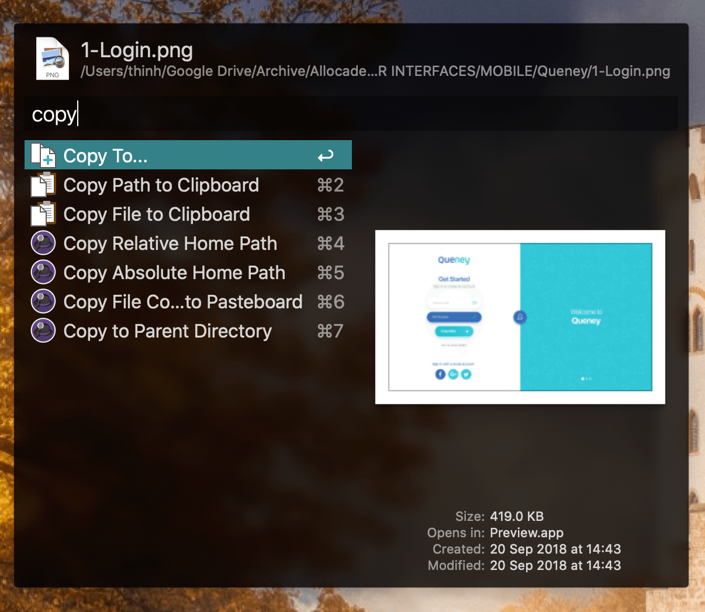

### Web Search

Quels sont les principaux sites que la plupart d'entre nous consultent quotidiennement ? Google, Twitter, YouTube ou Amazon. Maintenant, admettons que tu veuilles chercher quelque chose sur l'un de ces sites. Que fais-tu ?

En général :

- Tu ouvres un nouvel onglet dans ton navigateur web
- Soit tu cliques sur un signet, soit tu cliques sur la barre d'adresse et tu entres l'URL du site
- Tu cliques sur le champ de recherche du site web, et lances ta recherche.

Tu le fais probablement plusieurs fois par jour. Franchement, c'est trop long !

Alfred le sait bien. La fonction de **Web Search** te permet donc d'effectuer une recherche sur tes sites web les plus utilisés, en un clin d'œil. Il tu suffit de lancer Alfred - quelle que soit l'application ou l'écran que tu utilises - et de commencer à taper un mot-clé Web Search, suivi de tes termes de recherche.

Pour trouver les mots clés Web Search, il suffit d'aller dans les préférences d'**Alfred → Features → Web Search**. Par défaut, tu peux déjà effectuer des recherches rapides sur la plupart des grands sites web : Google, Google Drive, Google Maps, Gmail, Amazon, Wikipedia, Twitter, Linkedin, Facebook, eBay...

Mais le plus grand avantage de cette fonction est que tu peux créer tes propres recherches personnalisées. Pour la plupart des sites web, une recherche est simplement une URL contenant des termes de recherche. Par exemple, lorsque tu recherches _"meilleur casque anti-bruit"_ sur Google, tu accèdes simplement à l'URL suivante :

`https://www.google.com/search?source=hp&q=meilleur+casque+anti-bruit`

J'ai un peu simplifié l'URL, car Google ajoute généralement un tas de paramètres d'URL pour ses propres besoins de suivi, mais c'est l'essentiel.

Comme tu peux le voir, l'URL se compose de deux parties : l'adresse du site web (`https://www.google.com/search`) et ta requête de recherche  (`?q=meilleur+casque+anti-bruit`).

**Cela signifie que tu peux créer une recherche Web pour presque tous les sites Web que tu utilises souvent**, tant que ce site permet d'effectuer une recherche via l'URL. Par exemple, si tu te trouves souvent à la recherche de plugins WordPress, tu remarqueras que l'URL, lorsque tu effectues une recherche de plugin sur le site officiel de WordPress, est comme ceci :

`https://wordpress.org/plugins/search/woocommerce/`

Il suffit d'isoler la partie domaine de base de l'URL (`https://wordpress.org/plugins/search/`) et la partie termes de recherche de l'URL (`woocommerce`). Il suffit de remplacer, dans l'URL, la partie où le terme de recherche doit se trouver par `{query}`.

Tu peux maintenant créer une recherche sur le Web comme ceci :

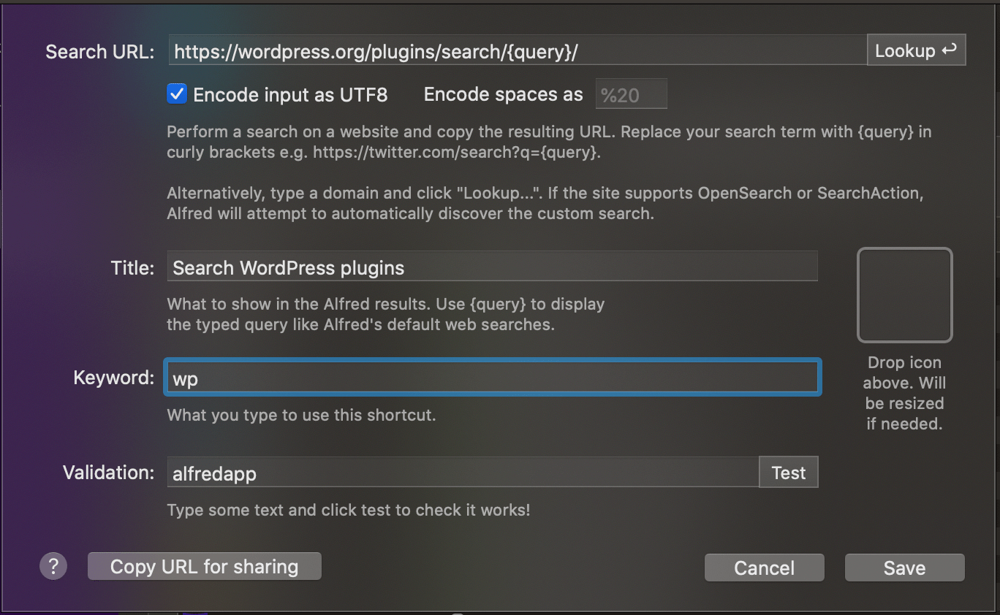

Ce n'est pas tout. Tu peux même créer des recherches personnalisées sur le web qui ne recherchent rien. Pourquoi faire ça ? Pour pouvoir lancer des sites web en tapant simplement un mot-clé. Je trouve cela beaucoup plus utile que des favoris ordinaires. Par exemple, j'utilise régulièrement le site web [UberSuggest](https://app.neilpatel.com/fr/ubersuggest/). J'ai configuré dans Alfred une recherche Web utilisant l'URL du site, sans aucun paramètre de recherche. Ainsi, il me suffit de taper "Ubersuggest" dans Alfred, et le site se lance.

Je te donne toutes les recherches Web personnalisées que j'ai créées un peu plus loin dans cet article.

### Signets Web

Si tu utilises quand même les favoris navigateur, Alfred dispose d'une fonction qui te permet de faire des recherches dans tes favoris. Il tu suffit de taper une partie de l'URL d'un signet dans la barre de recherche d'Alfred, et il te les proposera directement. Encore beaucoup de changements de fenêtre et de clics épargnés.

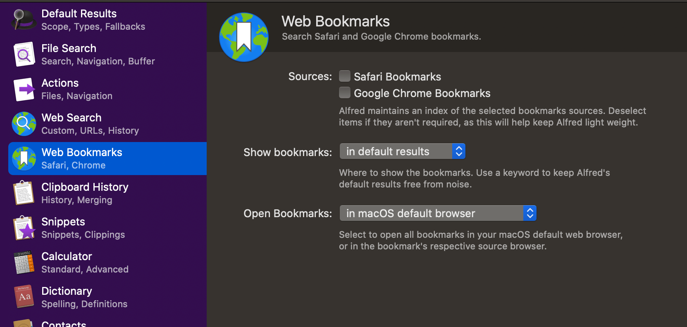

### Calculatrice

Si tu as besoin d'effectuer un calcul simple et rapide, ne t’embêtes pas à lancer l'application Calculatrice. C'est trop long. Il suffit de le taper directement dans Alfred.

<figure>

<figcaption>

Si tu te poses la question, le calcul que j'ai tapé était totalement aléatoire 😎

</figcaption>

</figure>

### Dictionnaire et orthographe

Tu n'es pas sûr de la signification d'un mot ? Sans Alfred, il fallait faire une recherche sur Google ou lancer l'application Dictionnaire manuellement. Maintenant, avec Alfred, il suffit de taper "Define {word}" et tu obtiendras la définition instantanément.

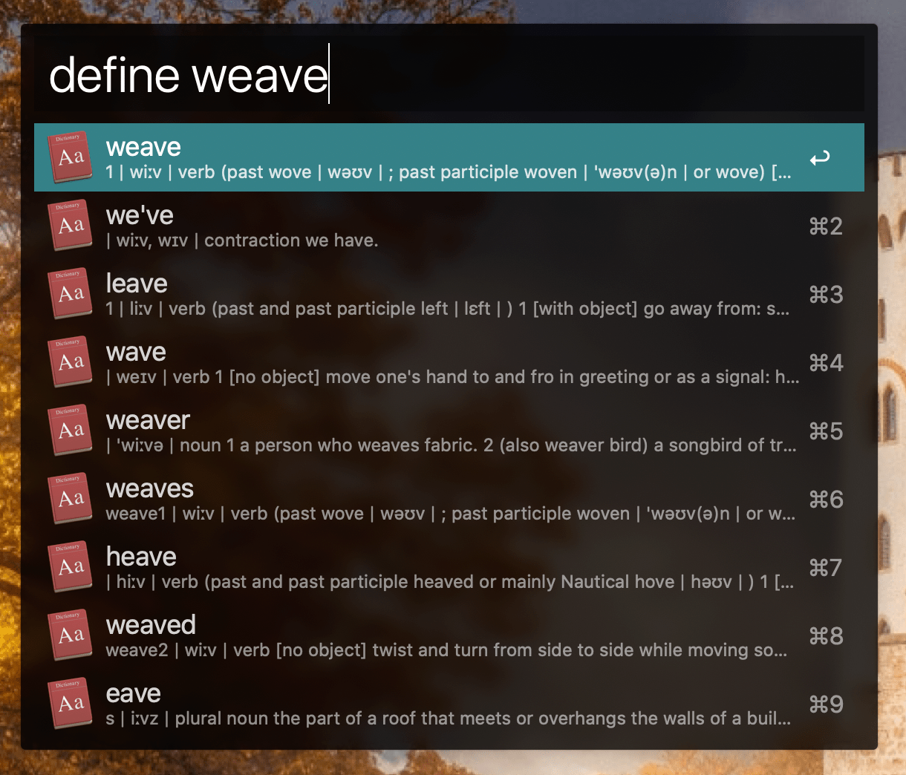

Si tu ne sais pas comment épeler un mot, tapes "Spell {xxx}", où "xxx" serait un mot mal orthographié. Alfred tu proposera les mots corrects correspondant à l'orthographe incorrecte.

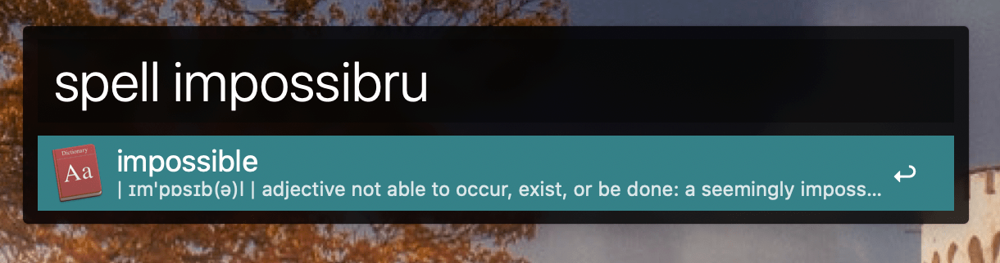

### Contacts

Il suffit de taper le nom d'un contact, et s'il est enregistré dans ta liste de contacts, Alfred le trouvera et te montrera rapidement ses informations. Tu pourras également copier rapidement ses coordonnées, comme son numéro de téléphone ou son email.

<figure>

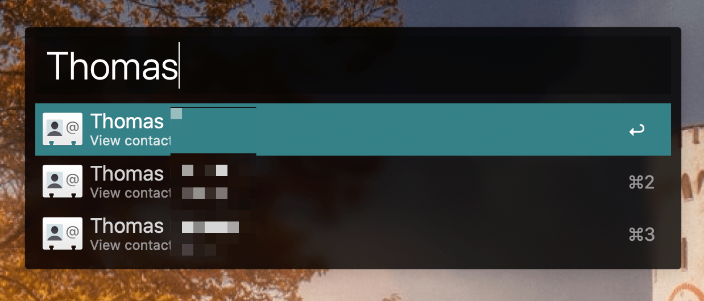

<figcaption>

Toi aussi tu connais plein de Thomas ?

</figcaption>

</figure>

### Commandes et paramètres du système

Alfred te permet de taper directement des commandes système, plutôt que d'avoir à aller dans les menus et à cliquer sur différent éléments. Par exemple, si tu souhaites :

- mettre l'ordinateur en veille
- le redémarrer
- vider la corbeille
- verrouiller l'écran
- lancer l'économiseur d'écran

Il suffit de le taper dans Alfred. Tu peux même cacher, quitter et forcer la fermeture des applications, et régler le volume de l'ordinateur.

Tu peux également accéder rapidement aux préférences système par leur nom. Par exemple, si tu veux aller dans le panneau de préférences de l'économiseur d'écran, il suffit de taper "Écran".

<figure>

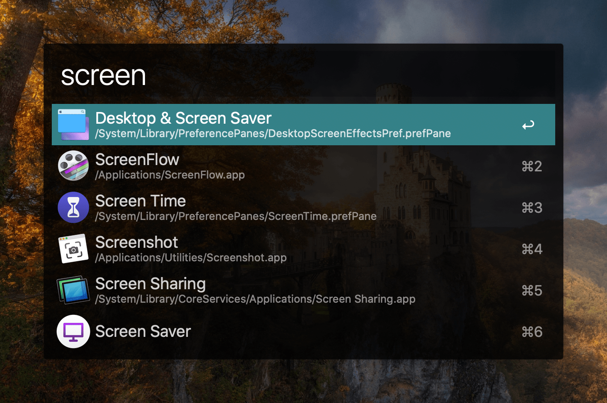

<figcaption>

Oui, bon, j'ai tapé "screen", parce que mon mac est en anglais.

</figcaption>

</figure>

## **Ne plus jamais ouvrir Finder**

J'ai donné à cette fonctionnalité sa propre section, parce que c'est probablement la fonctionnalité que j'utilise le plus et qui me fait gagner le plus de temps. Rien que ça, ça rend Alfred indispensable.

On passe une grande partie de notre temps devant l'ordinateur à chercher des dossiers et des fichiers, et à les déplacer. Avec Alfred, ouvrir le Finder et parcourir les dossiers pour trouver un fichier appartient au passé (tant que l'on se souvient d'une partie du nom des fichiers/dossiers).

Ça fait une éternité que je n'ai pas ouvert le Finder pour chercher un fichier. Chaque fois que j'ai besoin d'un fichier, je lance Alfred, j'appuie sur la barre d'espace (pour basculer en mode de recherche de fichiers) et je commence à taper le nom du fichier. La vitesse à laquelle Alfred te permet de trouver des fichiers est dingue.

Une fois que tu as trouvé tes fichiers ou dossiers, tu peux effectuer des actions avec, au sein même d'Alfred. C'est pourquoi je n'utilise presque jamais Finder. Depuis Alfred, tu peux ouvrir un fichier, le copier ou le déplacer dans un autre dossier, copier son chemin d'accès, l'envoyer par e-mail, le supprimer, le renommer, etc.

Tu peux même faire une recherche _dans le contenu des fichiers_ en commençant ta recherche par le mot-clé `in`.

Une fois que tu t’y es habitué, ça change complètement la donne. Tu peux faire tout et n'importe quoi en quelques frappes.

## **Les fonctionnalités avancées d'Alfred (PowerPack requis)**

Pour les prochaines fonctionnalités, tu dois posséder [Alfred PowerPack](https://www.alfredapp.com/powerpack/). C'est une mise à jour payante qui déverrouille les fonctionnalités les plus puissantes. Elle coûte 29 £ (environ 32.50 €) ce qui, pour moi - et pour tous ceux qui accordent de l'importance à leur temps - est une bouchée de pain.

### Snippets

Aussi connu sous le nom d'expansion de texte, c'est un des meilleurs outils de productivité. Ça t’évite de taper du texte répétitif. Tu as probablement un tas de choses que tu écris tout le temps. Comme ton email, ta signature, ton adresse physique, ton numéro de téléphone...

Il existe [une multitude de logiciels dédiés à l'expansion du texte](https://thesweetbits.com/best-text-expansion-mac/). Certains sont excellents. Mais une fois que tu as le PowerPack d'Alfred, pas besoin d'installer une autre application.

Pour n'importe quel texte que tu tapes et retapes, les snippets d'Alfred tu feront gagner beaucoup de temps.

Par exemple, au lieu de devoir taper

> N'hésite pas si tu as la moindre question,
> Thinh

à chaque fois, je tape juste `,nh` et Alfred remplace automatiquement par le texte voulu.

Je commence mes mots-clés auto-expansibles par `","` car lorsque tu tapes normalement, les virgules sont toujours suivies d'un espace. De cette façon, je suis sûr de ne pas auto-développer un extrait par erreur.

En outre, Alfred te permet également d'insérer du contenu dynamique dans tes snippets. Ainsi, chaque fois que je dois taper la date, je n'ai pas à réfléchir. Je tape juste `,date`  ou `,tod` (pour "today", aujourd'hui), et Alfred va automatiquement l'étendre à la date du jour dans les formats que j'ai configurés.

Voici mes snippets les plus utiles :

- `,ttb@` : s'étend automatiquement à mon adresse électronique thinh@tobal.fr. J'en ai un tas pour les différentes adresses électroniques que je possède. Il s'agit toujours de trois lettres suivies d'un signe @
- `,thx` : signature rapide pour les courriers électroniques, s'étendant à :

> _Thanks,
> Thinh_

- `,date` : s'étend à la date actuelle en format international, par exemple 2020-10-20

- `,tod` : même chose, mais au format européen, par exemple 20/10/2020

- `,addr` : s'étend à mon adresse complète (rue, ville et code postal)

- `,phone` : pour mon numéro de téléphone

- `,tob` : s'étend à l'URL de ce site, [https://tobal.fr/](https://tobal.fr/). Tout comme les adresses électroniques, j'en ai quelques-unes, ce qui me permet de partager facilement et rapidement des URL importantes.

Je ne les énumérerai pas tous, car le reste est propre à mes usages personnels. J'ai du texte que j'envoie par email, spécifique à mes projets. Ou encore des messages pour AirBnB, que j'envoie souvent. J'ai même un extrait de _lorem_, qui s'étend automatiquement à un paragraphe de [lorem ipsum](https://www.blindtextgenerator.com/lorem-ipsum). C'est pratique pour faire des maquettes rapides de pages web.

### Historique du presse-papiers

Je suis étonné par - et n'arrive pas à comprendre - par le nombre de personnes qui n'utilisent pas de gestionnaire d'historique de presse-papiers. Savent-ils à quel point il est limitatif de ne pouvoir copier/coller qu'un seul élément ? Sont-ils conscients du temps qu'ils perdent à faire des allers-retours entre les applications et les documents pour trouver le bout de texte dont ils ont besoin ?

<figure>

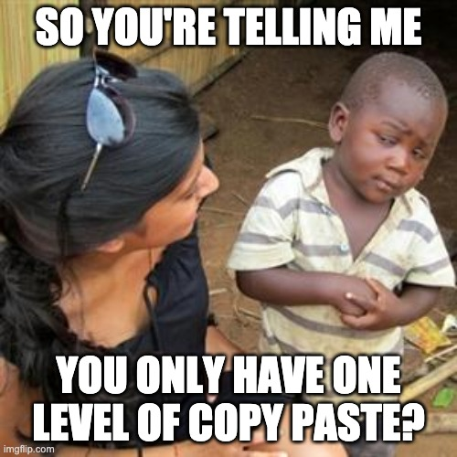

<figcaption>

"Tu es en train de me dire... Que tu ne peux copier-coller qu'un élément à la fois ?"

</figcaption>

</figure>

Tout comme pour snippets, [il existe de nombreux gestionnaires de presse-papiers géniaux](https://www.producthunt.com/ask/646-what-is-the-best-clipboard-manager-for-mac-os), mais le Powerpack d'Alfred fait l'affaire ici aussi. Il suffit de cliquer sur le raccourci choisi (pour moi, c'est ⌥ + 1), et **tu peux accéder à tous les éléments que tu as copiés dans le presse-papiers dans le passé**, jusqu'à une certaine période de ton choix. Il peut s'agir des dernières 24 heures, 7 jours, 1 mois ou 3 mois.

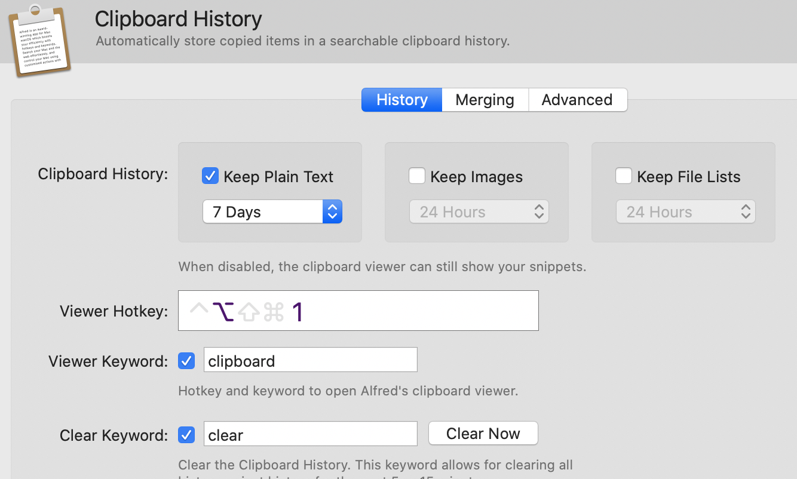

Le popup d'historique est simple mais efficace. Il te permet à la fois d'effectuer une recherche textuelle dans l'historique de ton presse-papiers, tout en te montrant un aperçu de chaque élément du presse-papiers, puis de le coller où tu le souhaites.

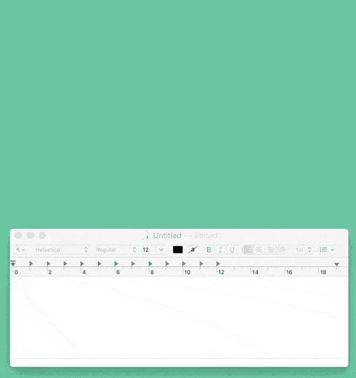

Même si tu penses que tu n'as pas tellement besoin d'un gestionnaire d'historique de presse-papiers, fais juste un essai. Je te garantis que tu te demanderas comment tu as pu vivre sans jusqu'ici.

Maintenant, laisse-moi te montrer des personnalisations plus poussées d'Alfred.

## Mes recherches personnalisées sur Alfred

Les personnalisations suivantes correspondent sont liées à mes propres besoins, mais tu en trouveras probablement certaines qui te seront utiles.

### Domainr

[Trouve rapidement des idées de nom de domaine](https://domainr.com/). Parfait si, comme moi, tu te retrouves de temps en temps à chercher des noms domaines à acheter.

Mot-clé :  `domainr`

L'URL de recherche est : `https://domainr.com/?q={query}`

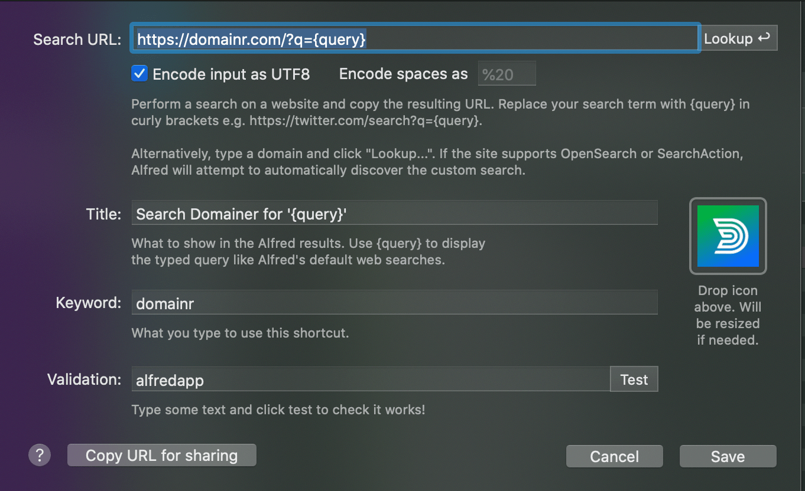

### Font Awesome

Trouve le parfait [icône (de police) en quelque seconde](https://fontawesome.com/) en quelques secondes.

Mot-clé : `fa`

L'URL de recherche est : `https://fontawesome.com/icons?d=gallery&q={query}&m=free`

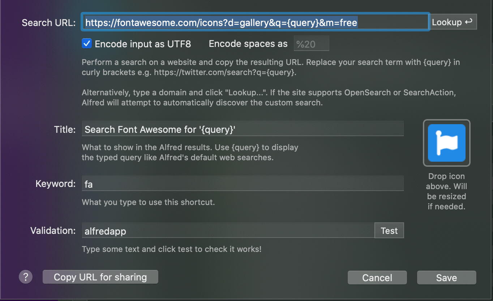

### IconFinder

Pareil que Font Awesome, mais avec des icônes plus colorées et plus variées. Alors que Font Awesome est principalement destiné aux sites web et aux interfaces utilisateur (puisqu'il faut installer une police), [IconFinder](https://www.iconfinder.com/) est destiné aux logos au format image (PNG).

D'ailleurs, la plupart des icônes que tu vois dans les captures d'écran (dans les paramètres de recherche sur le web dans Alfred) proviennent de ce site.

Mot-clé :  `icon`

L'URL de recherche est : `https://fontawesome.com/icons?d=gallery&q={query}&m=free`

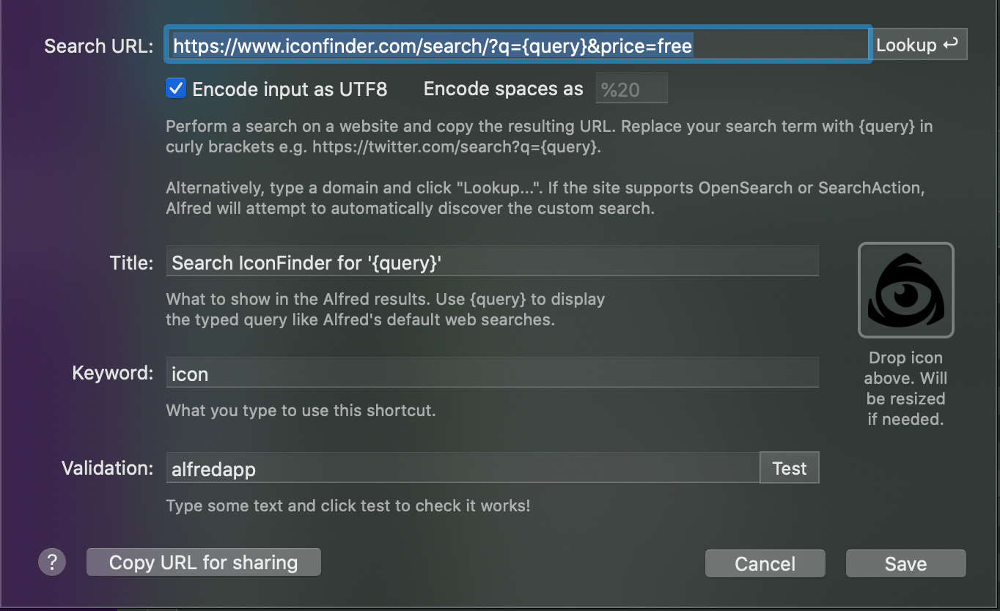

### LibreStock

[LibreStock](https://librestock.com/) est un site web pratique où tu peux obtenir gratuitement des photos stock (libres de droit) intéressantes. Grâce à Alfred, c'est un moyen très rapide de chercher une image.

Mot-clé :  `lstock`

L'URL de recherche est : `http://librestock.com/photos/{query}`

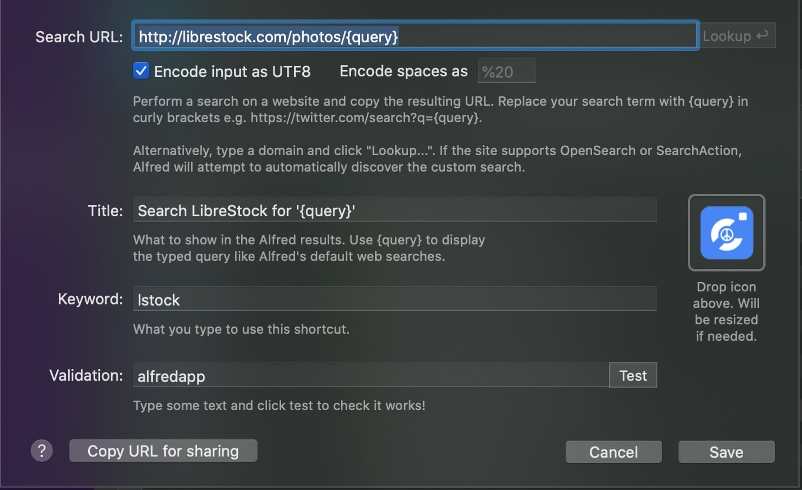

### Unsplash

Il y a de fortes chances que tu aies entendu parler au moins une fois de [Unsplash](https://unsplash.com/). C'est comme LibreStock, mais en plus célèbre, et il me semble qu'il y a encore plus de photos.

Mot-clé :  `unsplash`

L'URL de recherche est : `https://unsplash.com/s/photos/{query}?orientation=landscape`

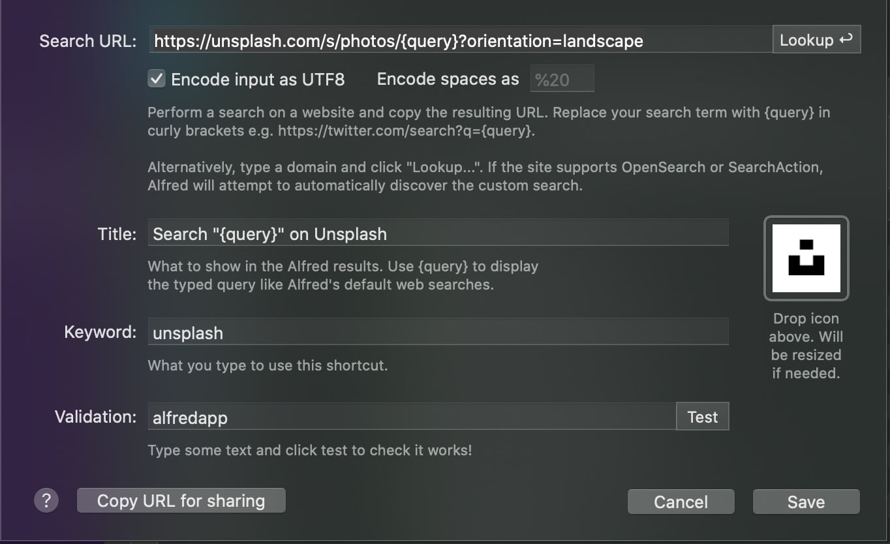

### API Ruby on Rails

Je m'amuse un peu à programmer avec [Ruby on Rails](https://rubyonrails.org/) ces derniers temps. Cela me permet de faire des recherches rapides dans la documentation de l'[API Ruby on Rails](https://api.rubyonrails.org/).

Mot-clé :  `rails`

L'URL de recherche est : `https://api.rubyonrails.org/?q={query}`

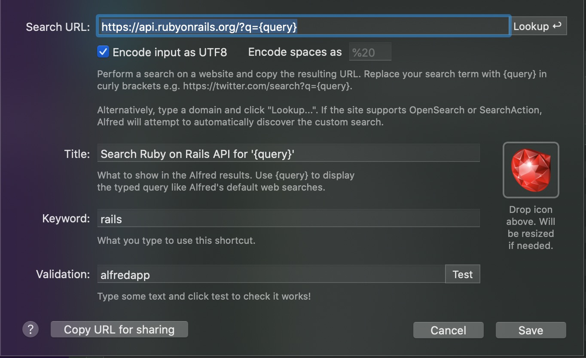

### Documentation Symfony

Cela me permet de rechercher rapidement dans la [documentation officielle Symfony](https://symfony.com/doc/current/index.html).

Mot-clé : `sf`

L'URL de recherche est : `http://symfony.com/search?q={query}`

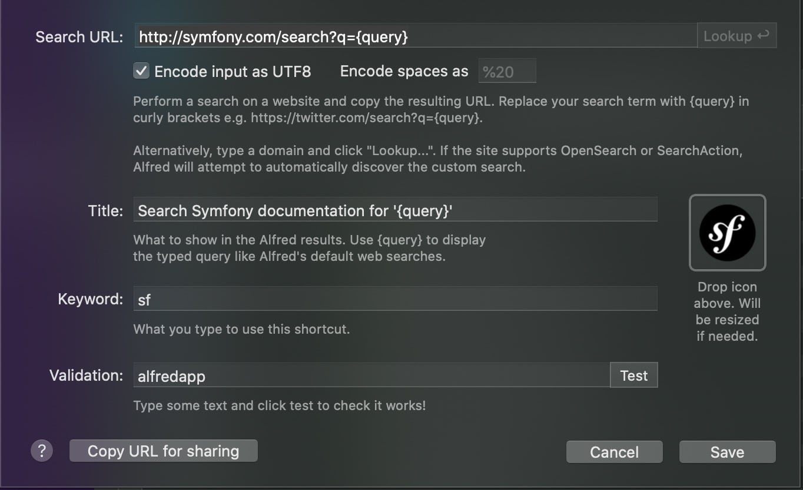

### Recherche de mots-clés UberSuggest

J'ai récemment commencé à utiliser [Ubersuggest](https://app.neilpatel.com/fr/ubersuggest/) de Neil Patel, comme outil de recherche de mot-clés. Cette recherche me permet de vérifier la performance d'un mot-clé en quelques instants.

Mot-clé : `us`

L'URL de recherche est : `https://app.neilpatel.com/fr/ubersuggest/overview?keyword={query}&locId=2250&lang=fr`

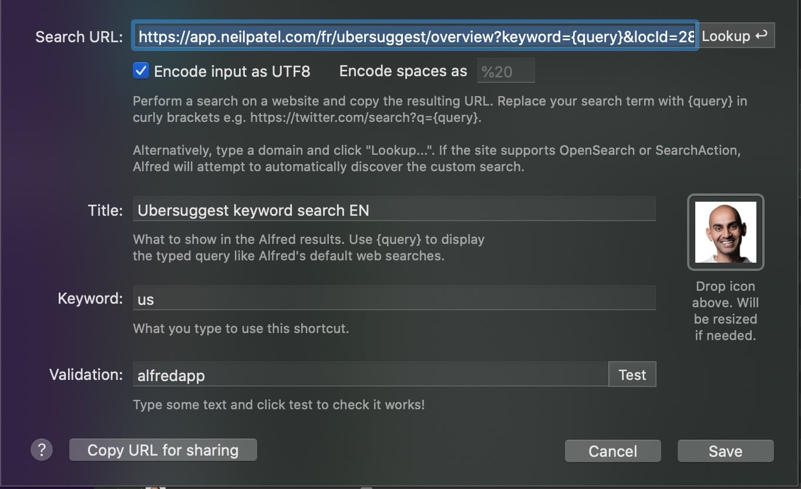

C'est facile et rapide d'ajouter une recherche personnalisée sur Alfred, et les possibilités sont illimitées. Fais-toi plaisir à créer tes propres recherches personnalisées.

## **Mes workflows Alfred**

**On entre à présent sur le territoire où Alfred devient ultra-puissant**. Les workflows sont à Alfred ce que les extensions sont à Chrome. Ils permettent à Alfred d'effectuer presque toutes les tâches imaginables.

Grâce à une interface visuelle puissante et versatile, dans laquelle tu peux créer divers éléments et les connecter, combinée à la prise en charge de nombreux langages de script (Apple Script, PHP, Ruby, Python...), **tu peux accomplir à peu près tout ce qui est peux réalisable avec un ordinateur**, en quelques touches de clavier.

Alfred peut prendre des mots clés et données en entrée, les passer à un script, appeler des API, interagir avec d'autres applications... La seule limite est l'imagination.

<figure>

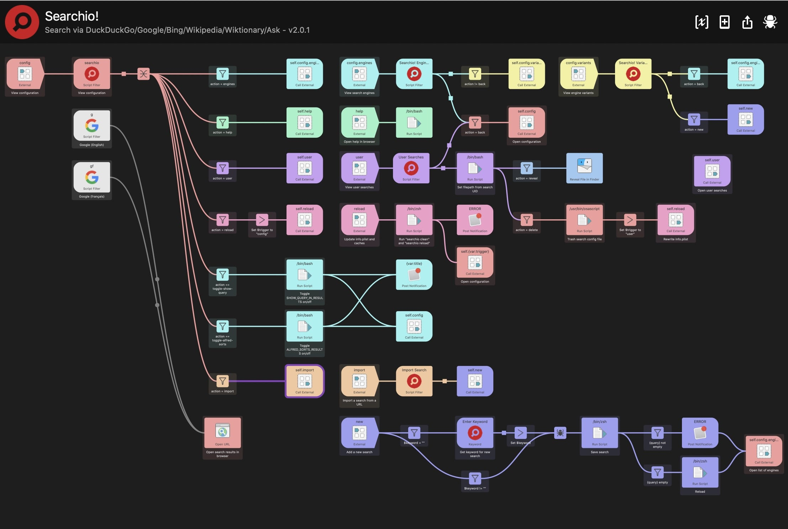

<figcaption>

Ok, ça fait flipper. Mais ne t'inquiètes pas, les workflows ne sont pas forcément tous aussi complexes.

</figcaption>

</figure>

L'interface de création de workflow peut être un peu intimidante, mais tu n'as pas besoin de l'utiliser pour bénéficier des workflows d'Alfred. Tu peux installer l'une des centaines de workflow créés par la communauté des passionnés d'Alfred, directement depuis le [site officiel de workflow d'Alfred.](https://www.packal.org/)

Je ne vais pas lister tous les workflows qui existent, puisqu'il y en a environ 1485 au moment où j'écris cet article. Je vais simplement te donner ceux que j'utilise, pour te donner une idée de ce qu'il est possible de faire.

### Boîte à outils du navigateur Alfred

Ce workflow ajoute un tas de mots-clés pratiques et des actions de menu supplémentaires pour trouver et manipuler tes fichiers et dossiers directement depuis Alfred.

[Obtenir Alfred Browser Toolbox sur Packal](https://www.packal.org/workflow/alfred-browser-toolbox)

## Alfred Maestro

Si tu utilises [Keyboard Maestro](https://www.keyboardmaestro.com/main/), ce workflow te permet de trouver (avec auto-complétion) toutes les macros Keyboard Maestro que tu as configurées, et de les lancer directement depuis Alfred.

[Obtenir Alfred Maestro sur GitHub.](https://github.com/iansinnott/alfred-maestro)

Le créateur du workflow prévient qu'il pourrait ne pas fonctionner sur MacOS Catalina, mais je n'ai eu aucun problème jusqu'à présent.

### Audio Switch

Je me retrouve souvent à devoir basculer la sortie audio de mon ordinateur portable entre mes écouteurs, mon interface audio ou les haut-parleurs internes. Ce simple workflow me permet de choisir l'entrée ou la sortie audio à utiliser sans avoir à toucher ma souris.

[Obtenir Audio Switch sur Packal](http://www.packal.org/workflow/audio-switch)

### Battery

Un workflow tout simple mais soigné. Il te montre des informations utiles sur la batterie de ton MacBook.

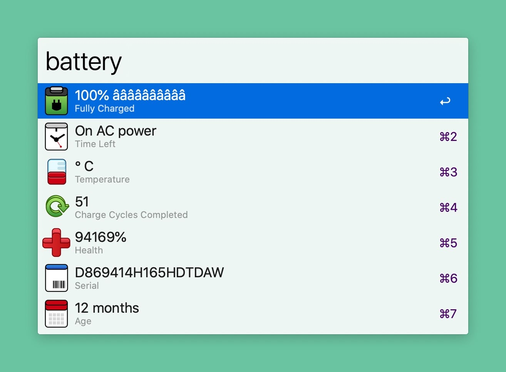

[Obtenir Battery sur GitHub](https://github.com/BenziAhamed/alfred-battery)

**Birthday**

Un workflow tout bête où tu entres ta date de naissance, puis il t’indique combien d'années, de mois, de jours, d'heures, de minutes ou de secondes tu as vécu au total. Pas indispensable, mais marrant.

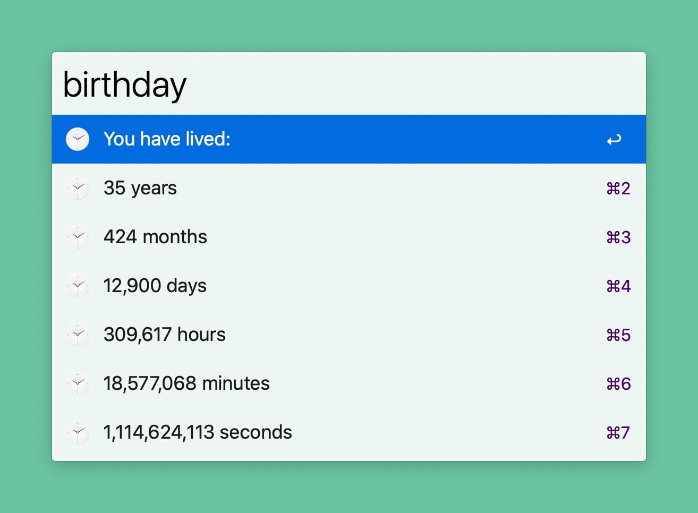

[Obtenir Birthday dans le forum officiel d'Alfred](https://www.alfredforum.com/topic/10733-alfred-time-see-time-passed-from-your-birthday/)

### Convert

Ce workflow génial te permet de convertir rapidement entre plusieurs unités. Monnaie, distance, durée, masse, vitesse, mémoire, volumes... Tu peux consulter [la liste complète des unités prises en charge](https://github.com/hgrecco/pint/blob/master/pint/default_en.txt) si tu es curieux.

Je l'utilise quotidiennement pour convertir les coefficients de viscosité en force magnétomotrice. Je plaisante, il me permet de convertir des euros en dollars sans avoir à utiliser Google.

[Obtenir Convert sur Packal](https://www.packal.org/workflow/convert)

### Codes Emoji Alfred

Tu utilises des emojis tout le temps, mais tu détestes perdre du temps à chercher dans le sélecteur d'emojis par défaut de ton Mac ? Ce workflow est pour toi. Il te permet de rechercher des emojis en utilisant du texte, directement à partir d'Alfred.

[Obtenir Emoji code sur GitHub](https://github.com/carlosgaldino/alfred-emoji-workflow). Bien que la documentation indique que c'est pour Alfred 2, et que le workflow n'ait pas été mis à jour depuis des années, il fonctionne parfaitement avec la dernière version d'Alfred (version 4 à l'heure où j'écris ces lignes).

### Gestionnaire du fichier hosts

Si tu faites du développement web, il y a de fortes chances que tu doives modifier ton fichier `/etc/hosts` de temps en temps. Tu peux l'ouvrir dans un éditeur de texte, ou dans [vim](https://en.wikipedia.org/wiki/Vim_(text_editor)) depuis le terminal, comme le font la plupart des gens. Mais tu peux aussi utiliser Alfred.

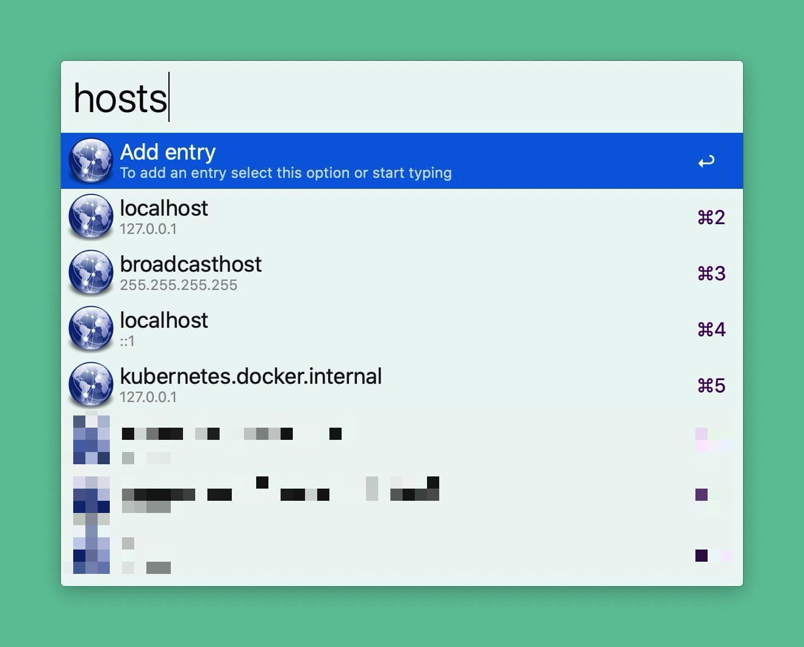

[Obtenir Host File Manager sur Packal](http://www.packal.org/workflow/hosts-file-manager)

### Nouveau document Google Docs

Un workflow simple, mais super utile si tu crées souvent des Google Docs. Comme son nom l'indique, il te permet de créer un nouveau document Google Docs, Sheets, Slides ou Form en quelques touches. Il suffit de taper "New" et de sélectionner le type de document à créer.

[Obtenir New Google Docs sur GitHub](https://github.com/mathewcropper/alfred/tree/master/new-google-docs)

### Nouveau calendrier d’événement avec Spark

C'est un workflow que j'ai crée moi-même.

Pour mes besoins en matière de calendrier, j'utilise Google Agenda. Une chose que j'aime utiliser, c'est la saisie en [langage naturel](https://www.lebigdata.fr/traitement-naturel-du-langage-nlp-definition) pour créer de nouveaux événements. Par exemple, je tape "Entraînement tous les lundis de 15h à 17h" pour créer un événement récurrent. Malheureusement, Google a supprimé cette fonctionnalité il y a quelques années. Pour contourner ce problème, j'utilise [l'application Spark](https://sparkmailapp.com/), qui prend en charge la saisie en langage naturel.

Ce workflow me permet ainsi de créer rapidement un événement de calendrier, en utilisant le langage naturel directement depuis Alfred.

Tout ce que fait ce workflow, c'est de lancer un [AppleScript](https://www.jannaud.fr/applescript#:~:text=Le%20langage%20AppleScript%20est%20un,comme%20iTunes%20ou%20le%20Finder.) pour ouvrir l'application Spark et de coller le texte dans la fenêtre de création d'événement. Donc, si tu n'utilises pas Spark, le workflow peut facilement être modifié pour utiliser une autre application qui prend en charge le langage naturel.

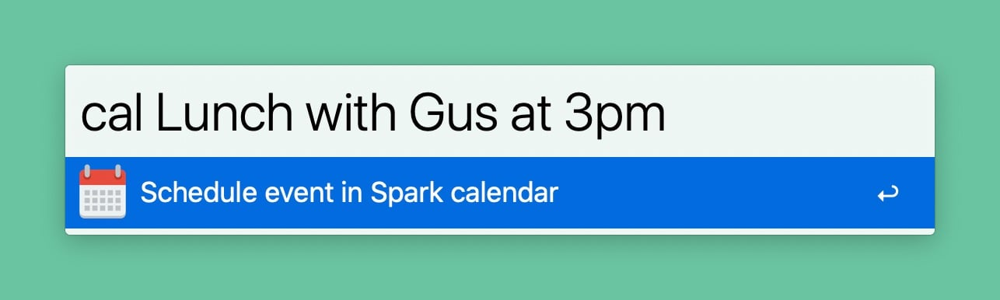

[Obtenir ce workflo](https://tobalfr.s3.eu-west-3.amazonaws.com/uploads/2020/10/New%20Spark%20calendar%20event.alfredworkflow)[w](https://tobalfr.s3.eu-west-3.amazonaws.com/uploads/2020/10/New%20Spark%20calendar%20event.alfredworkflow)

### Notion Search

[Tout le monde attend l'API officielle de Notion](https://www.zetoolbox.fr/blogposts/pourquoi-lapi-de-notion-va-tout-changer). Pendant ce temps, un développeur malin a trouvé un moyen d'interagir avec Notion, et a créé ce workflow qui te permet d'utiliser Alfred pour rechercher n'importe quoi dans Notion.

Ce workflow est un peu plus difficile à configurer que les autres, mais ce n'est pas hyper compliqué non plus. Ce qui est génial, c'est que tu obtiens des suggestions. Si tu utilises beaucoup Notion comme moi, tu vas adorer.

[Obtenir le workflow Notion Search et les instructions d'installation sur GitHub](https://github.com/wrjlewis/notion-search-alfred-workflow). Ce n'est pas difficile à installer, mais il faut bien suivre les instructions d'installation.

### Générateur de mots de passe

Crée rapidement des mots de passe sûrs. Je ne l'utilise pas souvent en ce moment car j'utilise [1Password](https://1password.com/). Mais si tu n'utilises pas de gestionnaire de mots de passe, ce workflow te sera utile. Tu peux générer différents types de mots de passe, choisir leur longueur ainsi que leur complexité.

[Obtenir Password Generator sur GitHub](https://github.com/deanishe/alfred-pwgen)

### PHP Docs

Ce workflow te fera gagner beaucoup de temps si tu fais du développement PHP. Il permet d'effectuer des recherches rapides dans la base de données officielle PHP. Il t’offre même des suggestions pendant que tu tapes.

[Obtenir PHP Docs sur Packa](http://www.packal.org/workflow/php-docs)l

### Pocket for Alfred

Si tu utilises [Pocket](https://getpocket.com/) pour enregistrer des articles à lire plus tard,, ce workflow te permet de gérer tout ce que tu as dans Pocket directement avec Alfred. Tu peux lister les contenus que tu as sauvegardés, parcourir les différentes catégories, ouvrir un lien, archiver ou supprimer des articles. Et, bien sûr, tu peux effectuer des recherches texte. Ça fait un bail que je n'ai pas ouvert l'application ou le site web de Pocket.

[Obtenir Pocket for Alfred sur Packal](https://www.packal.org/workflow/pocket-alfred)

### Recent dowloads

Ce petit workflow te montre simplement une liste de tes téléchargements récents en tapant  `recent`.

[Obtenir Recent Downloads sur Packal](https://github.com/ddjfreedom/recent-downloads-alfred-v2)

_Note : en cherchant le lien de téléchargement de ce workflow, je suis tombé sur une version [plus récente et intéressante](https://ldstephens.medium.com/recent-items-4-2-for-alfred-3-418829ec07c9) de ce workflow, qui permet de lister d'autres choses récentes (documents, applications, dossiers, etc_.._.)_

### Alfred Reminders

Tout comme pour les événements du calendrier, j'aime pouvoir créer des [Rappels Apple](https://support.apple.com/fr-fr/guide/reminders/welcome/mac) en utilisant la saisie en langage naturel. Ce workflow ingénieux te permet de le faire directement à partir d'Alfred. Ce n'est peut-être pas aussi rapide que de dire "Dis Siri, rappelle-moi de ...", mais c'est beaucoup plus rapide que de devoir déverrouiller ton téléphone ou ton ordinateur et de lancer l'application Rappels.

[Obtenir Alfred Reminders sur GitHub](https://github.com/surrealroad/alfred-reminders)

### Search Notes

Bien que j'utilise énormément [Notion](https://www.notion.so/) et [Roam Research](https://roamresearch.com/), j'utilise aussi souvent Apple Notes pour prendre des notes rapidement quand je suis en déplacement. C'est plus simple et rapide pour prendre des notes, surtout depuis le smartphone. Comme tu peux le deviner, grâce à ce workflow, tu peux rapidement rechercher tout ce qui se trouve dans tes notes Apple, à partir d'Alfred.

[Obtenir Search Notes sur Packal](http://www.packal.org/workflow/search-apple-notes)

### Searchio!

La fonction de base de recherche Web d'Alfred te permet de chercher n'importe quoi sur n'importe quel site web, y compris sur les moteurs de recherche. C'est très bien, mais tu ne peux rechercher que ce que tu tapes C'est à dire sans auto-complétion ou suggestion, que tu obtiendrais si tu utilisais le site web officiel de Google par exemple.

Le workflow Searchio corrige ce problème. Il te permet d'effectuer des recherches sur la plupart des grands sites web, avec des suggestions directement dans Alfred.

[Obtenir le workflow Searchio ! sur GitHub](https://github.com/deanishe/alfred-searchio)

### Spotify Mini Player

Si tu utilises Spotify, tu vas adorer ce workflow. Il te permet de prendre le contrôle total de Spotify à partir d’Alfred. Tu peux rechercher ou jouer n'importe quelle chanson dans Spotify, parcourir des albums, des listes de lecture, afficher une petite fenêtre popup de la chanson en cours de lecture, aimer ou suivre des chansons, des artistes, des albums... Bref, presque tout ce que tu peux faire avec l'application Spotify. Le site web du workflow liste tout ce qu'il est possible de faire, et c'est impressionnant.

[Obtenirs Spotify Mini Player sur le workflow du site officiel](https://alfred-spotify-mini-player.com/)

### Timezones

Un simple workflow utilitaire pour afficher l'heure de différents fuseaux horaires.

[Obtenir Timezones sur Packal](https://www.packal.org/workflow/timezones)

### Unicod Symbols Search

Tu n'a pas idée de l'utilité de ce workflow tant que tu n'as pas eu besoin de taper des caractères spécifiques comme , ©, ou ⌘.

Au lieu de devoir chercher sur Google, puis copier-coller ou mémoriser des codes à taper compliqués, ce workflow te permet de trouver n'importe quel [caractère unicode](https://www.smashingmagazine.com/2012/06/all-about-unicode-utf8-character-sets/) par son nom, directement depuis d'Alfred.

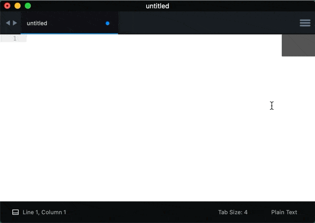

[Obtenir Unicode Symbols Search](https://www.packal.org/workflow/symbols-search)

## Un dernier petit conseil

Depuis Alfred 4, tu peux accéder rapidement à tous les paramètres, options ou personnalisations disponibles dans Alfred, en tapant "?" suivi du libellé du paramètre en question. #inception.

Par exemple, si tu souhaites accéder rapidement à l'écran de configuration des snippets, il te suffit de taper **?snippets** dans Alfred.

## **Conclusion**

Alfred est d'une importance capitale pour mon travail. Je ne compte pas les heures qu'il m'a fait gagner (mais si je devais deviner, je dirais que ça se compte en _semaines_).

Alfred est tellement important que c'est la toute première application que j'installe sur un nouveau Mac. Je ne peux tout simplement pas m'imaginer utiliser mon mac sans lui. Il te suffit de l'essayer - un véritable essai, pendant quelques semaines - et tu comprendras ce que je veux dire.
