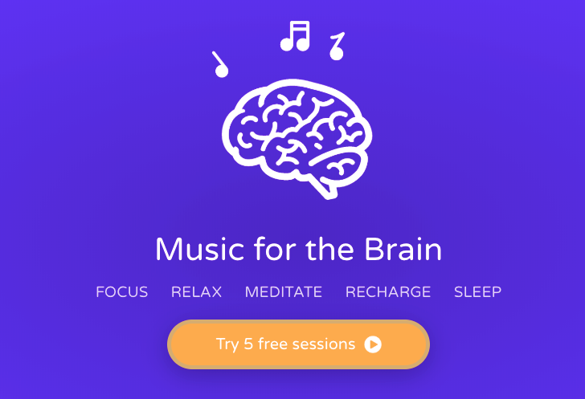
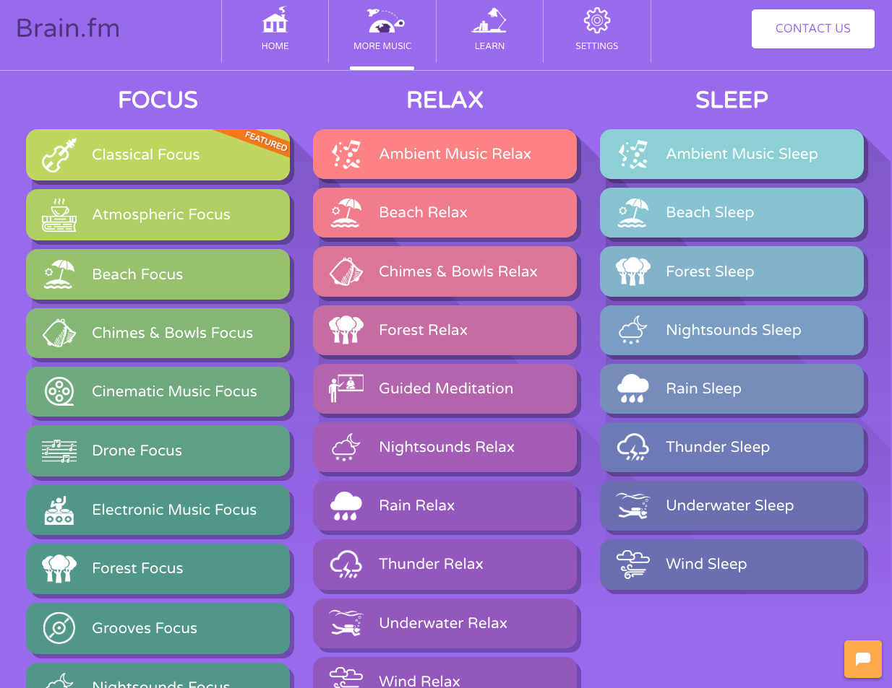
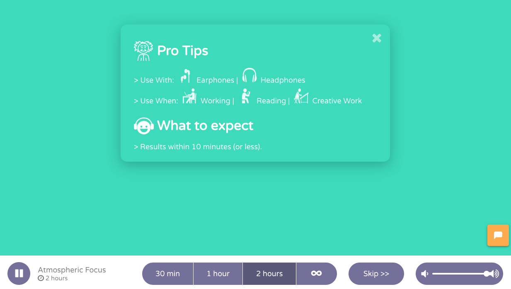
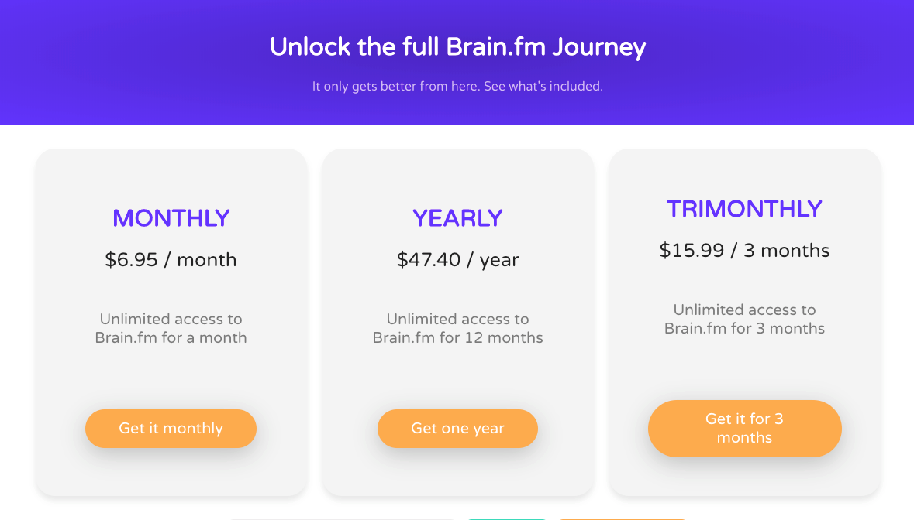

Pour être productif, il faut pouvoir bien se concentrer. Et quand il s'agit de concentration, avoir un bon environnement, c'est super important.

**Hors, on ne maitrise pas toujours son environment**. Peut-être que tes collègues au boulot font du bruit. Ou tu es chez toi, mais ta famille regarde la télé. Tu es peut-être dans le train à côté de gens qui parlent fort, ce qui t'empêche de lire tranquillement.

Quelque soit la raison, il existe une solution magnifique pour pallier à ce genre de situation: [Brain.fm](https://brain.fm/).<!--more-->

## Concentration sur commande

Brain.fm, c'est un site web et une application smartphone qui te permet d'écouter des "musiques" crées spécialement pour favoriser la concentration. Je met "musiques" entre parenthèses, car ce sont en réalité des mix entre des musiques et des sons.

Le principe est simple: tu choisis un objectif entre concentration, travail, [méditation](https://tobal.fr/comment-se-mettre-a-la-meditation/), relaxation et sommeil. Puis tu choisis la durée de la piste qui sera jouée. Brain.fm va alors automatiquement choisir pour toi une piste sonore adaptée à ton objectif.

Si tu le souhaites, tu peux choisir toi-même le thème de ta piste parmi de nombreux thèmes, divisés en trois grandes catégories (Concentration, Relaxation et Sommeil) :

- Musique classique.
- Musique d'ambiance.
- Sons atmosphériques.
- Sons de plage.
- Son de forêt.
- Pluie, nuit, orage.
- et de nombreux autres...

Comme tu peux le constater, il y a l'embarras du choix. Il y a même une piste de méditation guidée, mais seulement en anglais.

## Efficacité

Alors, de quelle qualité sont les pistes et est-ce que ça fonctionne ?

**Ça marche grave !** C'est une de mes application les plus utilisées. C'est simple, dès que j'ai besoin de m'isoler pour me concentrer ou méditer, je lance Brain.fm. La variété des pistes évite de se lasser, et **leur qualité est tout simplement exceptionnelle**.

D'ailleurs, pour info, ce ne sont pas juste des sons et musiques "simples". **Les mix ont été crées spécifiquement avec l'aide de chercheurs en neuroscience pour créer des sons, fréquences et harmonies favorisant la concentration**. Il existe certaines fréquences et types de sonorités qui aident le cerveau à se concentrer ou au contraire, à se relaxer.

Quand j'ai besoin de me concentrer alors que je travaille dans un environnement bruyant, j'utilise Brain.fm. Quand je suis dans les transports en commun et que j'ai envie de lire tranquille ou même méditer, j'utilise Brain.fm.

Pour que ça fonctionne au top, je te recommande d'utiliser Brain.fm avec **un casque à réduction de bruit**, si tu en as un. Ou au moins un casque qui isole bien des bruits extérieurs. Le combo Brain.fm + casque anti-bruit c'est tout simplement fantastique. C'est la meilleure solution que je connaisse pour se concentrer facilement même quand il y a du bruit autour de toi.

## Combien ça coûte

**La version gratute te permet d'écouter les 3 types de sons (Concentration, Méditation, Sommeil) pendant 5 sessions**, une session pouvant durer jusqu'à 2 heures. Ça te laisse donc tout le loisir de bien tester.

Ensuite, si ça te plait, l'accès "Pro" (nombre de sessions illimités et choix de toutes les catégories de son) est à 6,20€ environ (6,95 dollars exactement) par mois, ou 3,50€ si tu prend l'abonnement sur un an.

Et là tu te dis : est-ce que ça vaut le coup de lâcher 3-6 euros par mois pour ça ?

Eh bien, comme toujours, ça dépend. Personnellement, cette app m'est très, très utile. Elle permet de mieux se concentrer, mieux travailler, mieux se relaxer, mieux dormir, et même méditer. Donc, potentiellement, elle t'aide à faire du meilleur travail, à être plus heureux, moins stressé, et au final plus épanoui.

Je sais pas pour toi, mais pour moi, ça les vaut largement.

[Brain.fm](https://brain.fm)

Sinon si tu cherche des solutions gratuites, tu peux essayer:

- [Noisli](https://tobal.fr/ameliorer-sa-concentration-avec-noisli/)
- [AmbiantMixer](https://tobal.fr/creer-dans-ambiances-sonores-pour-etre-plus-concentre-et-plus-productif/)
- [focusmusic.fm](https://tobal.fr/une-application-web-pour-mieux-se-concentrer-et-etre-plus-productif/)
