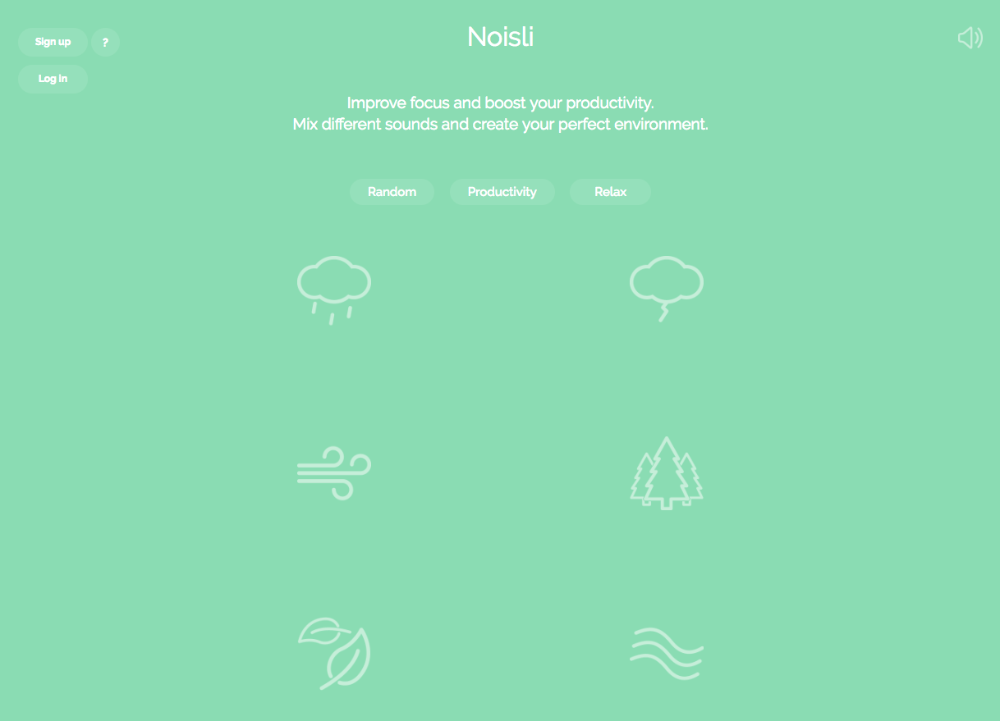

Je suis fan de ces petites applications toutes simples qui permettent de mieux se concentrer pour travailler, méditer ou simplement se reposer. [Noisli](https://www.noisli.com/) en fait partie.<!--more-->

Noisli est d'abord un site web, mais aussi une application iOS, Android et même une extension Chrome, qui fonctionne très simplement. Tu as des icônes représentant des fonds sonores, et quand tu cliques dessus, tu les actives. Tu peux régler le volume et mélanger différents types de sons.

Il y a plein de sons très sympas, que je trouve très efficaces pour améliorer la concentration) : la pluie, l'orage, le vent, le bruissement de feuilles, une rivière, un feu de camp, une ambiance de nuit, dans un train... Sinon, si tu cherches plutôt de la musique tu peux essayer [focusmusic.fm](https://tobal.fr/une-application-web-pour-mieux-se-concentrer-et-etre-plus-productif/)

**C'est totalement gratuit**. Tu mets un casque sur les oreilles (avec réduction de bruit de préférence), tu lances Noisli, et c'est parti pour un moment de concentration intense.

À noter que les bruits sont vraiment bien faits et peuvent aussi servir pour aider à s'endormir ou simplement se relaxer. Des fois, dans les transports, j'écoute juste le bruit du vent et le bruissement des feuilles. En fermant les yeux, tu as l'impression d'être dans la nature, c'est génial.

[Noisli](https://www.noisli.com/)
