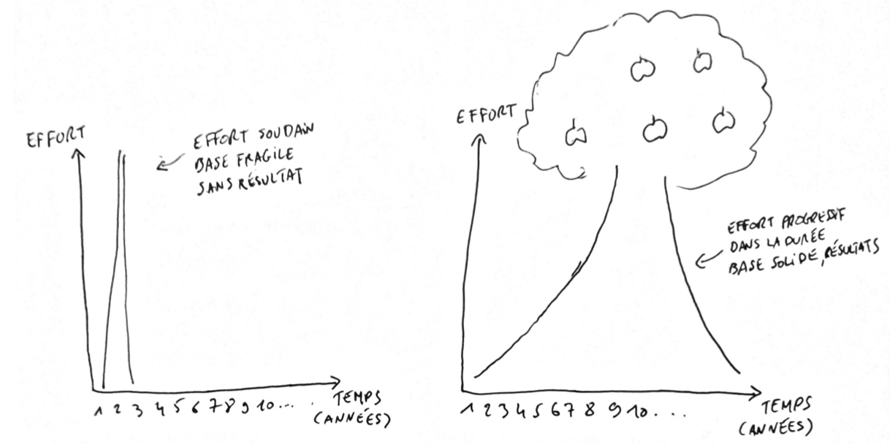

Comment achève-t-on un objectif de vie _signicatif_ ?

Quand je dis significatif, c'est à dire un objectif relativement complexe et difficile à atteindre, mais qui produit un changement notable dans ta vie, améliorant considérablement ton quotidien, et qui te rend plus heureux.<!--more-->

Par exemple : perdre du poids, apprendre une nouvelle langue, maitriser une nouvelle compétence, se lever tôt.

Faut-il :

a) Avoir une volonté de fer, être discipliné et motivé. Et arrêter de déconner : dès aujourd'hui, s'y mettre à fond, et pratiquer le plus possible.

b) Lire le maximum de livres, d'articles, reagarder des vidéos YouTube jusqu'à ce qu'on sache tout ce qu'il y a à savoir, pour partir avec les meilleures bases possibles.

c) Ne jamais se forcer : il faut le faire quand on est inspiré, quand la motivation vient. C'est le meilleur moment, là où on est le plus efficace.

d) En faire un petit peu tous les jours, sans s'arrêter. Le secret est dans la régularité.

Alors, quelle est ta réponse ? Les réponses a), b) et c) semblent logiques, pourtant c'est bel et bien d) la _seule_ bonne réponse.

**Pour achever tout objectif de vie significatif, il faut [répéter les mêmes actions positives tous les jours](https://tobal.fr/3-choses-a-faire-au-quotidien-pour-ameliorer-ta-vie/) pendant une longue période**. Ce ne sont pas la discipline, la motivation, l'inspiration, ni même la connaissance qui importent. Ce qui compte, c'est la régularité.

Ce qu'il nous faut, donc, ce n'est pas une méthode pour "atteindre ses objectifs", mais un véritable guide du changement comportemental. C'est à dire **un guide pour prendre de bonnes habitudes**, et pour de bon. Cet article a pour but d'être ce guide.

## Au revoir motivation et inspiration, Bonjour habitudes

Il est totalement illusoire de se dire qu'il suffit de se fixer un objectif, et ensuite de faire preuve de volonté pour y parvenir. Oh que non. Parce que le problème, c'est que **la volonté, la motivation, l'inspiration, et l'auto-discipline sont des ressources très réduites chez l'être humain**. C'est un fait. Certains en ont plus que d'autres, c'est vrai. Mais il y a une limite pour tout le monde. Et cette limite est très vite atteinte.

Alors si on ne peut pas compter sur la motivation ou la volonté, comment fait-on ?

La clé, ce sont **nos habitudes**.

Pour vraiment atteindre ses objectifs, il faut penser à adopter de bonnes habitudes. Ou au contraire, éviter les mauvaises habitudes qui nous entrainent dans une spirale infernale.

L'être humain est un être d'_habitudes_. Quelle que soit la situation dans laquelle on se trouve, on ne devient pas ce qu'on est tout d'un coup, du jour au lendemain, mais _à force de temps et de répétition_.

C'est valable pour tout, mis à part accidents ou autres situations exceptionnelles.

Une personne obèse ne passe pas de 70 kg à 140g en quelques semaines, ni même en quelques mois.

À l'inverse, un champion sportif n'est pas arrivé à son niveau en faisant d'énormes efforts sur une courte période.

Un pianiste virtuose ne joue pas du Chopin en quelque semaines, juste parce qu'il a décidé de se mettre au piano et que ça avait l'air cool.

Non, c'est à force de répétition et d'entrainement (ou de laisser aller) au fil des années.

Les gens riches ne le deviennent pas du jour au lendemain, si on met de côté les gagnants au loto. Et encore, en fait c'est un très bon exemple. La plupart d'entre eux finissent par tout perdre, justement à cause de leurs mauvaises habitudes. Il suffit de faire une petite recherche Google pour s'en rendre compte :

Mais les gens riches (et qui le restent), comme les athlètes de haut niveaux, et les gens qui excellent dans leur art (chef cuisinier, artiste, artisan, musicien) en sont là où ils sont par force de répétition dans le temps. Autrement dit, grâce à leurs habitudes.

[Oublie la volonté, l'auto-discipline, la motivation](https://tobal.fr/fuck-la-motivation/). Ça ne t'aidera que sur le très court terme. Focalise-toi sur tes habitudes.

Quel que soit l'objectif à atteindre, ne te concentre pas sur la masse d'efforts à fournir, et surtout pas sur la distance qui te sépare de ton objectif. À la place, demande-toi : **quel est le genre de personne qui atteint cet objectif ?** Ce n'est pas une question de savoir quoi faire, mais de qui devenir.

Pour reprendre mes exemples cités au début :

- Au lieu de vouloir "perdre du poids", demande-toi quelles sont les personnes qui n'ont pas besoin de perdre du poids ? Ce sont les personnes athlétiques. Et que font les personnes athlétiques ? Elle font du sport régulièrement. Elle ne cherchent pas à perdre du poids. Elle font du sport parce que c'est une partie intégrale de leur vie.
- Comment se lever tôt ? Il suffit de regarder les personnes qui se lèvent tôt tous les jours. Que font ces personnes ? Elles se couchent tôt. Se lever tôt le matin, régulièrement, ça commence la veille. Organise tes journées de manière à aller au lit tôt.

Autrement dit, il faut _prendre les bonnes habitudes_.

## Comment se mettre à de bonnes habitudes, et surtout les faire durer ?

La première chose, c'est d'éviter le piège des _fausses habitudes_.

Ce que j'entends par fausses habitudes, **c'est lorsqu'on se met à faire des choses qui, au lieu de devenir des habitudes, font en réalité énormément appel à notre volonté et notre motivation**. Ce qui est systématiquement le cas quand on fait des changements drastiques dans notre vie. Hors, les habitudes ne font justement quasiment jamais appel à notre volonté.

On le voit bien, à chaque nouvel an. Tout le monde se sent soudainement inspiré, et se dit "ça y est, cette fois-ci je m'y mets" (ou "j'arrête").

Et ça donne quelqu'un qui se met au sport une heure, cinq fois par semaine, alors que ça fait des années qu'il ou elle n'avait plus aucune activité physique.

Ou une autre personne qui se met à faire un régime draconien, à ne plus manger que des légumes à tous les repas alors qu'auparavant, elle mangeait des grosses assiettes à base de steak-frites ou pizza.

Et trois semaines plus tard, ces personnes sont reparties comme en quarante. Elles ont la flemme d'aller à la salle de sport ou de se faire des repas diététiques, parce que c'est trop dur de faire appel à sa volonté tous les jours pendant des semaines. Elles loupent leur objectif une fois, deux fois, puis finissent par conplètement lâcher l'affaire.

L'histoire te semble familière ?

L'être humain est un être d'habiudes. Et **on ne change pas ses habitudes du jour au lendemain**. Cela prend systématiquement _au moins_ plusieurs semaines, souvent plusieurs mois.

Il y a 5 règles d'or à respecter si tu veux mettre en place des bonnes habitudes, c'est-à-dire des habitudes solides, qui tiendront dans la durée.

Les voici.

### Règle n˚1 : Attacher une signification importante à tes actions, et se la rappeler constamment.

Attention, ici je n'ai pas dit _un but_, mais une _signification_.

Le but, c'est "Je veux parler couramment anglais" ou "Je veux perdre 10 kilos". La signification, c'est _pourquoi_ tu veux atteindre ce but ? C'est très différent de se focaliser seulement sur atteindre un but.

Dans l'exemple de la perte de poids, la signification derrière pourrait être de se sentir mieux dans sa peau. Eh bien, pour te sentir mieux dans ta peau, tu peux le faire dès maintenant. Une séance de sport et tu te sentiras mieux. Tous les jours tu peux te sentir mieux dans ta peau. Pas besoin d'atteindre un chiffre particulier.

### Règle n˚2 : Apprécier l'activité en elle même, pas pour le résultat.

La plupart du temps, on se fait violence parce que, justement, on cherche à atteindre un but à tout prix, le plus vite possible. On se dit que plus on fait d'efforts, et plus rapidement on atteindra notre but. Mais vouloir à tout prix atteindre un but qui souvent n'est pas atteignable rapidement, c'est le meilleur moyen de finir par se décourager.

Par exemple, si tu cours et te fait souffrir en étant exténué à la fin de chaque séance, parce que tu as voulu brûler le plus de calories possible pour maigrir le plus rapidement possible… C'est normal qu'à chaque fois que tu devras aller courir, tu vas redouter l'exercice et rechigner à la tâche. Et c'est ce qui te fait sauter une séance, puis deux, puis abandonner. Quand on prend du plaisir à faire quelque chose, il n'y a pas à se forcer.

### Règle n˚3 : Goûter au plaisir du succès.

C'est le challenge, et la réussite, qui nous motivent. Si on échoue tout le temps parce qu'on s'est fixé des barrières trop hautes, on se démotive forcément. Pour tenir dans la durée — et c'est ce qui compte — [il faut s'assurer de réussir ses objectifs de manière régulière](https://tobal.fr/comment-se-motiver-et-surtout-le-rester/). Il n'y a pas de meilleure source de motivation que de goûter au succès.

C'est pour ça que des objectifs hors de notre contrôle direct (atteindre un poids particulier, gagner une somme d'argent précise, trouver un job dans une entreprise spécifique) est contre-productif.

Par exemple, tu ne peux pas te dire "Aujourd'hui, je perds un kilos". Enfin tu peux te le dire, mais il y a très peu de chance que tu y arrives. En revanche, si tu te fixes le bon type d'objectif, comme faire 10 minutes de corde à sauter, c'est sous ton contrôle. Et quand tu l'as fait, tu as réussi. C'est un succès, _peu importe que tu aies perdu du poids ou non_.

### **Règle n˚4 : Y aller de manière incrémentale**.

Le souci, c'est quand on veut en faire trop d'un coup.

C'est justement en évitant de vouloir trop en faire que tu vas pouvoir goûter au succès rapidement, te faire plaisir et apprécier l'activité en elle-même.

Rien de pire que de commencer par des changements drastiques. Se mettre à courir une heure tous les jours alors qu'on faisait jamais de sport avant. Vouloir jouer du Chopin alors qu'on a jamais fait de piano. Vouloir écrire un livre alors qu'on a à peine écrit des articles de blog. Il faut y aller crescendo.

### **Règle n˚5 : Mettre en place des rituels**.

L'autre ennemi de l'action, c'est la prise de décision. Prendre des décisions, aussi bégnines qu'elles soient, a un impact sur notre énergie mentale, et par conséquent sur notre capacité à agir.

La solution est donc simple : **ne pas laisser la place au hasard ni à la réflexion**. Est-ce que tu réfléchis pour savoir si tu vas te brosser les dents ? Non, c'est le principe d'une habitude, d'un rituel.

**Mettre en place un rituel, c'est désigner des jours et des horaires très précis pour mettre en place tes nouvelles habitudes**.

Si tu décides de te mettre au sport, dis-toi par exemple que tu vas en faire le Lundi, Mercredi et Vendredi à 18h. Et quand le moment arrive, il n'y a pas de questions à se poser, tu sais exactement à quel moment il faut le faire. Et quand c'est l'heure de le faire, tu le fais.

### Petit aparté : quand il s'agit d'arrêter une mauvaise habitude

Si il s'agit plutôt d'arrêter une mauvaise habitude, une chose essentielle à garder à l'esprit est qu'il est beaucoup plus facile de remplacer cette habitude par une autre (bonne celle-ci), plutôt que de juste vouloir l'arrêter, sans rien à la place.

Les habitudes qu'on prend sont tenaces, qu'elles soient bonnes ou mauvaises. C'est là tout leur intérêt quand elles sont bénéfiques, et le problème quand elles sont mauvaises. Dans ce cas précis, **ça demande souvent trop de volonté d'arrêter une mauvaise habitude, si on ne la remplace pas derrière**. Et comme je le disais au début de cet article, la volonté, c'est une ressource  très limitée.

Pour réussir à stopper une mauvaise habitude, il faut que tu identifies une nouvelle chose que tu pourrais faire à la place.

Si tu as l'habitude de grignoter entre les repas, au lieu de te priver, continues de grignoter mais remplace les chips ou les gâteaux par des fruits. Remplace la cigratte par des chewings-gums ou des sucettes. Remplace l'heure de télé du soir par de la lecture, la bière par du thé, etc.

## Tout repose sur la régularité

Toutes ces techniques n'ont qu'un seul but : te permettre de rester _régulier_. La régularité est la clé. **Quel que soit l'objectif que tu cherches à atteindre, il ne doit pas être vu comme une course dératée pour y parvenir le plus vite possible, mais comme un mode de vie**.

Autrement dit, au lieu de faire des choses pour obtenir un résultat, deviens le type de personne qui obtient ces résultats .

Ça doit être quelque chose que tu fais tous les jours, toutes les semaines, tous les mois, tout au long de l'année. Il ne faut même pas entrevoir de fin. Dès le moment où tu vois ça comme une course avec une ligne d'arrivée, c'est foutu.

N'oublie jamais cela : une habitude est un mode de vie, _pas un résultat_. C'est la base du fonctionnement des habitudes. Si tu as pris l'habitude de regarder la télé en fin de journée, est-ce que tu attends un résultat particulier dans quelques mois ou quelques semaines ?

Prendre une bonne habitude, paradoxalement, ne doit pas se faire dans l'objectif d'atteindre un résultat. **L'habitude en elle-même est son propre résultat**.

La mise en place d'une bonne habitude, et les bénéfices qu'elle apporte, sont comme faire pousser un arbre. Il y a des efforts maximums que tu peux faire et une vitesse maximum à laquelle tu peux aller pour atteindre ton objectif. Ensuite tu dois y aller progressivement, continuer dans le temps, et l'arbre grandira naturellement.

Si tu veux aller trop vite, tu auras des fondations fragiles, ou pire, tu vas tuer l'arbrisseau et réduire à néant tes efforts.

Plus tu veux aller vite, plus tu fais de gros efforts sur une courte durée. Mais ces efforts finissent par être abandonnés aussi vite qu'ils sont arrivés. En revanche, quand tu y vas progressivement, la base que tu construis va te permettre, au bout d'un moment, de réduire tes efforts tout aussi progressivement, jusqu'à que tu n'aies pratiquement plus d'efforts à faire.

Sur mon dessin, à gauche, c'est le cas typique : quand on essaye de faire le plus d'efforts possible en peu de temps, pour atteindre son résultat au plus vite. Ça ne crée pas de fondation solide. La base est fragile et on abandonne ses efforts aussi vite qu'on a commencé.

A droite, on y va progressivement. [Plus le temps passe, plus la base créée est solide](https://tobal.fr/les-bonnes-choses-se-construisent-sur-de-bonnes-fondations/). Mieux, au bout d'un moment, quand on a développé l'habitude pour de bon, il y a de moins en moins d'efforts à faire. Et c'est à ce moment que les bonnes habitudes qu'on a développé portent leurs fruits (d'où les petites pommes dans mon arbre. C'est assez clair dans mon fantastique dessin, mais je précise au cas où tu pensais que c'était des manettes de Playstation).

La meilleure façon d'illustrer mes propos est de prendre mon propre exemple.

Voici quelques bonnes habitudes que j'ai prises au cours des derniers mois. J'avais essayé d'adopter ces mêmes habitudes il y a quelques années, mais j'avais échoué, car à l'époque je n'avais pas connaissance des principes que je viens d'énumérer.

Ce qui a fait la différence cette fois-ci, ce sont justement ces techniques que j'ai appliquées, et qui m'ont permis de réellement développer ces habitudes.

### Apprendre une nouvelle langue

Ça fait des années que je veux apprendre le Japonais. Je m'y suis essayé il y a 10 ans, juste comme ça, parce que j'avais envie de parler Japonais comme dans les mangas, et ça avait l'air cool. C'est tout. C'était ma seule motivation. Alors j'ai choppé deux bouquins et je me suis mis à apprendre pendant une semaine.

Au bout d'une semaine, ça m'a gonflé. Lire un bouquin de japonais n'a rien de particulièrement amusant. Au contraire même, ça endort. J'ai réessayé quelques jours plus tard, mais j'ai fini par abandonner rapidement.

Il y a un an et demi, je m'y suis remis. Et là, j'ai appris _tous les jours pendant 6 mois_. Et j'ai fini par savoir parler Japonais. Du moins assez pour me débrouiller et réussir à tenir une conversation basique avec un Japonais.

Quelle a été la différence ? J'ai appliqué les principes que je t'ai présentés.

La plus grosse différence avec la fois où j'ai abandonné, c'est que cette fois-ci, j'avais une vraie raison d'apprendre le Japonais qui me tenait à coeur : j'avais planifié un voyage au Japon.

La deuxième grosse différence, c'est que je n'ai pas utilisé de livre pour apprendre. À la place, j'ai trouvé une façon amusante d'apprendre, qui me donnait envie d'en faire un peu tous les jours : un podcast au format léger (pas plus de 15 minutes), avec des dialogues, de l'humour, et de la pratique.

Chaque fois que je me mettais à apprendre le Japonais, j'étais content, voire impatient. J'y prenais du _plaisir_.

### Se lever tôt

J'ai toujours été plus ou moins un "hibou". À la fac, j'avais pris l'habitude de me lever tard. Au mieux à 10h, bien souvent à midi. La plupart du temps, je me couchais la veille vers 3-4h du matin.

Il y a un peu plus de deux ans, j'en ai eu marre d'être un hibou. J'ai pris alors la décision de me lever tôt, _très tôt_.

Pour quelle raison ? À force d'entendre parler du [Miracle Morning](https://amzn.to/2F74zEn), et de toutes ces histoires d'entrepreneurs et CEOs célèbres qui se lèvent à 5h du mat'. C'est placardé partout sur internet, tu peux pas le louper : pour réussir dans la vie, il faut se lever tôt (affirmation à prendre avec des très grosses pincettes, mais c'est un tout autre sujet).

Alors je me suis dit : "J'ai envie de réussir ma vie, je vais faire pareil !".

Pouf, du jour au lendemain, je me suis reveillé à 5h tous les matins.

J'ai tenu deux mois. Et j'ai fini par lâcher l'affaire. Trop tôt, trop soudain, trop dur.

Puis j'ai retenté l'expérience il y a quelques mois. Sauf que, cette fois-ci, j'y suis allé bien plus sagement.

Déjà, j'ai choisi une _vraie raison_ de me lever tôt. Pas juste pour faire comme tout le monde conseille de faire, mais pour une raison qui me tient à coeur : pour avoir du temps dédié uniquement aux choses que j'ai vraiment envie de faire et qui me passionnent. Pour avoir du temps pour moi, et rien que pour moi.

Et surtout, j'y suis allé _progressivement_. Au lieu de passer de 10h à 5h du matin du jour au lendemain, je me suis levé pendant un mois à 8h, puis le mois suivant à 7h.

Résultat : tous les jours je me lève à 7h du matin _sans réveil_, frais. Fini les réveils K.O où je repousse l'alarme de mon téléphone pour pouvoir me rendormir dix minutes de plus.

**Objectif, sens, plaisir, succès, progressivité**.

Demande à n'importe quelle personne qui a de bonnes habitudes de vie, et tu verras qu'elle aura appliqué, consciemment ou non, la plupart voire la totalité de ces cinq principes.

D'ailleurs, c'est aussi la raison pour laquelle il est très facile de prendre des mauvaises habitudes (mal manger, fumer, regarder la télé, procrastiner…). Trois des principes (progressivité, plaisir, succès) sont naturellement impliqués.

On se met rarement à fumer 2 paquets par jour d'un coup, ou à manger 5 fois au fast-foods en une semaine. Ça s'immisce petit à petit dans la vie. Ça fait plaisir, et ce sont toujours des récompenses immédiates. Voilà pourquoi on se retrouve plus souvent avec de mauvaises habitudes.

Le "secret" est donc de faire en sorte de mettre en pratique ces principes dans les activités qui nous sont bénéfiques, et de les retirer des mauvaises habitudes dont on souhaite se débarrasser.

Par exemple, pour [arrêter de procrastiner](https://tobal.fr/3-techniques-pour-arreter-de-procrastiner/), trouve un moyen de retirer le plaisir à le faire. Ça peut être en te donnant des reponsabilités, notamment en impliquant les autres. La plupart du temps, si on procrastine, c'est parce qu'on est le seul impliqué. Et si on ne fait pas ce qu'on a à faire, il n'y aura pas de véritables conséquences, du moins pas _à court terme_. En impliquant d'autres personnes, et en t'engageant auprès d'elles, tu verras tout de suite que tu seras plus motivé.

Engage-toi auprès d'un ami à lui donner 50 euros si tu ne fais pas ta séance de sport. Tu verras que ce sera tout de suite plus facile de te motiver. Il y a même des sites crées spécialement pour ça, sur lesquels tu déposes une somme d'argent et ne la récupère que si tu fais ce que tu as dit que tu allais faire, comme [GoFuckingDoIt](https://gofuckingdoit.com/) ou [Stickk](http://www.stickk.com/).

Pour bien manger, c'est pareil. Si tu comptes sur ta volonté pour résister au paquet de chips quand tu as faim, tu as déjà perdu la bataille.

En revanche, ce que tu peux faire, c'est vider tes placards de tout ce qui est mauvais pour la santé. La prochaine fois que tu vas faire tes courses, premièrement, fais-les le ventre plein, sinon tu vas racheter n'importe quoi. Deuxièmement, n'achète que des choses saines mais qui te plaisent un minimum. N'achète pas de céleri si tu n'aimes pas le céleri.

Comme ça, la prochaine fois que tu as un creux, si tes placards ne contiennent aucune malbouffe, et que pour avoir ta barre de snickers il faut sortir et aller en acheter, il y a de fortes chances que tu choisisse un fruit à la place.

## Comment appliquer ces conseils concrètement

Pour illustrer tout ce qu'on vient de voir, rien de mieux que de prendre des exemples concrets.

Imaginons que tu veuilles te mettre au sport.

En tout premier lieu, pourquoi est-ce que tu veux te mettre au sport ? On fait rarement du sport juste "pour faire du sport", mais plutôt pour différentes raisons. Ça peut être :

- Pour maigrir et avoir une meilleure image de soi.
- Pour se dépenser et avoir plus d'énergie en général dans la vie.
- Pour avoir son moment à soi, se recentrer, mieux se sentir dans sa peau.
- Pour se décharger mentalement, se défouler.
- Pour se challenger, se prouver qu'on peut sortir de sa zone de confort et dépasser ses limites.

Peu importe la raison, **tant qu'il s'agit d'une raison qui est importante pour toi**, qui a un sens profond à tes yeux.

_Petit aparté : il n'y a pas de bonne ou mauvaise raison, tant que ça compte vraiment pour toi. Si c'est pour te sentir plus beau/belle, c'est une bonne raison, si ça te tient vraiment à coeur_.

Une fois que tu as lié une nouvelle habitude à une raison profonde, elle aura un vrai sens, et c'est une base vitale. Mais ce n'est pas tout. Ensuite, rappelle-toi ce que je disais plus tôt : pour obtenir un résultat, il ne s'agit pas de simplement _faire des choses_ mais plutôt de _devenir la personne qui obtient ce résultat_.

Concrètement, ça veut dire mettre de côté ton objectif. Mets-le dans un coin de ta tête et arrêtes d'y penser. Il viendra naturellement en devenant le type de personne qui obtient ce résultat.

**Mets en place des rituels**. Définis explicitement et précisément le jour, l'heure et la fréquence de ta nouvelle habitude. Se dire "Je vais me mettre au sport cette année", ou même "Je vais faire 3 séances de sport par semaine à partir de maintenant", ce n'est pas suffisant. À la place, sois _précis_ : "Je vais faire mon sport le Mardi et le Jeudi à 14h, et le Samedi à 11h".

Si tu as un emploi du temps variable et que tu n'es pas sûr de pouvoir respecter des horaires précises, fixe-toi des _événements déclencheurs_. C'est à dire des événements dont la suite est ta nouvelle habitude. C'est comme le matin, après le petit-déjeuner, quand tu te brosses les dents. C'est automatique, tu ne réfléchis pas. Là, c'est pareil. Par exemple, décide que dès que tu rentres du travail, tu fais ton sport.

**Prévois un plan de secours**. Ce conseil m'a été inspiré par mon ami [Bülent Turan](https://bulent-turan.com/). La vie est pleine d'aléas et il est facile de se retrouver dans une situation imprévue. Prévois une option de secours. Tu devais aller à la salle de sport mais elle est fermée exceptionnellement ? Décide que dans ce genre de cas, tu vas aller courir à la place.

**Vas-y de manière incrémentale**. Commence ta nouvelle habitude _simplement_ et _progressivement_. Si tu ne faisais jamais de sport avant, commence par faire trois séances de dix minutes par semaine. C'est tout. Pas besoin de plus.

L'idée est que _ce soit si simple que tu ne puisses pas éprouver de difficulté à exécuter cette habitude_. Fais-le pendant 2 ou 3 semaines. Puis passe à 15 minutes. Et ainsi de suite. En quelques mois tu en seras déjà à des séances d'une heure, sans forcer. Laisse-toi le temps de progresser tranquillement.

[**Apprécie l'activité en elle même**](https://tobal.fr/etre-heureux-et-trouver-la-motivation-un-jeu-denfant/). Choisis une activité à laquelle tu prend plaisir. Si ton objectif à la base est de maigrir, tu te dis peut-être qu'il faut que tu ailles courir. Pourquoi tant de haine ?! Personnellement, je déteste courir. Il n'y pas que le jogging pour maigrir. Tu peux faire un tas d'autres trucs : de la corde à sauter, de la boxe, du crossfit, de la danse, du roller...

C'est quelque chose que tu t'apprêtes à faire régulièrement, pendant des années, alors choisis quelque chose que tu aimes faire !

**Goûte au plaisir du succès**. Rien n'est plus motivant que le succès. À chaque fois que tu exécutes ton habitude, fixe-toi des mini-objectifs qui représentent un certain challenge, mais que tu pourras réussir.

En gros, ne te fixe pas une heure de sport quand tu suffoques au bout de 10 minutes. Ou à l'inverse, ne te donne pas pour objectif de faire cinq pompes quand tu es largement capable d'en faire 20. Trouve les bons objectifs qui te procureront de la satisfaction lorsque tu les atteindras, sans qu'ils soient trop difficiles non plus.

## Ressources

Si le sujet t'intéresse vraiment et que tu veux tout savoir sur les habitudes et le changement comportemental, voici quelques ressources excellentes, qui m'ont permit de développer moi-même des bonnes habitudes et ont été une grande source d'inspiration

Il faut commencer par ce qui est, pour moi, la référence n˚1 en la matière, le blog de [James Clear](http://jamesclear.com). Il a écrit des dizaines et des dizaines d'articles sur le sujet des habitudes mais aussi des façons d'améliorer sa vie, sa santé et sa productivité. C'est un peu le "grand maître" du changement comportemental, et ses articles sont pratiquement tous aussi excellents les uns que les autres.

D'ailleurs, il a écrit un bouquin 100% dédié à ce sujet, [Atomic Habits](https://amzn.to/2HyQyBa). Je ne l'ai pas lu, mais connaissant le bonhomme et vu les évaluations (5 étoiles sur 729 avis !), je sais que le livre est génial.

Autre excellent livre, que j'ai lu, [The Compound Effect](https://amzn.to/2O4U1Zh). Il existe en Français sous le nom de [L'Effet Cumulé](https://amzn.to/2CpjU1r). Ce livre t'ouvre les yeux, et fait réaliser que tu peux faire de très grandes choses, simplement en mettant en place de bonnes habitudes.
