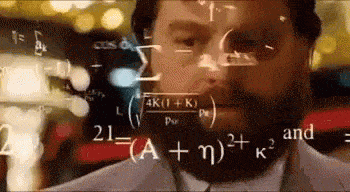

Si je te disais que je connais une astuce pour que tu sois plus **plus concentré** et **plus efficace** tout au long de la journée; pour que tu fasses de meilleurs choix et, malgré tout, que tu te sentes moins fatigué à la fin de la journée, tu voudrais bien la connaitre je suppose ?

Eh bien, l'astuce est simple : il s'agit tout simplement de prendre de la coke ! Non, non, je plaisante, surtout pas.

Plus sérieusement, pour réussir tout ça, il suffit de **réduire ta fatigue décisionnelle**.<!--more-->

## Le pouvoir décisionnel, une ressource précieuse et limitée

**Chaque fois que tu prend une décision, _peu importe laquelle_, tu puises dans une resource limitée : ton pouvoir décisionnel**. La plupart des gens ne se rendent pas compte que c'est une resource limitée. Et c'est exactement pour ça que la plupart des gens prennent des décisions stupides, [procrastine](https://tobal.fr/3-techniques-pour-arreter-de-procrastiner/), et sont fatigués nerveusement à la fin de la journée.

C'est parce qu'ils ont puisé sans cesse dans ce pouvoir décisionnel pour toutes sortes de décisions, alors que la plupart ne sont pas importantes, voire complètement insignifiantes.

Vois ça comme une barre d'énergie, comme dans un jeu vidéo. Et à chaque fois que tu as un choix à faire, tu utilises petit à petit cette barre. Quel que soit le choix : qu'il s'agisse d'une grande décision comme changer de boulot, ou un truc tout bête comme quel t-shirt mettre le matin.

Plus la décision est importante, plus tu vides ta barre. Mais une série de petites décisions est tout aussi épuisante qu'une seule grosse décision.

Des décisions sans importance, comme par exemple :

- Qu'est-ce que je prend au petit déj' ?
- Comment je m'habille aujourd'hui ?
- Je prends la voiture ou les transports ?
- Je dis "Bonjour" à mon voisin ou pas ?
- Je commence par un gros projet ou un petit ?
- Italien ou Sushi ce midi ?
- Je répond à cet email / ce message / cet appel ou pas ?

Tout au long de la journée, tu es bombardé de choix qui usent ton pouvoir décisionnel. Et c'est ça qui te rend épuisé, à la fin de la journée.

Mais le pire, c'est que **ça t'empêche d'utiliser le maximum de ton potentiel de décision sur les décisions importantes**, celles qui comptent vraiment dans ta vie.

Souvent, quand les gens font un choix de vie stupide, c'est parce qu'ils passent leur journées à utiliser leur pouvoir décisionnel sur des choses sans importance.

## Éviter la fatigue décisionnelle

<iframe class="giphy-embed" src="https://giphy.com/embed/3o7budPMOMXVyvzolO" width="480" height="270" frameborder="0" allowfullscreen="allowfullscreen"></iframe>

La solution, comme je le disais au début, c'est donc d'éviter la fatigue décisionnelle. Pour prendre les bonnes décisions importantes et garder son énergie mentale, il faut préserver au maximum notre pouvoir décisionnel.

Comment on fait ça ? [**En évitant de prendre des décisions, tout simplement**](https://tobal.fr/je-suis-minimaliste/).

**Pour toutes les petites décisions qui ne sont pas importantes, décide à l'avance ce que tu vas faire**.

Prévois tes petits déjeuners sur toute la semaine.

Décide une fois pour toutes de ne prendre que les transports ou que la voiture.

Prépares tes vêtements pour la semaine.

Décide le dimanche où tu vas manger tous les midis de la semaine suivante.

Réserve un moment précis dans la journée pour répondre aux emails.

C'est exactement pour ce besoin de préserver leur pouvoir décisionnel que les gens comme Steve Jobs, Mark Zuckerberg et Barack Obama s'habillaient ou s'habillent exactement de la même façon tous les jours. Pour ne pas avoir à décider quoi mettre le matin.

Le but est d'automatiser au maximum toutes les prises de décisions pour que, justement, tu n'aies pas à réfléchir. Et ainsi préserver ton pouvoir décisionnel.

## Mettre en oeuvre

Commence par noter, tous les jours pendant une semaine, _tous les choix triviaux_ auxquels tu es confronté.

Quoi manger le matin, comment t'habiller, quel route prendre, sur quoi tu vas travailler, ce que tu vas manger le midi, etc... Tous !

Ensuite, pour chaque choix, **décide de ce que tu choisis à l'avance, et crée des règles que tu suivras sans réfléchir**. Ça peut être par exemple de préparer tes vêtements pour le lendemain, la veille. De planifier une heure et des jours précis pour faire tes séances de sport.

**Le principe, c'est que tu réfléchisse le moins possible sur ce que tu dois faire**. Que ta journée soit la plus simple possible et prédéfinie à l'avance.

Évidemment il y aura toujours des impondérables, mais justement, en ayant planifié tes choix à l'avance, tu te donnes de la resource mentale pour pouvoir justement traiter ces impondérables de la meilleure façon.

Et quand tu auras des décisions importantes à prendre, tu auras le maximum de pouvoir décisionnel à ta disposition pour prendre les bonnes décisions.
