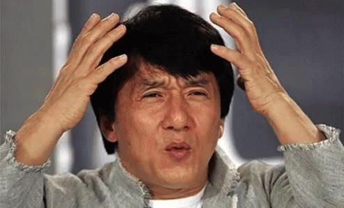

_Note : écoute le morceau "[Heal The World](https://youtu.be/BWf-eARnf6U?t=63)" en même temps que cet article pour plus d'effet._

Il y a quelque chose qui peut sembler paradoxal dans la vie, c'est que **pour [obtenir un résultat](https://tobal.fr/atteindre-ses-objectifs-comment-on-fait-pour-de-vrai/), il faut souvent faire le contraire de ce qui semble logique**.<!--more-->

C'est quand on arrête de se creuser la tête que le mot qui ne venait pas nous revient.

Pour calmer quelqu'un qui crie, il ne faut pas crier plus fort que lui mais rester calme.

Moins on est pressé et plus on a de temps (et l'inverse est tout aussi vrai : plus on est pressé et moins on a de temps).

Plus on cherche à plaire et moins on on a de charisme. Et les gens qui n'en ont rien à faire de ce qu'on pense d'eux sont souvent les plus charismatiques.

On a tous connu ce mec ou cette nana à l'école qui révisait à peine mais qui cartonnait à l'examen.

Et c'est quand on en a presque rien à faire de l'entretien qu'on décroche le job.

\[caption id="" align="aligncenter" width="494"\] What the fuck ? (traduction : quelle est cette situation inexplicable qui ne rentre pas dans ma conception du monde ?)\[/caption\]

Mais si on fait l'effort d'y réfléchir vraiment, ce n'est pas si paradoxal. Plus je prends de l'âge et plus je m'aperçois que les choses se font _naturellement_. Hors, **quand on veut forcer absolument un résultat, on a tendance à adopter des comportements qui vont à l'encontre du "naturel"**. C'est le fait d'être obnubilé par un résultat escompté qui nous fait agir de manière contradictoire, et aller à l'encontre même de ce résultat qu'on désire tant.

## Et c'est exactement pareil pour ce que tu donnes et reçois

Au moment où j'écris cet article, il y a une sorte de crise en France où des milliers de gens mettent des [gilets jaunes](https://tobal.fr/range-ton-gilet-jaune/) et sortent dans les rues pour exiger du gouvernement qu'il fasse quelque chose pour augmenter leur pouvoir d'achat. Je ne m'étendrai pas sur la futilité de cette démarche, mais plutôt sur son caractère purement contradictoire qui est un parfait exemple à mon propos.

**Le plus grand malheur de notre époque c'est qu'on ne se rend pas compte que pour avoir plus, il faut donner plus**.

Et si tu considères que tu n'as pas assez dans la vie, c'est que tu n'as pas assez donné à la vie. C'est valable pour tout.

Tu as l'impression de manquer de temps ? Arrête de courir partout dans tous les sens, et [prends ton temps](https://tobal.fr/le-paradoxe-du-temps-comment-avoir-plus-de-temps-dans-la-journee/). Donne de ton temps aux autres.

Si tu trouves que les gens ne sont pas assez généreux avec toi, sois le plus généreux possible avec les autres.

Tu te sens seul, abandonné ? Au lieu de chercher comment faire pour ne plus être seul, va vers les autres, tiens compagnie aux autres et apporte-leur du soutien.

Si tu as le sentiment de ne pas être assez considéré ? Donne autant de considération que possible aux autres.

**Et moins tu as, plus il est nécessaire de donner**.

> L'univers est une harmonie parfaite, un équilibre éternel. Plus tu vas prendre et moins tu vas recevoir. Et plus tu va donner et moins tu auras à demander.

C'était la minute spirituelle. Tu peux enlever l'encens et sortir de ta position du lotus.

Oui, je sais, donner quand on a l'impression de manquer, c'est pas facile. Quand tout autour de toi les choses semble manquer, ça parait difficile de combler. **Mais c'est justement là où toute la différence se joue**.

S'énerver quand quelqu'un s'énerve, être radin quand tout le monde est radin, faire la tronche quand tout le monde tire la tronche, bref, [réagir impulsivement](https://tobal.fr/on-ne-peut-pas-controler-ses-emotions-mais-ses-impulsions-si/) c'est facile. Mais ça ne change pas la situation. Pour changer ton monde et amener du positif, tu dois être celui qui crée ce changement. **Et quand tu le feras sincèrement, et non pas dans l'attente du résultat, tu réaliseras que tu es capable de changer ton monde**.

À ce qu'il parait, Gandhi serait à l'origine de cette citation :

> Sois le changement que tu désires voir dans le monde.

Moi je pense que c'est Michaël Jackson, mais peu importe. Ça reste vrai.
