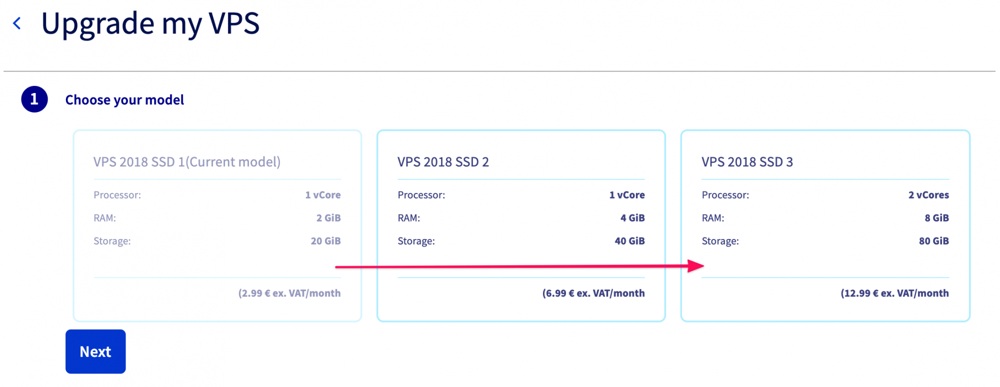
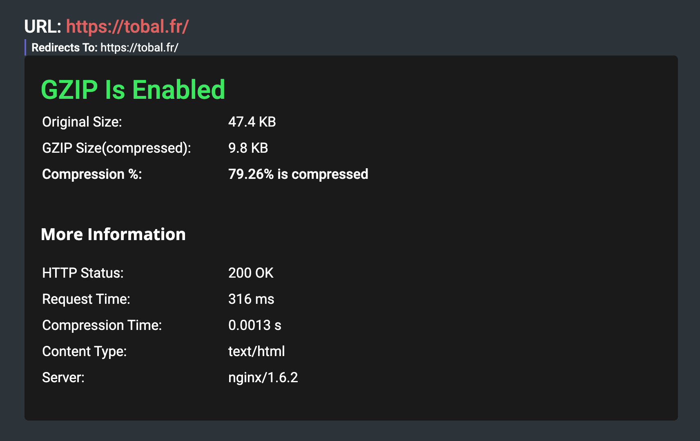
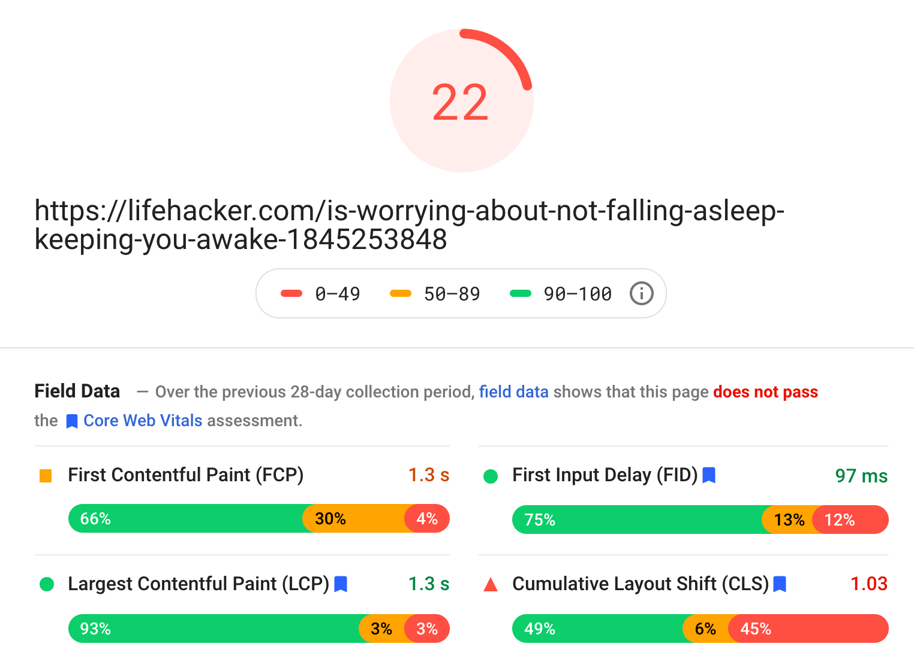
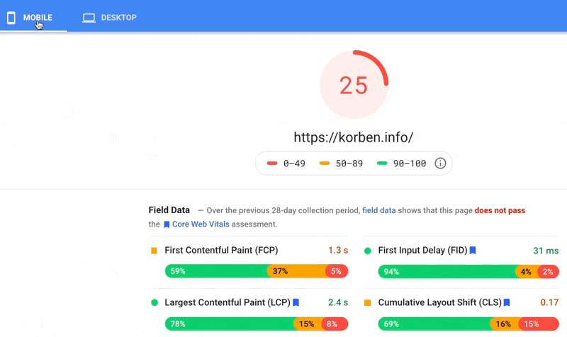

_Note : J'aurais aimé faire des captures d'écran des différents benchmarks que j'ai effectués, mais j'étais tellement impatient d'essayer les différentes astuces que je vous montre dans cet article que j'ai oublié d'en prendre. Je vais donc vous donner les chiffres de mémoire (récente)._

En regardant Google Analytics pour ce site, je me suis aperçu que beaucoup de pages affichaient un temps passé sur la page de 0 seconde. Je me suis dit que cela se produit lorsqu'une page met trop de temps à se charger, de sorte qu'une page est comptée mais que le visiteur a fini par fermer l'onglet avant la fin du chargement. J'ai donc lancé quelques tests sur [Google Page Speed Insights](https://developers.google.com/speed/pagespeed/insights/) pour vérifier la vitesse de mon site web et, à ma grande consternation, j'ai obtenu une note moisie de 8 sur 100.

<!--more-->

Pour être sûr, j'ai également testé la vitesse de chargement des pages de mon site avec [Pingdom Tools](https://tools.pingdom.com/). Les résultats ont été similaires. J'ai obtenu une note d'environ 35 sur 100, en sachant qu'au cours de tous mes tests, j'ai remarqué que Pingdom a tendance à donner une note moins sévère que Google Page Speed Insights (plus d'informations à la fin de cet article).

Avant optimisation, mon site web prenait en moyenne entre 5 et 8 secondes à charger. C'est beaucoup trop lent. Il fallait que je corriger ça.

## Que faut-il optimiser ?

S'attaquer à l'[optimisation du temps de chargement des pages d'un site WordPress](https://tobal.fr/optimiser-son-site-wordpress-en-detectant-les-plugins-qui-le-ralentissent/) peut sembler compliqué. Il y a tant de choses que vous pouvez faire, comme la mise en cache, l'[optimisation du thème](https://tobal.fr/limportance-davoir-un-theme-wordpress-rapide-comparaison-de-20-themes-populaires/), des fichiers JS et CSS, les minifier, [vérifier vos plugins](https://tobal.fr/optimiser-son-site-wordpress-en-detectant-les-plugins-qui-le-ralentissent/), votre base de données...

Je ne voulais pas passer trop de temps sur le problème, donc j'ai visé des solutions rapides. Les critères sont que :

- chaque opération ne devrait pas prendre plus de 15 minutes,
- et le gain devrait être clair.

Alors, ça a donné quoi ?

Eh bien, le résultat est fantastique ! **Je suis passé d'un score de 8 à 58**. Bien que cela ne semble pas si génial, sur Google Page speed insights, c'est en fait une énorme amélioration.


Voici ce que j'ai fait. Rien de trop technique, et plutôt rapide à mettre en place.

## Augmenter la puissance du serveur

**La première chose que j'ai faite a été d'augmenter la puissance du serveur qui héberge le site web**.

Bien sûr, ajouter de la puissance peut sembler fainéant, et ce n'est pas toujours la bonne solution. Dans mon cas, cependant, le serveur était un VPS entrée de gamme de chez OVH, avec un seul processeur virtuel et 2 Go de RAM. C'était une configuration assez faible, donc une mise à niveau était logique.

Je me suis dit que cette configuration était la cause principale de la lenteur de mon site, et j'avais raison.

[Le VPS entrée de gamme d'OVH ne coûte que 3€](https://www.ovhcloud.com/fr/vps/cheap-vps/). Il n'a donc pas été difficile de débourser 8€ de plus pour passer à un VPS supérieur, avec deux fois plus de cœurs et quatre fois plus de RAM.



Avec une configuration serveur plus puissante, les choses se sont tout de suite nettement améliorées. Ça m'a permis de réduire le temps de chargement des pages de 2 à 3 secondes, et d'obtenir un score de 36 sur Google Page Speed Insights et de plus de 60 sur Pingdom Tools.

## Activer la compression GZIP

Vous pouvez laisser votre site envoyer les fichiers source (fichiers JS, CSS) tel quels, mais presque tous les navigateurs modernes sont capables de recevoir et d'utiliser des fichiers compressés. Quand on veut améliorer la vitesse de chargement de ses pages, ça fait souvent une grosse différence.

[Le serveur web que j'utilise est NGINX](https://tobal.fr/installation-de-serveur-web-avec-nginx-php5-mysql-ftp-sur-serveur-dedie/), avec lequel il existe un moyen facile de servir le contenu en utilisant la compression GZIP. Je n'avais pas configuré mon serveur web pour en tirer parti, ce qui fait que le site envoyait plusieurs ressources allant jusqu'à 1 Mo sur chaque page.

Tout ce que vous avez à faire, c'est mettre à jour votre fichier de configuration NGINX principal, généralement situé dans `/etc/nginx/nginx.conf`.

Voici comment j'ai configuré mon fichier `nginx.conf` pour utiliser la compression gzip :

```
// Ce code devrait déjà être dans le fichier nginx.conf,
// mais commenté par défaut.
##
# Gzip Settings
##

gzip on;
gzip_disable "msie6";

gzip_vary on;
gzip_proxied any;
gzip_comp_level 6;
gzip_buffers 16 8k;
gzip_http_version 1.1;
gzip_types text/plain text/css application/json application/javascript text/xml application/xml application/xml+rss text/javascript;
```

Jetez un oeil à [cet article de David Walsh sur la compression gzip](https://davidwalsh.name/enable-gzip) pour plus d'informations.

Une fois la compression gzip activée, la taille de la plupart de fichiers sources envoyés au navigateur a été réduite de plus de 80 % !



Une fois de plus, cela m'a permis de réduire le temps de chargement de mon site de manière assez significative. J'ai encore réduit d'une à deux secondes le temps de chargement des pages. Ce qui signifie à ce stade qu'il a été réduit de près de moitié.

Ça a également augmenté mon score de 10 points sur les outils de test.

## Activer le cache

C'est une solution évidente, mais bizarrement, je n'utilisais pas de [cache](https://fr.wikipedia.org/wiki/Cache_web) sur mon site web.

Avec WordPress, la mise en place d'un cache est simple comme bonjour. Il suffit d'installer un plug-in connu comme [W3 Total Cache](https://wordpress.org/plugins/w3-total-cache/) ou [WP Super cache](https://wordpress.org/plugins/wp-super-cache/).

J'avais déjà installé [WP Optimize](https://wordpress.org/plugins/wp-optimize/), pour faire un peu de nettoyage sur la base de données. Les développeurs du plugin ont récemment intégré une fonction simple de gestion du cache. Du coup, j'ai utilisé cette solution comme moteur de cache.

Avec ça, j'ai encore réduit de 1 à 2 secondes le temps de chargement du site web. Cela m'a valu 10 points supplémentaires sur mes scores Page Speed Insight et Pingdom Tools.

## Choses à garder à l'esprit

**Au total, je suis passé de 8 à 58 sur Google Page Speed Insights et de 35 à 81 sur Pingdom Tools**, tout en réduisant le temps de chargement moyen de mes pages de 8 secondes à environ une seconde. Il y a d'autres façons d'améliorer les choses, comme passer à un thème plus efficace, réduire le nombre de plugins, faire une optimisation compliquée des ressources, mais je suis plus satisfait comme ça.


Mettre en place de ces trois changements ne devrait pas vous prendre plus de deux heures au maximum. Compte tenu de l'amélioration - et de tous les avantages potentiels d'un site web qui charge vite - ça vaut carrément le coup de le faire.

Par curiosité, j'ai testé les outils de benchmark avec des gros sites web comme [Lifehacker](https://lifehacker.com/) et [Korben.info](https://korben.info/). Ces sites sont bien super bien classés dans Google et reçoivent une tonne de trafic (donc bien optimisés). J'ai essayé plusieurs fois, et à ma grande surprise, ils ont obtenu des scores pourris sur Google Page Speed Insights (mais pas sur Pingdom Tools).




**Je pense donc que vous devriez prendre votre score sur Google Page Speed insights avec une pincée de sel**. Quand vous atteignez un score de 25-30 et qu'il vous met tout en rouge, ça ne veut pas nécessairement dire que votre site web est une catastrophe. Essayez vous-même avec de gros sites que vous connaissez, vous verrez.

D'un autre côté, Pingdom Tools semble plus juste et plus utile dans sa notation. Pour moi, c'est donc un meilleur critère de référence.

_Note de dernière minute : Google Page Speed Insight est sévère sur la notation pour **Mobile**. Je viens juste de me rendre compte qu'il y avait des onglets en haut de la page de test, et pour tous mes tests, Mobile était sélectionné. Lorsqu'on passe en **Desktop**, le score est plus clément et se rapproche beaucoup plus de Pingdom Tools._


