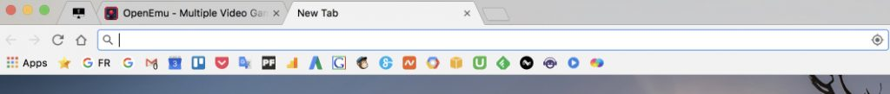
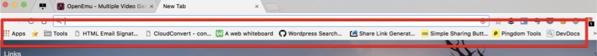
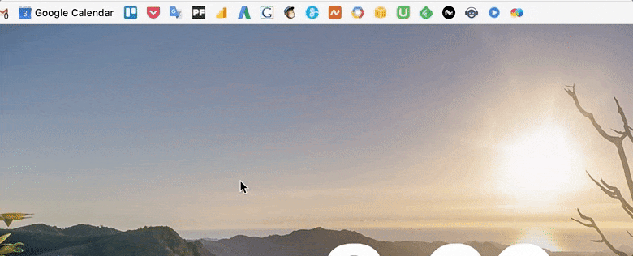

_Note: l'astuce que je donne marche tout aussi bien pour Firefox._

Voici une petite astuce sympa qui va vous plaire. Que diriez-vous d'avoir une barre de favoris qui ressemble à ça:

Plutôt cool non ?<!--more-->

Je trouve ça vachement pratique. Les favoris ne prennent plus beaucoup de place, on peut donc en mettre plein.

Et c'est plus joli.

C'est tout de même un peu plus sympa que d'habitude. En général, la barre de favoris de Chrome (si vous l'affichez), ça donne quelque chose dans ce style:

Rien de folichon, du classique quoi. Mais saviez vous qu'il n'est pas obligatoire de donner un nom à un favori ? D'ailleurs, la plupart du temps on repère un favori grâce à son _favicon_, la petite image à gauche de chaque favori. Du coup, après une intense réflexion (oui, je m'ennuie parfois), je me suis dit:

> Et pourquoi pas virer tout ce texte moche et pas pratique ?

Éclair de génie, je sais. Ni une ni deux, je m'empresse de virer le texte de chaque favoris, pour obtenir le résultat que je vous ai montré tout au début de cet article. Pour avoir la même chose, c'est ultra-simple. Il vous suffit de faire un clic droit sur un favori, puis Éditer et de supprimer le texte dans le champ "Nom":

Et voilà, c'est tout. Pas d'extension à installer, en fait c'est un truc tout simple mais bien pratique. C'est pas tout nouveau, et vous y avez peut-être déjà pensé, mais pour ceux qui ne connaissaient pas le truc, vous aurez une nouvelle façon de rendre votre navigateur plus sympa.
