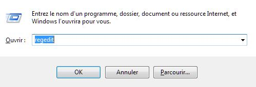
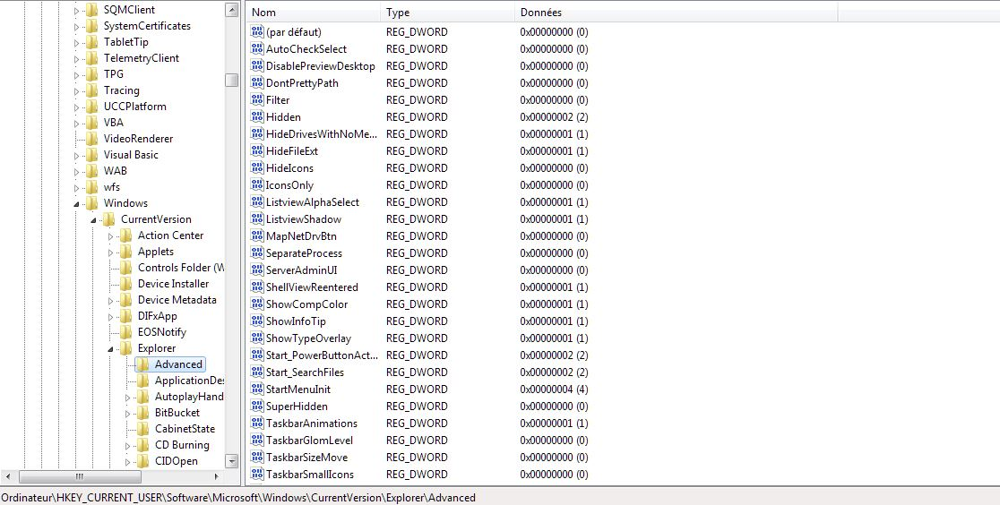
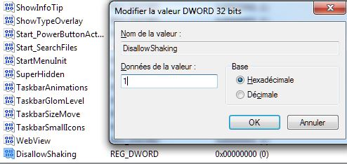

Connue à l'époque de Windows 7 sous le nom de "Aero Shake", cette fonction te permet de minimiser les fenêtres en agrippant sur le ruban celle que tu veux garder ouverte tout en maintenant enfoncé le bouton gauche de la souris. Cette fonction, désormais connue sous le nom de "Shake to Minimize" (secouer pour réduire), est toujours active dans Windows 10.

<!--more-->

Certains l'adorent, mais moi, je ne la trouve pas très utile. Ce serait bien mieux, par exemple, si on pouvait à nouveau faire le même geste pour tout agrandir.

D'ailleurs cette fonctionnalité peut même devenir gênante lorsque tu fais des mouvements accidentels de souris.

Si tu ne souhaites pas garder cette fonctionnalité, je vais te montrer ici comment la désactiver. Il faut passer par le registre de Windows. Toutefois, bien que le processus soit sûr si tu suis les instructions, **il est toujours bon de sauvegarder d'abord ton registre Windows 10**.

Tout d'abord, ouvre l'éditeur du registre en appuyant sur **Win + R** puis tape « regedit ».



Dans l'éditeur du registre, vas à :

```
Computer\HKEY_CURRENT_USER\Software\Microsoft\Windows\CurrentVersion\Explorer\Advanced
```



Ici, clic droit sur un espace vide dans le panneau de droite et sélectionne « Nouveau -> DWORD (32 bits) », puis donne le nom « DisallowShaking ».



Double-clique sur l'entrée nouvellement créée, puis change le chiffre dans la case « Valeur » à 1. Ensuite, il ne te reste plus qu'à cliquer sur OK, et fermer l'éditeur de registre. Cela aura pour effet de désactiver la fonctionnalité qui réduit les fenêtres lorsqu'on secoue une application.

Maintenant que tu as désactivé la fonction "Shake to minimize", tu vas pouvoir naviguer à nouveau normalement. Si tu veux, tu peux aussi [désactiver le mot de passe à l'ouverture de Windows 10](https://tobal.fr/comment-vraiment-supprimer-le-mot-de-passe-de-connexion-a-louverture-de-windows-10/), ou bien l'[empêcher de s'allumer tout seul la nuit](https://tobal.fr/empecher-windows-10-de-sallumer-tout-seul-la-nuit/) pour faire des mises à jour.

Et si tu en as marre de Windows, il est peut-être temps de [passer à Mac](https://tobal.fr/pc-ou-mac-que-faut-il-acheter-et-quel-est-le-meilleur-pour-2017/) ;)
