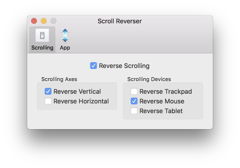

Question à ceux qui utilisent un portable de chez Apple (MacBook/Air/Pro): avez-vous déjà essayé de brancher une souris sur votre Mac ?

Tant que vous restez sur le trackpad ça va. Mais quand vous branchez la souris, et que vous commencez à l’utiliser... Vient le moment de faire défiler votre fil d’actualité Facebook vers le bas, et là, c’est le drame.<!--more-->

Vous vous rendez compte que sens de défilement est inversé.

En fait, c'est comme pour le trackpad. Apple appelle ça le défilement “naturel”. Sauf que si c’est naturel avec un trackpad, ça l’est beaucoup moins avec la souris.

## Au début, vous croyez que c’est facile, mais en fait non

Pas de soucis, vous êtes débrouillard, Vous allez dans les _Préférences > Souris_. Là, vous décochez “Sens du défilement : naturel”. Cool.

Un peu plus tard, vous prenez votre Macbook avec vous en déplacement, donc vous utilisez le trackpad. Et là, horreur: le défilement au trackpad est inversé. _Ouate Zeu Feuque_ ?

Vous allez voir dans les préférences du trackpad, et là vous voyez que “Sens du défilement : naturel” est décoché. **En réalité, c’est complètement con, mais les options “Sens du défilement : naturel” de la souris et du trackpad sont liées** !

## La vraie solution

Le salut vient d’une toute petite application appelée [Scroll Reverser](https://pilotmoon.com/scrollreverser/).

C’est une application qui vient se loger dans votre barre de menu, qui ne prend pas de ressources, et dont le seul but est de vous permettre d'avoir des réglages de défilement (“scroll” en anglais) différents selon que vous utilisiez le trackpad ou la souris.

Il vous suffit de régler l’application comme ceci:

Et vous êtes bon. Merci Nick Moore (le gars qui a crée l’application) !

Il a également d’autres petites applications dans le même genre, très pratiques, comme PopClip, qui vous donne des menus à la iOS lorsque vous surlignez du texte. Ou encore DropShelf, qui vous facilite la vie si vous faites beaucoup de glisser-déposer.

Je vous invite à regarder sa [https://pilotmoon.com](https://pilotmoon.com).
