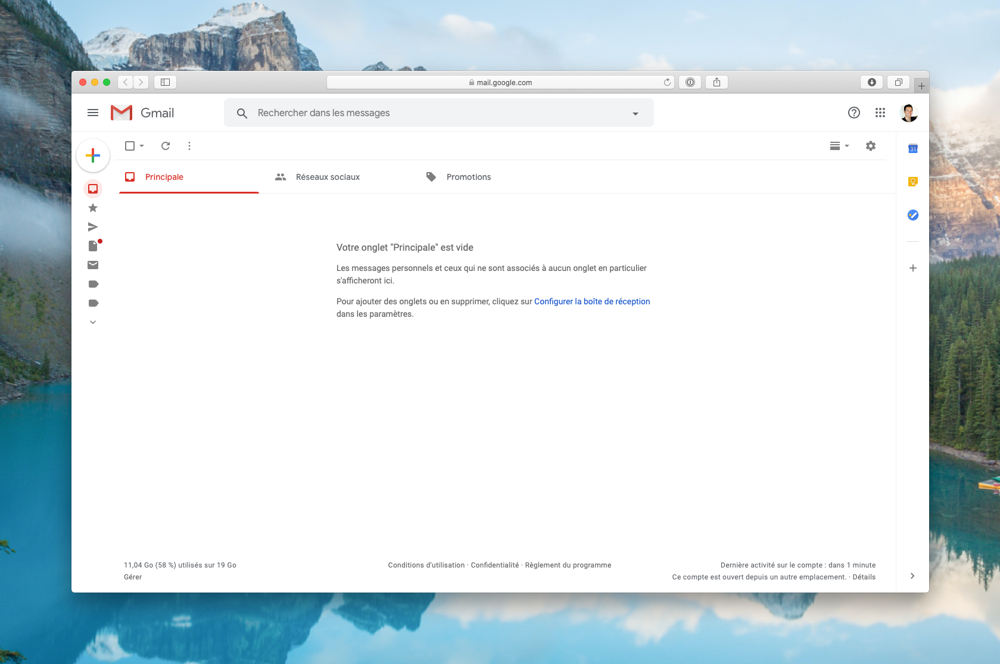
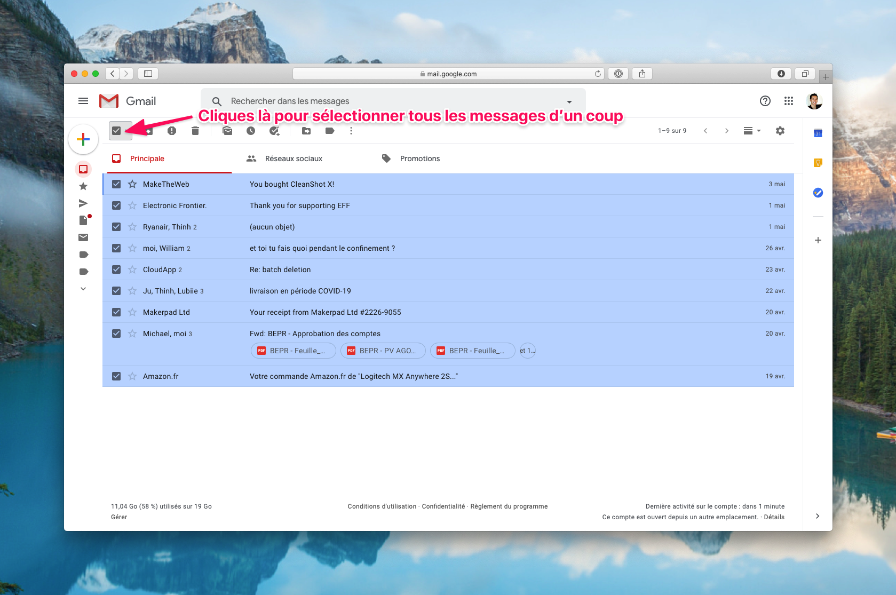
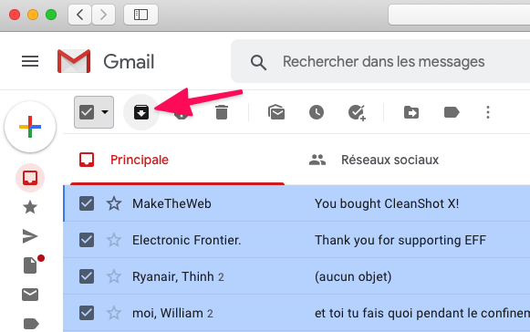
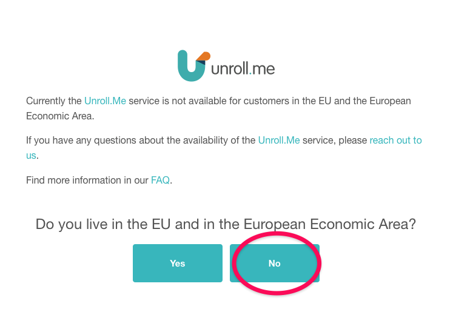
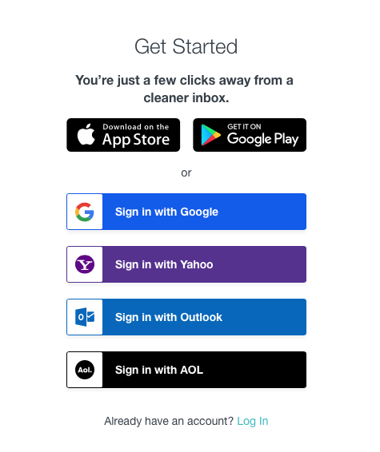
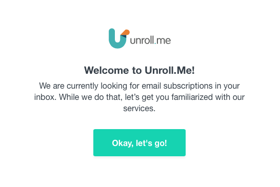
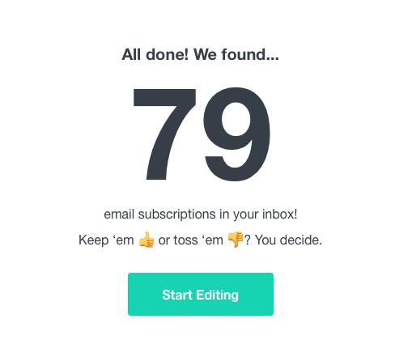
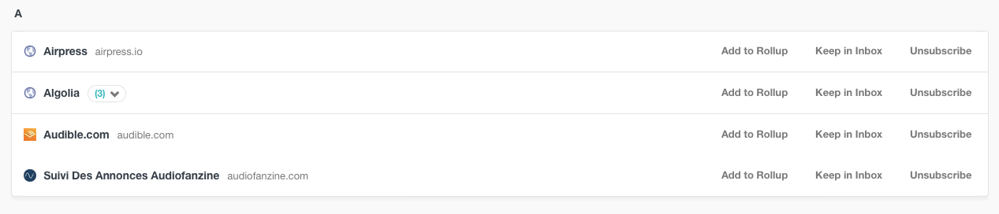

Inbox Zero, tu connais ? C'est ça :

<!--more-->

Peu importe combien de mails tu as dans ta boite de réception, je vais te montrer comment nettoyer ta boite email pour qu'elle soit aussi propre que la mienne, en 2 minutes. Oui, même si tu as 13852 mails dans ta boite de réception. Après ça, je vais te montrer comment faire pour qu'elle le reste.

## Nettoyer sa boite email

Je vais te montrer la manipulation pour Gmail, mais si tu utilises Hotmail ou Yahoo, c'est exactement pareil, si ce n'est l'interface qui change.

Lorsque tu arrives dans ta boite email, sélectionne tous tes messages. Oui, tous, sans exception.

Cliques sur **Archiver**.

Et voilà, c'est terminé. C'était facile, non ?

Rassure-toi, la fonction **Archiver** ne supprime pas les emails. Ils ne sont donc pas perdus.

## Garder sa boite email propre

Avoir une boite email propre, c'est cool, mais qu'elle le reste, c'est encore mieux.

### Se désabonner facilement de toutes les newsletter pourries

Je te conseille de prendre un petit quart d'heure pour faire ce qui suit. Ça te permettra d'éviter, _en amont_, que ta boite soit polluée.

Pour cela, il existe un service simple et gratuit : [Unroll.me](https://unroll.me/).

Depuis la loi RGPD, le site affiche un message indiquant qu'il n'est pas disponible pour les résidents de l'Union Européenne. Tu t'en fous, cliques sur **No** à la question **Do you live in the EU and in the European Economic Area?**

Ensuite, il faut autoriser l'application à accéder à ta boite email. Sélectionne le fournisseur qui correspond à ta boite email (Google pour Gmail, Yahoo pour les adresses @yahoo.fr ou @yahoo.com, et Outlook pour les comptes @live/outlook/hotmail).

Une fois autorisée, l'application va d'abord t'afficher quelques messages de présentation. Il faut juste valider pour dire que tu as compris.

Lorsque l'application aura fini de repérer tous tes abonnements newsletter, tu verras le nombre qu'elle en a trouvé.

Cliques sur **Start Editing** pour voir la liste complète de toutes les newsletters et autres abonnements emails que tu as.

Tu peux ignorer le premier bloc, c'est une proposition pour rassembler certaines newsletters en une seule, ce qu'ils appellent un _Rollup_.

Là partie qui nous intéresse, c'est la suite, classée par ordre alphabétique. Chaque ligne est une newsletter à laquelle tu es abonné.

Pour chaque ligne, tu as alors 3 choix :

- **Add to Rollup**: si veux rester abonné mais que tu veux grouper les emails de plusieurs newsletters en une seule.
- **Keep in Inbox:** Ne rien faire, continuer de recevoir la newsletter dans ta boite email comme avant.
- **Unsubscribe**: pour te désabonner en un clic.

Il suffit alors de cliquer sur **Unsubscribe** partout où tu ne veux plus recevoir de mails, et tu seras automatiquement désabonné de ces mailing-lists.

### Prendre le bon réflexe

La dernière chose importante, c'est de prendre le bon réflexe lorsque à chaque nouveau mail que tu reçois :

- Si tu sais que tu n'auras pas besoin de ce mail dans le futur, **supprime-le** de suite.
- Si tu n'es pas sûr et pense que tu pourrais avoir besoin de t'y référer plus tard, **archive-le** tout de suite.

C'est tout. Généralement, c'est le bordel dans nos boites mails car on laisse trainer nos emails dans la boite de réception, ce qui est inutile.
