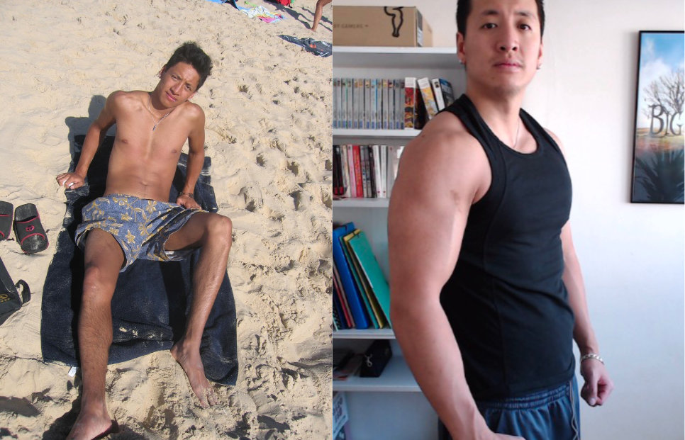

Tu connais le mec qui va à la salle depuis 2 ans mais qui ressemble toujours une crevette ? Ne sois pas ce gars-là.

Trop de gens pensent que pour prendre du muscle, il suffit de s'inscrire à la salle, faire de la musculation 2-3 fois par semaine, et ça va aller tout seul. Oui, tu vas sûrement prendre _un peu_ de muscle. Mais [si tu le fais sans réfléchir, ça se fera lentement](https://tobal.fr/efficacite-et-efficience-deux-mots-proches-mais-une-grosse-difference/), et tu finiras par stagner.<!--more-->

Pour gagner rapidement en muscles, il y a tout un ensemble de paramètres à connaitre. Ces paramètres favorisent l'_hypertrophie musculaire_, et ce n'est pas qu'une question d'exercice physique.

Mais tout d'abord, qui suis-je pour donner de tels conseils ? Pourquoi est-ce que tu devrais m'écouter ? Parce qu'à gauche c'était moi avant et à droite, moi après :

J'ai eu l'occasion d'apprendre beaucoup de choses en terme de prise de muscles.

## La musculation ne représente qu'un tiers du boulot

D'abord, sache que **quand on veut prendre du muscle, la musculation, les exercices physiques, ça ne représente que 30% de l'effort**. Oui, _seulement un tiers_. Ça ne sert à rien d'aller à la muscu cinq fois par semaine, si c'est la seule chose qu'on fait pour transformer son corps. Que représentent les pourcentages restants ?

**Développer ses muscles, c'est aussi et surtout 35% de nutrition et 35% de repos**. C'est le trio magique et surtout nécessaire. Il faut faire des efforts sur ton alimentation, des efforts physiques, et surtout bien penser à te reposer. Voilà pourquoi le réflexe de foncer à la muscu, pousser comme un dingue et ignorer les deux autres amène peu ou pas de résultats, voire parfois même un résultat contraire.

**Ton alimentation est clé**. Tu veux plus de muscles ? Consomme plus de protéines, c'est aussi simple que ça. Blanc de poulet, dinde, poisson, oeufs, produits laitiers, soja, viande rouge (maigre de préférence)... Il y a des milliers d'aliments sources de protéines. Commence par là.

**Pense aussi à bien reposer tes muscles**. Ça ne sert à rien de travailler _tous les jours les mêmes muscles_. Quand tu les sollicite autant que pendant une séance de musculation, ils ont besoin de 48h de repos **grand minimum**. Si tu fais les pecs le Lundi, ça ne sert à rien de les refaire le Mardi ou même le Mercredi.

## Le secret

Maintenant que j'ai expliqué les principes de base, passons au coeur du sujet, pendant les séances de musculation. Il y a des milliers de choses que tu peux faire, des centaines d'exercices et de programmes, je ne vais pas entrer dans le détail ou essayer de conseiller un programme en particulier.

Par contre, il y une notion clé, un concept qu'on peut appeler "le secret" parce que franchement, en 8 ans de musculation j'ai vu très peu de gens en parler, et encore moins l'appliquer. Mais ce concept est valable _partout, tout le temps et pour tout le monde_. Pour n'importe quel matériel et n'importe quel type d'exercice. **Il est ce qui fait la différence entre les gens qui progressent vite et ceux qui stagnent**.

Ce concept ? **Le choc musculaire**.

Tes muscles sont une machine super efficace. Tellement efficace que, lorsque ton corps s'aperçoit que tu fais un mouvement de manière répétée dans le temps, il va optimiser ta construction musculaire pour faire en sorte de réduire l'effort demandé. Plus tes muscles sont sollicités d'une façon précise, moins ils auront besoin de travailler.

En gros plus tu fais un mouvement, moins il sollicitera tes muscles au fur et à mesure que tu le répète. C'est un mécanisme naturel de ton corps, et c'est très pratique, en termes d'efficacité.

Le problème, c'est que pour que les muscles grossissent, ils doivent justement faire des efforts. Et c'est là qu'intervient le concept du choc musculaire. **Pour faire croitre tes muscles continuellement, tu dois choquer tes muscles en changeant régulièrement de routine et surtout le type d'exercices que tu fais**.

Par exemple, imaginons que tu fais toutes les semaines des séries de développé couché avec des charges lourdes et 6 à 8 répétitions. Si tu fais ça pendant des mois et des mois, tu vas très peu progresser. Au début oui, mais au bout de quelques semaines, tu vas stagner.

Pour appliquer le concept du choc musculaire, toutes les 6 semaines grand max, **change l'intensité, les charges et le nombres de répétitions**. Par exemple, passe sur des charges plus légères mais en faisant beaucoup plus de répétition. Puis 6 semaines après, change encore. Ou change d'exercice.

**Et c'est ce changement constant qui va empêcher le muscle de s'habituer**. Et à chaque fois qu'il est choqué, le muscle grossit beaucoup plus rapidement.

C'est aussi simple que ça. Pourtant, c'est ignoré par tellement de gens.

Pour prendre du muscle, garde donc bien à l'esprit ces mots dans l'ordre : choc musculaire, alimentation, repos.
