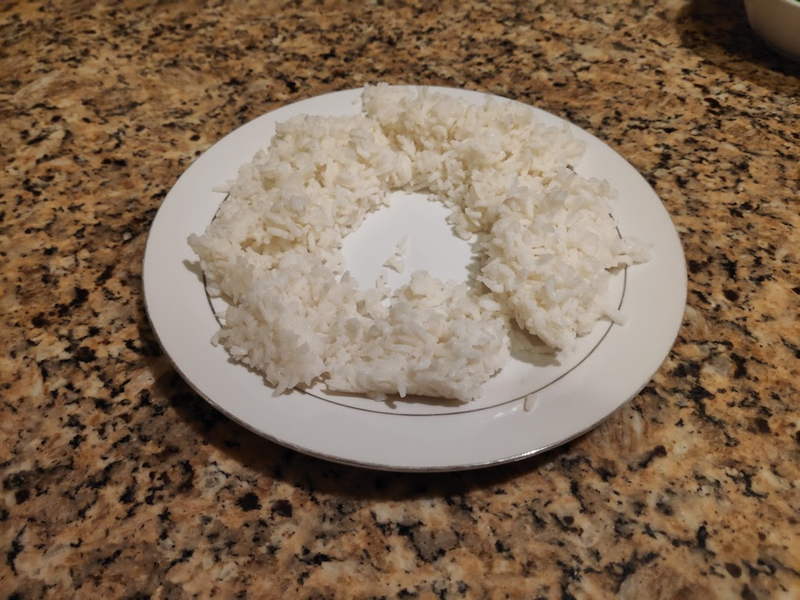

Non ce n'est pas une connerie. Je vais vraiment te dire comment réchauffer un plat efficacement au micro-ondes.

C'est vrai que d'habitude, je donne plutôt des conseils de [productivité](https://tobal.fr/9-outils-essentiels-a-ma-productivite-que-jutilise-au-quotidien/). Ou alors je parle d'applications web. Mais tout à l'heure en me réchauffant du riz au micro-ondes, je me suis rendu compte que je connaissais aussi plein de "trucs" de la vie quotidienne qui n'ont pas forcément de lien avec la productivité ou le web.

Ce qu'ils appellent, en anglais, un _lifehack_.<!--more-->

Pourtant ce serait dommage de ne pas les partager, parce que je pense que ce sont des trucs cools et qui peuvent te servir dans la vie de tous les jours. Au même titre que des techniques pour être plus productif, mieux gérer son temps ou se lever plus tôt.

Donc, dorénavant, je partagerai aussi bien des techniques de productivité que des astuces de vie toutes simples comme celle-ci.

Bref, venons-en au fait.

Tu as probablement remarqué que quand tu réchauffes un truc au micro-ondes, autour c'est super chaud mais au milieu c'est toujours un peu tiède voir froid.

C'est parce que justement, les ondes qui réchauffent le plat arrivent par les bords, et d'ici à ce qu'elles atteignent le milieu du plat, elles sont moins efficaces.

La solution est toute simple : arrange le contenu de ton assiette en cercle. Comme ceci :

\[caption id="" align="aligncenter" width="1025"\] Un donut de riz.\[/caption\]

Évidemment, ça veut dire qu'il ne faut pas réchauffer une assiette blindée, puisqu'il faut pouvoir faire ce cercle avec la bouffe. Mais si tu fais ça, fini la partie restée froide au milieu, le réchauffement sera homogène.

Et ça marche avec toutes sortes d'aliments (excepté peut-être la soupe... À moins que tu ne t'appelles Moïse). Ce qui compte c'est l'arrangement dans l'assiette. Ce trou au milieu permet aux ondes de mieux se propager et donc d'avoir une chaleur mieux répartie.
