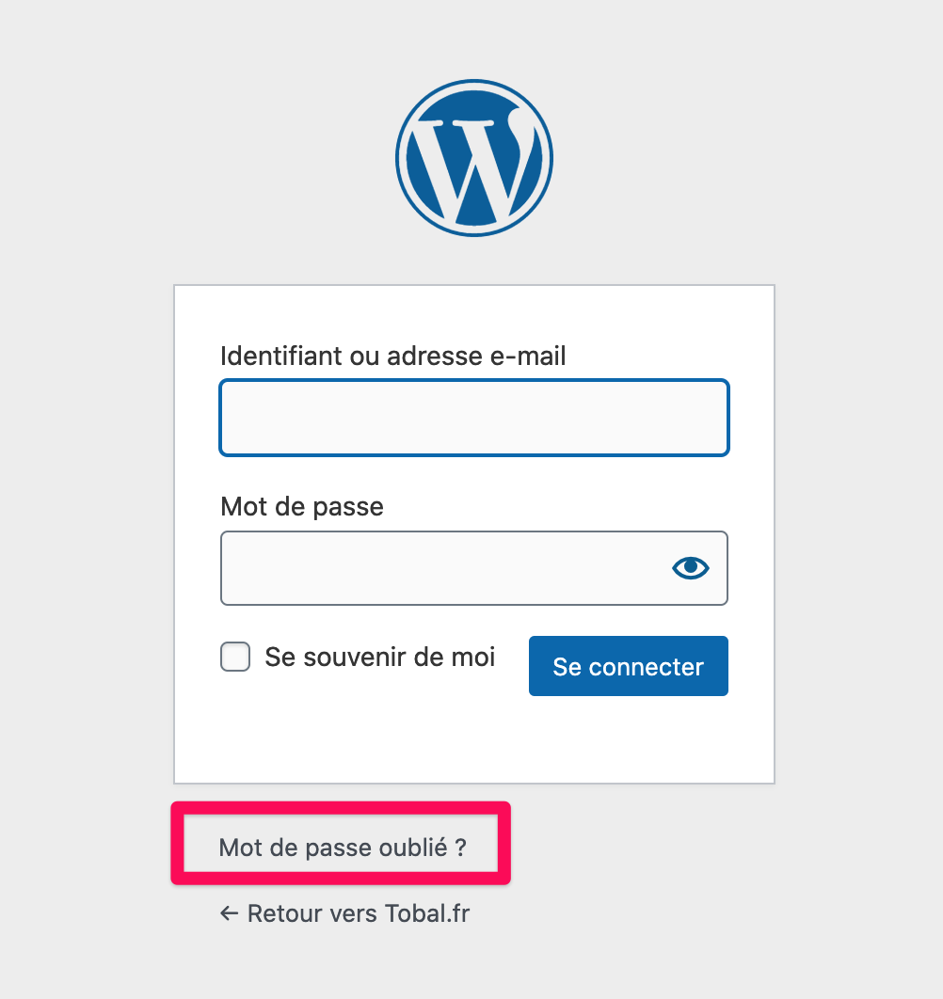
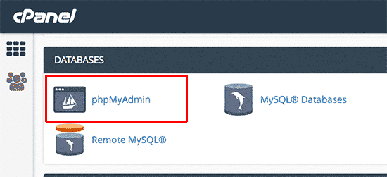
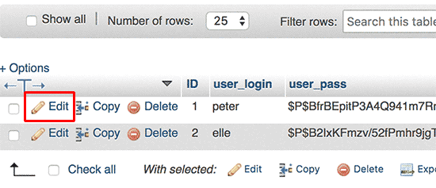
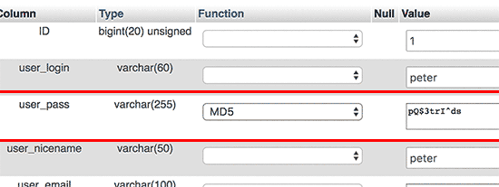

Récemment, j’ai eu besoin de réinitialiser le mot de passe admin d’un site WordPress. Je n’avais pas configuré l’envoi d’email, donc je ne pouvais pas passer par la procédure classique de réinitialisation de mot de passe. Dans ce cas, il existe un moyen de réinitialiser facilement un mot de passe WordPress à partir de phpMyAdmin. Je vais te montrer comment faire dans cet article.

<!--more-->

## **Pourquoi réinitialiser le mot de passe WordPress à partir de phpMyAdmin ?**

WordPress permet de réinitialiser ton mot de passe très facilement. Tu n’as qu’a te rendre sur l'écran de connexion et cliquer sur le lien _Mot de passe oublié ?_.

En cliquant dessus, tu accèdes à la page de réinitialisation du mot de passe où tu pourras entrer ton nom d'utilisateur ou ton adresse électronique pour réinitialiser le mot de passe. Ensuite, WordPress envoie un lien de réinitialisation du mot de passe à l'adresse email associée à ce compte utilisateur.

Toutefois, si tu n'as pas accès à l’email du compte administrateur,  ou si ton site WordPress n'envoie pas d’email (comme dans mon cas), tu ne pourras pas réinitialiser ton mot de passe par cette méthode.

Dans une telle situation, tu devras réinitialiser ton mot de passe WordPress directement depuis la base de données. La manière la plus simple de le faire est d'utiliser phpMyAdmin (ou encore mieux, depuis [Adminer](https://tobal.fr/adminer-alternative-a-phpmyadmin-mais-en-mieux/))..  

Voyons  comment faire.

## **Comment réinitialiser un mot de passe WordPress à partir de phpMyAdmin**

Connecte-toi à phpMyAdmin. Si ton hébergement utilise cPanel, il faut passer d’abord par le tableau de bord cPanel de ton hébergement WordPress. Ensuite, clique sur l'icône phpMyAdmin, dans la section base de données.

Cela lancera l'application phpMyAdmin où tu devras sélectionner ta base de données WordPress.

Tu verras la liste des tables dans ta base de données WordPress. Cherche la table **wp\_users** dans cette liste et cliquer sur le lien **Browse** à côté.

**Note** : les noms des tables dans ta base de données WordPress peuvent avoir un préfixe de table différent de celui que tu vois sur la capture d'écran. Mais la plupart du temps, le préfixe est **wp\_**.

Tu verras alors les lignes de ta table d'utilisateurs WordPress. Clique sur le bouton d'édition à côté du nom d'utilisateur dont tu veux changer le mot de passe.

phpMyAdmin va te montrer un formulaire avec tous les champs d'information de l'utilisateur.

Tu dois supprimer la valeur du champ **user\_pass** et la remplacer par ton nouveau mot de passe. Dans la colonne de fonction, sélectionne **MD5** dans le menu déroulant et clique sur le bouton **Go**.

Ton mot de passe sera crypté à l'aide du hachage MD5, puis stocké dans la base de données.

Et voilà ! Tu as réussi à changer ton mot de passe WordPress en utilisant phpMyAdmin 🎉.

## MD5 ? Eh oh, c'est pas très secure tout ça non ?

Tu te demandes peut-être pourquoi j’ai choisi le hachage MD5 pour crypter le mot de passe.

Dans les anciennes versions, WordPress utilisait le hachage MD5 pour crypter les mots de passe. Depuis sa version 2.5, WordPress utilise des technologies de cryptage plus puissantes. Cependant, WordPress reconnaît toujours le MD5 pour assurer la rétrocompatibilité.

**Dès que tu te connectes en utilisant une chaîne de mots de passe stockée avec un hachage MD5, WordPress la reconnaît et la modifie en utilisant les nouveaux algorithmes de cryptage**. Donc pas de souci niveau sécurité dès que tu te connectes. 

Source : [WPBeginner](https://www.wpbeginner.com/beginners-guide/how-to-reset-a-wordpress-password-from-phpmyadmin/).
