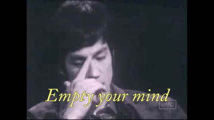

La méditation est l'une des pratiques les plus répandues parmi les gens qui réussissent ou ont réussi. Grands entrepreneurs, champions sportifs, artistes célèbres... Un nombre impressionant de gens connus pratique la méditation.

Bien sûr, ça veut pas dire automatiquement que la méditation garantit le succès, mais apparemment, ça aide.<!--more-->

## En vrai, c'est quoi la méditation ?

Déjà, mettons-nous au clair. La méditation c'est pas ce à quoi on pense instinctivement. Il ne s'agit pas de se mettre en position du lotus, allumer de l'encens, être vêtu d'une toge et atteindre l'[illumination spirituelle](https://tobal.fr/recommandation-de-livre-la-petite-voix/).

\[caption id="attachment\_3670" align="aligncenter" width="1200"\] Oh le vieux cliché quoi.\[/caption\]

**La méditation, c'est simplement se vider la tête**. C'est arrêter, pour un petit moment, cette voix à l'intérieur de nous qui débite sans cesse.

D'ailleurs, dans certaines cultures, cette voix que tu as à l'intérieur de ta tête est parfois appelé _voix de singe_. On appelle cela aussi la _subvocalisation_. Tu vois un tracteur, et dans ta tête, tu formules le mot "tracteur". Tu as faim, la petite voix dans ta tête dit "Hmm... J'ai faim. Qu'est ce que je vais bien pouvoir manger".

Quand tu ne fais pas gaffe (c'est à dire la majorité du temps), et excepté quand tu dors, cette voix ne s'arrête _jamais_.

**La méditation c'est simplement faire taire cette voix**.

## Les bases fondamentales de la méditation

Il n'y a pas de _conditions nécessaires_ à la méditation. **Pas de position spéciale, pas de lieu particulier et surtout pas de durée minimum**. Oui, c'est mieux de pouvoir se poser 10, 15 ou 30 minutes. Mais ce n'est pas une obligation. C'est comme quand tu te repose lorsque tu es fatigué. Une certaine durée minimum est le plus efficace, mais même se reposer 2 minutes ça fait du bien. **Vois la méditation comme un repos de l'esprit**.

C'est la première chose fondamentale à la méditation. **Il ne faut pas que ça vienne d'une crispation, d'une tension ou d'une frustration. Il faut être parfaitement calme et relaxé**. Être en harmonie avec soi-même. _Donc de base, si on s'impose des choses, c'est foutu d'avance_.

Évidemment, ça aide d'être dans un endroit calme. Il faut pouvoir se détendre, et ne pas être stressé. C'est pour ça que démarrer la méditation en étant assis confortablement, dans un endroit silencieux, est plus pratique que de se mettre en tailleur sans dossier, en plein brouhaha. Il faut aussi avoir un peu de temps devant soi, et ne surtout pas être pressé.

**La deuxième chose fondamentale, c'est de ne pas chercher à obtenir un résultat**. Si on le fait avec un objectif au bout, ça annule le bénéfice de la méditation. Ne te mets pas à méditer pour obtenir du succès, de l'argent, une meilleure vie, plus d'intelligence, de meilleurs relations... C'est ça qui est paradoxal avec la méditation : **elle est réellement efficace quand elle est pratiquée et appréciée pour l'acte en lui-même, pas ce qu'on espère en tirer**.

## En pratique

Une fois que tu as bien intégré les deux notions fondamentales, **la méditation consiste simplement à faire une pause à ton cerveau**. Arrête de penser.

Beaucoup plus facile à dire qu'à faire, c'est vrai. Notre cerveau est habitué à être actif non-stop quand on est éveillé. Donc au départ, tu vas voir, c'est très dur de penser à _rien_.

Pour t'aider, **focalise-toi sur ta respiration**. Inspire doucement (une inspiration doit prendre environ 5 secondes pleines), et expire doucement, en respirant par le nez et avec le ventre. Ressens l'oxygène qui vient remplir tes poumons, et ton abdomen s'affaisser quand tu expires.

Ne penses a rien.

Au début, tu vas peut-être réussir à ne penser à rien seulement pendant une ou deux secondes. Puis ton cerveau va repartir tout seul. Ce n'est pas grave. **L'important c'est de t'en rendre compte et toujours revenir à cet état de non-pensée**. Ton cerveau va faire des va-et-vient, entre vide et pensées, et c'est normal. Continue simplement de te concentrer sur ta respiration pour revenir dans un état sans pensées.

Plus tu vas le faire, et plus tu arriveras à ne penser à rien pendant longtemps. C'est comme un muscle.

Quoiqu'il arrive, _ne forces jamais_. Ne te crispes pas, ne te tends pas. Sinon ça aura tout l'effet contraire. Plus tu forces et moins tu réussiras. Au contraire, il faut te relâcher complètement.

En ce qui concerne la durée, comme je le disais un peu plus tôt, il n'y a pas de minimum. Si tu te sens bien, et que tu as le temps, tu peux méditer 30 minutes voir une heure. Mais 10 ou 15 minutes par jour c'est déjà une très bonne chose. _Tu peux même méditer seulement 2 minutes_. L'important est de trouver cet "espace" où ton cerveau se repose complètement.

En revanche, pour que les effets — qu'il ne faut pas attendre, je te le rappelle — arrivent, il faut le faire tous les jours. Au bout d'un moment tu arriveras à te relâcher plus longtemps, et tu te sentiras de mieux en mieux.

## Ce qu'apporte la méditation

La méditation, c'est le vrai repos de l'esprit. Et comme quand tu es plus efficace physiquement si tu laisses tes muscles se reposer, c'est ton esprit qui sera plus efficace grâce à la méditation. Tu seras plus calme, plus posé, tu réfléchiras mieux.

Tu auras plus de clarté d'esprit, et plus de résistance face au stress, à l'angoisse ou l'anxiété.

**Mais il ne faut pas attendre ces résultats. Ils viendront d'eux-mêmes**. Ça suit parfaitement [la loi du moindre effort](https://tobal.fr/la-loi-du-moindre-effort/). C'est comme se triturer le cerveau pour trouver un mot qu'on a sur le bout de la langue, mais pourtant impossible de le retrouver. Et plus tu forces et moins t'y arrives. C'est seulement quand tu abandonnes et passe à autre chose que la réponse vient toute seule.
