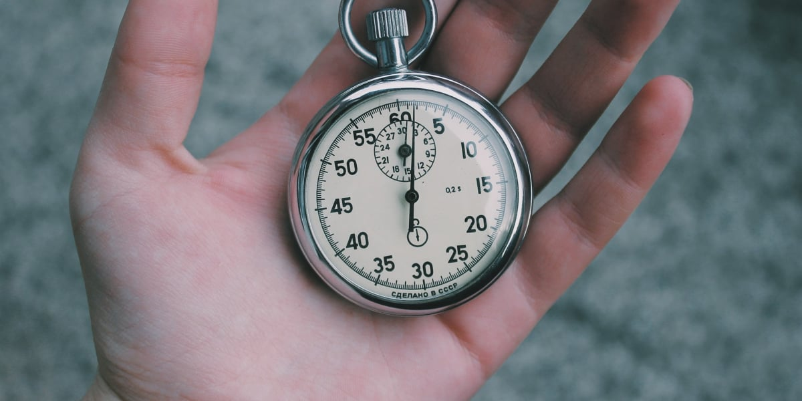

Au départ, quand tu te fixes un [objectif](https://tobal.fr/atteindre-ses-objectifs-comment-on-fait-pour-de-vrai/), tu es toujours super motivé. Tu es prêt à tout, tu as la patate.

C'est comme quand les gens font leurs résolutions pour la nouvelle année.

> "Cette fois ci ca y est : j'arrête de fumer. Je me mets au sport. Je perds 10 kgs. J'apprend la guitare. Je deviens un moine de Shaolin. Je trouve une solution à la faim dans le monde."

Mais tu connais la suite. Au bout de quelques semaines, le doute s'installe. L'énergie du départ a disparu. Et ce que tu t'es fixé comme objectif devient tout simplement une corvée. Tu n'as plus envie, plus la motivation et tu finis par abandonner. Où est partie cette foutue motivation ?<!--more-->

## La boucle de feedback

**Le souci principal qui cause cette perte de motivation est l'absence de résultat**. Hors, en vérité, quand tu produis des efforts, il y a toujours des résultats. Aussi petits soient-ils. Mais si tu ne les vois pas, **ou plutôt que tu ne sais pas les identifier**, c'est comme si il n'y en avait pas.

Quand on veut perdre du poids par exemple, on ne perd pas un kilo tout de suite. Ça met au moins plusieurs jours, voire plusieurs semaines. Pas étonnant qu'on abandonne. Ce qu'il faut, c'est **trouver le moyen d'obtenir un résultat rapidement après une action.** Peu importe le résultat, tant que c'est quelque chose de positif. Il faut que tu apprécies d'avoir fait un effort. **Si ce n'est que de l'effort sans récompense, tu finis forcément par abandonner**.

C'est pour cette raison que les jeux vidéos sont si addictifs. Ils exploitent cette boucle de feedback. Tu vois ton score monter, ton niveau progresser, tes barre d'énergie se remplir... **À chaque action, tu vois si il y a un résultat direct ou pas**, si ça marche ou non.

Donc, pour rester motiver dans les objectifs de vie, c'est pareil. Il faut **nourrir cette boucle de feedback**. Et pour ça, tu dois, d'une part, **voir un résultat après tes efforts**, aussi petit soit-il, et d'une autre, **tu dois pouvoir constater tes progrès**.

La meilleure façon de suivre ses progrès, c'est de les mesurer. Il n'y a rien de plus concret que les chiffres.

## Ce qui est mesuré est maitrisé

**Ce qui est mesuré est maitrisé** : ne fais pas les choses aléatoirement. Suis ton progrès pour savoir où tu en es à l'instant présent, et où tu en es le jour suivant.

Si tu veux te mettre à courir, ne va pa juste courir comme ça, au pif. Mesure combien de temps ou combien de kilomètres tu fais aujourd'hui. Et demain, **améliore ton résultat**, même un tout petit peu. Cours une minute ou 100 mètres de plus.

Si tu veux perdre du poids, mesure les calories que tu ingères chaque jour. **Ne te focalise pas sur ton poids car celui-ci ne varie pas assez rapidement pour que ce soit encourageant**. À la place, choisis comme objectif d'être en déficit calorique (c'est à dire de consommer moins de calories que la moyenne journalière pour un adulte). Et si chaque jour tu réussis, c'est une victoire.

Pour te donner un exemple concret : je publie un article _tous les jours depuis plus de 2 mois_. J'en suis à 71 articles d'affilée. C'est plus que ce que tout ce que j'ai écrit auparavant les 3 dernières années.

C'est un exercice que j'ai essayé plusieurs fois par le passé, sans réussir. Pourquoi ? Car je me fixais comme objectif le traffic, le nombre de visiteurs sur mon site. Et ce chiffre, en vrai, je n'ai que très peu d'influence dessus. Et surtout pas dans l'immédiat. Avant de voir un résultat, il faut attendre plusieurs semaines voire plusieurs mois. Et à chaque fois, en constatant l'absence d'augmentation de traffic, je me suis découragé.

Ce qui a changé cette fois-ci, c'est que _j'ai changé d'objectif_. J'ai changé _les métriques avec lesquelles je mesure mon succès_. J'ai choisi quelque chose que je contrôle : peu importe le nombre de visiteurs, si je publie un article chaque jour, c'est une réussite. [Plus j'enchaine les jours d'affilée, et plus ma série s'allonge](https://tobal.fr/ta-meilleure-resolution-pour-2019-1-x-365-100-x-30/).

Le reste ne compte pas. Ainsi, il est relativement facile de faire en sorte que chaque jour pour moi soit une réussite. Du coup la motivation reste.

Bref, dans tout ce que tu fais, mesures le résultat de tes effort _tous les jours_ afin d'être connecté a la réalité, et surtout de constater tes progrès.

Sais exactement où tu en es, et **définit une métrique indicative de succès pour toi qui soit atteignable chaque jour ou presque**.. Ainsi, chaque jour tu pourras réussir (ou échouer) et ça te donnera un feedback sur ton avancement. Comme pour les jeux vidéos. Et c'est ça qui te gardera motivé sur le long terme.
