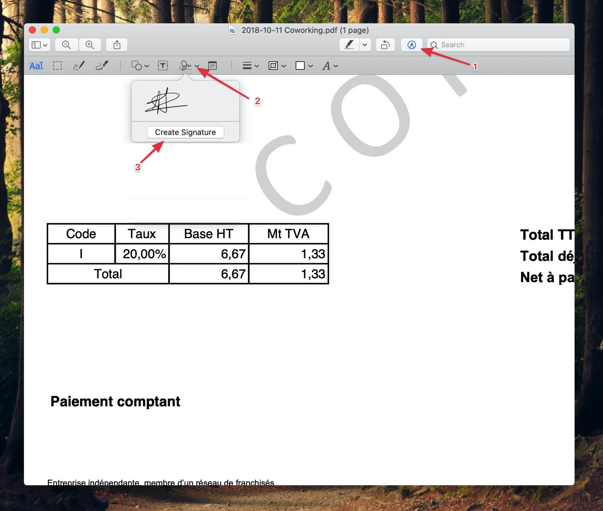
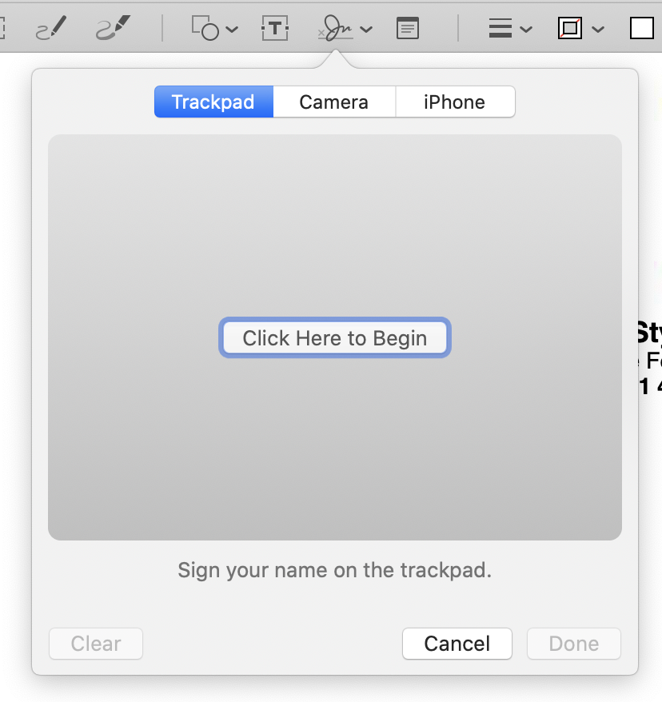

Tu viens de recevoir un contrat par e-mail, et il faut que tu le signes avant de le renvoyer, que fais-tu ?

Si tu imprimes le document, le signe, le re-numérise au scanner ou le prend en photo avec ton téléphone pour pouvoir le renvoyer, il y a une façon beaucoup plus simple de faire. Voici comment éviter d'avoir à faire tout ça à chaque fois. Ça se passe en deux clics sur Mac et sur Windows

<!--more-->

## Signer un document sur Mac

Pour signer un PDF (ou tout autre document numérisé, ça marche aussi avec les images) avec un Mac, il suffit de l'ouvrir avec l'application **Aperçu** (Preview). Clique ensuite sur les outils avancés (1), puis sur le bouton signature (2), et enfin sur **Créer une signature** (3) :

La première fois, Preview va te demander de créer ta signature. L'application propose plusieurs façons hyper pratiques de le faire :

- Soit en utilisant le trackpad,
- soit en signant sur une feuille blanche et en la présentant devant la webcam,
- ou si tu as un iPhone, tu peux carrément signer avec le doigt sur l'écran de celui-ci.

Une fois ta signature crée, tu n'as plus qu'à la sélectionner et la placer où tu veux sur le document. Quand tu auras pris l'habitude de ce petit truc, tu te demanderas comment tu faisais avant 😂

## Signer un document sur Windows

Sur Windows, c'est tout aussi simple et le procédé est similaire. Il faut cependant que tu aies installé le logiciel Acrobat Reader au préalable.

Comme je n'ai pas d'ordinateur sur Windows, et plutôt que de ré-écrire ce qui a déjà été très bien expliqué, je t'invite à suivre ce [tutoriel très simple de 01Net](https://www.01net.com/astuces/comment-creer-une-signature-manuscrite-pour-vos-pdf-1384525.html).

Si tu as la flemme d'installer Acrobat Reader, tu peux utiliser aussi [ce site qui permet de signer très simplement un document PDF](https://smallpdf.com/fr/signer-un-pdf). À noter qu'il est gratuit pour 2 documents par heure, et payant ensuite.
