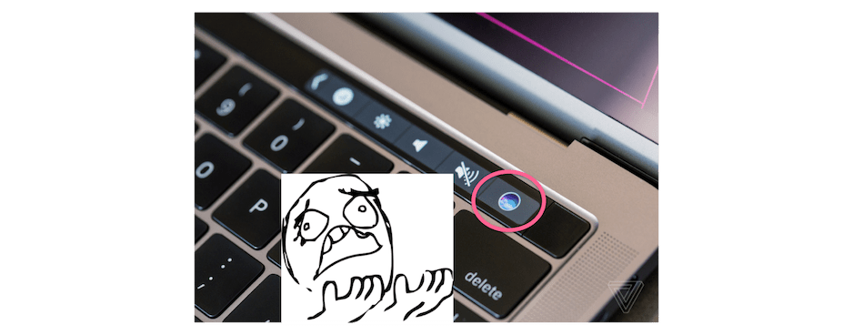
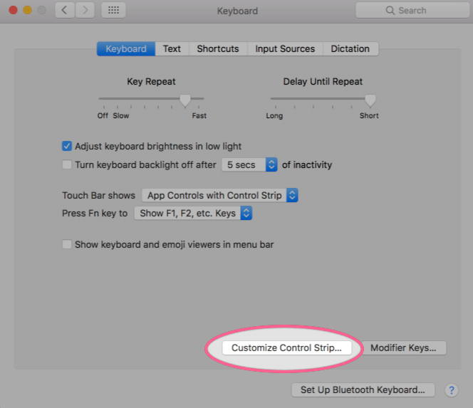
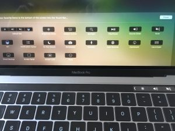

Vous avez craqué pour le tout nouveau MacBook Pro avec Touch Bar sorti l’année dernière ? Félicitations, c’est un super ordinateur.

Le problème c’est que la Touch Bar, avouons-le nous: c’est un peu gadget. Mais surtout, peut-être que comme moi vous n’arrêtez pas d’appuyer sur cette foutue touche Siri de me\*de sans faire exprès. Vous savez, celle sur laquelle vous appuyez une fois sur trois quand vous voulez revenir en arrière. <!--more-->Celle ci:

Au bout de la 354ème fois, j'en ai eu marre. "Il faut que je vire cette touche", me suis-je dit. Mais comment faire ?

Eh bien figurez vous que c'est tout simple. Apple a eu la bonne idée de vous permettre de personnaliser cette barre facilement. Donc, pour virer la touche Siri de votre Touch Bar - ou d'ailleurs n'importe quelle touche qui vous plaira, en ajouter d'autre ou changer l'ordre des touches - il vous suffit de vous rendre dans les paramètre de clavier: cliquez sur le menu  tout en haut à gauche, puis _Préférences système_, et dans le menu qui s'affiche, choisissez _Clavier_. Dans les préférences clavier, cliquez sur _Personnaliser la barre de contrôle_:

Vous verrez quelque chose comme ceci (avec les icônes de votre TouchBar "tremblent"):

Vous pouvez alors appuyer sur la touche Siri et la glisser dans la poubelle tout à gauche de la Touch Bar, ou utiliser votre souris pour la glisser en dehors de la Touch Bar.

Une fois que c'est fait, cliquez sur _Terminer_ et vous voilà débarrassé de cette maudite touche !
