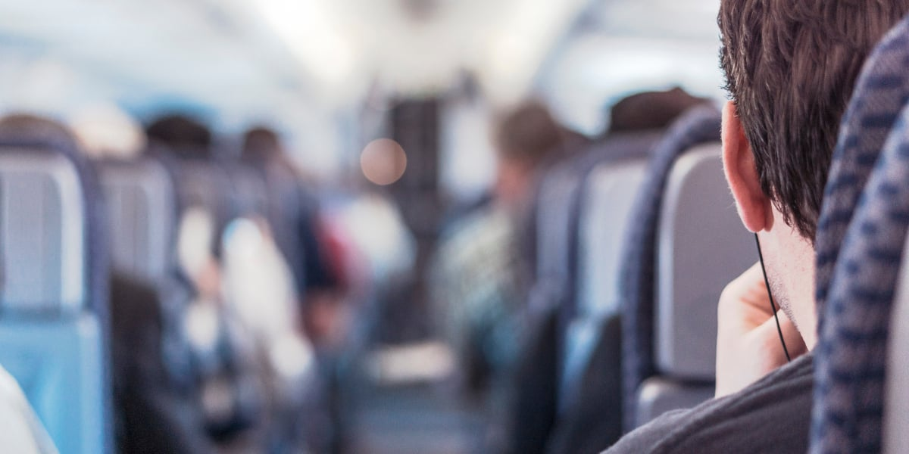
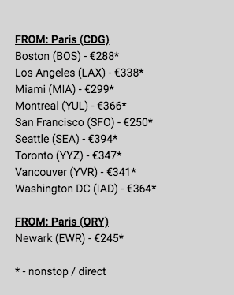

Quand on demande au gens si ils aiment voyager, la réponse qui revient souvent est :

> "Oui mais les voyages ça coûte cher."

Sauf qu'en fait, c'est faux. <!--more-->Voyager à l'autre bout du monde et aller de pays en pays, c'est pas forcément si cher que ça. Au final, c'est surtout une question d'avoir le temps.

Je vais te donner quelques astuces pour pouvoir voyager où tu veux, le temps que tu veux, **sans que ça te coûte un bras**.

## C'est le confort qui coûte cher, pas le voyage

Tout simplement. [Le confort, ça se paie, et c'est ça qui coûte cher dans les voyages](https://tobal.fr/je-suis-minimaliste/). Partir deux semaines à Cancún, dormir dans un hôtel 4 étoiles All Inclusive, ou manger au restaurant tous les midis et soirs, faire toutes les attractions touristiques... C'est ça qui coûte une blinde.

En revanche, vivre comme un local, c'est à dire :

- éviter les attrape-touristes,
- se déplacer avec les transports en commun,
- faire ses courses et cuisiner
- dormir chez l'habitant,

permettent de faire de _très grosses_ économies.

Par exemple, pour le logement, au lieu de prendre l'hôtel, simplement passer par AirBnB coûte deux voire trois fois moins cher. Et si tu es encore plus motivé, tu peux même être logé gratuit avec [CouchSurfing](https://www.couchsurfing.com/).

Tout comme quand on est chez soi, aller faire des courses et cuisiner fait économiser énormément par rapport à aller au restaurant midi et soir.

Et, évidemment, ne pas aller faire toutes les attractions touristiques, qui coûtent souvent très cher et qui en valent rarement la peine. **Le plus intéressant dans les voyages, ce ne sont pas les trucs les plus connus mais les petites pépites connues seulement des locaux.**

## Trouver le billet d'avion au meilleur prix

Le prix du billet d'avion reste probablement un des coûts les plus importants d'un voyage, et sur lequel c'est les plus difficile d'économiser. Mais il y plusieurs façons de trouver des excellents prix, et parfois même des prix totalement improbables.

La première façon d'économiser, c'est de s'y prendre bien longtemps à l'avance. Bon ça c'est assez évident.

Mais ensuite, il faut passer un peu de temps à comparer les prix sur [SkyScanner](https://www.skyscanner.fr/), [Momondo](https://www.momondo.fr/), [Kayak](https://www.kayak.fr) et [Google Flights](https://www.google.com/flights). **Ça vaut vraiment le coup de tester ces 4 sites car les meilleurs prix s'y trouvent**. Des fois c'est sur SkyScanner que tu trouveras le meilleur prix, des fois sur [Google Flights](https://tobal.fr/trouver-les-meilleurs-prix-de-billet-davion-avec-google-flights/), etc...

### ... Et parfois même trouver des prix de fous

La deuxième façon, c'est de s'inscrire sur [Scott's Cheap Flights](https://scottscheapflights.com/). Ce site est tout simplement génial. Le principe, c'est de s'inscrire à la newsletter, et tu reçois des emails de temps en temps avec des offres exceptionnelles pour des billets d'avion.

En quoi ces offres sont exceptionnelles ? Et bien il s'agit _d'erreurs_ des compagnies aériennes. Les prix sont rentrés par des humains, et **les compagnies sont obligées d'honorer un billet qui a été réservé à un prix erroné**.

Évidemment, trouver ces erreurs tout seul demanderait un temps fou. Scott's Cheap Flight est là exactement pour ça. Le site surveille en continu des milliers de sites de prix pour les billets d'avion, et quand une erreur est détectée, tu es prévenu.

Pour te donner un ordre d'idée, voici un mail que j'ai reçu il y a pas longtemps :

250€ un vol **direct** aller-retour pour San Francisco. C'est pas un prix de ouf ça ?

L'inscription est totalement gratuite, et tu reçois pas mal d'offres, mais pas _toutes_. Si tu es un voyageur aguerri, tu peux souscrire à un abonnement (qui coûte seulement $39 / an) pour recevoir _toutes_ les offres. Au premier voyage, ton abonnement est remboursé 10 fois.

Voilà, en suivant ces simples conseils tu peux te faire n'importe quel voyage pour pas si cher que ça. Par exemple, en t'arrangeant bien, pour moins de 1000€ tu peux faire deux semaines à San Francisco ou Los Angeles tranquille, _tout compris_.
