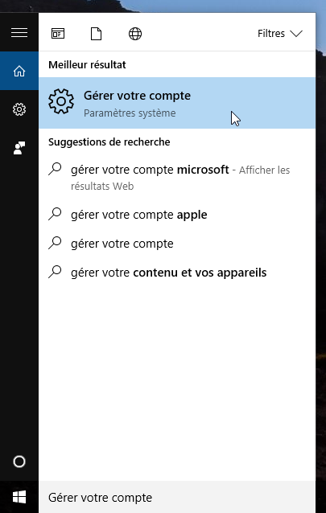
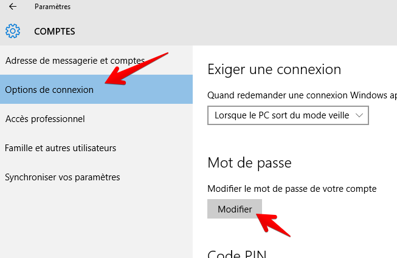
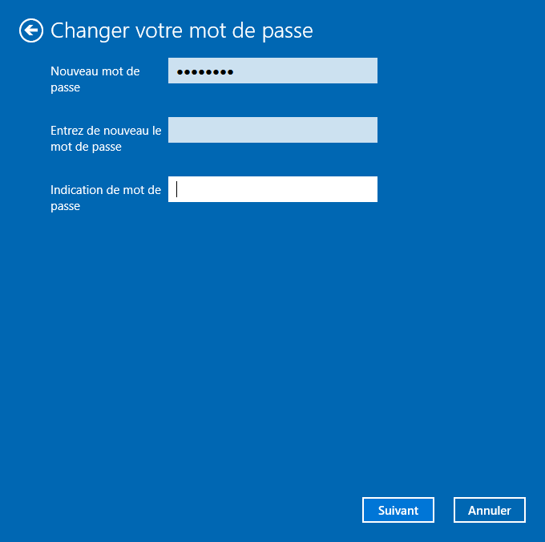

Beaucoup de gens se connectent à leur ordinateur tous les jours, plusieurs fois par jour, en tapant machinalement leur mot de passe. Mais c’est peut-être quelque chose qui vous saoûle un peu, surtout si vous êtes le seul utilisateur de l’ordinateur à la maison. Et peut-être que vous vous êtes dit “Tiens, je vais supprimer le mot de passe à la connexion”.<!--more-->

Récemment, un de mes amis exactement dans cette situation m’a demandé de l’aider afin retirer le mot de passe d’ouverture de session Windows de son ordinateur. Tranquille, je me suis dit, une petite recherche Google et c’est réglé.

## La vraie fausse solution

Peut-être avez vous même déjà cherché comment faire, et très probablement, comme moi, vous êtes tombé sur les dizaines d’articles qui disent tous la même chose, aussi bien en français qu’en anglais. En gros, la manipulation serait de:

- Lancer la fenêtre **Exécuter** (raccourci clavier `Windows + R`).
- Taper `netplwiz` et valider.
- Dans la fenêtre _Comptes d’utilisateurs_ qui s’ouvre, de décocher la case _Les utilisateurs doivent entrer un nom d’utilisateur et un mot de passe pour utiliser cet ordinateur_.

Et soi-disant le tour est joué. Sauf que non, en fait. J’ai fait ça trois fois d’affilé pour être sûr, redémarré à chaque fois l’ordinateur, sans succès. A chaque redémarrage, il fallait retaper le mot de passe.

Et le plus flippant c’est que TOUS les sites donnent la même réponse, et j’ai cherché comme un dingue sur Google. Ça commençait à me rendre fou.

À croire que j’avais loupé un truc.

**Et bien oui**.

Enfin, moi et surtout tous les autres sites (désolé les gars). Il manque une partie cruciale, et si c’est votre cas, je vous annonce que vous allez enfin pouvoir arrêter de chercher.

## La vraie vraie solution

En plus de la manipulation précédente, il y a une manipulation supplémentaire. Il suffit de cliquer sur le menu démarrer, et de taper “Gérer votre compte”, et de sélectionner le menu du même nom:Puis dans ce menu, cliquez sur _Options de connexion_, et cliquez sur le bouton _Modifier_ dans la section _Mot de passe_.Là, vous aurez une fenêtre vous demandant de taper votre mot de passe habituel de connexion Windows. Faites le une première fois, puis vous arriverez sur le dernier écran, où vous aurez 3 champs: un pour votre mot de passe actuel, et deux pour votre nouveau mot de passe. Sauf que vous ne voulez pas de nouveau mot de passe justement. Pas de problème, il vous suffit de ne renseigner que le premier champ, et donc de laisser vides les champs de nouveau mot de passe, comme ceci:Il ne vous reste plus qu’à cliquer sur suivant et valider la modification.

Fiou, cette fois-ci le mot de passe sera vraiment désactivé et vous serez immédiatement connecté en allumant l’ordinateur.

Voilà, si vous ragiez parce que vous n’arriviez pas à enlever le mot de passe de Windows 10 en suivant les instructions données par à peu près _tous_ les sites, c’est qu’il vous manquait cette partie.
