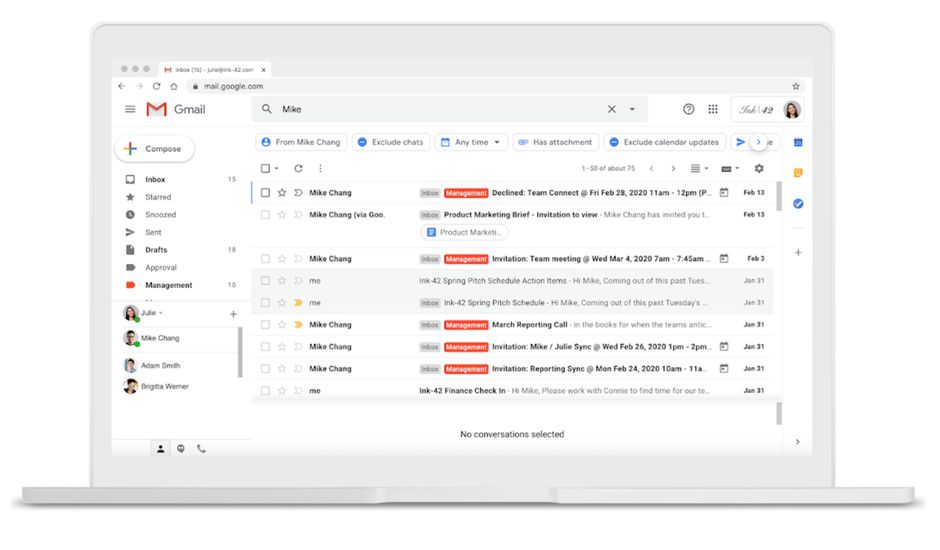
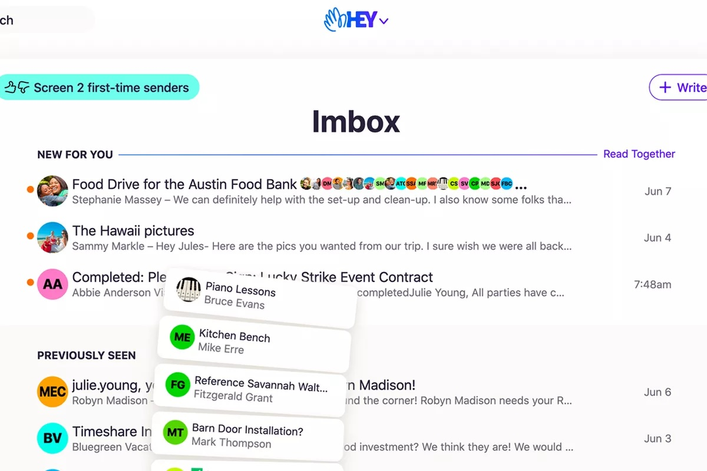
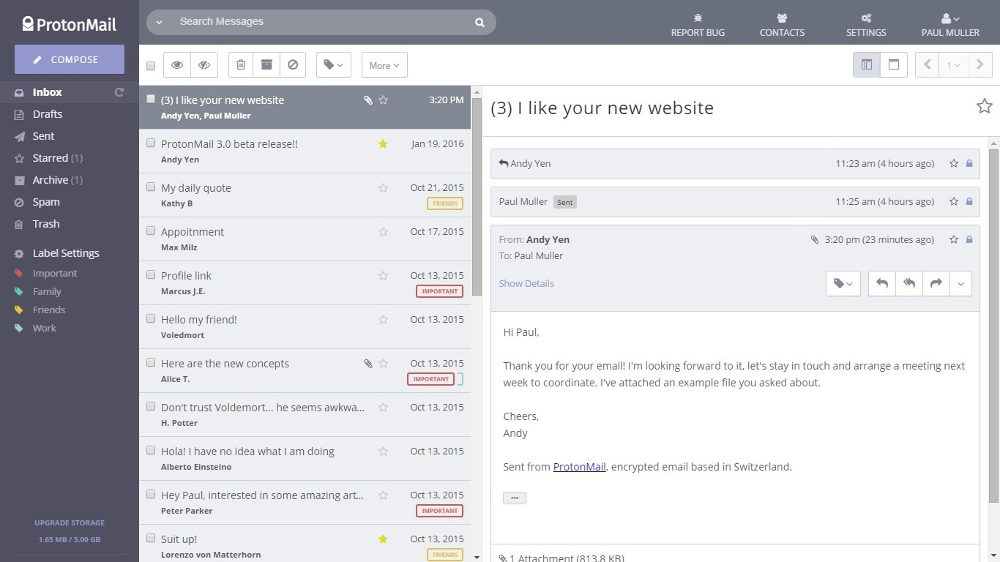
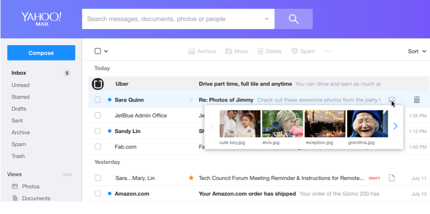
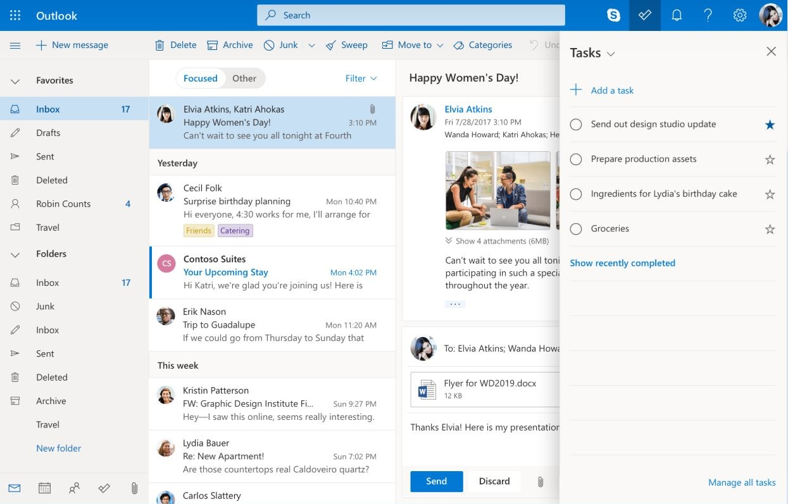
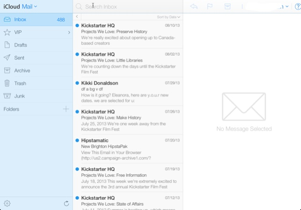
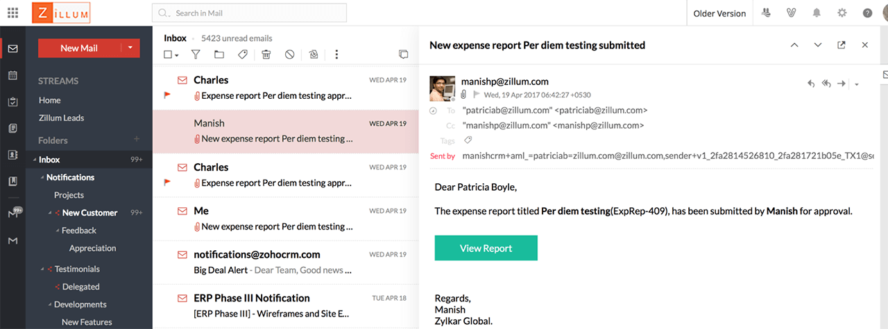
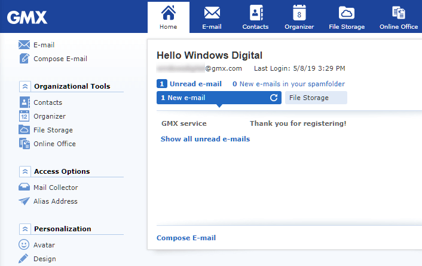
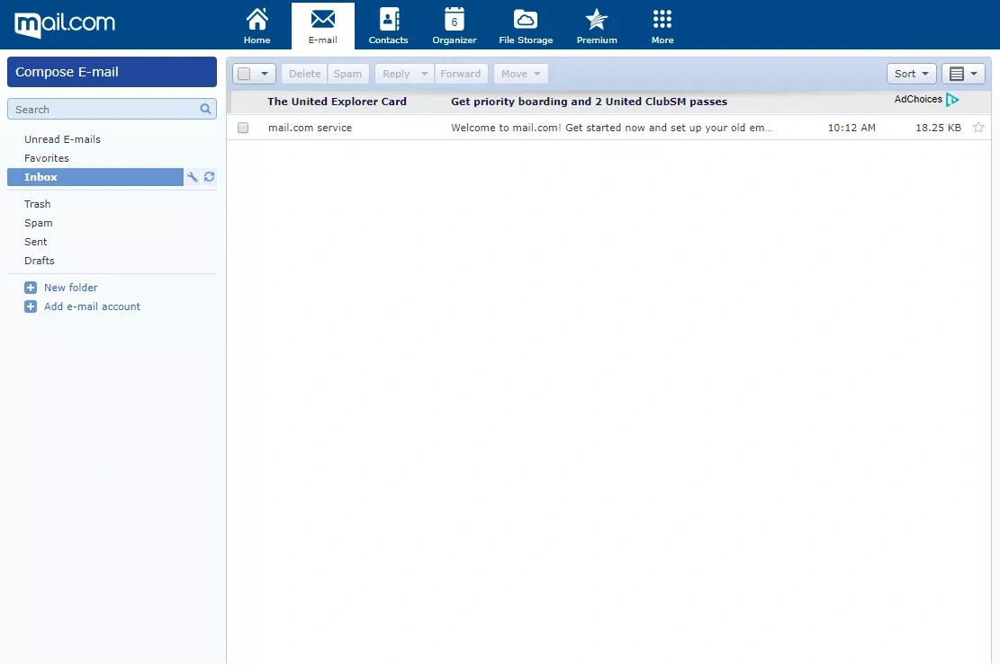

Pour les particuliers comme les professionnels, le recours à une messagerie est une nécessité. Si tu utilises un téléphone, une tablette ou un ordinateur, tu auras besoin d'un compte électronique, ne serait-ce que pour avoir accès à certains services. Mais, trouver l'un des meilleurs fournisseurs emails dont les services répondent à tes besoins n'est pas toujours évident.

Et si tu ne souhaites pas te contenter des messageries par défaut installées sur tes terminaux, il te faudra faire des choix. La difficulté réside dans la densité de l'offre qui s'enrichit sans cesse de nouvelles solutions. Pour t'aider à trouver la solution qui te convient, découvre dans ce guide le comparatif des meilleurs fournisseurs emails en 2020.

<!--more-->

## **Évolution des offres des fournisseurs emails depuis 2000**

Le paysage technologique a beaucoup changé au cours de ces 20 dernières années, ce qui a forcément eu un impact sur le marché des fournisseurs emails. Au début des années 2000, les messageries électroniques les plus connus étaient [Yahoo ! Mail](https://mail.yahoo.com) et [Microsoft Outlook](https://www.microsoft.com/fr-ww/microsoft-365/outlook/email-and-calendar-software-microsoft-outlook) qui avaient été lancées 3 ans auparavant.

Si Yahoo a longtemps été la tête de proue des portails internet et de la messagerie électronique du moins pendant quelques années, un autre géant qui n'est autre que [Gmail](https://www.google.com/intl/fr/gmail/about/) a commencé à lui faire de l'ombre.

En effet, propulsé au-devant de la scène en 2007, Gmail n'a pas mis longtemps à s'imposer comme l'une des références du milieu. Si les débuts des services de messagerie électronique ont été quelque peu balbutiants, il n'en est rien aujourd'hui, au vu de la dynamique de ce secteur de plus en plus concurrentiel.

## Présentation du marché actuel des fournisseurs emails

Aujourd'hui, ce ne sont pas les options qui manquent en termes de fournisseurs emails, mais cela ne facilite pas pour autant leur choix.

Pour te décider, plusieurs critères entrent en ligne de compte, notamment :

- Tes besoins en tant que professionnel ou particulier,
- Les contraintes techniques liées à ton système d'exploitation,
- Les fonctionnalités,
- L'accessibilité du service (gratuit ou payant)
- Et l'expérience utilisateur.

Pour te faire une idée sur la qualité des offres disponibles, il te faut déjà t'intéresser à leurs caractéristiques.

## Gmail

<figure>

<figcaption>

Gmail, le fournisseur mail avec filtres

</figcaption>

</figure>

**URL :** [www.google.com/intl/fr/gmail/about/](https://www.google.com/intl/fr/gmail/about/#)

**Terminaison de l'adresse mail :** @gmail.com

Il suffit de jeter un coup d'œil au nombre d'internautes qui utilisent Gmail ou Google Mail comme service de messagerie. On compte environ 1 milliard d'utilisateurs de Gmail.

Cette donnée a de quoi impressionner, mais elle n'est pas uniquement basée sur les fonctionnalités de la messagerie. Il faut aussi considérer le fait que disposer d'**une adresse Gmail est essentiel pour bénéficier des services Google**.

Outre cette particularité, on reconnaît quand même des qualités à ce service qui permet de [bien gérer ses emails](https://tobal.fr/comment-bien-gerer-ses-emails-reprenez-le-controle-de-votre-boite-de-reception/). Gratuit, tu as accès au compte Gmail autant sur un navigateur web que sur l'application dédiée. **L'interface est esthétiquement attrayante** et donne une vue d'ensemble sur les différents composants de la messagerie. Les dossiers (messages envoyés, messages suivis, brouillons, spams, etc) sont regroupés dans une barre latérale, tandis que la liste des mails occupe une place plus centrale. **Les messages sont classés en plusieurs catégories** (réseaux sociaux, notifications, promotions, etc.)

L'utilisation au quotidien se révèle agréable grâce à l'organisation de la messagerie. Consulter ou écrire des mails se fait en quelques clics. Il est aussi possible de créer de nouveaux dossiers ou libellés pour te retrouver plus rapidement et gagner encore plus de temps.

**Tarif**

Totalement gratuit, Gmail dispose d'un espace de stockage de 15 Go, partagé avec Google Photos et [Drive](https://tobal.fr/9-outils-essentiels-a-ma-productivite-que-jutilise-au-quotidien/#more-3633). Il est toujours possible de faire une [sauvegarde de ses mails en local avec Gmail](https://tobal.fr/sauvegarder-ses-emails-gmail-en-local-avec-gmvault/).

## Hey.com

<figure>

<figcaption>

Hey, le fournisseur de messagerie électronique qui te laisse décider

</figcaption>

</figure>

**URL :** [hey.com](https://hey.com/)

**Terminaison de l'adresse mail :** @hey.com

Avec Hey, on part sur une nouvelle définition des fournisseurs emails. Mais qu'est-ce qui change vraiment ?

Hey veut offrir un environnement plus pragmatique et plus pratique à ses utilisateurs. Dans le sens où, avec cette solution, tu auras entièrement la main sur ta messagerie. Cela commence par « Imbox » qui se substitue à la boîte de réception classique à laquelle tu es habitué.

Ici, dès le départ, c'est **l'utilisateur qui décide des mails qu'il recevra ou non**. Ainsi s'il accepte le message d'un expéditeur une première fois, il pourra par la suite continuer à en recevoir d'autres de sa part. Le filtrage des mails est donc manuel.

- **Les messages en attente de validation** sont contenus dans un dossier « The screener » avant de passer dans « Imbox ».
- Tandis que **les messages non validés** sont basculés dans « Screened out » et peuvent toujours être acceptés plus tard.

Les mails sont classés dans 2 autres catégories : « Feed » et « Paper trail » qui comprennent respectivement les listes de diffusion, mais aussi les reçus ou tickets, les factures et les confirmations de commandes. Les mails déjà lus auxquels tu souhaites répondre plus tard sont gardés dans le dossier « Focus & Reply ». Tu as aussi une vue globale des conversations avec tes différents interlocuteurs via des fiches contact.

**Tarif**

Hey n'est **gratuit que pendant une période d'essai de 14 jours**. Ceux qui souhaitent continuer l'aventure devront débourser $99 (environ 83,46 €) chaque année et auront droit à un espace de stockage de 100 Go.

## Protonmail

<figure>

<figcaption>

Protonmail et sa messagerie sécurisée

</figcaption>

</figure>

**URL :** [protonmail.com](https://protonmail.com/)

**Terminaison de l'adresse mail :** @protonmail.com, @protonmail.ch ou pm.me.

Protonmail se présente d'emblée aux internautes comme une solution sécurisée sans pour autant être impénétrable aux profanes. L'enjeu c'est de proposer une messagerie plus sûre mais aussi confortable.

L'une des principales fonctionnalités de Protonmail, c'est le **chiffrement bout à bout de tous les messages**, envoyés ou reçus.

L'interface frappe par sa sobriété et par la présentation assez simpliste des différentes catégories comme la liste des mails, le panneau de lecture et les dossiers compris dans une barre latérale située à gauche, avec par-dessus le bouton de rédaction de nouveaux mails.

Protonmail peut te sembler manquer de souplesse, l'interface étant plutôt avare en options de personnalisation. Tu ne t'y sentiras cependant pas désorienté et retrouveras des fonctions familières comme le transfert des messages vers un expéditeur, le déplacement dans un dossier particulier, le marquage « lu » ou « non lu », l'archivage ou la suppression, et la création de nouveaux libellés entre autres.

**Tarif**

Il est vrai que le service est gratuit, mais cela te prive de certaines fonctionnalités comme l'accès au [protocole IMAP/SMTP](https://www.google.com/url?sa=t&rct=j&q=&esrc=s&source=web&cd=&cad=rja&uact=8&ved=2ahUKEwi1q6TtvM7sAhVR66QKHcHDD1sQFjAHegQIAhAC&url=https%3A%2F%2Fwww.journaldunet.fr%2Fweb-tech%2Fdictionnaire-du-webmastering%2F1203601-smtp-simple-mail-transfer-protocol-definition-traduction-et-acteurs%2F%23%3A~%3Atext%3DLe%2520protocole%2520SMTP%252C%2520pour%2520Simple%2Cjoue%2520le%2520r%25C3%25B4le%2520d%27exp%25C3%25A9diteur.&usg=AOvVaw1Za7EARQRSrVkaW16Zr6p9). L'espace de stockage par défaut est aussi réduit, juste 500 Mo. Pour l'étendre, il te faudra donc passer de l'offre gratuite à la formule « Plus » qui te coûtera 5 € par mois et te donnera accès à 5 Go d'espace.

## Yahoo Mail

<figure>

<figcaption>

Yahoo Mail revient avec un nouveau design

</figcaption>

</figure>

**URL :** [mail.yahoo.com](https://mail.yahoo.com/)

**Terminaison de l'adresse mail :** @yahoo.com

Pour se donner les moyens de faire face à la concurrence, Yahoo a tenu à soigner son retour en mettant à la disposition des internautes une solution au goût du jour. En effet, avec **une interface épurée et surtout moderne**, Yahoo renoue avec [ses bonnes habitudes](https://tobal.fr/prenez-de-bonnes-habitudes-de-vie-pour-reussir/).

On apprécie la fluidité de l'interface qui te permet dès le premier coup d'œil d'avoir un aperçu de ta liste de mails et de tes dossiers. Cette disposition te rappellera sûrement celle du fournisseur Gmail avec lequel la messagerie partage certaines fonctionnalités de base.

L'organisation est pensée pour que tu puisses retrouver en peu de temps tes discussions. Outre les options de tri et d'archivage des mails, tu as aussi la main sur leur disposition en choisissant entre un affichage sous forme de liste ou d'aperçu. Consultable sur un navigateur web, Yahoo Mail est aussi disponible via une application mobile qui facilite grandement la désinscription des newsletters.

Tu peux en toute liberté intégrer d'autres adresses de messagerie à Yahoo si tu disposes de plusieurs comptes.

**Tarif**

Le service Yahoo Mail comporte une version gratuite avec publicités et une version Yahoo Mail Pro qui en est dépourvue et qui exige un abonnement mensuel de 3,60 €. Indifféremment de la formule choisie, tu bénéficies d'un impressionnant **stockage de 1 To.**

## Outlook

<figure>

<figcaption>

Outlook et sa solution de messagerie électronique

</figcaption>

</figure>

**URL :** [outlook.com](https://outlook.com/)

**Terminaison de l'adresse mail :** @outlook.com (ou .fr), @live.com (ou .fr).

Compris dans le package de la suite Microsoft Office, Outlook est une solution de messagerie qui a particulièrement bonne presse auprès des professionnels. Il est aussi bien entendu utilisé par des particuliers et est apprécié pour sa polyvalence. En effet, le service intègre également un calendrier pour optimiser le suivi des évènements ou des rendez-vous.

Tu y trouveras une interface organisée de façon classique, notamment un bloc central regroupant les mails, une barre latérale comprenant les différents dossiers, sans oublier le panneau de prévisualisation.

La gestion des pièces jointes est particulièrement réussie, avec la possibilité d'une intégration aux mails à partir de Dropbox ou de Google Drive. De base, Outlook est proposé avec un **stockage de 15 Go** qui te donne assez de marge pour trouver de la place à tes fichiers. Pour en avoir plus, il te suffit de passer à l'offre premium Office 365 qui, en plus de la suppression des publicités, étend le stockage de la messagerie à 50 Go.

**Tarif**

Le service d'email est gratuit, mais pour disposer de plus fonctionnalités, le prix à payer pour l'offre premium Office 365 est d'environ 50 € par an pour un seul utilisateur, et 67 € pour 6 personnes avec la formule Microsoft 365 Famille. Si tu n'es pas satisfait de la configuration par défaut, tu peux la changer à ta convenance grâce aux nombreuses options de paramétrage.

## iCloud

<figure>

<figcaption>

Icloud Mail, ta messagerie Apple

</figcaption>

</figure>

**Url :** [icloud.com/mail](https://www.icloud.com/mail)

**Terminaison de l'adresse mail :** @icloud.com

Apple iCloud est la solution de messagerie développée par la marque de la pomme. Elle fait partie du compte iCloud dont sont dotés les terminaux Apple comme les smartphones, les iPads et les ordinateurs. Les mails sont consultables en ligne sur des navigateurs web et sur une application dédiée.

Apple a fait l'effort de rendre compatible son service de messagerie avec d'autres fournisseurs emails, notamment Outlook, Yahoo et Gmail, mais uniquement sur la version mobile. Quand tu passes par un navigateur web, seuls les mails d'iCloud sont à ta portée. Les utilisateurs ont par conséquent une nette préférence pour l'application mobile qui se veut bien plus complète.

Fidèle à ses principes, Apple a tenu à livrer une interface épurée et fluide. Sur la gauche, tu retrouveras plusieurs dossiers comme la traditionnelle « Boîte de réception », mais aussi les messages envoyés, les archives et les messages indésirables. Tu as la possibilité de diriger tes discussions importantes vers une boîte mail VIP prévue expressément à cet effet. Il te suffit pour cela d'attribuer le statut VIP aux contacts de ton choix.

Comme tu peux t'en douter, Apple ne laisse pas une grande marge de manœuvre aux utilisateurs quant aux possibilités de personnalisation du service. La marque se montre aussi un peu chiche par rapport au **stockage qui ne se limite qu'à 5 Go**.

**Tarif**

Le service est toutefois gratuit et reste satisfaisant dans son ensemble.

## Zoho mail

<figure>

<figcaption>

Zoho mail, la messagerie qui s'adapte aussi aux professionnels

</figcaption>

</figure>

URL : [www.zoho.com/fr/mail/](https://www.zoho.com/fr/mail/)

**Terminaison de l'adresse mail :** @zoho.com

Zoho Mail se distingue par sa versatilité et sa **capacité à s'adapter aux besoins des professionnels et des particuliers**.

Cette solution est très prisée des entreprises pour ses fonctions avancées. En effet, s'il peut te servir à envoyer et recevoir des mails, Zoho Mail se présente aussi comme un outil collaboratif à part entière. L'opportunité t'est donnée d'organiser ta boîte de réception pour ne manquer aucun message important. Tu peux prévoir des notifications spécifiques pour les différents dossiers présents sur l'interface. Documents, pièces jointes ou messages peuvent être retrouvés facilement grâce à des filtres intelligents.

Pour les entrepreneurs qui tiennent à leur image de marque, il y a une fonctionnalité plus qu'intéressante : la création d'adresses mails incluant un nom de domaine personnalisé.

Le volet collaboratif est marqué par la possibilité de créer des tâches, des évènements et des notes. [Par souci de productivité](https://tobal.fr/9-outils-essentiels-a-ma-productivite-que-jutilise-au-quotidien/), tu peux partager ces différents éléments avec tes collaborateurs, ce qui facilite grandement le travail en équipe. Tes options s'étendent aussi à des outils d'édition de textes, ou de feuilles de calcul disponibles sur le Cloud de Zoho Mail.

Le service se veut aussi rassurant puisqu'il propose une **solution sécurisée avec un chiffrement des données**. Comptez aussi sur une messagerie instantanée qui facilite les échanges entre plusieurs contacts. L'espace de **stockage de 10 Go** est réparti équitablement entre les documents et les messages.

**Tarif**

Avec la formule Mail Premium, tu peux prétendre à un stockage plus conséquent de 50 Go, à condition de payer un peu plus de 3 € par mois.

## GMX

<figure>

<figcaption>

Gmx, le fournisseur de mails gratuit

</figcaption>

</figure>

**URL :** [gmx.fr/mail/](https://www.gmx.fr/mail/)

**Terminaison de l'adresse mail :** @gmx.fr

Bien plus qu'une alternative aux fournisseurs emails traditionnels, GMX Mail cherche à s'imposer comme une solution complète et gratuite. Elle dispose pour cela d'atouts non négligeables comme sa simplicité d'utilisation et son interface agréable que tu peux adapter à ton goût en jouant sur les couleurs de l'interface en y appliquant une diversité de thèmes.

Déployé sur iOS et Android, le service permet d'avoir un accès rapide et aisé à tes mails, y compris ceux provenant d'autres fournisseurs emails, Outlook, ou Gmail. Outre la facilité de migration des e-mails, GMX se distingue aussi par les options de sécurité qu'il propose au travers de son antivirus, du filtre anti-spam et du chiffrement des communications. En tant qu'utilisateur, tu seras forcément sensible à ses fonctionnalités qui sont le gage d'un usage sûr, d'autant plus que le service facilite la création de [mots de passe sécurisés](https://tobal.fr/retiens-tous-tes-mots-de-passe-avec-1password/).

GMX se montre aussi généreux en offrant un **espace de stockage de 65 Go**. Tu n'auras pas non plus à te soucier de la taille de tes pièces jointes, étant donné que tu peux en envoyer dans la limite de 50 Mo par message.

**Tarif**

GMX est un fournisseur de mails totalement gratuit.

## Mail.com

<figure>

<figcaption>

Mail.com, la solution de messagerie gratuite et personnalisable

</figcaption>

</figure>

**URL :** [www.mail.com/mail/](https://www.mail.com/)

**Terminaison de l'adresse mail :** @mail.com

Si vous voulez **créer une adresse email gratuite** et bénéficier d'un service sur-mesure, Mail.com est sans nul doute ce qu'il vous faut.

Tout d'abord, tu disposes d'une solution mobile grâce à l'application installable sur tablette comme sur smartphone, sans oublier l'interface web accessible sur les navigateurs. A l'image du fournisseur précédemment cité, Mail.com permet d'**envoyer des messages pesant jusqu'à 50 Mo**.

L'une des principales caractéristiques de ce service, c'est l'occasion donnée aux utilisateurs de choisir entre plusieurs noms de domaine pour **personnaliser leurs adresses mails**. Même si cette option peut paraître ludique, elle a un réel intérêt dans le sens où elle permet vraiment de se démarquer. Cette fonctionnalité se révèle pratique, notamment pour les entreprises qui ont ainsi le moyen de communiquer sur leur activité via leur adresse mail.

En plus d'être sécurisée, la messagerie inclut un filtre anti-spam à l'efficacité éprouvée. Tu as le droit à **un stockage de 2 Go** et tu pourras débloquer en passant à la version premium, l'accès aux [services IMAP et POP](https://fr.wikipedia.org/wiki/Internet_Message_Access_Protocol).

**Tarif**

La mise à jour t'affranchit aussi des publicités et te coûtera environ 25 € ou 40 € par an si tu souhaites respectivement disposer d'un stockage de 10 Go et 110 Go pour les services IMAP et POP.

## **Conclusion de ce comparatif des fournisseurs emails**

Au vu de ces différents éléments, je dirais que Gmail et Zoho Mail sortent du lot comme **meilleur fournisseur d'adresse email**. Même si chacun des services concurrents présente des avantages irréfutables, il faut reconnaître que ces deux services disposent d'atouts solides. On retiendra leur polyvalence, l'expérience utilisateur décuplée par la présence des outils collaboratifs et de la messagerie instantanée. On ajoutera à tout ceci les adresses mails personnalisables et le haut niveau de sécurité de la messagerie. Et pour finir, le prix est plus qu'abordable, puisque gratuit si on accepte certaines conditions.
