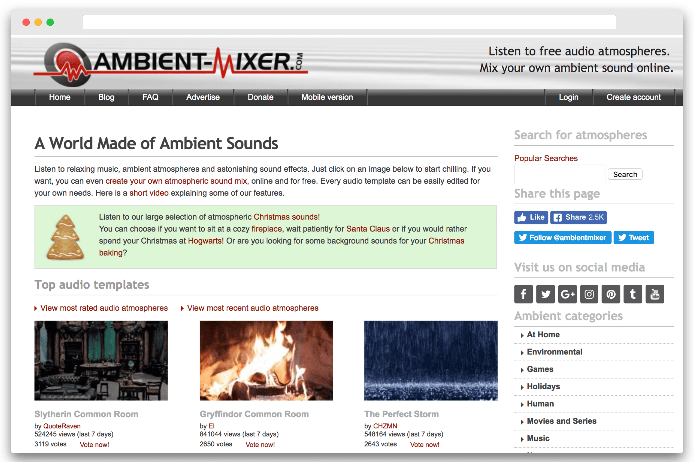
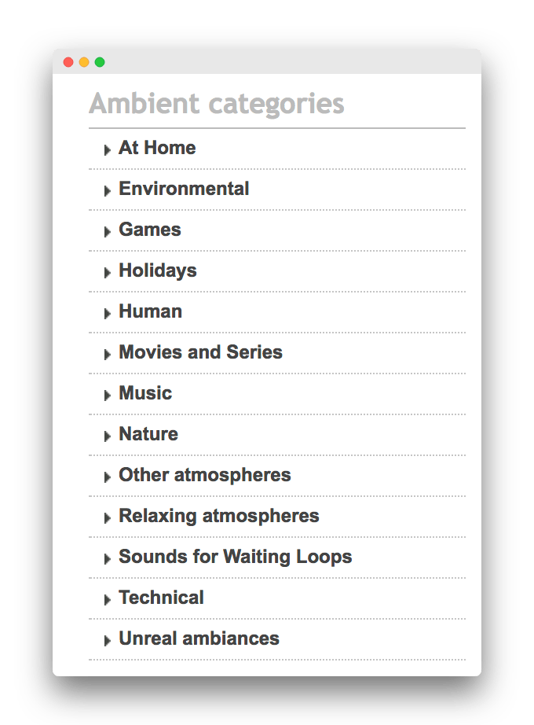
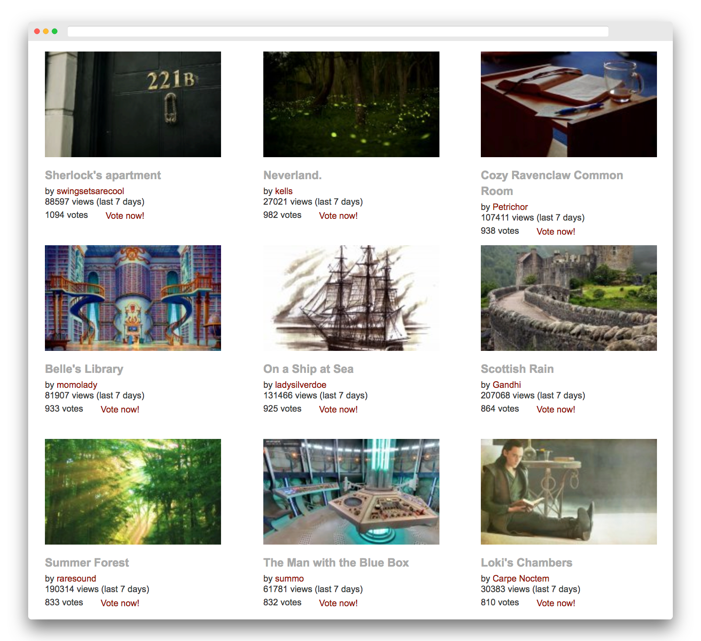
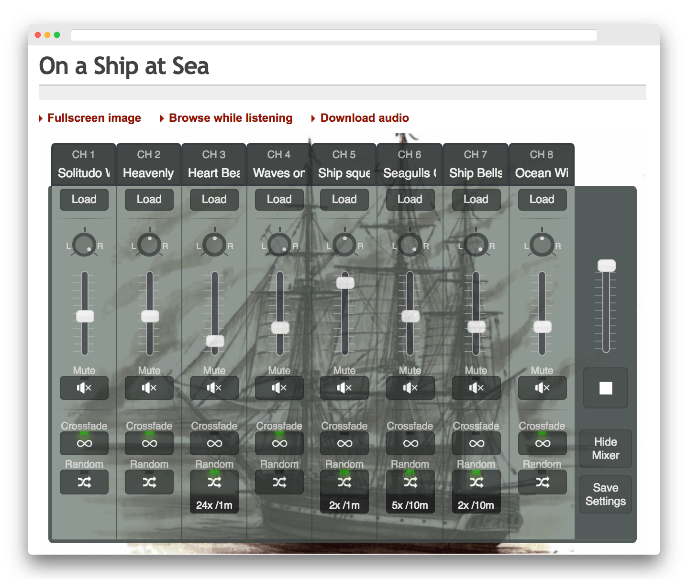

Je suis un vrai fan des applications qui permettent de créer une _ambiance sonore_. Elles sont très pratiques car elle permettent de se concentrer quand il y a trop de bruit autour de soi. Elles peuvent aussi aider à dormir. [J'ai déjà parlé de Noisli](https://tobal.fr/ameliorer-sa-concentration-avec-noisli/) la semaine dernière, qui est super pour se concentrer quand on bosse, ou pour créer.

Mais il y a quelque temps, j'ai découvert une application web géniale qui part du même principe, mais qui pousse la personnalisation beaucoup plus loin. Elle s'appelle [Ambient Mixer](https://www.ambient-mixer.com/). <!--more-->

Le but est le même : proposer des fonds sonores, à écouter de préférence au casque, que ce soit pour se concentrer, méditer ou simplement se détendre. Mais là où Ambient-Mixer se démarque des autres applications comme Noisli, c'est d'une part avec la manière dont les sons sont présentés et organisés, et d'une autre, avec l'incroyable possibilité de personnalisation possible.

Déjà, les sons ne sont pas justes "des sons" (comme le bruit du feu, du vent, d'un ruisseau...) mais plutôt des _ambiances_. Et le nom des ambiances est très évocateur : Salle commune de Griffondor (clin d'oeil aux fans de Harry Potter), Tempête parfaite, Au volant an Angleterre, Bar Fantasy Donjons et Dragons, Sur un navire à la mer... **Il y des centaines d'ambiance "toute prêtes"**.

\[caption id="" align="aligncenter" width="680"\] Les sons sont classés dans de nombreuses catégories très explicites.\[/caption\]

\[caption id="" align="aligncenter" width="1592"\] Les ambiances proposées sont superbes et souvent tirées d'univers de films, séries où jeux vidéos.\[/caption\]

Et quand on clique sur une ambiance, c'est là qu'on découvre le côté génial de ce site :

\[caption id="" align="aligncenter" width="1438"\] Ici l'ambiance Bateau en mer\[/caption\]

Chaque ambiance est en fait un ensemble de sons qui sont chacun paramétrables via une console de mixage. On peut régler le volume de chaque son, la spatialisation (côté gauche ou droit), et même des paramètres plus poussés comme la fréquence d'activation de certains sons.

Tu peux donc soit utiliser une ambiance toute faite, parmi les nombreuses proposées, soit créer ta propre ambiance en partant d'une ambiance existante en la personnalisant à ton goût. Évidemment c'est un peu moins plug'n'play qu'un [Noisli](https://tobal.fr/ameliorer-sa-concentration-avec-noisli/) ou que [focusmusic.fm](https://tobal.fr/une-application-web-pour-mieux-se-concentrer-et-etre-plus-productif/), où les sons s'activent en un clic. Mais si tu as le temps de passer 5 ou 10 minutes à customiser une ambiance comme tu le souhaites, tu peux obtenir des ambiances extrêmement personnalisées.

Et il n'y a pas que des "sons" d'ambiance, il y a aussi des musiques, des voix...

Du coup, Ambient-Mixer peut servir pour se concentrer au travail, mais pas que. Tu peux aussi créer une ambiance parfaite pour méditer, t'endormir, ou pour jouer à des jeux de société par exemple. Ou même créer des ambiances pour des enregistrements ou des podcasts.

Le site est totalement gratuit, mais tu peux leur faire un don, si le service te plait. Personnellement, j'ai tellement aimé le concept que je leur ai donné 10€. Ce n'est pas grand chose mais si ça peut les aider...

[Découvrir Ambient-Mixer](https://www.ambient-mixer.com/).
