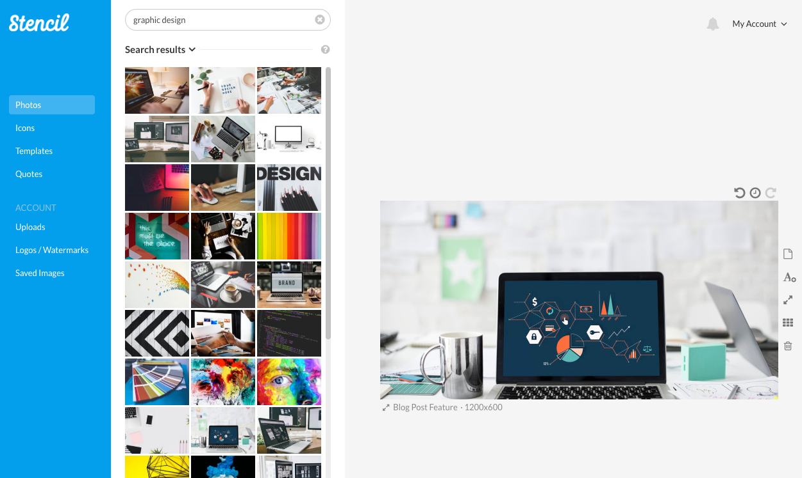
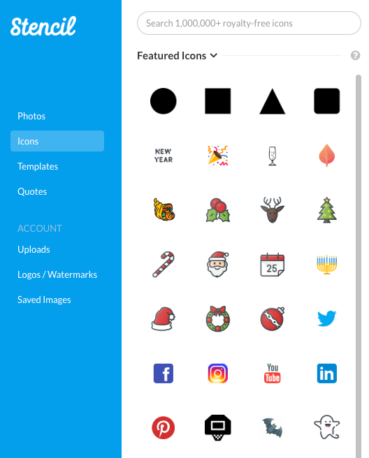
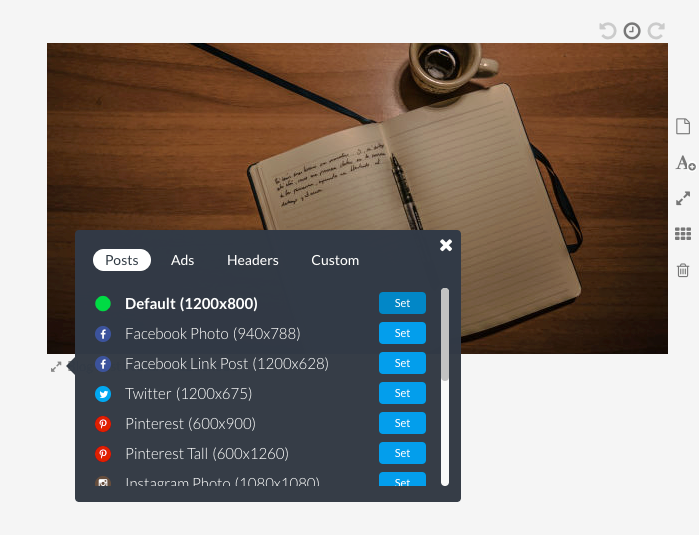
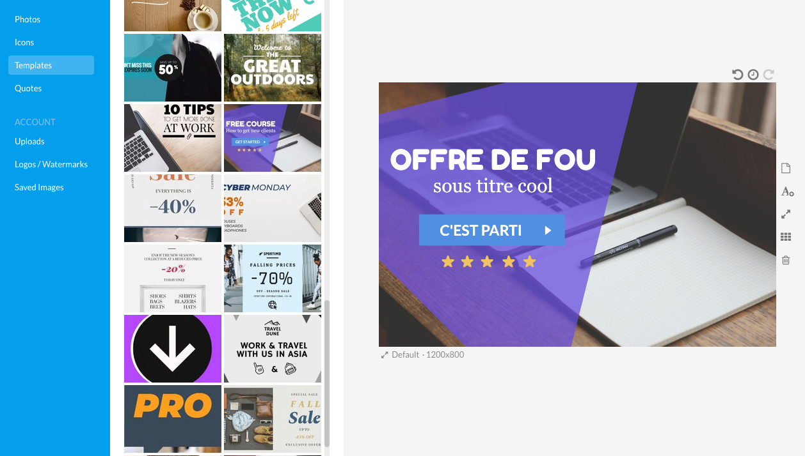
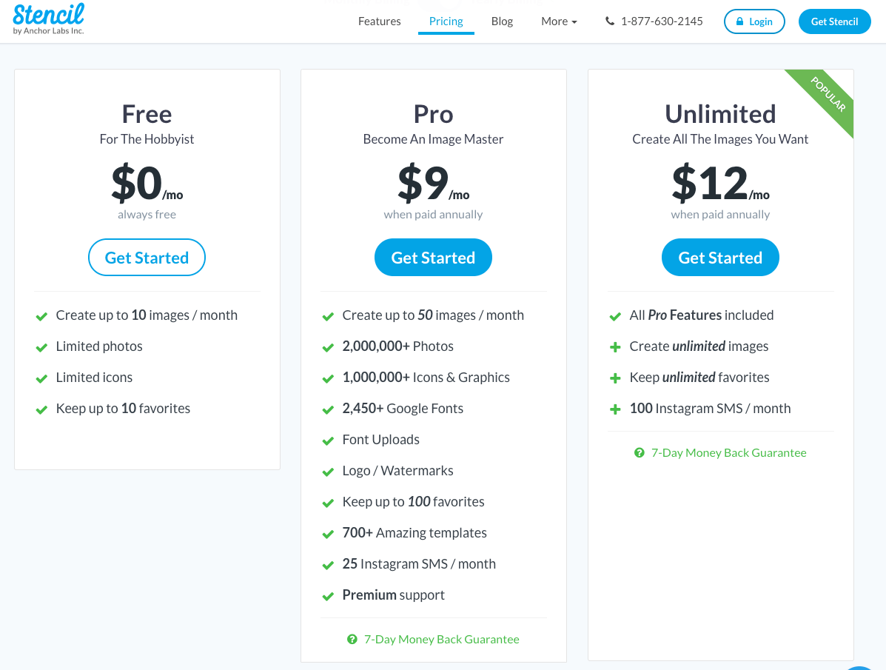

Photoshop c'est has been.

Bon, en fait, c'est un super logiciel, mais 1/ ça coûte plutôt cher et 2/ c'est un logiciel professionnel.<!--more-->

Si tu veux créer des images simples pour :

- illustrer une présentation,
- agrémenter un article de blog,
- faire de la publicité
- poster sur des réseaux sociaux.

Utiliser Photoshop pour ce genre de besoin c'est comme sortir un lance-flamme pour se débarrasser de moustiques, ou aller faire ses courses avec un camion : tu peux, mais y'a plus simple.

Je te présente [GetStencil](https://getstencil.com/).

GetStencil est une application web qui te permet de créer très facilement, et rapidement, des compositions graphiques de qualité.

C'est une application web, donc rien à installer, ça tourne dans ton navigateur.

La force de GetStencil c'est qu'il propose de base plus de _deux million_ d'images d'excellente qualité et surtout libres de droit. Plus besoin d'aller piquer des photos sur Google Images ou raquer sur les sites de photos stock (style Fotolia).

\[caption id="attachment\_3726" align="aligncenter" width="1251"\] Une tonne d'images libres de droits sont à disposition\[/caption\]

En plus des images, il y a aussi des milliers d'icônes, des templates tout prêts, et des effets simples à utiliser.

Il y a les principaux formats d'images utilisés sur le Web et les réseaux sociaux.

Et des tonnes de templates sympas et bien pratiques.

## Prix

GetStencil propose une offre gratuite qui permet d'accéder à toutes les fonctionnalités de base de l'application, avec les limites suivantes :

- créer jusqu'à 10 images par mois,
- accéder à une collection limitée de photos et d'icônes,
- garder jusqu'à 10 favoris,
- pas d'accès aux templates.

La version pro à $9 par mois donne accès à l'ensemble de la collection de photos et d'icônes (plus de 3 millions en tout), toutes les polices, permet d'accéder aux templates et d'uploader ses propres photos.

Une alternative est [Crello](https://crello.com/fr/) (et pas Trello hein) qui est moins limité dans les fonctionnalités de la version gratuite, mais qui fait payer chaque photo que tu veux utiliser. Sinon si tu veux supprimer l'arrière plan d'une image, tu peux tenter [Remove.bg](https://tobal.fr/supprimer-larriere-plan-dune-image-en-5-secondes-et-deux-clics/). Bref, à toi de voir selon ton besoin, perso je préfère l'interface de GetStencil et le côté "Netflix" des images à volonté.

[Découvrir GetStencil](https://getstencil.com/).
