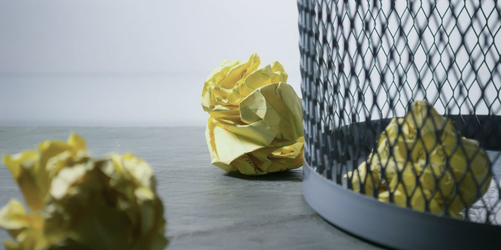
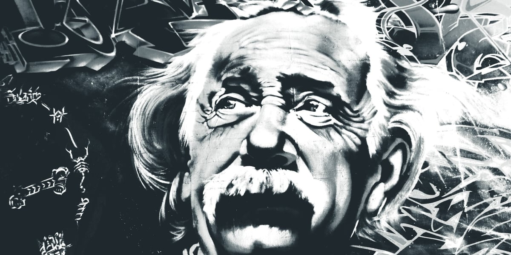

Il y a bien trop à dire sur le Yin et Yang pour tenir dans un article, tellement ce symbole aborde toutes sortes de questions et principes philosphiques. Mais dans l'essentiel, il s'agit de l'union des opposés. De _l'inévitabilité de la coexistence des contraires_. La vache, c'était une phrase de ouf.

Bref, l'univers est ainsi. Il y a le bien, le mal, le chaud, le froit, le rapide, le lent...

**Pour devenir plus créatif, tu peux appliquer aussi ce concept de Yin et Yang**. Je m'explique.<!--more-->

Quand il s'agit de créer des choses, il y a deux sortes d'approches, qui sont totalement opposées. Soit tu crée à fond les manettes, quitte à faire beaucoup de déchets. soit tu attends ou recherches l'éclair d'inspiration pour créer un chef d'oeuvre.

Mais une approche n'est pas meilleure que l'autre. Pour moi, **faire preuve de créativité, c'est plutôt faire tantôt appel à l'une, tantôt à l'autre**.

En utilisant en alternance ces deux approches, tu vas pouvoir débloquer une créativité dont tu n'avais même pas idée.

## Le Yin : quand la quantité engendre la qualité

En général, quantité ne rime pas avec qualité. _Sauf pour la créativité_.

Les plus gros chef d'oeuvres de l'histoire ne sont pas nés de soi-disant "éclairs d'inspiration" comme on nous fait souvent croire. Archimède dans sa baignoire, Newton qui se prend une pomme sur la tête, Einstein qui regarde une horloge.

Tout ça, ce sont juste de belles histoires. Les belles histoires sont plus jolies.

Mais la vérité, c'est que **toutes les grandes oeuvres qui ont été crées, e toutes les grandes découvertes, sont le fruit d'un nombre incroyable de répétition, d'échecs et de déchets**.

Pour composer un tube, il faut créer une centaine de chanson nulles. Pour réaliser un tableau de maître, il faut peindre des centaines de toiles médiocres. Pour écrire un best-seller, il faut écrire des dizaines et des dizaines d'histoires inintéressantes.

Quelques exemples :

- Thomas Edison a testé plus d'un milliers de concepts avant de trouver l'idée de l'ampoule.
- Si tu lis la biographie d'Einstein, tu t'aperçois qu'avant de publier ses papiers sur la relativité générale, il en a écrit tout un tas qui sont passé à la trappe.
- Picasso a peint des dizaines de tableaux totalement inconnus.

Quelle conclusion tirer de ça ? **Que pour créer de belle choses, il ne faut pas "attendre l'inspiration". C'est en forgeant qu'on devient forgeron**. Plus tu vas créer de choses, et plus tu va t'améliorer et finir par créer quelque chose de magnifique.

Donc, pour développer ta créativité, c'est simple : **il faut complètement arrêter de juger ton travail, et juste créer**. Peu importe ce que tu fais : dessiner, écrire, peindre, programmer, composer... Cesse de juger ton travail aussitôt que tu le produis. [Autorise-toi à faire des trucs nuls](https://tobal.fr/tu-veux-devenir-creatif-accepte-la-mediocrite/).

Ça va te débloquer, et tu finiras par créer de belles choses. Force-toi seulement à faire une chose : créer. Fais-le tous les jours, sans aucune attente ni jugement sur la qualité.

## Le Yang : l'inspiration vient d'elle même

L'autre versant de la créativité, c'est tout le contraire : ne pas se forcer. Laisser venir l'inspiration.

Mais vraiment, _la laisser venir_.

Le problème c'est que souvent on _cherche_ l'inspiration. C'est là toute l'ironie. **Plus on la cherche, moins elle vient**. Paradoxalement, l'[inspiration vient d'elle-même, quand on passe complètement à autre chose](https://tobal.fr/la-loi-du-moindre-effort/). Mais rester devant une page blanche, une toile vide, ça n'aide pas, au contraire.

N'as tu jamais eu une idée sous la douche ? Trouvé la solution à un problème alors que tu n'y réfléchissait même pas ?

Par exemple, lorsque je faisais du développement en freelance, souvent je bloquais sur un bug. Il pouvait m'arriver de chercher et réfléchir pendant des heures sans trouver une solution. Et plus je forçais, moins j'y arrivais.

Au bout d'un moment, je finissais par abandonner. J'allais faire autre chose, ou j'allais dormir. Et _à chaque fois_, le lendemain, la solution apparaissait "toute seule". Je résolvais en 5 minutes le problème sur lequel je me prenait la tête pendant des heures la veille.

Einstein aurait dit :

> Un problème ne peut pas être solutionné sur le même plan de réflexion qui l'a crée.

Pour moi c'est exactement ça. Quand on se triture le cerveau sur un problème, on est justement en mode "problème" et pas solution. Quand on arrête d'y réfléchir, c'est comme si le cerveau passait sur un "plan" supérieur, que notre subconscient analysait le problème différement. Et tout ça nous permet de trouver la solution facilement.

Donc, quand tu butes sur un problème qui te semble impossible à résoudre, ou que tu es bloqué et qu'il te semble impossible de créer, au lieu de te prendre la tête dessus, **passe à autre chose**.

Fais une autre activité, pense à d'autre trucs. Oublie complètement le problème. C'est ce qui va permettre à ton subconscient de continuer à analyser le problème et y trouver solution. Et c'est là que l'inspiration apparait comme par magie.
