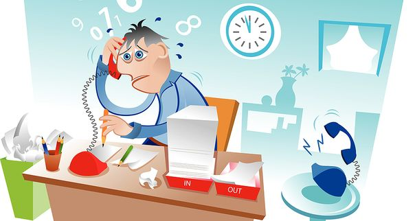

_Cet article est le troisième d’une série de 5 articles. Retrouvez les liens vers les autres articles à la fin de celui-ci_.

Une bonne gestion du temps, c’est avant tout une **bonne gestion de son attention**.

Pour optimiser son temps, au-delà des conseils que je vous ai donné jusqu’ici, **il est indispensable de savoir gérer correctement son attention**.

Quand je parle d’attention, je parle de concentration, de la capacité à se plonger dans chaque tâche de notre to-do list sans constamment alterner entre différentes choses. Ce qui, à notre époque, est quelque chose de plus en plus dur !<!--more-->

Combien de fois consultez-vous votre boite mail au travail ? Combien de fois allez-vous sur Facebook, Twitter, Youtube ou bien lisez et envoyez des textos dans la journée pendant que vous travaillez ? C’est devenu tellement automatique qu’on n’y fait même plus attention.

Faites le test: prenez une feuille blanche et faites un trait chaque fois que vous consultez votre téléphone, allez sur YouTube ou consulter Facebook pendant votre journée de travail. Vous risquez d’être très surpris par le nombre de petits traits à la fin de la journée.

C’est une des principales raisons qui fait que le temps parait nous échapper constamment. Cela a été dit de nombreuses fois: le multi-tâche n’existe pas. **Et c’est précisément le fait de ne pas se focaliser entièrement à chaque tâche que nous réalisons, d’avoir l’esprit ailleurs pendant que nous faisons une chose, qui provoque cet effet de temps qui file comme du sable fin entre les doigts de la main**.

Comme le dit Antony Priou dans un son article [Mieux que la gestion du temps: la gestion de l’attention](http://antonypriou.fr/mieux-que-la-gestion-du-temps-la-gestion-de-lattention/)

> Ce qui importe ce n’est pas tant la durée que nous consacrons à nos actions que l’attention que nous portons au moment où nous les accomplissons. Autrement dit, mieux vaut passer un quart d’heure dans une vraie écoute de son interlocuteur qu’une heure avec l’esprit qui virevolte.

Après avoir classé nos tâches par priorité, nous devons nous discipliner et faire preuve de rigueur dans la gestion de notre attention: ne pas se laisser distraire avant ni pendant l’exécution des tâches importantes.

Pour certains, se concentrer à une tâche en particulier est facile, pour d’autres moins. Pourtant, même ceux pour qui c’est facile ne le font pas forcément, car ils n’y pensent même pas; ils adoptent un comportement d’inattention sans y réfléchir, en réponse au sollicitations extérieures. Quel que soit votre cas, vous pouvez reprendre le contrôle, en appliquant les conseils qui suivent.

### Dites bye-bye au multi-tâche

Dans une société où l’on est toujours de plus en plus connectés et sollicités, on entend encore trop souvent l’apologie du multi-tâche. Certaines personnes se targuent d’être multi-tâche, d’être capable de gérer simultanément plusieurs activités. On le voit même apparaitre dans les CVs, dans la rubrique “compétences”.

Qu’on se le dise tout de suite: le multi-tâche n’existe pas. Si vous pensez être multi-tâche, désolé, mais vous êtes en réalité “mono-tâche qui alterne rapidement entre plusieurs tâches”.

**C’est ainsi: le cerveau est fait pour se concentrer et bien faire une seule chose à la fois. Et dès qu’on le soumet à plusieurs activités simultanées, les performances dégringolent**.

Si vous souhaitez donc vous entrainer et maitriser votre capacité d’attention, efforcez-vous au quotidien à réaliser des tâches “monocentrées”, c’est à dire où ne vous ne faites rien d’autre que ce que vous avez décidé de faire. Vous travaillez ? Bien, fermez TOUS les onglets de navigateurs qui n’ont rien à voir avec le travail (ce qui veut souvent dire _tous_ les onglets sans exception). Mettez votre téléphone en mode avion et fermez votre boite email. Vous déjeuner seul ? Alors mangez sans consulter votre téléphone ou lire le journal et apprenez à appréciez votre repas, sans rien faire d’autre.

Faites une petite rétrospective de votre journée d’hier (ou d’aujourd’hui si vous lisez cet article en fin de journée) et comptez le nombre de fois où vous avez fait une seule chose à la fois ?

Pourquoi bon nombre d’entre nous trouvent que faire la vaisselle, repasser, ou toute activité manuelle simple est relaxant, outre le fait qu’il s’agisse d’une corvée ? **C’est parce que ces tâches sont toujours exécutées avec toute notre attention, sans rien faire d’autre**.

C’est lorsque nous somme concentrés sur notre tâche en cours, sans être distrait, que nous sommes non seulement le plus efficace mais aussi que nous apprécions le plus ce que nous sommes en train de faire.

### Limitez le temps passé sur une tâche

Notre capacité de concentration, aussi bonne qu’elle soit, est limitée dans le temps. **Plus vous passez du temps à une activité, plus votre capacité à vous concentrer décroit**, c’est humain. C’est pour cela que le meilleur moyen de rester activement concentré sur une tâche, c’est de limiter le temps passé dessus. C’est un autre avantage, en plus des nombreux cités plus haut.

Pour rester efficace et concentré, je vous parlais de la technique Pomodoro. Bien sûr, tout dépend des capacités et habitudes de chacun, mais personnellement, j’ai trouvé que 25 minutes était un très bon intervalle de temps dans lequel j’étais pleinement concentré. Après ce laps de temps, mon attention décroît et j’ai besoin de la recharger en faisant une courte pause. Pour certains, ça peut être plus, 45 minutes, une heure, mais dans tous les cas, **faites une petite pause** après votre “rush” de concentration. Juste 5 ou 10 minutes, ça suffit. Mais le fait de s’arrêter un moment permet de recharger complètement votre attention et d’être concentré pour la prochaine tâche (ou pour continuer la précédente).

Apprenez donc à faire des pauses toutes les 25 ou 45 minutes, plutôt que d’avoir le nez plongé obstinément dans votre activité pendant des heures non-stop. Vous verrez: à la fin de la journée, non seulement vous vous sentirez moins lessivé, mais vous en aurez accompli beaucoup plus !

### Utilisez et agencez votre environnement à votre avantage

Un aspect souvent négligé lorsqu’il est question de productivité est **notre environnement**. Et quand je parle d’environnement, je parle à la fois d’environnement matériel, mais aussi des personnes qui sont autour de vous.

> Plus qu’un simple détail, l’environnement dans lequel vous évoluez est **crucial** et affecte directement votre capacité à vous concentrer, et donc votre productivité.

Travaillez-vous en bureau ou à domicile ? Si c’est au bureau, avez-vous votre propre bureau ou êtes-vous en open-space ? Comment est-il agencé ? Comment sont vos collègues ?

Et si vous travaillez à la maison, comment le faites-vous ? Avez-vous une pièce dédiée au travail ? Utilisez-vous le même ordinateur pour travailler que pour vous détendre ?

Oui je sais, ça fait beaucoup de questions. Mais c’est pour illustrer le fait que votre environnement de travail est constitué de nombreuses composantes qui influent directement sur votre capacité à travailler et vous concentrer.

**Pour favoriser votre attention et pouvoir bien vous concentrer, il est indispensable d’être dans un endroit exempt de toute source de distraction**. Si vous travaillez en entreprise, et que vous avez votre propre bureau, tant mieux. Sinon, il faut que vous créiez votre espace de calme, par exemple en mettant des écouteurs (avec de la musique ou non, c’est juste pour qu’on ne vienne pas vous déranger).

Si vous travaillez à la maison, l’idéal est d’avoir une pièce “bureau”, dédiée entièrement au travail. Si ce n’est pas le cas ou que pour une raison quelconque ce n’est pas possible, réservez un coin du salon et déclarez-le officiellement comme votre coin travail.

L’idée est vraiment d’avoir un endroit privilégié pour travailler et **ne rien faire d’autre**. Les loisirs, la consultation d’emails, le chat, le téléphone, les discussions… tout cela doit se faire ailleurs.

Ainsi, en ayant un coin “officiel” pour travailler, vous bénéficiez de deux avantages.

Premièrement, cela vous permet d’avoir une “séparation des affaires”, c’est à dire que vous ne mélangez pas distractions et boulot. Cela permet à votre cerveau d’être beaucoup plus clair, concentré et efficace que si vous faisiez tout au même endroit.

Deuxièmement, c’est _votre_ zone. Les gens (vos collègues si vous êtes en entreprise, votre épouse, vos enfants ou vos colocataires si vous travaillez à domicile) sauront qu’ils ne doivent pas venir vous déranger quand vous êtes à votre poste.

Vous pouvez aller encore plus loin dans le concept, si vous disposez de plusieurs machines, comme un ordinateur fixe et un portable, ou un ordinateur portable et une tablette, en dédiant une machine à une utilisation précise. Par exemple, votre ordinateur portable ne servira qu’au travail et rien d’autre. Pas d’email, pas de jeux, de YouTube et Facebook. Toutes ces choses, vous les ferez uniquement sur la tablette.

J’applique moi-même ce principe et j’adore. Je trouve cela super efficace car cela me permet d’être totalement focalisé sur la tâche en cours. Ça devient un réflexe: dès que je me mets sur mon ordinateur portable, je sais que je suis en mode boulot. Quand je retourne sur la tablette, je suis en mode détente.

L’idée sous-jacente est toujours la même: **être hyper concentré sur chaque chose que l’on fait, et ne pas se laisser distraire, ni essayer de faire plusieurs choses à la fois**.

[Article 1/5: Les bases de la gestion du temps](https://www.smartrock.fr/blog/devenez-un-pro-de-la-gestion-du-temps-et-triplez-votre-productivite/) [Article 2/5: Gérez votre temps efficacement](https://www.smartrock.fr/blog/devenez-un-pro-de-la-gestion-du-temps-gerez-votre-temps-efficacement/) [Article 4/5: Gérez votre énergie](https://www.smartrock.fr/blog/devenez-un-pro-de-la-gestion-du-temps-gerer-son-energie/) [Article 5/5: Les meilleurs applications pour gérer son temps](https://www.smartrock.fr/blog/devenez-un-pro-de-la-gestion-du-temps-les-meilleures-applications/)
