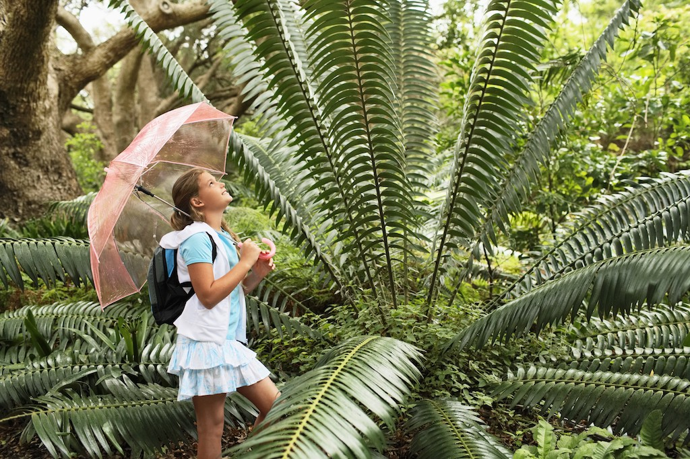
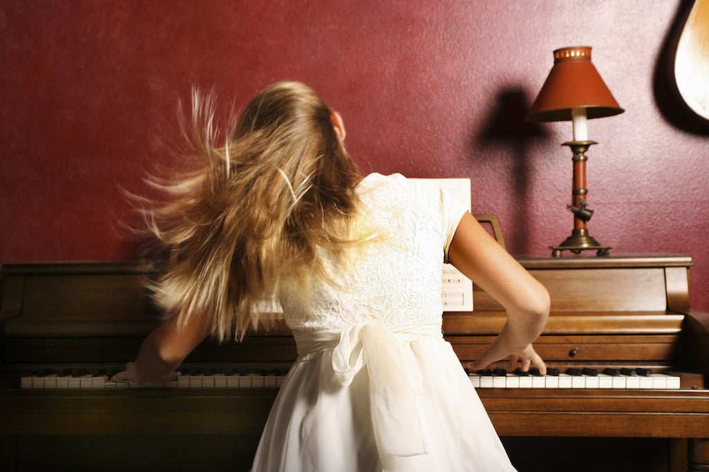

Traverser un passage à vide sentir que tout nous échappe, qu'on a plus le contrôle de notre vie, ça arrive à _tout le monde_. Tu n'arrive plus à te motiver ou à te discipliner. Tu as du mal à persévérer dans tes projets. C'est tout à fait normal.

Il n'y a pas que des hauts, il y aura toujours des bas. La vie n'est pas un conte de fées.<!--more-->

**Il y a quelques temps, je suis passé par une de ces phases "creuses"**. Ma motivation et mon énergie ont atteint un niveau très bas. Comme si ce que je faisais n'avait plus de sens ou d'intérêt. Sans aller jusqu'à la dépression, c'était une sorte de mini-burnout. Je voulais plus rien faire.

Pourtant, un mois après ce passage à vide, j'ai retrouvé, _petit à petit_, ma motivation et ma détermination. Comment j'ai fait ?

**Je suis redevenu un enfant.**

## Redeviens un enfant

Tu veux retrouver la flamme, l'énergie, la motivation ? Redeviens un enfant.

**Approche toute chose avec curiosité et enthousiasme**.

Tu connais ce dicton "Vis ta vie comme si chaque jour était le dernier" ? Je te propose l'inverse : et si tu vivais ta vie comme si **chaque jour était le premier** ?

Quand on devient adulte, y'a un truc bizarre qui se passe. Tout d'un coup, on a tout vu et tout vécu. On est blasé. On a souvent un regard plus pessimiste, en prétendant être _réaliste_, sur le monde qui nous entoure. On perd une forme d'innocence pourtant si importante.

Hors, il n'y a rien de pire que d'être blasé de tout, et de ne s'étonner de rien. Le cynisme, la complaisance dans le sûr et le connu, et cette perte du sens de la découverte, c'est du poison. Qui t'empêche d'atteindre le bonheur, l'accomplissement et donc de trouver la motivation.

Tu es au courant du nombre de gens qui sont à la recherche de leur [passion](https://tobal.fr/comment-trouver-sa-passion/) ? Peut-être même toi tu recherches quelle est ta vraie passion. Pourtant, souviens-toi lorsque tu étais petit et que tu découvrais les choses. Quand on est enfant, on n'essaye pas de définir quel est sa passion à l'avance. On découvre un truc, et on expérimente. **C'est comme ça que nait réellement la passion : pas avec le raisonnemment, mais avec l'expérimentation, la pratique et le temps.**

## Supprime les barrières d'entrée

Quand on devient adulte, c'est après avoir été formaté à systématiquement devoir "produire" une certaine quantité et une certaine qualité de travail. Ce qui est normal, vu que c'est notre travail et qu'on le fait tous les jours.

Le problème c'est qu'on applique cette logique même aux choses qu'on vient juste de découvrir. Sur le plan créatif, c'est un des principaux facteurs de démotivation. Dès qu'on fait quelque chose, [on se dit tout de suite qu'il faut en faire un minimum](https://tobal.fr/tu-veux-devenir-creatif-accepte-la-mediocrite/), qu'il faut "bien faire".. Ce besoin de bien faire, au lieu d'être motivant, devient une barrière d'entrée. Et c'est justement cette barrière d'entrée qui nous sape mentalement.

> "J'aimerai bien danser/dessiner/écrire/peindre/sculpter/jouer mais je suis nul".

Oui tu es nul, sauf que c'est pas grave ! Qui a dit que tu devais être génial à tout ce que tu fais dès le départ ?

Au lieu de cela, ignore cette nécessité de produire un résultat minimum. Cela rejoint ma [règle des dix minutes](https://tobal.fr/blog/la-cle-cest-de-sy-mettre/), que j'ai même d'ailleurs transformé en règle des _deux minutes_.

Quand un enfant découvre une activité, tu crois qu'il se dit "Hmm, je dois être excellent, sinon c'est pas la peine" ? Bien sûr que non !

Il n'a pas d'attente particulière, sauf celle de s'amuser. Alors pourquoi, quand on devient adulte, il ne s'agit plus d'amusement mais uniquement de performance et de résultat ?

Lorsque tu te mets à la tâche, peu importe ce qu'elle est (professionnelle, sportive, hobby personnel...), **sois enthousiaste dans ta démarche**. **Approche la chose avec engouement et excitation, sans t'imposer des obligations de résultat ou de performance**.

## Laisse la tâche t'absorber

**Oublie le reste du monde, laisse ce que tu fais t'_absorber_**.

Être absorbé, c'est quand t'es tellement intéressé et focalisé sur quelque chose que tu ne vois pas le temps passer.

C'est exactement l'inverse de quand tu fais quelque chose de pénible, comme dans la salle d'attente chez le dentiste ou que tu fais du jogging (et que tu n'aimes pas ça). Tu sais, quand tu regarde l'heure, 10h05, tu attends au moins 30 minutes, tu re-regardes, 10h12.

À l'inverse, dans un état d'absorption, les heures passent comme des minutes. C'est dans ces moment où tu es le plus heureux : rien ne vient troubler ton esprit. **Tu ne penses ni au passé avec son lot de regrets, ni au futur avec son lot d'inquiétudes**. Tu es complètement focalisé sur ce que tu es en train de faire. Ton cerveau est totalement absorbé par la tâche.

**Et être heureux, c'est ça: apprécier la vie en vivant pleinement le [moment présent](https://tobal.fr/recommandation-de-livre-le-pouvoir-du-moment-present-par-eckhart-tolle/).**

C'est ce que font les enfants naturellement. Oui, bon ok, ils n'ont pas beaucoup de passé a ressasser, mais ils ne soucient pas non plus constamment de l'avenir, ni de ce que les gens pensent d'eux ou de leur travail. Lorsqu'ils sont absorbés par ce qu'ils font, il n'y a plus rien d'autre qui compte.

Et si tu demande aux grands artistes, ou aux athlètes de haut niveau, ils te diront que c'est exactement la même chose pour eux. Lorsqu'ils exercent leur art ou leur sport, il n'y a plus rien d'autre qui compte dans l'univers.

> "Oui, mais dans la vie on ne peut pas faire ce qu'on veut, parfois on est obligé de faire des trucs qui ne nous plaisent pas".

C'est discutable, mais parfois ça peut arriver qu'on ne puisse pas faire ce qu'on veut. **En revanche, tu as toujours la possibilité de choisir une manière de voir et d'aborder les choses qui nous permette d'y trouver un intérêt**.

Par exemple, j'aime faire la vaisselle. Mais quand je la fais, j'ai le choix : je peux me sentir frustré en me disant que je perds mon temps. Ou bien je peux me dire à la place que c'est une activité relaxante, et que je me rends service en rangeant et en nettoyant la vaisselle pour pouvoir en profiter au prochain repas.

Je pense que pour être le meilleur de soi-même, il faut savoir faire coexister l'enfant qu'on a été avec l'adulte qu'on est devenu.

**La vie, et la façon dont on l'apprécie, c'est simplement une question de point de vue**. Adopte de temps en temps celui d'un enfant. Ça te fera un grand bien.
