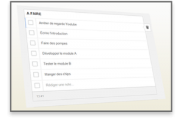

## Les symptômes

Il est 10h du matin. Vous vous êtes réveillé il y a à peine plus d‘une heure, vous avez pris juste un café comme petit déjeuner. Vous devez vous mettre au travail. Vous devez attaquer le projet qui vous tient tant à cœur et auquel vous n’arrêtiez pas de penser hier soir. Celui que vous étiez si impatient de commencer.

Mais aujourd‘hui, maintenant, à cet instant précis… non. Vous n’en avez pas envie. Vous avez la “flemme”, comme on dit. Toute votre motivation de la veille a disparu, engloutie dans les tréfonds de la léthargie du matin. Vous n'avez pas envie de bosser. Plutôt aller sur Youtube, ou faire un tour sur Facebook.

C‘est comme ça le matin. Et puis l’après-midi, on vient de manger, on est en phase digestive, pas possible de s‘y mettre non plus. Et le soir c’est pareil.

Et lorsque vient le moment de se coucher, toute la motivation qui avait disparu vous revient subitement. Vous vous dites que c‘est vraiment un super projet, important, et qu’il faut vous y mettre. Vous vous y mettrez demain.

Mais aujourd‘hui vous n’avez rien fait.

Cela vous rappelle quelque chose ? Pour être honnête, moi oui. J‘ai peut-être un petit peu exagéré, mais personnellement c’est quelque chose qui m'est arrivé _très souvent_.

## Le traitement

Alors, quelle est la solution ? Comment sortir de ce cercle vicieux, de cette spirale de la procrastination qui vous absorbe doucement mais surement ? En d'autres termes, **comment devenir productif** ?

Je vais vous donner une technique, où plutôt une combinaison de techniques, qui peut vous permettre changer le cercle vicieux en cercle vertueux. J'appelle cette solution le “principe du petit effort”.

### Le principe du petit effort

Pour commencer, il faut appliquer le tout premier conseil que j'ai donné sur ce blog: [il faut s'y mettre](https://www.smartrock.fr/blog/la-cle-cest-de-sy-mettre/). C'est vraiment le plus important. Si vous ne montez pas dans le bateau, pas de croisière. Si vous ne démarrez pas la voiture, pas de voyage. **Il faut vous y mettre !**

Même 10 minutes seulement. L‘important est de ne pas se sentir obligé d’en faire plus. Soyez indulgent avec vous-même et forcez-vous seulement 10 minutes. Je me sers de cette technique psychologique presque tout le temps, et ça fonctionne à chaque fois.

Ensuite, il faut appliquer une deuxième technique. Souvent, pendant ces 10 minutes, vous vous retrouvez seulement à réfléchir à ce que vous pouvez faire, par quoi commencer. En général, quelle que soit la tâche ou le projet, cela prend plus de 10 minutes. **Découpez votre projet en tâches, et re-divisez ces tâches en sous-tâches**. Créez vous une “TO DO list”. L'astuce au final est de tout diviser en petites tâches, qui seront beaucoup plus faciles à appréhender une par une au fur et à mesure.

N‘hésitez pas à vous servir d’outils comme [Trello](https://trello.com/), [Any.do](http://www.any.do/), ou encore [Google Keep](https://keep.google.com/). Ce sont des très bons outils (la plupart en anglais) pour gérer ses listes de tâches. Si vous êtes plus crayon et papier, armez vous d'une feuilles blanche et écrivez la liste des choses à faire, et barrez chaque tâche réalisée.

N‘oubliez pas, l’important est de bien subdiviser les tâches en plus petites, et faire une tâche à la fois.

## Le résultat

Si vous combinez et appliquez ces deux techniques, vous vous rendrez compte d‘une chose: quelque soit le projet, il vous apparaîtra au final pas si dur ou si long. Le principal facteur qui nous incite (consciemment ou non) à repousser les choses et à procrastiner, c’est la sensation de difficulté et de longueur de la tâche à laquelle nous faisons face.

Le simple fait de se donner une limite de temps, et de diviser son projet en une liste de petites tâches facilement abordables change réellement la donne. Une fois que vous avez défini vos petites tâches, occupez-vous d'elles une par une. Donnez vous des “blocs” de temps de 10 minutes, 30 minutes, 1 heure. Pas besoin de plus.

Et vous verrez qu'au final, à coup de “blocs de temps”, vous réaliserez vos projets beaucoup plus vite que vous ne le pensiez, et sans même vous en rendre compte vous serez devenus réellement “productifs”.

Alors essayez, et dites moi: pour vous, est-ce que ça a marché ? Si vous avez des remarques ou des suggestions pour améliorer encore cette approche, n‘hésitez pas à m’en faire part dans les commentaires.

_Illustration principale, photo "Checklist" par SmartRock. Photo "Yawning Cat"" par Dan._
