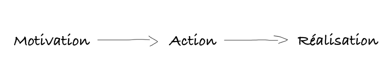
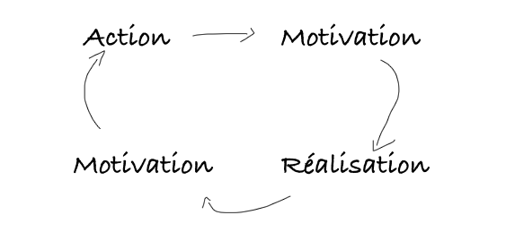

Le concept le plus surestimé du 21ème siècle ? **La motivation**.

Développement personnel, productivité, coaching de vie, succès, carrière, argent... tout semble fondé sur la motivation. Probablement parce que ça fait vendre. Fais n'importe quel recherche avec le terme "motivation" dans Google et tu tomberas sur d'inombrables articles, vidéos et podcast t'expliquant "comment trouver la motivation".

D'ailleurs, tu risques peut-être de tomber sur de vieux articles à moi. Que veux-tu, on fais tous des erreurs.

Ce que je veux dire par là, **c'est le concept même de se dire "Il faut que je me motive", c'est totalement biaisé dès le départ**.<!--more-->

## Le problème avec la motivation

Penses-y un instant. Qu'est ce que la motivation ? C'est le désir accompagné de l'énergie nécessaire de réaliser un acte. N'importe lequel : étudier, faire du sport, aller chercher du boulot, créer. aider, faire à manger, sortir les poubelles, chercher des clients, passer l'aspirateur...

Tout commence avec une décision : le faire, ou pas. Mais chercher la motivation de faire quelque chose, c'est ajouter une étape supplémentaire, non seulement inutile mais qui en plus détourne l'attention vers un questionnement fallacieux.

Oui, _fallacieux_. Illusoire. **Chercher la motivation, c'est se voiler la face. C'est se mentir à soi-même. C'est une forme de [procrastination](https://tobal.fr/3-techniques-pour-arreter-de-procrastiner/)**. Si tu cherches la motivation de faire quelque chose, c'est tout simplement que tu n'as pas vraiment envie de faire cette chose. _Parce que le gain apporté par la réalisation de cette chose n'a pas assez de valeur à tes yeux_.

Si tu as la flemme d'aller courir une heure, mais que d'un coup je te dis que je donne un million d'euros, tu pense que tu vas le faire ?

L'influence peut-être aussi négative. Si tu te fais courser par un pitbull, je te garantis que tu vas courir très vite et très longtemps. D'ailleurs, les influences négatives sont parfois les meilleures, car les être humains ont une très forte aversion des expériences négatives (perte ou danger).

**Le souci c'est que, la plupart du temps, tu n'as pas moyen d'influencer la valeur du gain obtenu, et c'est pour ca que tu "cherches la motivation"**.

Prend quelqu'un qui essaye, sans succès, d'arrêter de fumer. La motivation n'est pas assez forte : le danger que représente la cigarette pour sa santé n'est pas concret à court terme. Si demain un médecin lui disait "Continuez de fumer et vous mourrez dans 3 semaines", tu crois que cette personne "chercherai" la motivation pour arrêter ?

C'est aussi pour ça que c'est dur de se motiver à faire du sport. **Parce qu'on fait une fixation sur les résultat** (les abdos, les muscles, la taille de guêpe) **mais comme ceux-ci n'arrivent jamais rapidement, on manque de motivation**. Si on pouvait avoir la tablette de chocolat en une semaine, personne n'aurait la flemme d'aller à la salle de sport.

## L'action au lieu de la motivation

C'est cette fixation sur le résultat, malheureusement omniprésente dans notre cerveau (car notre survie en dépendait), qui crée ce problème de motivation.

La solution ? **Tourne-toi vers l'action**.

L'action, c'est dix fois mieux et plus efficace que la motivation.

Tu peux passer des journées entières à chercher la motivation ou l'inspiration. [L'action, tu peux la faire tout de suite](https://tobal.fr/envie-de-faire-quelque-chose-fais-le-maintenant-just-do-it/).

> "Mais justement, pour passer à l'action il faut la motivation !"

Bordel, t'as rien compris. Justement non. Oublie cette notion de motivation. Ne la recherche pas. Oublie les mots "inspiration" et "motivation" et passe plutôt à l'action.

**Rappelle-toi simplement que tu n'es pas obligé de tout faire d'un coup ou de faire de grandes choses immédiatement**.

Tu veux te motiver à aller faire du sport ? Sors juste dehors et marche 2 minutes. Tu a des dizaines de dossiers à traiter au boulot ? Commence par en faire un seul. Et le plus facile.

**Ensuite arrête de réfléchir**. C'est bien la différence. Quand il y a réflexion, il n'y pas d'action. Et vice-versa. Passe à l'action, fais n'importe quoi mais ne reste pas sur place à cogiter. Il faut juste bouger, au sens propre du terme. Lève-toi, va marcher, sors dehors. N'importe quoi tant que tu bouges physiquement.

Le moindre mouvement est utile. Même bouger tes doigts pour écrire un email fait effet.

## La magie du momentum

Le momentum, c'est l'énergie crée par un objet en mouvement. Ça veut dire que si tu te mets en mouvement, tu vas créer de l'énergie, et en retour cette énergie va t'animer pour continuer et faire encore plus d'efforts.

Et c'est là toute la "magie" : **ce n'est pas la motivation qui crée l'action, c'est l'action qui crée la motivation**.

On a le réflexe de se dire que les choses vont ainsi :

Alors qu'en réalité c'est plutôt comme ceci :

Voilà pourquoi ça marche beaucoup mieux de se mettre d'abord en action, plutôt que de chercher la motivation.

Donc la prochaine fois que tu te retrouves à te dire "J'ai la flemme, il faut que je me motive", souviens-toi: **il ne faut pas que tu te motives, il faut que tu te bouges**. C'est en [passant à l'action](https://tobal.fr/le-principe-de-la-premiere-action/) que la motivation viendra, et pas l'inverse.
