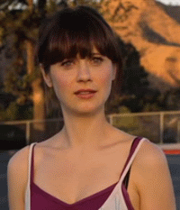

Tout le monde connait le proverbe :

> Il n'y a que la vérité qui blesse.

Mais ce n'est pas seulement la vérité qui blesse. Ce qui peut nous atteindre parfois, et nous piquer à vif, n'est pas forcément la vérité, **mais le plus souvent une insécurité à propos d'un sujet** .<!--more-->

## Quand il n'y a aucun doute, l'esprit est serein

Avoir une insécurité à propos de quelque chose, c'est quand tu n'es pas parfaitement sûr à propos de cette chose. Ça peut-être une situation ou un trait de caractère.

**Plus tu doutes de toi, plus tu es susceptible**. Comment réagis-tu si tu croises un enfant dans la rue, et qu'il te traite de trouillard, ou de clochard ? J'imagine que tu ne prêtes pas attention, ou tu es juste surpris. Peut-être tu pousses juste un petit soupir, puis continues ta journée comme si de rien n'était. Tu n'es ni un trouillard ni un clochard, donc ça ne t'affecte pas le moindre du monde.

En revanche, si [un supérieur, ou des collègues, se mettent à te traiter d'incapable, quelle serait ta réaction](https://tobal.fr/tu-es-la-moyenne-des-5-personnes-avec-qui-tu-passes-le-plus-de-temps/) ? Tu te mets sur la défensive ou bien tu ignores complètement ce qu'on te dit ?

**Ta réaction va dépendre de ton niveau d'insécurité par rapport aux affirmations qui te sont adressées**.

## Pas forcément la vérité, mais une insécurité

Il n'y a pas que la vérité qui blesse, les choses dont on doute peuvent aussi nous faire réagir bêtement.

Je suis plutôt grand en taille. Si quelqu'un vient me traiter de nabot, je ne vais même pas lever un sourcil. Probablement que je vais même en rire. Si on dit ça à quelqu'un de relativement petit, il y a plus de chances qu'il le prenne mal.

Mais si on le dit à une personne de taille moyenne, c'est là que ça devient intéressant. Tout dépend de comment cette personne se définit, et si elle accorde une beaucoup d'importance à la taille, ou si elle s'en fiche.

"Nabot" n'est pas une vérité définissant cette personne, mais c'est **le niveau d'insécurité par rapport à sa taille qui va dicter la réaction de cette personne**. Si elle est parfaitement à l'aise avec sa taille et son physique, ça ne l'affectera pas. Dans le cas contraire, elle va sûrement se vexer.

En gros, si tu as un doute, tu es vulnérable. Ce qu'on te dit n'est peut-être pas réellement fondé, mais tant que tu ne seras pas convaincu du contraire, ton orgueil peut être blessé.

## Ça peut aussi être une vérité que tu refuses de voir

Parfois, une remarque ou une critique suscite notre colère parce que, même si c'est faux, on doute. Mais d'autres fois, **c'est une réalité qu'on refuse de voir**.

Le cerveau humain est très doué pour cacher ces petites vérités qui nous mettent mal à l'aise.

Ce n'est pas la réaction la plus facile à avoir quand on essuie une critique, mais c'est la plus efficace pour progresser : il faut étudier la critique et voir si elle est constructive. Si c'est le cas, ça mérite de se pencher dessus et **voir la réalité en face**.

Dans tous les cas, [quand tu es serein et confiant sur ta situation ou tes attributs, aucun propos ne peut t'atteindre](https://tobal.fr/petite-confidence-sur-la-confiance-en-soi/).

Donc, à l'avenir, quand quelque chose te met hors de toi, poste-toi la question : pourquoi est-ce que ça te blesse, pourquoi est-tu en colère ? Est-ce qu'il s'agit d'une vérité ou d'une insécurité ?

Si c'est une insécurité, tu sauras que tu dois travailler sur ta confiance. Si c'est une vérité, tu auras une piste pour devenir une meilleure personne.
