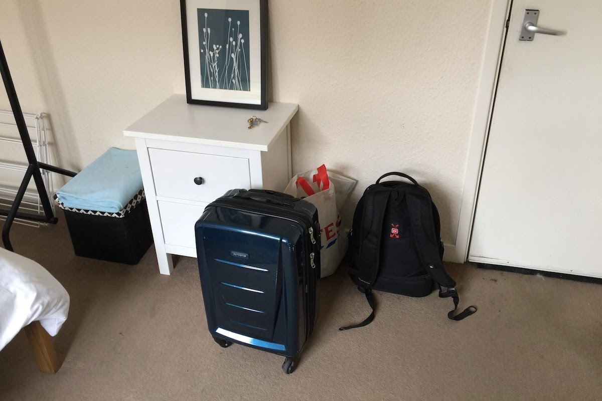
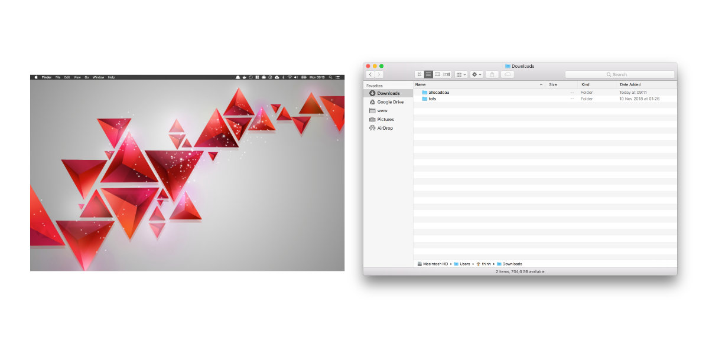

J'ai découvert la philosophie minimaliste il y a moins de deux ans, donc plutôt récemment.

Depuis, je n'ai plus qu'un seul couteau, une seule fourchette, une seule assiette. Je n'utilise plus de PQ ou de sopalin. J'économise même mes mots et n'ouvre la bouche que quand c'est pour une urgence absolue. Je porte le même t-shirt et le même caleçon tous les jours, et ne change que tous les mois.<!--more-->

Non je déconne. Pour le couteau et la fourchette.

J'ai découvert le minimalisme via différents entrepreneurs, notamment Tim Ferris qui parlait de Marie Kondo, la présidente officieuse de Minimaliste Land (c'est l'auteur du best-seller [La Magie du rangement](https://amzn.to/2AlNOC4).

C'est une philosophie qui m'a tout de suite attiré. Peut-être parce que j'ai grandi dans un foyer où l'on ne jette rien et on accumule tout, parce qu'_on ne sait jamais_ (je vais y revenir à ce "on ne sait jamais").

## Mettons-nous d'accord sur la définition de "minimalisme"

Concrètement ça veut dire quoi être minimaliste ? C'est important de se poser la question parce que tout le monde n'a pas la même définition. Pas plus tard qu'il y a quelque jours j'ai entendu un philosophe parler de minimalisme et ça n'avait rien à voir avec la mienne. Je vais te donner ma définition.

Déjà, être minimaliste, ce n'est pas faire voeu de pauvreté ou d'abstinence.

Pour moi, être minimaliste, **ça veut dire simplement dire que [je consomme et j'utilise moins, beaucoup moins](https://tobal.fr/une-chose-en-moins-par-jour-es-tu-capable-de-relever-le-defi/)**. Je ne pense pas qu'il y ait de manuel pratique pour appliquer la philosophie minimaliste. C'est plutôt, comme je viens de le dire, une philosophie, un précepte, et chacun peut l'appliquer à sa manière.

Au quotidien, ça se traduit de différentes façons.

Par exemple, j'ai fortement réduit ma garde-robe. en donnant tout ce que je ne mettais jamais ou presque. À tel point que depuis 6 mois je vis avec juste cette petite valise pour seul et unique garde-robe.

\[caption id="" align="aligncenter" width="1200"\] À droite c'est mon sac à dos pour mon ordi portable et mes différents accessoires tech, et derrière, un sac de courses.\[/caption\]

Toutes les affaires que je ne mets plus, je les donne. Il y a ces conteneurs un peu partout pas loin de chez toi où tu peux donner les affaires dont tu ne veux plus. Ça te libère les placards, l'esprit, et tu fais des heureux. D'une pierre trois coups.

Avant, j'avais 5 ordinateurs. J'en ai revendu 3. J'en ai gardé deux: un ordi portable et un fixe. Oui, deux quand même, parce qu'il faut pas déconner non plus (on est geek ou on ne l'est pas).

Le minimalisme ça passe aussi par le digital (fichiers, emails, logiciels, services etc...), même si c'est de base forcément moins encombrant ou visible. Cela dit, j'essaye autant que possible de supprimer les fichiers que je ne consulte plus. Tu devrais faire pareil. Si si, regarde ton répertoire _Téléchargements_, et ton bureau. C'est quoi ce bordel ? Pourquoi est-ce que tu gardes tous ces fichiers ? Mon répertoire "Téléchargement" est tout le temps vide ou presque, car dès j'ai fini d'utiliser ce que j'ai téléchargé, je le supprime. Si j'en ai besoin plus tard, bah... je le re-télécharge.

\[caption id="" align="aligncenter" width="1200"\] Mon bureau et mon dossier téléchargements\[/caption\]

Pareil pour les emails. À part les emails importants type professionnel, portant sur des contrats ou des choses dont je sais parfaitement si il est important de pouvoir les consulter plus tard, tout le reste par à la poubelle une fois consulté.

Idem pour les logiciels. Combien de logiciel as-tu installé sur ton ordinateur dont tu ne te sers jamais ? Après les gens se plaignent que leur ordinateur ralentit ou qu'il n'y a plus de place. En virant tout ce qui n'est pas utilisé, tu résous les deux problèmes.

Enfin, pense aussi à résilier les services et abonnement que tu n'utilises pas. Par exemple, je me suis abonné à Netflix en début d'année, puis je me suis rendu compte que je regardait à peine un épisode de série une fois par mois. Hop, résilié. En plus ça fait économiser de l'argent.

Je ne stocke pratiquement plus aucun papier. [Je les scanne et les enregistre dans Evernote](https://tobal.fr/trop-de-paperasse-debarrassez-vous-de-vos-papiers-avec-evernote/). Factures, courriers, reçus... Il n'y a aucune raison de garder ces reliques de la torture de pauvres arbres.

## Pourquoi le minimalisme

Et alors, qu'est qu'on y gagne après tout ça ?

**J'ai l'esprit plus libre**. Je dépense moins d'argent dans les choses matérielles (bon du coup j'ai tendance à rattraper avec les expériences, mais ce n'est pas une mauvaise chose).

J'ai moins de bordel dans ma vie. Moins de choses qui trainent à droite à gauche dont je ne me sers jamais.

[**J'apprécie plus les choses que j'ai**](https://tobal.fr/moins-tu-auras-plus-tu-sera-heureux/). C'est comme quand tu compares le gamin défavorisé à qui tu offre UN jouet et qui le chérit intensément pendant des années, comparé à l'ado aux parents riches qui chiale parce qu'elle a pas eu le modèle de voiture qu'elle voulait pour son 16ème anniversaire.

C'est tout bête mais c'est comme si on avait un quota d'appréciation de base, genre 100 points. Si t'as a qu'un seul truc, tu vas lui attribuer les 100 points et donc tu va l'adorer. Alors que si t'as 100 trucs, chaque truc aura qu'un seul point. Et c'est naze un seul point après tout, donc on s'en fout du truc.

> Plus on possède de choses et plus ce sont ces choses qui nous possèdent.

Moins de possessions matérielles, c'est moins de choses à entretenir, moins de choses qui peuvent tombent en panne ou se casser, qui trainent et qu'il faut ranger.

Indirectement, le processus mental libéré peut être ré-utilisé ailleurs dans notre vie, dans nos projets, dans nos relations, pour nous-même. Et ça, ça n'a pas de prix.

## "On ne sait jamais"

La pire phrase du monde.

C'est elle qui est responsable de la faim dans le monde, la guerre ou la vente de drogue.

Quand on garde des choses au lieu de les jeter, c'est souvent parce qu'on se dit "on ne sait jamais".

> "Je ne vais pas jeter ce vieux trousseau de clés, même si je n'ai strictement aucune foutue idée de ce qu'elles peuvent ouvrir. On ne sait jamais".
>
> "Je vais garder cette vis et ce boulon dans le pot (avec les clés), même si je ne sais pas du tout à quoi ils vont servir, on ne sait jamais".
>
> "Je vais garder ces vieux vêtement trop petits / trop larges. On ne sait jamais".

On ne sait jamais ? Mon c\*l, on sait tous très bien que 99,99% on ne va jamais rien faire de ces choses. Le "on ne sait jamais", c'est penser au 0,01% de probabilité d'avoir besoin de la chose en question.

Non sérieux, combien de fois ça t'es arrivé de te dire :

> "Aaaaaah OUF ! Heureusement que j'ai gardé ce boulon de 8 dans le pot à clés, sinon j'aurais été dans la merde"

Le pire c'est que dans ce 0,01% des cas où tu en aurais besoin, même si tu n'as pas gardé l'objet, tu trouveras une solution.

Je ne conseillerai jamais de se débarrasser d'une boite à pharmacie, car dans ce cas précis le "on ne sait jamais" est parfaitement justifiié. Mais pour tout le reste, c'est très rarement une question de vie ou de mort.

## Less is more

Ou "Moins c'est plus", mais en anglais c'est quand même plus stylé.

Le courant minimaliste prend de plus en plus d'ampleur à travers le monde et c'est une bonne chose. Je crois que les gens se rendent compte qu'au delà d'être un truc cool à la mode, c'est surtout pratique, et ça rend la vie meilleure.

Bref, si t'as compris où je voulais en venir c'est cool, sinon je le dis ici: **le minimalisme c'est génial.**

Après, pas besoin de se sapper avec une toge et de vivre uniquement d'air pur (qui, au passage, n'existe plus en ville), hein. Chacun peut y trouver son compte et se débarrasser simplement des choses qu'il n'utilise pas ou qui ne sont pas absolument nécessaires.

Nul besoin d'aller dans l'extrême. Il faut y aller à son rythme. Je dirais que, moi-même, je suis un "minimaliste en cours". Il y a encore plein de trucs dont il faut que je me débarrasse. Par exemple j'ai un box rempli de meubles qu'il faut que je revende. Il faudrait aussi probablement que je revende mon PC fixe parce qu'en vrai 99% du temps je me sert du portable. Mais ce n'est pas grave. Ce qui est important c'est de trouver ce qui fonctionne pour toi et qui te rend la vie plus simple.
