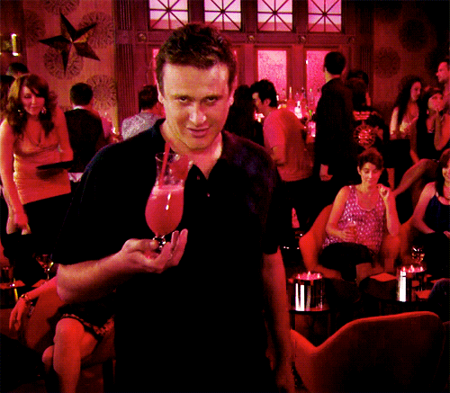

Tous les jours, on prend plusieurs centaines de décisions. _Plusieurs centaines_. Est-ce que je mets un t-shirt gris ou rouge ? Est ce que je prend des céréales ou juste un café ? Les transports ou la voiture ? Je dis bonjour a mon voisin ou je fais semblant de ne pas le voir ?

La plupart du temps, ce sont des [décisions triviales qui font perdre de l'énergie](https://tobal.fr/avoir-plus-denergie-etre-plus-concentre-et-plus-efficace-au-quotidien/). Mais de temps en temps, tu te retrouves face a un choix dont les possibilités te font peur.<!--more-->

Est-ce que je dois aller parler a mon collègue au sujet de son irresponsabilité ? Est-ce que je dois aller parler a cette jolie fille ? Est-ce que je dois changer de métier, de ville ou de pays ?

**Si quelque chose te fait peur, c'est le meilleur indicateur qu'il faut justement le faire ou y aller**.

Excepté les rares situations où ta vie est menacée, ce dont tu as peur est exactement ce que tu dois affronter. **La peur est l'indication qui te dit que ton choix va potentiellement changer ta situation, et c'est parce que le cerveau n'aime pas le changement que ça te fait peur**.

Ton cerveau veut rester dans sa zone de confort, mais justement, comment on grandit ? En sortant de sa zone de confort.

## Suis ta peur

Un exemple tout bête. Je me suis rendu à un événement Meetup pour rencontrer un groupe de gens qui se rassemblaient dans un bar. Je ne connaissais aucun membre du groupe, j'y allais donc pour faire de nouvelles connaissances.

Arrivé sur place, le soir, je me retrouve dans un très grand bar, avec beaucoup de gens et beaucoup de bruit. Je ne suis pas particulièrement timide mais quand on arrive tout seul dans un grand bar avec plein de monde, et qu'on ne connait personne, on ne se sent en général pas très à l'aise.

Mon but est de retrouver le groupe, sauf qu'ils ne m'ont laissé aucune info sur eux : comment les retrouver, un signe distinctif, un endroit particulier pour se retrouver...

Je décide de me mettre à côté du bar, et de laisser un message sur le groupe Facebook de l'événement en espérant qu'on me réponde pour me dire où est le groupe.

Au bout d'une demi heure, aucune réponse. Dans ce genre de situation, plus le temps passe, moins on est à l'aise. Déjà que je ne l'était pas au début. A ce moment, tu as l'impression que les gens te regardent, style "C'est qui ce mec au bar tout seul sans amis". J'ai l'impression de passer pour un rebut de la société, le mec bizarre qui est posté tout seul en plein milieu du bar.

Première chose que je me dis : je vais me barrer. Je commence donc à me diriger vers la sortie. Mais au fond de moi, un petit truc me tracasse. Dans le bar, j'ai vu plusieurs groupes de personnes se rassembler pendant la demi-heure où j'attendais. Je savais que le truc à faire c'était "simplement" d'aller voir ces groupes et leur demander si ils étaient le groupe que je cherche.

_Simplement_. Vite dit. Ça fous les jetons grave. Qui a envie, après être resté planté une demi-heure tout seul au milieu du bar, de voguer de groupe en groupe, et interrompre les gens dans leurs discussions avec leurs amis pour leur demander si jamais ils faisaient partie d'un groupe Meetup.

Et là, je repense au titre de cette section. "Suis ta peur".

**Le meilleur moyen de progresser, de s'améliorer, d'étendre sa zone de confort, c'est de faire un [premier pas](https://tobal.fr/le-principe-de-la-premiere-action/) et d'aller là où ça nous fait peur**.

Si Amerigo Vespucci (ou Christophe Colomb si tu préfères) n'avait pas fait ça, on aurait peut-être jamais découvert l'Amérique. Si le peuple avait eu peur en 1789, on serait peut-être toujours sous une Monarchie.

Malgré la boule au ventre, et les scénarios de honte qui défilent dans ma tête, je me dis "P\*tain, je me suis pas tapé 50 minutes de transport et une demi heure de poireautage pour repartir comme un galérien".

Je me dis aussi "Allez, je vais voir 3 groupes, juste 3. Au pire, je me prend 3 vents, je m'affiche 5 minutes, mais au moins j'aurais essayé".

Quel est le pire qui pouvait m'arriver ? Ne pas trouver mon groupe, et repartir bredouille. Quelques personnes qui rigolent parce que j'ai l'air d'un mec paumé. C'est tout. Au moins je n'aurai pas de regrets.

Et qu'est ce qui s'est passé ? Je me suis fait jeté comme une merde par tous les groupes que je suis allé voir, une fille m'a jeté son verre a la figure, pensant que je voulais la draguer, j'ai glissé en plein milieu du bar et je me suis étalé de tout mon long. Tout le bar a rigolé, ce qui a bien sur été filmé et vu plusieurs millions de fois sur YouTube.

Non, je plaisante. En vrai, j'ai trouvé mon groupe au bout du deuxième essai. C'est tout. Le premier groupe auquel je demande me dit simplement "Ah non désolé", et au deuxième, bingo. La suite est très simple. Ça m'a fait une histoire marrante à raconter, et j'ai pu faire connaissance avec pleins de gens sympas.

Je n'ai aucune idée d'où ces rencontres pourront me mener. Peut-être nulle part. Peut-être très loin. Tout ce que je sais, c'est que j'ai passé, au final, une super soirée. Et si je n'avais pas suivi ma peur et fait très précisément ce que j'avais peur de faire, je serais rentré chez moi en ayant fait un long trajet pour rien, à la fois aigri et déçu.

99% des peurs et des scénarios qu'on s'imagine ne sont pas fondés sur des faits rationnels. Ce sont des barrières mentales qu'on s'impose tout seuls bêtement et qui nous empêchent d'apprécier la vie, les gens, et d'avancer. Plus que jamais, pour grandir, il faut sortir de ta zone de confort. Et pour ça, il faut suivre ta peur.
