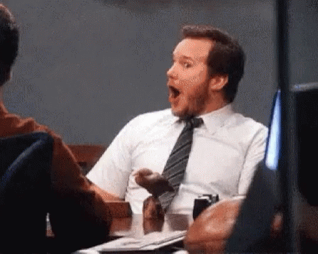
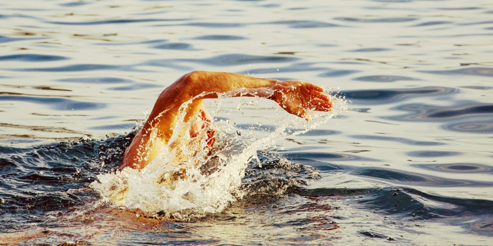

Il y a une loi qui régit cet univers. Elle s'appelle _la loi du moindre effort_. Contrairement à ce que tu pourrais penser, il ne s'agit pas d'être [un gros fainéant](https://tobal.fr/3-techniques-pour-arreter-de-procrastiner/).<!--more-->

La loi du moindre effort est observable partout dans la nature. **C'est quand les choses se font _naturellement_, sans forcer.** L'eau emprunte les chemins ouverts, les oiseaux chantent, les abeilles butinent et l'herbe pousse. Ça arrive naturellement, il n'y pas d'effort.

Pourquoi je te parle de ça ? Parce que c'est peut-être ce qui t'empêche d'avancer. Une caractéristique de l'être humain est d'avoir tendance à vouloir forcer les choses.

Certains veulent imposer une idéologie. D'autres veulent absolument faire un métier pour lequel ils ne sont pas fait. On veut vendre n'importe quoi à n'importe qui. On s'obstine à vouloir faire marcher une relation vouée à l'échec. À essayer d'arranger des choses ou espérer des situations qui n'ont pas lieu d'être.

**La vie serait beaucoup plus simple si on l'acceptait comme elle est**.

C'est une question d'efficacité : forcer les choses est aller à l'encontre du naturel.

Si tu es introverti de nature, faire un métier impliquant beaucoup d'interactions sociales te fatiguera énormément.

C'est aussi pour ça que les débats d'idées, [vouloir convaincre les gens](https://tobal.fr/comment-gagner-du-temps-dans-la-vie-de-tous-les-jours/) (en vrai ou sur Facebook), c'est de la perte de temps pure. Tu perds énormément de temps et d'énergie à vouloir convaincre des gens qui n'ont pas envie de t'écouter.

Tu seras malheureux à perséverer dans un métier qui te ne plaît pas. À rester avec un entourage qui ne t'apprécie pas pour ce que tu es. Comme une fleur dans une zone industrielle, tu n'évoluera pas dans un environnement qui ne t'est pas favorable.

## Moindre effort ne veut pas dire inaction

Attention, accepter les choses ne veut pas dire "ne rien faire".

**Le problème inverse, c'est quand on évite la réalité**. Quand on refuse de voir les choses comme elles sont. De souhaiter qu'elles soient différentes, sans pour autant agir pour amener les bonnes choses. La difficulté première vient bien du fait de refuser d'accepter la réalité. **C'est seulement en acceptant la réalité du [moment présent](https://tobal.fr/recommandation-de-livre-le-pouvoir-du-moment-present-par-eckhart-tolle/) qu'on peut donner le meilleur de nous même**.

Ensuite, si une situation te déplait, après l'avoir reconnu comme telle, tu dois oeuvrer pour la changer,

Mais pas en combattant le cours des choses. **Si tu essayes de nager contre le courant qui t'emporte, tout ce que tu feras, c'est t'épuiser**.

Non, **si le courant t'emporte ailleurs, laisse le faire**.

Si tu es [malheureux dans ton métier, change de job](https://tobal.fr/5-signes-indiquant-quil-est-temps-de-changer-de-boulot/). Même si tu as un super salaire actuellement.

Au lieu de vouloir absolument faire marcher une relation improbable, libère-toi et efforce-toi de trouver une vraie âme soeur.

Plutôt que d'[essayer de convaincre des gens qui de toutes façons n'ont pas envie de t'écouter](https://tobal.fr/comment-gagner-du-temps-dans-la-vie-de-tous-les-jours/), adresse-toi à des gens qui sont prêts à recevoir ton message.

Plutôt que de vouloir vendre à tout le monde, donne-toi à fond pour vendre aux clients les plus prometteurs.

Ne cherches pas à plaire à tout le monde, consacre-toi aux gens qui t'apprécient.

Bref, je peux continuer longtemps comme ça. Cela dit, ne te sers pas de cette loi comme une excuse. Il faut bien faire la différence entre "je ne suis pas fait pour ça" et "j'ai la flemme / j'ai pas envie de m'y mettre sérieusement".

Par exemple, quand on veut se mettre au sport, souvent on commence par courir. Si tu t'aperçois que tu détestes, courir, qu'est ce que tu fais ? Tu te dis "Non, je ne suis pas fait pour courir" et tu arrêtes le sport ? Non ! Tu dois simplement trouver un sport qui te plait. Essaye la corde à sauter, le ping pong, la boxe, peu importe. Mais tu continues de faire du sport.

Pour reprendre mon image du courant qui t'emporte, tu dois arrêter de nager à contre-courant, pas arrêter de nager tout court. Sinon tu te noies. Suivre la loi du moindre effort, c'est comprendre où le courant t'emmène et nager plus vite avec l'aide de celui-ci.
