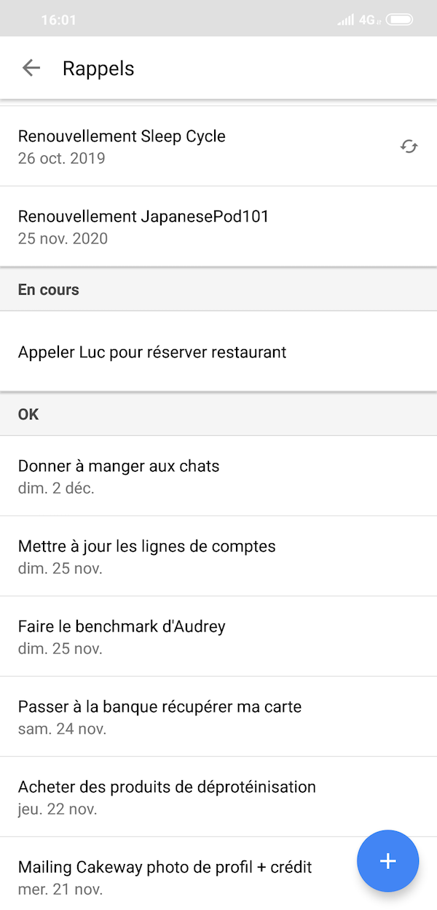

Quel est la meilleure façon de gérer une todo list au quotidien ? Quelles sont les meilleures astuces de productivité pour abattre sa todolist le plus rapidement et le plus efficacement ?

La meilleure façon de gérer ta todolist, c'est... De faire ce que tu as mis dans ta liste. Tout simplement. Voilà, Bon courage !

<!--more-->

Je déconne. J'ai un peu plus de choses à dire, quand même.

En fait il y tout juste quelques mois, après quatre années à gérer une todolist _chaque jour_, et essayé plusieurs outils, **j'ai testé de ne carrément plus utiliser de logiciel de todolist**.

Résultat ? Ça ne me manque pas du tout. Au contraire, _je suis devenu encore plus productif_.

## Le problème des todo list

Le plus gros problème avec les todolist, surtout quand on utilise un logiciel (comme [Todoist](https://todoist.com/) ou [Wunderlist](https://www.wunderlist.com/)), on développe le syndrome que j'appellerai, faute de nom officiel, "J'ajoute tout ce qui me passe par la tête même si c'est pas vraiment indispensable".

Tu finis par te retrouver avec des listes longues comme le bras. **Et surtout, avec des tâches que tu ne fais jamais, que tu repousses tout le temps, et qui finissent par "prendre la poussière"**. Tu sais, ces fameux trucs qui sont dans ta liste depuis 6 mois et que tu n'as toujours pas fait.

Autre syndrome, découlant directement du précédent : **ça nous fait oublier l'essentiel**. Comme on peut tout mettre dedans, ça peut rapidement [nous faire croire qu'on est productif](https://tobal.fr/pourquoi-tu-as-limpression-detre-productif-mais-que-les-resultats-ne-viennent-pas/). On finit par attraper le virus du "Je coche la case pour dire que c'est fait". _(Il va falloir que je revoie comment je nomme mes concepts)_

C'est vrai qu'il y a un petit plaisir à marquer une tâche comme faite, mais ça incite inconsciemment a créer des listes de tâches comme ça :

Alors qu'en vrai, la seule chose que t'as à faire, c'est envoyer un courrier de résiliation.

Bon ok, j'exagère peut-être un peu, mais tu vois le délire.

Ensuite, **planifier des choses plus loin qu'une semaine, ca relève de l'imaginaire**. Après 4 ans de todolists quotidienne, je peux te l'affirmer, quand tu planifies un truc pour dans 2 semaines, un mois ou plus, tu le fais jamais.

Si les choses sont vraiment importantes, tu ne les oublieras pas. Attention, je ne parle pas des chose ponctuelles, comme un rendez vous chez le médecin. Pour ça, il faut utiliser un agenda (papier ou digital). Mais pour ce qui est des tâches importantes, pas besoin de les planifier plusieurs semaines a l'avance.

## Les todolist c'est quand meme cool

Je ne crache pas dans la soupe pour autant, les todolist c'est pas le mal absolu non plus.

Ce qui est vraiment bien avec les todo list, c'est que ça peut servir de _vide-tête_. Toutes les choses qu'on se dit qu'on devrait faire, on les note, comme ça, on les oublie pas. Ensuite, il faut repasser sur sa liste, et virer tout ce qui relève plus du fantasme que de la réalité.

Ça aide aussi à structurer une idée ou un projet. En listant les étapes à suivre et les choses principales à faire, on se fait une meilleure idée de ce qui nous attend. Mais garde à l'esprit que tu ne peux jamais savoir à l'avance comment les choses vont évoluer exactement.

Mais tenir une todolist, en tant qu'activité à part entière, c'est-à-dire passer 10 minutes ou plus par jour, via un logiciel dédié... Aujourd'hui je trouve ça superflu.

Pour ma part, je n'utilise plus de todolist depuis 3 mois, et ca me convient parfaitement.

## Comment je fonctionne

Alors pour être exact, en vrai je fais encore un tout petit peu de listes, mais c'est plus "freestyle". Je n'en fait ps tous les jours, il n'y a pas de notion de régularité, c'est au feeling. Quand j'ai des trucs importants à faire dans la journée, je marque 2 ou 3 trucs sur mon carnet de notes, ou sur une feuille de papier. C'est tout.

**Pour les rappels vraiment importants à plusieurs jours**, je les ajoute en rappel sur Google Agenda. Ce qui est très pratique car si tu loupes un rappel un jour, il est automatiquement reporté au lendemain.

Je n'ai quasiment aucun rappel a plus d'une semaine, mis à part les abonnements ou autre trucs de facturation qui arrivent dans longtemps histoire d'éviter les mauvaises surprises.

Pour mes différents projets professionnels, je crée une note dans Evernote, dans laquelle j'ai effectivement une todo list. J'y mets les choses a réaliser sur chaque projet.

Mais je ne mets pas de date butoir. **Et surtout, il n'y a pas ce besoin de _devoir consulter ma todo list tous les jours_**. Quand je me mets à bosser sur le projet, la liste est là et je l'utilise. Le reste du temps, je n'y pense pas. L'important c'est que ce soit 100% contextuel

Au final, se passer d'un gestionnaire de todos, ça évite principalement de vouloir tout faire et donc _trop en faire_, et à la place, tu peux te concentrer sur les choses qui comptent vraiment, au bon moment.
