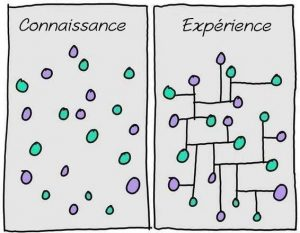

Quelle est la différence entre la connaissance et l'expérience ? Je pense que la meilleure réponse à cette question est ce dessin qui distingue parfaitement les deux notions.

Cette image a été réalisée par le dessinateur **Hugh Mac Leod** qui a trouvé là un moyen efficace d'exprimer un concept qui n'est pas facile à saisir.

Cette image nous souligne une vérité : la connaissance ne sert à rien s'il n'existe aucun lien entre tout ce que nous avons appris.

<!--more-->

Beaucoup de grand écrivains, artistes et scientifiques nous ont dit que pour faire grandir son imagination et sa créativité, il fallait toujours en apprendre plus, diversifier ses connaissances, s'intéresser au monde qui nous entoure et surtout de créer des connexions entre ces différents points.

J'ai donc recensé des études, citations et conseils de plusieurs horizons.

Pour commencer, j'ai jeté un coup d’œil du coté dé la recherche scientifique qui démontre que l'intelligence est étroitement lié aux connexions physiques de notre cerveau.

## Intelligence et Connexions : Pourquoi notre Cerveau a-t-il Besoin de Bien Communiquer avec Lui-Même

A l'Institut Technologique de Californie, des scientifiques ont découvert que l'intelligence n'est pas une zone précise du cerveau mais plutôt un **ensemble de différents éléments**. Physiquement, elle ne constitue pas une structure unique mais un **réseau de plusieurs structures** se trouvant dans les deux hémisphères. L'étude montre que le cerveau fonctionne comme un système distribué.

_"Les nombreuses régions cérébrales et les connexions qui s'y établissent représentent le plus gros de notre intelligence globale"_ explique le chercheur Gläscher.

Le rapport stipule aussi qu'il existe une théorie qui dit que l'intelligence générale serait basée sur la capacité du cerveau à rassembler et intégrer les nombreux types de traitement, telle une mémoire vive.

À l'Université de Washington, une autre étude a démontré que l'intelligence dépendait d'une part des zones hautement actives du cerveau mais d'une autre de leurs capacités à communiquer avec les autres régions cérébrales.

Avoir la capacité de faire des liens entres vos idées et vos connaissances peut vous aider à penser de façon plus créative et à produire un travail de meilleure qualité.

## Les Connexions Augmentent la Créativité : Il n'y a Rien d'Original

Lorsqu'on parle de créativité ou d'innovation, on pense évidemment à Steve Jobs. Je n'ai donc pas été surpris de constater que de son vivant il avait mentionné le fait d'établir des connexions. Cette belle citation provient d'une interview de 1996 :

_"La créativité, c'est seulement mettre les choses en connexion. Quand vous demandez à des gens créatifs comment ils ont fait telle ou telle chose, ils se sentent un peu coupables parce qu'ils n'ont pas vraiment fait quelque chose, ils ont juste vu quelque chose."_

Steve Jobs expliqua ensuite que l'expérience était le secret pour être capable de faire des connexions si facilement ( Comme nous l'avons vu dans le dessin de **Hugh McLeod** ) :

_"Ça leur a semblé évident après coup. C'est parce qu'ils ont été capables de connecter des expériences qu'ils ont eues et de les synthétiser sous une nouvelle forme."_

**Maria Popova** est la promotrice et sans doute l'un des meilleurs exemples de ce qu'elle appelle la "Créativité Combinatoire".

_"Dans le but sincère de créer un monde et d'y contribuer, nous devons être capable de lier d'innombrables points, de recroiser les idées d'une multitude de domaine, de combiner et recombiner ces morceaux afin de construire de nouveaux châteaux."_

Elle a fait une conférence sur ce sujet durant l'événement des "Creative Mornings" et a soulevé de très bons points concernant la créativité. Une des choses les plus importantes à faire est d'être **capable de lire une multitude de sujets différent**. Ensuite, il faut admettre que notre fierté nous empêche de reprendre les idées des autres. La créativité est combinatoire, il n'y a rien d'original, tout repose sur ce qui existait auparavant.

**Popova** a ensuite intelligemment fait l'analogie entre la connaissance et des blocs de construction LEGO.

_"Plus vous avez de blocs de construction, plus vos châteaux seront variés dans leur forme et leur couleur, et plus ils deviendront intéressants"_

**Austin Kleon** m'est également venu à l'esprit lorsque j'ai commencé cet article.Il est l'auteur du livre _"Steal Like An Artist"_ (Voler comme un artiste) qui explique comment utiliser le travail des autres pour inspirer et conseiller le votre. Le livre commence par :

_On pose la même question à tous les artistes :_ _"Où trouvez-vous vos idées?"_ _L'artiste honnête répond "Je les vole."_

Il partage avec **Popova** l'idée qu'il n'y a rien d'original. _"Chaque nouvelle idée n'est qu'un mélange, une version remodelée de plusieurs autres idée."_ Si vous souhaitez être plus créatifs, **Kleon** propose de :

- Transporter un netbook partout où vous allez
- Lire énormément
- Prendre des notes

## Tout est Question de Connexions Selon les Scientifiques

Dans le domaine de la Science, établir des connexions entre ses différents point de connaissance est tout aussi important. Dans le livre "_The Art of Scientific Investigation"_, **William I.B. Beveridge**, professeur à l'Université de Cambridge, a écrit que les scientifiques les plus doués étaient souvent des personnes qui s'intéressaient à une variété de sujets, ce qui les rendaient originaux.

_"L'originalité consiste souvent à relier des idées dont la connexion n'a pas été suspecté auparavant."_

Il a également suggéré aux scientifiques d'élargir leur lecture, de ne pas se restreindre à leur domaine afin d'ajouter des "points de connaissance" (Qu'ils pourraient connecter en temps voulu avec d'autres "points" ).

La plupart des scientifiques estiment qu'il est très handicapant d'étudier un sujet sans connaître les précédents travaux qui y ont été faits dans le passé.

L'écrivain scientifique **Dorian Sagan** partage cette idée que la Science est n'est qu'une question de connexions:

_"La nature n'obéit pas plus aux différentes sciences, que les continents ne reflètent leurs pays et leurs devises depuis l'espace._ _Pour moi, les grands scientifiques se sont caractérisés par leur capacité à se connecter."_

## Établissez des Connexions et Soyez Créatifs

Je vais vous donner quelques suggestions pour améliorer votre capacité à établir des liens.

### 1\. Élargissez vos Connaissances - Le Pouvoir des Nouvelles Expériences

Plus vous avez de connaissances et plus de connexions vous pouvez lier. Commencez par lire plus, sur des sujets variés et tenter de nouvelles choses pour **collecter un maximum de connaissances** ( faites des voyages si vous avez les moyens, rencontrez de nouvelles personnes, adoptez une nouvelle passion).

**Dr.Duezel** explique : _"Seulement les choses complètement nouvelles provoquent une forte activité au niveau du mésencéphale (cerveau-moyen)"._

Essayer de nouvelles choses et surcharger doucement votre cerveau peut donc apporter une amélioration spectaculaire de l'activité de votre cerveau.

### 2\. Gardez une Trace de Tout

Comme le suggère **Austin Kleon**, prenez un ordinateur portable (ou votre téléphone) partout avec vous et prenez des notes. Ne vous attendez pas à ce que votre cerveau se souvienne de tout, donnez-lui un coup de main en notant les concepts ou des idées importantes que vous rencontrerez. En faisant cela, vous pourrez vous souvenir des précédentes notes que vous aurez écrites ( vous faites des **connexions** ! ).

### 3\. Relisez vos Notes Quotidiennement

Réviser vos notes peut vous aider également à vous remémorer ce qui s'est passé dans le temps. A cet instant, vous aviez fait la rencontre d'une personne, vous aviez appris quelques chose de nouveau, il pleuvait ...A travers la lecture de vos notes, vos idées sont reliées à vos souvenirs, vous faites là encore des **liaisons** !

Élargissez vos domaines d'intérêts, lisez plus, rencontrez de nouvelles personnes, voyagez si vous le pouvez, multipliez vos hobbys et prenez des notes. Tous ces conseils constituent une base solide de connaissances. A vous ensuite de connecter ces idées entre-elles pour en faire émerger de nouvelles. L'expérience est source de créativité !

Vous avez sûrement vos propres méthodes pour vous rendre plus créatifs. Faites-les nous savoir dans les commentaires et parlons-en.

Source : [Buffer](http://blog.bufferapp.com/connections-in-the-brain-understanding-creativity-and-intelligenceconnections)
