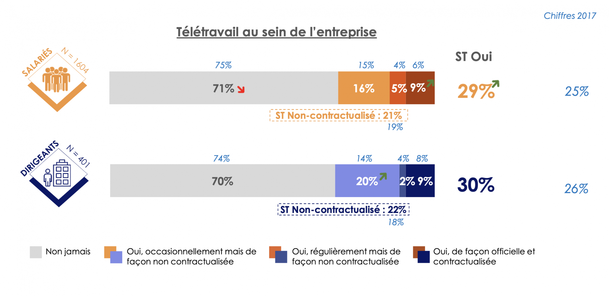
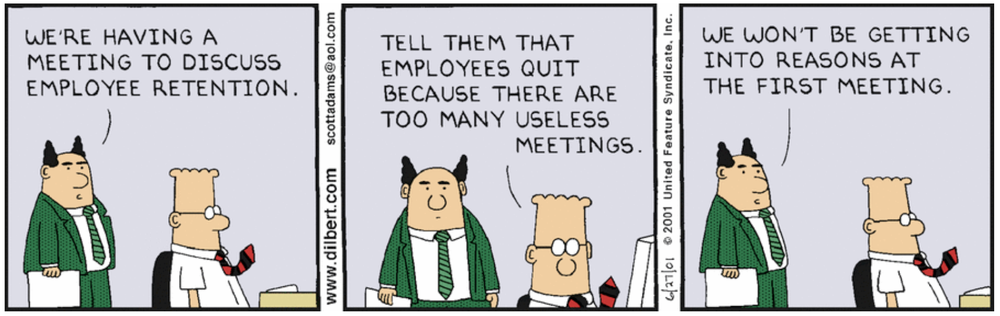

Déjà, on va commencer avec le nom. Télétravail.

Télé, et travail.

On colle deux mots qui s'opposent: la télé et le travail. Tu m'étonnes que les employeurs n'ont pas confiance. Pour la suite, appelons-ça le **_remote_**.

Fin 2019, il y a eu les gros problèmes de [grève des transports](https://www.google.com/search?client=safari&rls=en&q=greve+transport+2019&ie=UTF-8&oe=UTF-8). Plus récemment, c'est la crise COVID 19. C'est à ce moment qu'on se rend compte que le remote résout 3/4 des problèmes.

<!--more-->

Mais combien y'a-t-il d'entreprises qui acceptent le remote en _conditions normales_ ? Il y en a de plus en plus, c'est vrai, mais c'est encore une toute petite minorité. En 2019, [moins de 10% des salariés faisaient du remote de manière contractualisée](https://zevillage.net/wp-content/uploads/2019/02/Etude-Teletravail-Malakoff-Mederic-comptoir-Nelle-entreprise-2019.pdf).

<figure>

<figcaption>

Il y a tout de même une progression par rapport à 2017.

</figcaption>

</figure>

## Le fond du problème du télétravail

Quand tu parles de remote à une entreprise qui n'encourage pas le remote, tu entends toujours la même rengaine : problème d'infrastructure, d'organisation, de technologie ou de sécurité. Que ce soit dit : tout ça c'est du pipeau.

On arrive sur 2020, les technologies sont largement en place et il est simple, rapide et relativement peu coûteux de mettre en place le remote. La preuve, merci le COVID.

Le seul et véritable souci en France avec le remote, c'est la confiance.

Ce que ne diront pas (tous) ouvertement les patrons et managers, c'est qu'ils sont en flippe de te payer alors que tu sirotes des cocktails devant la télé toute la journée. Je ne l'invente pas, on me l'a déjà sorti.

Mais c'est prendre le problème à l'envers. Ce serait comme ne pas avoir confiance en sa femme mais rester avec elle ou l'obliger à rester à la maison.

Alors voici mon message aux dirigeants qui refusent de laisser leurs employés faire du remote : si vous n'êtes pas capable de faire confiance à vos employés, et que vous estimez qu'ils doivent être au bureau pour pouvoir garder un oeil sur eux (ce qui revient à les infantiliser), pourquoi les employez-vous ?

**Un environnement de travail sain repose sur la confiance**.

## Réponses aux objections

### 1\. Et pour les réunions ?

Il y a la visioconférence pour ça. Et si la présence des employés est absolument requise, le remote n'empêche pas de venir au bureau ponctuellement. Le bonus, c'est que ça fera réfléchir à deux fois avant de vouloir ameuter tout le monde pour une réunion. On sait tous que les [réunions sont inutiles](https://hbr.org/2017/07/stop-the-meeting-madness).

<figure>

<figcaption>

Source: [Dilbert comics](https://dilbert.com/strip/2001-06-27)

</figcaption>

</figure>

### 2\. Les employés travailleront moins bien / moins longtemps

Premièrement, pour le "moins bien".

Il a été clairement démontré que [le remote apporte de nombreux bienfaits](https://www.passeportsante.net/fr/psychologie/Fiche.aspx?doc=travailler-chez-soi), un des principaux étant l'amélioration de [la productivité des employés](https://stayinthegame.net/wp-content/uploads/2019/07/HBR-To-Raise-Productivity-Let-More-Employees-Work-from-Home.pdf). Si tu t'ennuies ou que tu aimes lire les longs rapports, voici [une étude complète sur le télétravail](https://zevillage.net/wp-content/uploads/2018/05/2018-05-17-OBERGO-Rapport-enquete-Teletravail-2018.pdf). L'essentiel, c'est que le remote améliore leur qualité de vie, ce qui améliore leur motivation, et par conséquent améliore leur productivité.

<figure>

https://twitter.com/chris\_herd/status/1257992288900386818

<figcaption>

Chris Herd, CEO de FirstBaseHQ, startup dédié à la facilitation de la mise en place du télétravail.

</figcaption>

</figure>

Ensuite, pour les employés qui travailleraient "moins longtemps", encore loupé. Les employés en remote n'ont pas à passer du temps pour le trajet domicile-travail. C'est de 30 minutes à parfois 2 heures gagnées par jour. Et surtout moins de fatigue, ce qui permet aux employés, si besoin, de bosser plus longtemps et mieux que s'ils avaient du faire des aller-retour domicile-bureau.

### 3\. C'est difficile à mettre en place

En 2020, utiliser ce prétexte relève soit de la mauvaise foi, soit de l'incompétence. De nos jours, pour la collaboration, les outils en temps réels sont légions, simples à installer et peu coûteux: GSuite, Slack, Front, Notion, Loom, Zoom...

https://twitter.com/chris\_herd/status/1192486196066295815

Il y a même des sites dédiés entièrement aux [outils à utiliser en remote](https://www.remote.tools). La startup Notion, [une des applications les plus importantes que j'utilise](https://tobal.fr/notion-outil-de-productivite-ultime/), a même [crée une page sur son site](https://www.notion.so/remote) consacrée entièrement à la mise en place du télétravail au sein de son entreprise, avec de super exemples.

## Vraie journée, fausse journée

Lorsqu'on est en télétravail, on peut faire une "fausse journée". C'est de là que vient le manque de confiance. Le chef se dit qu'on va regarder la télé, jouer aux jeux vidéos, surfer sur Facebook ou YouTube, ou bien dormir, au lieu de travailler.

Mais on peut aussi faire une "vraie journée". C'est à dire bosser le temps qu'il faut bosser. Et comme on ne se tape pas le trajet au boulot du matin, ni celui vers la maison au retour, **ça permet même de bosser une heure ou deux en plus tranquillement**.

Tandis qu'au bureau, très souvent, on ne bosse pas autant qu'on le pourrait. En tout cas pas dans les [meilleures conditions](https://www.lesaffaires.com/blogues/olivier-schmouker/comment-combattre-les-incessantes-distractions-au-bureau/602332).

Dans une étude menée auprès de 5.150 employés travaillant au moins trois jours dans un environnement d'entreprise, **la quasi-totalité (98%) des sondés ont déclaré être distraits au travail** !

Entre les collègues qui discutent à côté, les interruptions liées au téléphone ou au réunions, les bruits gênants de photocopieur ou machines à café, il y a [énormément de distractions perturbantes au bureau](https://www.atlantico.fr/atlantico-light/3572401/le-classement-des-distractions-les-plus-perturbantes-au-bureau-travail-open-space-appel-telephone-cafe-animaux-enfants-).

C'est logique après tout : on perd du temps le matin dans les transports ou les embouteillages. Ensuite, on arrive au bureau, on papote, on prend le café. Puis il y a les interruptions des collègues. Les réunions inutiles. Et comme il faut rentrer chez soi, on quitte le boulot une heure plus tôt que si on avait été en télétravail.

En conséquence, on est souvent plus productif en télétravail qu'au bureau.

## Certaines personnes ne sont pas faites pour bosser en télétravail, et c'est tout à fait normal

Il y a ceux qui ont du mal à se concentrer chez eux. Ça peut-être parce qu'ils ont des enfants qui font du bruit. Ou qu'ils tiennent à tout prix à séparer le personnel du professionnel. Pour d'autres, c'est une question d'ambiance.

D'ailleurs, **la plupart des gens semblent préférer le télétravail _partiel_ plutôt que _total_**, comme semble l'indiquer ce [sondage Linkedin](https://www.linkedin.com/feed/news/t%C3%A9l%C3%A9travail-combien-de-jours-par-semaine-4153153/).

Et puis, il y a les gens qui ont besoin d'être entourés, d'avoir un certain cadre plus ou moins strict pour les garder disciplinés, sans quoi ils risquent de se laisser distraire. Mais je crois que **la plupart de ces gens connaissent leur limites**, et savent dans quel cadre ils évoluent le mieux. J'en ai dans mon entourage, et ils ont le recul nécessaire pour dire qu'ils préfèrent ne pas faire du télétravail.

On en revient à cette histoire de confiance. Le cas marginal de l'employé de mauvaise foi qui veut profiter du télétravail pour se la couler douce, c'est plutôt rare. De toute façon, un élément comme ça ne sera pas une meilleure ressource en étant surveillé au bureau. Au contraire même, **le télétravail sera une façon rapide et efficace d'identifier les employés irresponsables**.

## Télétravail ne signifie pas ne jamais venir au bureau

Enfin, mettre en place une politique de télétravail au sein de l'entreprise ne signifie pas qu'on bannit les gens chez eux.

Pour de nombreuses personnes, [être obligé de faire du télétravail est carrément une source de stress](https://www.lci.fr/emploi/44-de-salaries-en-detresse-psychologique-quand-le-teletravail-devient-une-souffrance-2151509.html). Rien n'empêche les gens de venir au bureau quand ils en ont envie.

**C'est peut-être même d'ailleurs la meilleure solution : permettre aux employés de faire du télétravail quand ça les arrange, et venir au bureau quand cela a du sens**, parce qu'ils en ressentent le besoin où que ça fait réellement gagner du temps.

C'est le meilleur des deux mondes. Les avantages sans les inconvénients. On ne reste pas isolé chez soi toute la semaine, et on n'est pas obligé non plus de devoir pointer au bureau tous les jours.

Au final, il s'agit de considérer les employés comme des gens responsables, et de trouver un équilibre qui permettra à chacun de travailler de la façon la plus efficace, en toute harmonie.

## Conclusion

La crise COVID aura eu certains effets positifs, dont celui de nous démontrer **qu'il est parfaitement possible de fonctionner en télétravail à grande échelle.** Et par conséquent, qu'ils est possible – et grand temps – de bousculer le statut quo. La pandémie nous a fait gagner au moins cinq ans sur le sujet. Reste à savoir si la culture du télétravail en France va enfin avancer ou si les mentalités obsolètes vont perdurer.

Au final, ce n'est pas tant l'utilité ou la légitimité du télétravail la question, mais de notre capacité à se défaire des vielles traditions et habitudes. Être capable de _think out of the box_, en somme.

* * *

**Sources :**
[Télétravail : les chiffres clés](https://recruiters.welcometothejungle.com/articles/chiffres-cles-teletravail/)
[Chris Herd, remote work activist](https://twitter.com/chris_herd)
[Sondage Linkedin sur le télétravail](https://www.linkedin.com/feed/news/t%C3%A9l%C3%A9travail-combien-de-jours-par-semaine-4153153/)
