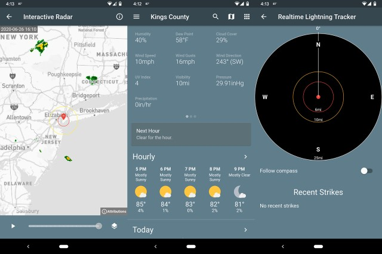

Lorsque [Dark Sky](https://www.igen.fr/app-store/2020/03/apple-soffre-lapplication-meteo-dark-sky-114023) a été vendu à Apple au début de l'année, un million d'utilisateurs d'Android ont crié à la consternation. Cela annonçait que leur application météo favorite allait bientôt disparaitre du catalogue d'applications météo du Play Store. Immédiatement, Dark Sky a été retirée de [Google Play](https://play.google.com/store) et le site web a été fermé peu après. Bientôt, les versions Android installées ne fonctionneront plus (selon certaines informations).

<!--more-->

D'ailleurs, tu as probablement remis à plus tard ta recherche d’application météo en remplacement de celle-ci et tu te demandes maintenant comment obtenir tes précieuses informations météorologiques. Bien sûr, Google peut t'apporter les infos basiques, mais qu'en est-il des cartes et des graphiques sympas, ou encore des personnalisations météorologiques ? Tu es peut-être toi aussi un geek des applications météo ?

J'ai téléchargé de nombreuses applications météo dont les mieux notées dans Google Play, et j’ai fait un petit tour d'horizon pour chacune d’entre elles. Je les ai comparées les unes aux autres, en prenant note de leur cohérence et de leurs sources. Parmi les critères que j'ai étudiés pour ces applications météo, il y a la présentation générale des données, la facilité d'utilisation mais aussi le côté visuel en recherchant les applications météo les plus agréables à regarder. Voici donc mes cinq premiers choix, classés du meilleur au pire.

## 1\. La meilleure application météo pour Android dans l'ensemble : AccuWeather

Ce n'est pas pour rien qu’elle est **« le » grand nom des prévisions météorologiques**. En effet, [Accuweather](https://play.google.com/store/apps/details?id=com.accuweather.android) offre des tonnes de données, notamment sur la vitesse du vent, les UV et l'humidité. Mais, l'information la plus précieuse est son **indice "RealFeel"**, qui t’indique **le ressenti réel des températures** en fonction de ces facteurs. Très utile pour savoir si tu vas avoir chaud ou froid selon les données du jour.

L'interface est agréable et complète, avec toutes les informations importantes situées en haut de la page. De plus, il y a des **cartes en temps réel** qui permettent de **suivre les tempêtes** qui arrivent.

Les publicités ne sont pas trop intrusives, mais tu peux passer à la version sans publicité pour 3,99 $ (3,54 €). _Pour information, c'est la seule appli météo dont je n'ai pas désactivé les notifications._

## 2\. Quand tu veux quelque chose de plus simple : Shadow Weather

Il s'agit d'une **application météo très épurée** qui met en avant beaucoup moins d'informations que les autres - juste la température et les précipitations. Toutefois, un défilement rapide te permet d'accéder aux autres données dont tu as besoin.

Tu peux personnaliser les mesures qui apparaissent, et choisir parmi quatre schémas de couleurs différents. [Shadow Weather](https://play.google.com/store/apps/details?id=com.noaimgames.shadowweather) tire ses bulletins météo de plusieurs sources. Ainsi, tu verras probablement des variations par rapport aux autres applications (ou même par rapport à la température intégrée indiquée sur ton smartphone).

La carte de la version gratuite est petite et très détaillée, tu dois donc payer 5 $ (4,43 €) par an ou regarder une petite annonce gratuite tous les jours pour passer à la version interactive plein écran.

## 3\. La plus belle (et la meilleure affaire) : Overdrop

Si tu es fan de graphismes soignés, **[Overdrop](https://play.google.com/store/apps/details?id=widget.dd.com.overdrop.free)** est l'application météo qu'il te faut. La bannière du haut est incroyablement agréable à l'œil avec des couleurs vives et des animations subtiles. Il y a **un graphique pour chaque mesure météorologique**.

Et du côté des widgets ? En passant à la version Premium pour 9 $ (7,98 €), tu auras accès à de **nombreux widgets** depuis l'écran de verrouillage : de ceux qui te donnent simplement l'heure et la température à ceux qui suivent le niveau de la batterie. Tu peux aussi l'essayer pendant un mois pour 0,99 $ (0,88 €) ou pendant un an pour 2,49 $ (2.20 €). La version premium débloque aussi plus de thèmes. Toutefois, les thèmes gratuits sont déjà très pratiques sans que tu n'aies besoin de les mettre à jour.

## 4\. Pour les intellos de la météorologie : The Weather Channel

[Weather Channel](https://play.google.com/store/apps/details?id=com.weather.Weather) ne manque pas d'informations. D'ailleurs, son plus grand défaut est certainement qu'il s’y passe trop de choses. Cette application météo contient **des nouvelles en quantité**, il y a même un onglet séparé dédié aux vidéos (qui se lance automatiquement, grrr).

Une fois les publicités supprimées avec un abonnement de 0,99 $ (0,88 €) par mois ou 9,99 $ (8,86 €) par an, cette application météo devient beaucoup plus facile à manipuler. On y retrouve notamment des informations comme **la qualité de l'air** qui sont bien mises en évidence.

Weather Channel propose deux rubriques intéressantes : "santé & activités" et "conditions extérieures". La première rubrique t’indique par exemple si tu peux sortir en bateau ou courir, tandis que la seconde te donne une idée de ce qui t’attend - notamment si tu as besoin d'un parapluie ou d'un insecticide pour éloigner les moustiques. De quoi éviter quelques problèmes.

## 5\. La plus fun : CARROT

Il y a beaucoup d'applications qui tentent d'adopter une approche plus souple de présentation de la météo.

[CARROT](https://play.google.com/store/apps/details?id=com.grailr.carrotweather) est probablement la meilleure application de ce côté-là car elle te permet de **personnaliser sa façon d’interagir avec toi, et notamment son humour, selon tes goûts**. Tu décides si le texte de l'application doit prendre un ton plutôt méchant ou agréable. Ou encore, quelle est l'orientation politique des blagues, qu'elles soient libérales, conservatrices ou même communistes. Tout est pensé, tu peux aussi le changer en apolitique.

Cependant, sous l'humour se cache une application météo magnifiquement conçue qui présente clairement les **prévisions heure par heure ou encore hebdomadaires** d'un seul coup d'œil.

La version premium supprime les publicités même si elles ne sont pas si gênantes, donc tu n’as pas vraiment besoin de gaspiller tes 3,99 $ (3,53 €) par an – sauf que la mise à jour ajoutera des widgets, te permettra de voir les **données météorologiques**, historiques et, apparemment, sauvera un pauvre petit chaton sans défense de la mort à cause des développeurs. (Je crois que ce dernier point est une blague, mais veux-tu vraiment prendre ce risque ?)

## Si tu veux simplement ignorer toutes mes suggestions ci-dessus : Google

L'application météo intégrée à ton smartphone est en fait correcte. Mais tu te souviens de cette pub Apple avec Zooey Deschanel où elle demande "Siri, c'est la pluie ?"

Je me moquais de cette pub, parce qu'elle avait juste à regarder dehors. Mais ensuite, j'ai commencé à le faire aussi, car je ne pouvais pas prendre la peine d'ouvrir ma fenêtre pour regarder. Et malheureusement, il arrive que Siri me réponde "non" même si j'entends des gouttes qui tombent sur mon climatiseur et que je les vois s’écouler sur la vitre. Google échoue d'ailleurs quand tu as besoin d'informations sur un lieu bien précis.

Mais pour les **bulletins météo généraux**, c'est très bien. De plus, la version mobile dispose d’une jolie interface avec des grenouilles.

Et toi, tu préfères attendre de regarder par la fenêtre au réveil ou tu aimes également anticiper avec une application météo ? D'ailleurs dis-moi en commentaires si tu utilises l'une d'entre elles et quelle est pour toi **la meilleure application météo pour Android** à avoir sur son smartphone ?
