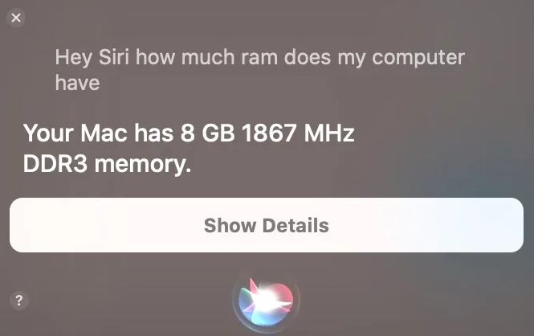

**Alors que Apple, avec Siri, se bat contre [Google Assistant](https://play.google.com/store/apps/details?id=com.google.android.apps.googleassistant&hl=fr) et [Amazon Alexa](https://play.google.com/store/apps/details?id=com.amazon.dee.app&hl=fr) pour le trône d'assistant vocal, les utilisateurs de MacOS ne devraient pas chercher plus loin. À partir de 2016, Apple a intégré [Siri](https://www.apple.com/fr/siri/) à toutes les versions de MacOS depuis [Mojave](https://support.apple.com/fr-fr/HT201475), et tu peux également l'activer sur les anciens Macs. Bien que la plupart de ses fonctionnalités soient identiques à celles d'iOS, il existe quelques commandes spécifiques à Mac qui pourraient te surprendre. Voici quelques-unes des choses les plus surprenantes que tu peux faire avec Siri sur ton Mac.**

<!--more-->

## Trouver des fichiers ou des dossiers

Si tu as besoin de trouver un groupe de fichiers, un dossier ou un fichier individuel, il suffit de demander à Siri. Bien sûr, tu peux aussi le faire avec [Spotlight](https://support.ring.com/hc/fr-fr/articles/115003340986-Ring-Spotlight-Cam-Battery-Installation-et-configuration), mais le faire avec ta voix est tellement plus cool. En effet, tu dis juste : _"Dis Siri, trouve les documents PowerPoint créés la semaine dernière"_ ou _"Siri, montre-moi des photos de janvier 2020"_. Alors, Siri vérifiera ta demande et t’amènera directement au résultat.

## Lire les mails

L'époque où tu devais lire ton propre mail est révolue, mais celle où Siri lit tes mails à ta place ne fait que commencer.

Tout d'abord, pour lancer la lecture tu dois dire : _"Dis Siri, lis tes emails"_. Ainsi, tu verras un aperçu des mails non lus. Ces mails apparaissent alors dans la fenêtre de Siri. Et, si tu cliques sur l'un d'entre eux avec la souris, tu peux basculer sur le mail et y répondre En revanche, si tu ne fais rien, Siri continuera à lire tous tes mails non lus, t’indiquant l'objet, le nom de l'expéditeur, ou encore la date et l'heure auxquelles le mail est arrivé dans ta boîte de réception.

## Recherches sur internet avec Google

Google et Siri sont amis depuis un peu moins de trois ans, ce qui permet de faire des recherches sur internet directement depuis la fenêtre Siri. Il te suffit de dire : "Dis Siri" et de poursuivre ta recherche.

Ainsi, les résultats de la recherche s'affichent dans la fenêtre Siri et, simplement en appuyant sur un résultat, tu peux passer directement au navigateur web. D'ailleurs, si tu veux trouver des photos du [nouveau MacBook Air](https://www.apple.com/fr/macbook-air/) sur Internet, il te faut juste dire : "Dis Siri, trouve des photos du MacBook Air 2020 sur internet" et tu verras les douze premières recherches sur le Web.

C'est également possible de rechercher les meilleures applications météo, mais pour ça tu peux aussi aller regarder mon article directement ici : [Les 5 meilleures applications météo](https://tobal.fr/les-5-meilleures-applications-meteo-pour-android/).

## Ouvrir des Sites web

Bien que Google soit très utile pour les recherches sur le web, que faire si tu sais déjà quel site tu veux aller ? C’est facile. Tu dis simplement : "Dis Siri, ouvre [tobal.fr](https://tobal.fr/)", et il s'ouvrira dans Safari.

## Glisser des résultats de Siri

Sais-tu que tu peux faire glisser les résultats de Siri directement dans une autre application ou une fenêtre MacOs ? Disons que tu veux utiliser une des images du MacBook Air 2020 que tu as trouvée via une recherche Google pour un document de recherche.

Trouve l'image grâce à Siri, et tu peux ensuite faire glisser cette image directement dans la page du document. D'ailleurs tu peux faire ça avec plusieurs applications et plusieurs résultats de recherche.

## À propos de ton Mac

Cette requête Siri sur MacOs n'est pas une requête que tu utiliseras très souvent, mais elle n'en est pas moins utile.

Si tu veux obtenir des informations sur ton ordinateur, Siri peut t’aider. Tu as besoin de connaître le numéro de série de ton Mac pour prendre rendez-vous au [Genius Bar](https://www.apple.com/fr/retail/geniusbar/) par exemple. Ainsi, il te suffit de demander : "Dis Siri, quel est le numéro de série de mon Mac ?" Tu peux aussi demander à Siri combien de mémoire de stockage tu as, combien de RAM ou quel type de processeur est installé.

Bien sûr, tu peux aller directement sur le logo Apple dans le coin supérieur gauche de la barre de menu pour obtenir ces informations, mais le faire avec Siri est tellement plus amusant.

## Lancer des Applications

C'est aussi facile qu'amusant. Demander à Siri de lancer le navigateur Safari est aussi simple que de dire "Dis Siri, lance Safari".

D'ailleurs, tu peux faire la même chose avec n'importe quelle application installée, y compris les applications par défaut d'Apple et les applications tierces. Si l'application n'est pas installée, Siri te dirigera alors vers le [Mac App Store](https://apps.apple.com/fr/genre/mac/id39?mt=12) pour installer l'application. Elle ouvrira même l'App Store directement sur cette page.

Tu peux aussi faire une demande un peu plus générale et demander à Siri d'ouvrir plutôt le dossier des applications.

## Contrôler les paramètres de base

Pourquoi appuyer sur les boutons pour augmenter ou diminuer le volume de la musique ou des films alors que Siri peut le fait pour toi ?

> Dis Siri, augmente le volume".

Tu veux augmenter ou diminuer la luminosité de l'écran ? Tu veux activer ou désactiver le Bluetooth ? Le Wi-Fi ? Tu peux effectuer toutes ces tâches en demandant simplement à Siri.

Siri est plein de charme et de personnalité. Même si elle n'est pas vraiment à la hauteur de Google Assistant et Amazon Alexa, elle est plus que convaincante. Pour les utilisateurs de Mac, c'est vraiment ton seul choix, alors découvre ces surprises de Siri qui peuvent rendre tes sessions informatiques quotidiennes un peu plus faciles et beaucoup plus amusantes. Et toi, quel est ton conseil Siri préféré ? Quelle phrase dis-tu le plus souvent à Siri ?
