Si tu as déjà travaillé en équipe, alors tu as probablement déjà utilisé la méthode de gestion Kanban. Le concept de Kanban fait référence à la répartition du travail en tâches selon différents statuts. Ainsi, les petites tâches cumulées permettent d'atteindre un objectif final à une date limite donnée. Chaque partie du processus est visible par l'ensemble des membres du groupe.

<!--more-->

Les tableaux physiques sont un moyen fantastique de commencer le Kanban. Cependant, à long terme, les tableaux Kanban en ligne deviennent beaucoup plus pratiques. En effet, ils offrent de nombreuses fonctionnalités utiles qui peuvent te faire gagner beaucoup de temps. C'est pourquoi envisager d'utiliser une application Kanban peut s'avérer salvateur dans ton organisation.

Une bonne appli de kanban aide beaucoup les équipes à comprendre la façon dont elles utilisent leur temps. La plupart des applications kanban fournissent des données qui aident à trouver facilement les domaines qui posent problème. Et une fois le problème trouvé, les équipes peuvent trouver des solutions à leurs problèmes. Certaines applications kanban sont basées sur la méthodologie Kanban.

Les tableaux Kanban deviennent des outils de collaboration de projet en ligne populaires pour les équipes dont le flux de travail est régulier. Les applications kanban permettent de visualiser, d'organiser et de gérer le travail de la meilleure façon possible. Avec de tels outils, tu peux facilement gérer ton flux de travail et te concentrer sur les travaux qui apportent une réelle valeur à tes clients. Pour t’aider dans ton choix de kanban, voici une liste non exhaustive des meilleurs applications de Kanban pour gérer ses projets.

## Trello

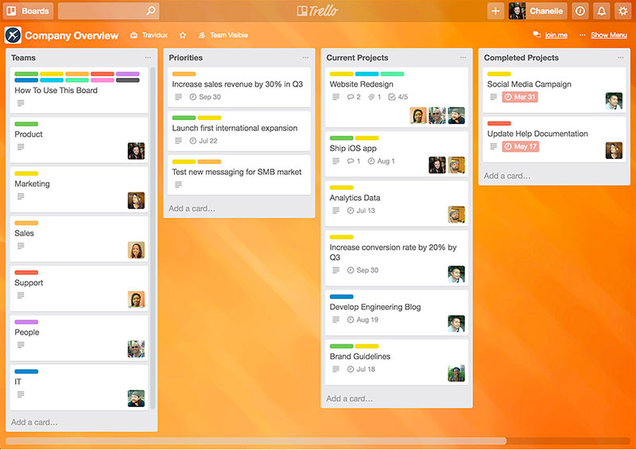

Quand on parle de Kanban, il est difficile de faire mieux que [Trello](https://trello.com/). Qu'il s'agisse de légèreté, de facilité d'utilisation, de courbe d'apprentissage, de performances, de disponibilité, de simplicité ou même d'intégration, d'évolutivité, de support et bien plus encore, Trello est à l'avant-garde dans de nombreux domaines.

Trello est un excellent logiciel de collaboration. Il utilise des tableaux, des listes et des cartes au lieu d'une structure basée sur le temps. Une règle typique de style Kanban dans Trello comporte trois colonnes : « To-Do, Doing et Done » (à faire, en cours, terminée). La première colonne "To-Do" (à faire) comporte des cartes avec une tâche à accomplir. Lorsque tu choisis la tâche qui t’es assignée, tu peux la déplacer dans la colonne "Doing" (En cours). Lorsqu'une tâche est terminée, déplace-la dans la colonne « Done » (Terminée).

Trello est rapide comme l'éclair. Tu veux créer un tableau dans Trello ? Le curseur clignote déjà sur la première colonne en attendant que tu lui donnes un nom. Tape et appuie sur Entrée et tu l'as nommé. Appuie à nouveau sur Entrée, et Trello ajoutera la deuxième colonne que tu peux maintenant nommer. Et ça continue ainsi…

Nous parlons de tranquillité d'esprit et de confort en ce qui concerne Trello. Et c'est pourquoi plus de 25 millions de personnes font confiance à Trello pour tous leurs besoins en matière de kanban.

**Tarifs :**

**Free** - Nombre illimité de cartes, limite de taille de fichier à 10 Mo

**Business Class** - à 9,99 $ par utilisateur/mois. Nombre illimité de cartes et de mises sous tension, limite de taille de fichier de 250 Mo, gestion des rôles. Assistance prioritaire, gestion des utilisateurs, et plus encore.

**Entreprise** - à 20,83 $ par utilisateur/mois, tout illimité, SSO et 2FA, SLA amélioré. Support prioritaire par e-mail et téléphone, cryptage des fichiers, examen de sécurité personnalisé, et plus encore.

## Asana

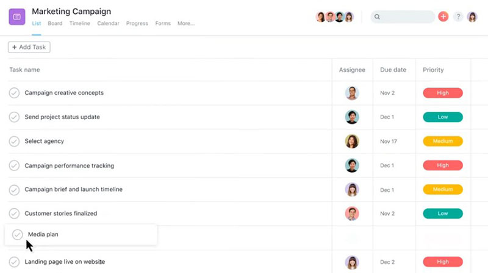

[Asana](https://app.asana.com/), avec sa structure polyvalente et une multitude d'options, fait également partie de cette liste des meilleurs applis de Kanban. En effet, Asana est spécialisée dans la gestion des flux de travail. Sa fonction de tableau Kanban permet à l'équipe de gérer les projets de manière optimale. Elle permet de visualiser tout le travail à faire et tout le travail en cours.

Démarre de nouveaux projets et gère ton flux de travail avec cette application Kanban de pointe. Utilise des diagrammes de Gantt, des champs personnalisés, des dépendances et des calendriers de projet à code couleur.

Asana facilite la collaboration entre les membres de l'équipe grâce aux tags, aux commentaires, aux "j'aime" et "suivre". Tu peux travailler avec plusieurs équipes à la fois avec des paramètres différents. De plus, Asana utilise des notifications incluant des mises à jour par e-mail. Ainsi, elle s’assure que tu ne manques aucune information. Elle organise et hiérarchise ton flux de travail en un clin d'œil. Et ceci avec des commandes simples et une interface claire.

**Tarifs :**

**Basic** - Gratuit à vie

**Premium** - à 9,99 $/utilisateur/mois facturée annuellement (11,99 $/utilisateur/mois)

**Business** - à 19,99 $/utilisateur/mois facturé annuellement (23,99 $/utilisateur/mois)

**Entreprise** - il faut contacter le service commercial pour obtenir un devis

## ProofHub

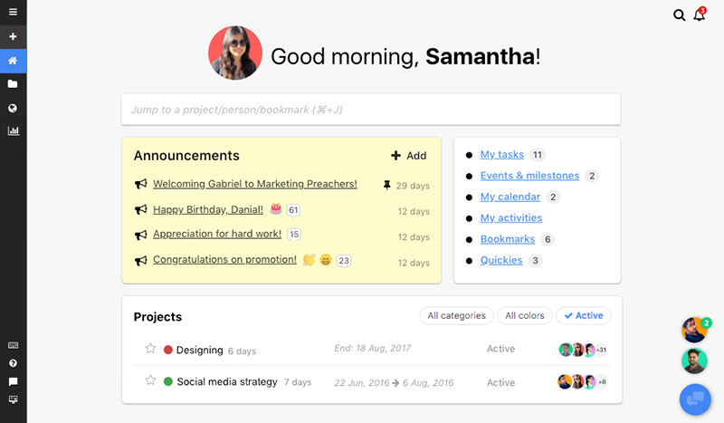

[ProofHub](https://www.proofhub.com/) fait parti des logiciels de planification de projet les plus utilisés pour mettre en œuvre la méthode Kanban. C’est même l’une des meilleurs applis de kanban que tu puisse envisager d'utiliser en ce moment. Elle donne une feuille de route pour suivre l'échéance de chaque tâche. ProofHub Kanban est très utilisé par les équipes distantes et internes.

Un des avantages de cette application est son côté visuel. Elle permet aux équipes de s'autogérer en voyant les tâches passer par plusieurs étapes sur le tableau Kanban. Cela permet notamment d'avoir un travail en cours plus clair dans le flux de travail.

En plus des fonctionnalités de base du Kanban, ProofHub fournit un ensemble d'outils pour t’aider à te déplacer dans les flux de travail sans perdre la tête en cours de route. ProofHub te permet par exemple d'ajouter des listes de tâches, puis d'abonner des membres de l'équipe à certaines tâches de ces listes. Tu peux également choisir les personnes à abonner à une étape particulière. Avec un tableau Kanban en ligne, tu auras également la possibilité d'associer un flux de travail à cette liste.

Cela signifie que tu peux obtenir une représentation visuelle des tâches placées dans des colonnes. Chaque colonne représente alors une étape particulière du flux de travail. Et si tu progresse dans le projet, la tâche passera d'une étape à l'autre. Les personnes affectées à la tâche de l'étape suivante travailleront maintenant sur la tâche. Elles pourront la faire passer à la colonne suivante lorsqu'elles l'auront terminée.

ProofHub offre également des fonctions simples de suivi du temps. Par exemple, utiliser un système de suivi du temps pour contrôler le temps passé pour chaque tâche. Ou encore, saisir manuellement le temps pour suivre la productivité de l'équipe. Ces données enregistrées se transforment en une feuille de temps que tu utiliseras plus tard à des fins multiples.

**Tarifs :**

**Essential** - 45 $ par mois (facturé annuellement). Fonctionnalités de base, ainsi que 40 projets, utilisateurs illimités et 15 Go de stockage

**Ultimate Control**\- 89 $ par mois (facturés annuellement). Projets illimités, 100 Go de stockage, nombre d'utilisateurs illimité et toutes les fonctionnalités avancées

## LeanKit

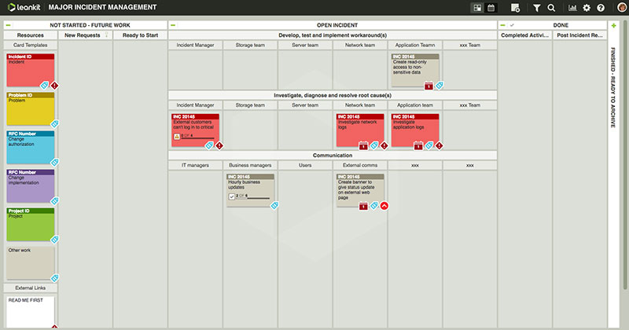

Toutes les applications kanban n'ont pas ce même design de colonne. [LeanKit](https://www.planview.com/demos/) est l'une des meilleurs applications Kanban pour faire passer ta gestion de projet à un niveau supérieur. Bien que l'adaptation à ce logiciel soit quelque peu compliquée au début, en raison du fait qu'il a un format différent des autres Kanban, tu pourras gérer des tâches très complexes après un certain entraînement. LeanKit devient même relativement facile à utiliser et prend en charge les méthodologies Lean et Agile.

LeanKit offre une expérience différente en utilisant des groupes et des sections au design unique, des flux de travail plus complets et plus complexes impliquant l'utilisation du Kanban.

Tu peux définir des sections pour chacune de tes listes sur un tableau LeanKit. Ensuite, tu peux regrouper les cartes en fonction de caractéristiques similaires. Egalement, tu peux fixer et attribuer des limites de cartes à chacune de ces sections de sorte que personne ne puisse ajouter plus que le nombre de cartes souhaité. Elle te permet la personnalisation de la façon dont tu utilises tes tableaux, listes, sections et groupes de tâches.

**Tarifs :**

**Teams** \- à 19 $ par utilisateur/mois, tableaux illimités, bibliothèque de modèles, métriques et rapports Lean, API LeanKit

**Scaled Teams** - à 29 $ par utilisateur/mois. Champs personnalisés, modèles configurables, vues de travail personnalisées. Rapports avancés, SSO et API d'approvisionnement des utilisateurs, essai gratuit disponible

**Entreprise** - il faut contacter le service commercial pour obtenir un devis, intégration de Planview Enterprise One

## Kanbanize

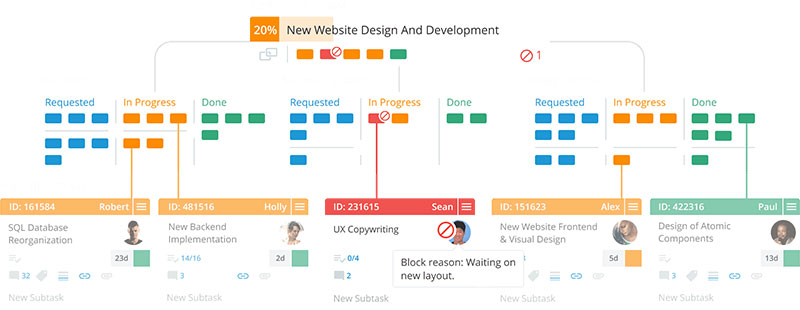

Si tu ne veux pas t’embêter à intégrer des applications tierces pour créer un flux de travail parfait, [Kanbanize](https://kanbanize.com/fr) est fait pour toi.

C’est un logiciel de gestion de projet Agile qui offre une puissante prise en main sur le concept de Kanban. Il propose un ensemble de nouvelles fonctionnalités spécialement conçues pour gérer plusieurs projets simultanément. L’application est chargée de fonctionnalités innovantes, mais offre en même temps une interface propre et sans encombrement.

Kanbanize combine des fonctionnalités de type Kanban et l'automatisation des activités. Tu peux l’utiliser pour la gestion de projets, de programmes et de portefeuilles. L’appli permet de visualiser les éléments clés et de les décomposer en plusieurs niveaux de postes de travail hiérarchiques. Cela offre une transparence inégalée et améliore le flux de travail au niveau mondial.

Tu peux notamment tirer le meilleur parti de cette application Kanban en utilisant la fonctionnalité des cartes de liaison. Cela te permet de visualiser les dépendances des tâches, et donc, plus de diagrammes de Gantt. Kanbanize permet de définir le nombre de cartes que chaque membre de l'équipe peut ajouter dans une colonne. Idéal pour identifier la quantité de travail de chacun des membres de l’équipe.

En matière de suivi des performances, Kanbanize est un véritable régal pour les utilisateurs. Obtiens des mises à jour en temps réel grâce à un suivi facile des temps associés aux tâches. Puis, met la main sur des rapports intelligents.

**Tarifs :**

Kanbanize propose un modèle de tarification flexible qui change en fonction des ajouts et du nombre de membres de l'équipe

A partir de 99 $ par mois, payés annuellement pour un maximum de 15 utilisateurs

## Kanban Tool

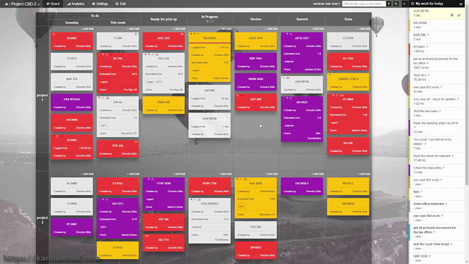

[Kanban Tool](https://kanbantool.com/fr/) est une application de gestion de projet qui possède un grand nombre de fonctionnalités concernant la gestion des tâches et des projets, le suivi et l'analyse du temps, ainsi que la collaboration.

Cette application Kanban se consacre aussi aux rapports de ton travail. Tu peux cloner à la fois des cartes et des tâches sur Kanban Tool, ce qui te fait gagner du temps. Tu peux voir une répartition de tes cartes par type, un rapport de temps, un flux cumulatif pour voir comment ton travail progresse et un journal détaillé des changements avec ce qui a été fait**.**

Kanban Tool dispose d'une belle interface avec des options bien placées sur le tableau central du Kanban.

En plus, tu peux même personnaliser la mise en page selon tes besoins. Pour le prix qu'elle offre, la clientèle qu'elle a acquise et la liste impressionnante de fonctionnalités qu'elle propose, cette application vaut le détour.

**Tarifs :**

**Gratuit** - 2 forums, 2 utilisateurs, pas de pièces jointes

**Team** - 5 $ par utilisateur et par mois, nombre illimité de tableaux et de pièces jointes

**Entreprise** - 9 $ par utilisateur et par mois, suivi et rapport du temps, automatisation des processus, nombre illimité de tableaux et de pièces jointes

## Jira

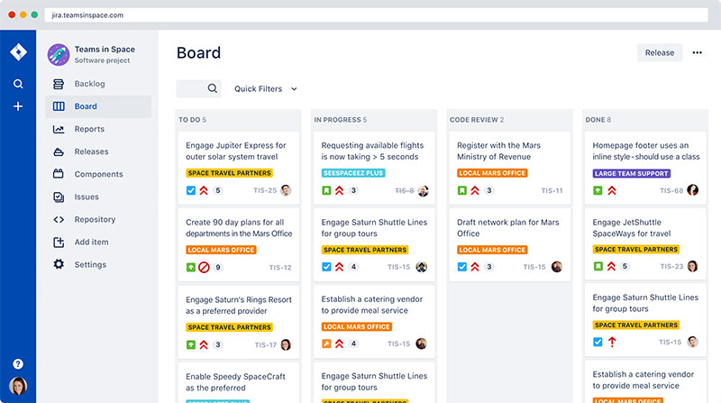

Si tu préfères que ton travail soit organisé sous forme de rapports et de graphiques, alors tu devrais essayer [Jira](https://www.atlassian.com/fr/software/jira). Avec cette application, il sera simple d'ordonner chaque tâche et de les affecter ensuite à un graphique. Ainsi, cela te permettra de retirer différents types de rapports en fonction de tes besoins.

Jira met à ta disposition un flux de travail prêt à l'emploi, avec les éléments classiques suivants : **en attente, développement, en cours, et terminé.** Les utilisateurs peuvent également créer des tableaux Kanban pour suivre leurs tâches. Ces flux de travail robustes, flexibles et personnalisables créent le processus qui convient à ton entreprise, que ce soit dans le cadre du Kanban ou du Scrum. Jira est extensible à l'échelle de ton entreprise au fur et à mesure de sa croissance.

Le fait de disposer de deux modes d'organisation des tâches aide toujours l'équipe à s'adapter à la nouvelle gestion. Tu peux obtenir des informations à partir de différents outils pour comprendre le pipeline de développement. Les développeurs peuvent utiliser le Jira Query Language (JQL) pour créer des filtres personnalisés, les intégrer aux outils de développement, définir des flux de travail et automatiser des processus à l'aide des API de Jira.

**Tarifs :**

**Gratuit** : 10 utilisateurs, 2 Go de stockage, des tableaux Scrum et Kanban, des rapports souples, des flux de travail personnalisables et des intégrations tierces

**Mise à niveau si** : tu souhaites un stockage et des utilisateurs supplémentaires ainsi qu'un meilleur support et des fonctionnalités avancées comme l'accès anonyme, les journaux d'audit, les feuilles de route avancées, etc.

**Premium Jira** : à partir de 7 $ par utilisateur/ mois

## Notion

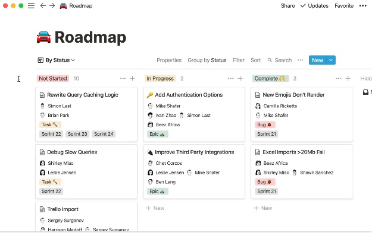

Pour ceux qui recherchent encore plus de liberté dans leur organisation, [Notion](https://notion.so) sera certainement la clé pour une productivité optimale.

En effet, Notion est une application très intuitive avec un aspect minimaliste qui part de la feuille blanche. tu verras au fur et à mesure apparaître toutes les fonctionnalités souhaitées. Un seul menu, un prise en main hyper rapide, une centralisation et un gain de temps. Notion a su jouer dans la cour des grands avec du rapide et efficace.

Côté productivité, tu peux aisément retrouver dans cette application un tableau de bord pour tesTo Do List, un calendrier éditorial, mais aussi un peu d'analyse de KPI, et nombreuses autres données utiles pour réaliser tes tâches que ce soit en projets personnels ou plus professionnels. Finalement on retrouve un effet Bullet Journal dans Notion avec l'avantage considérable d'avoir toutes les fonctionnalités disponibles en trois clics maximum.

Et pour aller encore plus loin, il est très facile de partager, en lecture seule ou modification, tes pages, et même relier certaines applications directement dans tes pages Notion, notamment pour créer un CRM, ou encore des tableaux Kanban voire même gérer tes campagnes marketing directement dans Notion.

Si tu veux en savoir plus, je t'ai détaillé tout ça dans un article à découvrir ici : [Notion, l'outil de productivité ultime](https://tobal.fr/notion-outil-de-productivite-ultime/). Tu découvriras toutes les possibilités que propose Notion pour améliorer ta productivité et ton organisation au quotidien, les points positifs et négatifs que j'ai pu trouver.

**Tarifs :**

**Gratuit :** Pour une utilisation individuelle des fonctionnalités de base, Pages illimitées, Partage jusqu'à 5 invités.

**Personal Pro :** 4 $ par mois. Utilisation professionnel pour une seule personne, téléchargement illimité des fichiers, nombre d'invité illimité, historique, Accès aux API.

**Équipe :** 8 $ par mois. Membres illimités, espace collaboratif de travail, accès avancés, outils d'administration

**Business & Entreprise :** (Essai gratuit) Tous les avantages de l'équipe, plus des contrats personnalisés, une sécurité avancée, SAML SSO, etc.

## Zoho Projects

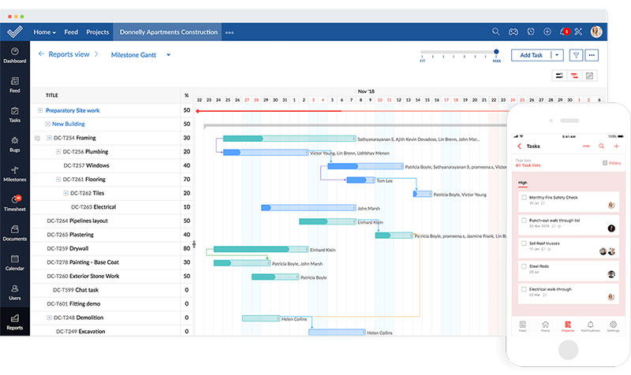

Parmi les meilleurs applis kanban, [Zoho Projects](https://www.zoho.com/fr/projects/) offre une plate-forme unique et complète que les entreprises utilisent pour leurs besoins de gestion de projets. La planification dans la gestion de projet permet de décomposer une tâche en éléments gérables pour s'assurer qu'une échéance n'est jamais dépassée.

Zoho Projects monte d'un cran ses fonctionnalités attrayantes avec sa courbe d'apprentissage très courte qui en fait un choix évident pour les gestionnaires de projets. L’application donne un accès centralisé à tous tes projets. La gestion de projet Kanban dans Zoho Projects offre l'avantage de disposer de visuels pour savoir à qui est attribuée la tâche ou encore quelles sont les échéances à venir. Il est même possible d'avoir une vue d'ensemble de chaque projet.

Une plongée plus approfondie dans les fonctionnalités de l’application révèle qu'elle possède à peu près tout ce que l'on peut attendre d'un puissant logiciel de gestion de projets. Tableaux Kanban interactifs, jalons, dépendances des tâches, capacités de collaboration, suivi des problèmes, et bien plus encore. L'outil porte plusieurs casquettes différentes et elles s'adaptent parfaitement !

Une fois que tu es dans l'application, utilise le tableau de bord personnalisable pour suivre instantanément tes performances. Il est mis en place pour que tu puisses jeter un coup d'œil sur tes progrès et prendre des décisions plus judicieuses en cours de route.

**Tarifs :**

**Standard** - à 240 $ pour 10 utilisateurs. 10 projets, suivi du temps, pièces jointes jusqu'à 5 Go. Dépendance des tâches, intégration CRM, et plus

**Express** - à 480 $ pour un maximum de 15 utilisateurs. Toutes les fonctionnalités standard, ainsi que 10 modèles de projets. Des tâches récurrentes, l'approbation des feuilles de temps, des vues personnalisées, et plus encore

**Premium** - à 1020 $ pour un maximum de 20 utilisateurs. Toutes les fonctionnalités Express, plus 20 modèles, 100 Go de fichiers joints. L'utilisation des ressources, le budget du projet et d'autres fonctionnalités avancées

**Entreprise** - à 1500 $ pour un maximum de 24 utilisateurs. Toutes les fonctionnalités Premium, ainsi que 30 modèles, des fichiers joints de 120 Go. Un domaine personnalisé, un Gantt global et un chemin critique, avec bien d'autres fonctionnalités clés

## Taskworld

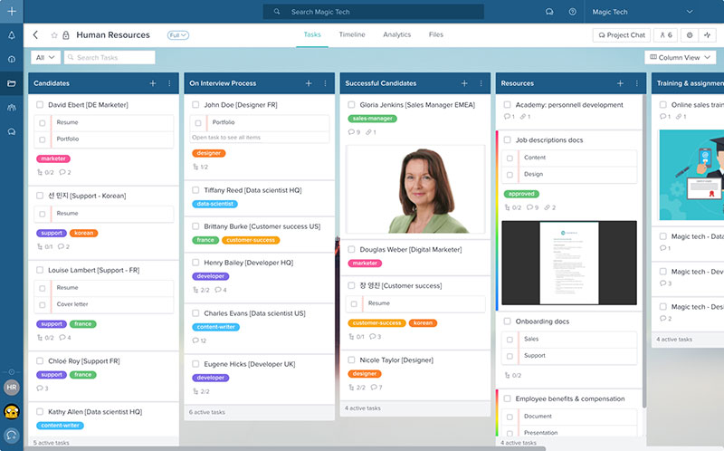

[Taskworld](https://taskworld.com/fr/) est un outil Kanban formidable et logique conçu pour des scénarios du monde réel. Il s'agit d'un tableau Kanban simple qui peut réduire tes cartes à une seule ligne de texte où tu peux voir plusieurs tâches à la fois. Les tableaux Kanban sont des projets différents, et il peut se produire des scénarios dans lesquels différentes tâches de différents tableaux dépendent les unes des autres.

Quelles que soient les informations à ajouter, tu peux les voir directement sur la carte, y compris les dates d'échéance, le suivi du temps global et les trois principaux éléments de la liste de contrôle de cette carte. Taskworld garde les choses au minimum. Les tâches que tu crées sur le tableau sont automatiquement réduites à une seule ligne, ce qui te permet d'avoir plus d'espace pour autant de tâches que tu veux sur ton tableau.

Clique sur la carte et les détails de la carte s'ouvrent. Tout est là, des dates de début et de fin aux assignés, aux suiveurs, aux tags, au temps passé qui est suivi par un minuteur intégré pour Taskworld, ainsi qu'un champ de localisation qui peut attacher la même carte à plusieurs tableaux et le travail peut être suivi pour la même tâche sur différents tableaux simultanément.

**Tarifs :**

**Professionnal** - à 10,99 $ par utilisateur/mois (essai gratuit de 15 jours). Un espace de travail, un nombre illimité de tâches et de projets, un nombre illimité d'invités. Plusieurs lieux de travail, des délais, un chat, des @mentions, et plus encore.

**Entreprise** - il faut contacter le service commercial pour obtenir un devis

## Breeze

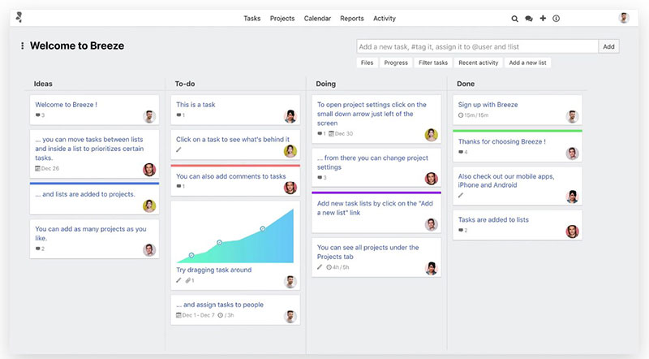

[Breeze](https://www.breeze.pm/) est l'une des rares applis de Kanban en ligne qui offre une suite complète d'outils de gestion de projet, allant de la gestion du budget, du suivi du temps et des dépenses, au suivi des étapes, à la planification du projet et à la gestion du portefeuille.

L’application possède une interface simple. Et, bien qu'elle offre un éventail d'outils plus large que de nombreuses plateformes, Breeze se fait un devoir de ne pas être une "usine à fonctionnalités", en ne conservant que les fonctionnalités qui sont essentielles. Pour sa simplicité, elle est un peu cher. Mais si tu veux quelque chose de léger, sans encombrement et rationalisé, Breeze vaut son prix.

Breeze te permet également de suivre le nombre d'heures qu'un membre de l'équipe a consacrées à une tâche spécifique. Tu peux aussi programmer des réunions visibles par tout le groupe, créer des programmes d'activités personnalisés pour chaque client, et bien plus encore.

Comme Breeze intègre un outil Kanban dans une suite de gestion complète, les fonctionnalités supplémentaires (et donc le prix plus élevé) ne conviennent pas aux projets plus simples.

D'autre part, la nature globale de cette plateforme est un avantage majeur pour certaines équipes. En effet, tu peux y gagner du temps, des ressources et éviter les maux de tête en gérant tout en un seul endroit.

**Tarifs :**

**Solo** - à 14 $ par mois, 1 utilisateur, projets illimités, clients gratuits illimités

**Freelancers** \- à 29 $ par mois, 5 utilisateurs, projets illimités, clients gratuits illimités

**Small Business** - à 59 $ par mois, 12 utilisateurs, projets illimités, clients gratuits illimités

**Large Team** - à 129 $ par mois, 30 utilisateurs, projets illimités, clients gratuits illimités

**Entreprise** - à 249 $ par mois, 60 utilisateurs, projets illimités, clients gratuits illimités

## Blossom

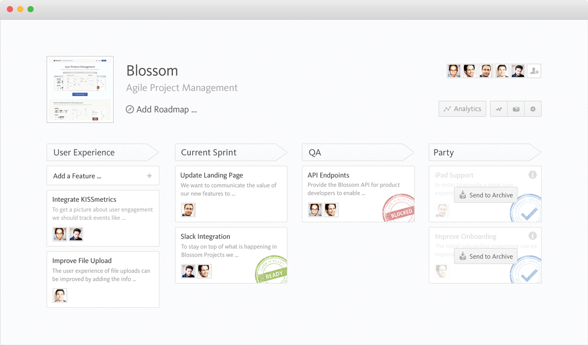

Alors que Trello apporte de la valeur grâce à des power-ups et un temps de réponse ultra rapide pour tous tes besoins de travail, [Blossom](https://blossom.co/kanban.html) offre un design magnifique et intuitif et fait partie des meilleurs applis de Kanban disponibles aujourd'hui.

Blossom, comme son nom l'indique, est le Kanban d'un processus, un outil plus spécialisé. Il offre des fonctionnalités particulièrement utiles pour les équipes de développement de logiciels.
Avec une interface simple et claire, des intégrations intégrées et des fonctionnalités supplémentaires comme la limitation des travaux en cours, l’analyse des performances, etc.

Chaque liste sur le tableau Kanban représente une étape du projet. Toutes les nouvelles tâches doivent être ajoutées à la liste la plus à gauche. Ensuite, elles sont déplacées vers la droite au fur et à mesure de la floraison des étapes du projet. C'est un concept intéressant qui nécessite une approche systémique pour faire les choses.

Blossom propose également un résumé rapide du nombre de cartes expédiées au cours d'une période. Mais aussi, un tableau qui indique le temps nécessaire pour remplir chaque carte. Blossom s'intègre également à GitHub, en récupérant les engagements afin que tu puisses suivre le travail sur le code à partir de tes cartes.

**Tarifs :**

A partir de 19 $/mois pour des équipes de 5 utilisateurs maximum

**Startup, Company et Entreprise** - Les détails des prix de Blossom ne sont pas disponibles. Il faudra donc contacter le service commercial pour obtenir un devis

## Smartsheet

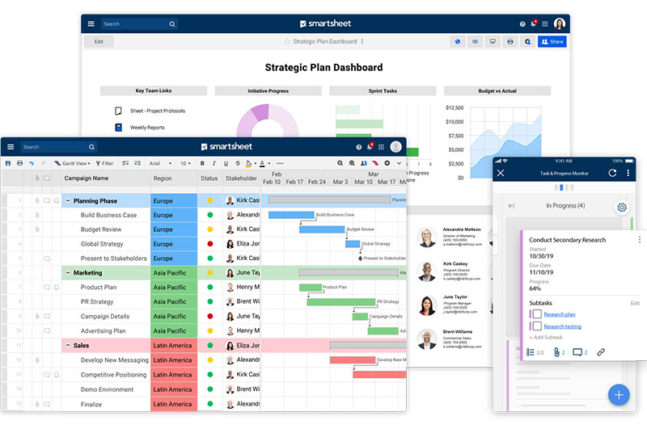

[Smartsheet](https://fr.smartsheet.com/) est une application très populaire auprès des chefs de projet, qui offre un large éventail de fonctionnalités de gestion des tâches, qu'elles soient ou non Kanban. La proposition de Smartsheet est plus complète que celle d'autres applications similaires. Elle te permet de centraliser tout ton travail dans un seul panneau de contrôle. Ainsi, tu peux stocker toutes les données importantes de l'entreprise et de l'équipe en un seul et même endroit, ce qui facilite la recherche si nécessaire.

Tu peux facilement créer une vue des tâches à partir de zéro ou les importer d'une feuille existante si elle est constituée de types de listes spécifiques. En outre, tu peux créer des filtres personnalisés pour te concentrer uniquement sur les choses importantes. Les cartes peuvent également être partagées avec n'importe qui pour collaborer sur des idées.

Les autres fonctionnalités clés de Smartsheet sont un calendrier interactif et des vues Gantt, un portail centralisé pour la communication entre les équipes, l'accès à des applications tierces, et bien plus encore.

**Tarifs :**

**Individual** - à 14 $ par mois, vues multiples (y compris la carte), tableau de bord, modèles, accès de tiers, flux de travail automatisés

**Business** - à 25 $ par utilisateur/mois, analyse des données, journal d'activité, tableau de bord, intégrations tierces, et plus

**Entreprise** - prix non communiqué, toutes les fonctionnalités du plan business, ainsi que des contrôles d'accès plus importants, des fonctionnalités d'administration du système et des groupes

**Premier** - prix non communiqué, toutes les caractéristiques du plan Entreprise, plus le support de prime et les applications de prime

## KanbanFlow

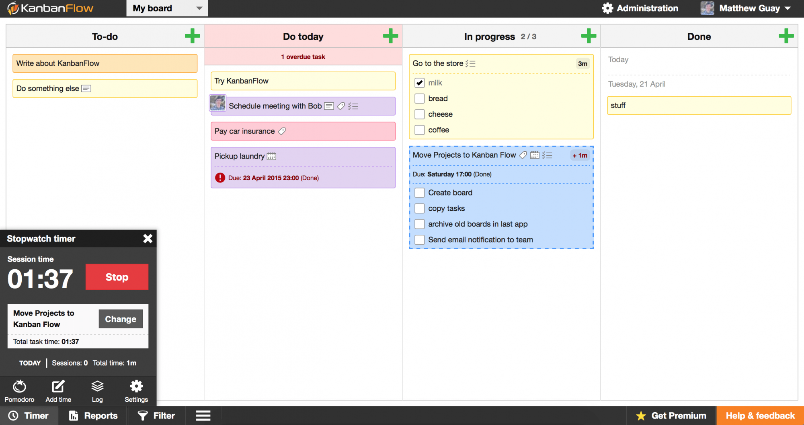

[KanbanFlow](https://kanbanflow.com/) est **un outil de gestion de projet allégé, doté d'un ensemble d'outils uniques** dont les options de gestion des tâches et des projets sont placées efficacement dans trois modules principaux. Au lieu de répartir des centaines d'options sur l'interface, KanbanFlow facilite la vie grâce à une interface propre et succincte .

KanbanFlow **est conçue pour suivre le temps que prend chaque partie de tes tâches.** Le tableau Kanban contient des colonnes pliables de cartes représentant des tâches. Ainsi, tu peux plier une carte lorsque tu n'en as pas besoin. Il offre toutes les fonctionnalités de base dont toute équipe aurait besoin, y compris la gestion des tâches (avec des sous-tâches, des tâches récurrentes et des dépendances, diverses cartes ainsi que des rapports personnalisables).

De plus, il te permet de suivre le temps passé sur les tâches. Par conséquent, tu peux prévoir les estimations de temps pour les projets futurs. Il encourage la technique de Pomodoro pour un travail ciblé, mais tu peux régler le minuteur selon tes besoins. Avec un plan payant très abordable pour la mise à niveau, KanbanFlow attirera ton attention.

**Tarifs :**

**Gratuit** - Gratuit pour toujours, tâches et conseils illimités, gestion du temps, support standard, 2 rôles de permission

**Premium** - 5 $ par utilisateur/mois, options avancées de rapport et d'exportation, support prioritaire, 4 rôles de permission

Avec cette liste, tu trouveras forcément ton bonheur pour gérer tes projets, réaliser tes objectifs et centraliser tout ça pour une productivité optimale. Tu as peut-être déjà testé certaines de ces applications, ou tu en utilise peut-être même déjà au quotidien ?

Dis-moi en commentaires lesquelles t'attirent, lesquelles tu préfères ou au contraire celles qui mériteraient quelques améliorations à tes yeux. Il y en a pour tous les goûts et toutes les utilisations.
