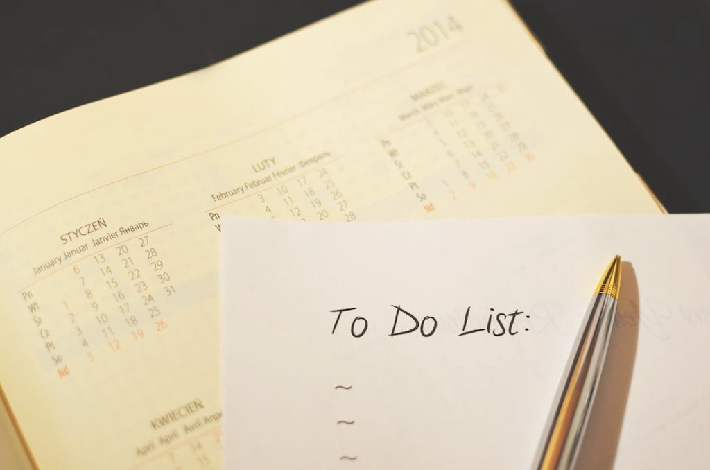
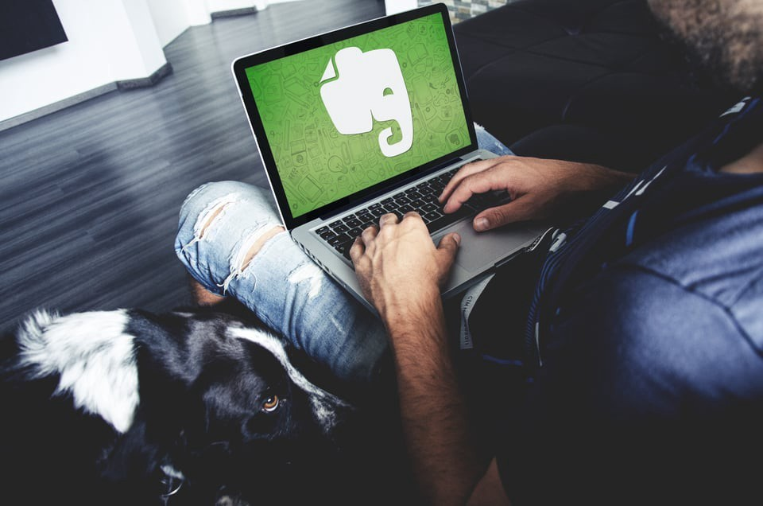
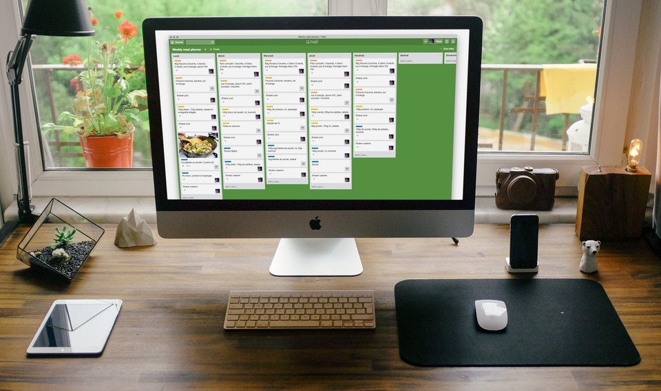

Est-ce que ce terme, "productivité", signifie encore quelque chose ? Est-ce que des applications pour booster la productivité existent vraiment ? Si c’est le cas, il y en a tellement qu'on perd un temps fou, rien qu'à choisir.

Alors... quelles applications de productivité pourrais-je vous recommander ?

<!--more-->

Il existe un paradoxe dans cette ère numérique. Nous avons davantage de ressources, toujours plus de choix, et pourtant il devient de plus en plus difficile de faire avancer les choses. Pourquoi ? Parce que nous sommes paralysés au moment d’agir. Nous n'arrivons jamais à nous décider. C’est une réalité.

Nous vivons une époque passionnante, où tout le monde peut faire tout et n'importe quoi. Mais ce tout devient compliqué. **Il faut une structure, un cadre de référence**. Vous avez également besoin d'[outils qui vous aideront à rester organisé](https://tobal.fr/9-outils-essentiels-a-ma-productivite-que-jutilise-au-quotidien/). Face à une nouvelle initiative ou à un projet prometteur, il est préférable de disposer d'un moyen de tenir ses objectifs, de rester sur la bonne voie et de planifier ses activités. En effet, vous voulez être en mesure de prendre des décisions et de faire avancer les choses, de la manière la plus efficace possible. C’est là que réside la clé de la productivité.

## **Donc pour y parvenir, existe-t-il un outil ou un ensemble d'outils spécifiques qui peuvent vous aider à booster votre productivité ?**

Oui, les outils ne manquent pas. Notez que je parle d’_outils_ au pluriel, et pas au singulier.  

Mais la première chose que je recommande à quiconque qui souhaite se lancer, c'est de commencer par choisir UNE seule application. Ne commencez pas à installer une douzaine d'applications à la fois, cela risque de vous submerger. Bien sûr, vous aurez besoin de fonctionnalités complémentaires par la suite. Mais, cela viendra au fur et à mesure que vous avancez et que vous vous lancez dans de nouveaux projets. Pour commencer, un seul outil fera l'affaire.

## Alors, quel est cet outil pour booster votre productivité ?

Je vous recommande différentes options, mais je ne citerai pas une application en particulier. Pourquoi ? Parce que **chaque application a ses spécificités, ses avantages et ses inconvénients, qui devront être étudiés plus en détails et évalués pour voir s'ils correspondent spécifiquement à vos besoins.** La seule chose dont je suis sûr et que je peux affirmer, c'est que le meilleur outil est celui qui répond à ces critères :

- Vous prenez du plaisir à l’utiliser
- Vous l’utilisez tous les jours
- Il vous aide à remplir vos objectifs

Je le répète encore une fois en une phrase :

> Les meilleures applications pour booster votre productivité sont celles que vous aimez utiliser tous les jours et qui vous permettent de réaliser vos objectifs.

Maintenant que cela a été dit, je vous propose une sélection de logiciels ou d'applications que je vous recommande, accompagnée à chaque fois de quelques suggestions.

## To-do lists

.La première chose à faire, en général, c'est justement de [dresser une liste de choses à faire](https://tobal.fr/la-meilleure-facon-de-gerer-sa-todo-list/). Vous n'avez même pas besoin d'utiliser une application pour cela. Un simple stylo et du papier suffisent. Mais, vous devez absolument disposer d'une liste de tâches pour atteindre vos objectifs. À moins que vos tâches ne soient extrêmement simples, vous devrez décomposer vos objectifs en tâches plus simples et plus détaillées.

**Ce qui importe, c'est que vous devez disposer de toute [la « puissance » de votre cerveau](https://tobal.fr/10-manieres-dont-votre-cerveau-vous-joue-des-tours/)**, de toutes vos capacités et de votre clairvoyance. Pour ce faire, il faut vous sortir toutes vos tâches de la tête et les répertorier dans un endroit où vous les trouverez et où vous pourrez y avoir accès.

**Suggestions:** [Todoist](https://todoist.com/), [Any.do](http://www.any.do/), [TickTick](https://ticktick.com/), [Microsoft To-Do](https://www.microsoft.com/fr-fr/microsoft-365/microsoft-to-do-list-app)

## Décharger son esprit en prenant de notes

Ensuite, vous devez disposer d'un endroit où vous pouvez vous débarrasser de tout ce qui se passe dans votre tête. Vos idées, vos pensées, vos propres réactions. Ce que vous apprenez et ce que vous jugez important et nécessaire. Il se passe trop de choses autour de nous, et trop de choses dans nos têtes pour que nous ne puissions pas nous décharger mentalement et nous vider la tête quelque part.

Ici encore, le support n'a pas d'importance : stylo et papier, auto-enregistrement (audio ou vidéo), utilisation d'une [application de prise de notes](https://tobal.fr/trop-de-paperasse-debarrassez-vous-de-vos-papiers-avec-evernote/), tout ce qui fonctionne pour vous et qui vous vient naturellement sera parfait

Le plus important, c'est que ce soit automatique : [faites-en une habitude](https://tobal.fr/prenez-de-bonnes-habitudes-de-vie-pour-reussir/). Cela doit venir comme une seconde nature d'écrire ou de stocker sous une forme quelconque vos pensées et vos idées.

Tout d'abord, cela libérera la puissance de traitement de votre cerveau ; la rétention d'informations n'est pas le but premier du cerveau. Il est préférable d'utiliser le cerveau pour traiter les informations et trouver des solutions, et non pour stocker des données. Ensuite, cette méthode vous permettra d'éviter l'anxiété liée à l'oubli d'idées et de points de vue importants et précieux, ce qui libérera encore plus votre esprit de la surcharge d'informations.

**Recommandations:** [Roam Research](https://roamresearch.com/), [Evernote](https://tobal.fr/utiliser-evernote-deuxieme-cerveau/), [OneNote](https://www.microsoft.com/fr-fr/microsoft-365/onenote/digital-note-taking-app?ms.url=onenotecom&rtc=1), [SimpleNote](https://simplenote.com/), [Google Keep](https://keep.google.com/), stylo et papier.

## Suivi des objectifs, suivi des habitudes et suivi du temps

**Tout ce qui compte, ce sont les résultats**. Et pour obtenir des résultats, il faut s'améliorer. Pour vous améliorer, vous devez garder une trace de ce que vous faites, et savoir si cela fonctionne ou non. Vous devez mesurer les effets de vos actions, ainsi que vos progrès (ou l'absence de progrès, ce qui vous indiquerait qu'il faut changer les choses). Si vous ne quantifiez pas et ne suivez pas les choses que vous faites, il est inutile d'[essayer d'atteindre un objectif](https://tobal.fr/atteindre-ses-objectifs-comment-on-fait-pour-de-vrai/) spécifique en premier lieu. Vous pourriez tout aussi bien naviguer sur l'océan sans boussole.

Vous devez également - et c'est extrêmement important - gérer votre temps. Ne tombez pas dans le piège de la [loi de Parkinson](https://fr.wikipedia.org/wiki/Loi_de_Parkinson). Le suivi de votre temps et du temps que vous consacrez à une tâche vous donnera un aperçu de la façon dont vous gérez votre temps. **Et [la gestion de votre temps](https://tobal.fr/devenez-un-pro-de-la-gestion-du-temps-les-meilleures-applications/), tout comme les résultats, est un élément clé pour atteindre vos objectifs.** Elle vous permet de savoir si vous vous en sortez bien ou pas.

**Suggestions :** 

- Pour suivre vos objectifs : [Goalmap](https://tobal.fr/goalmap-une-app-pour-prendre-de-bonnes-habitudes-et-atteindre-vos-objectifs/), [GoalsOnTrack](http://www.goalsontrack.com/), [LifeTick](https://lifetick.com/), [Google Spreadsheet](https://www.google.com/sheets/)
- Pour suivre vos habitudes : [Momentum](https://tobal.fr/momentum-vous-aide-a-prendre-de-bonnes-habitudes/) , [Productive](https://itunes.apple.com/us/app/productive-habit-tracker-daily/id983826477?mt=8), [Streaks](https://itunes.apple.com/us/app/streaks/id963034692?mt=8&at=11l7ja&ct=tss), [Habitica](https://habitica.com/static/home), [Loop](https://play.google.com/store/apps/details?id=org.isoron.uhabits&hl=fr&gl=US), [Habithub](https://www.thehabithub.com/).
- Et pour le suivi de votre temps : [RescueTime](https://www.rescuetime.com/), [TimeDoctor](https://www.timedoctor.com/), [ManicTime](http://www.manictime.com/), [Timely](https://memory.ai/timely).

## Organiser vos projets avec une application de gestion de projet

<figure>

<figcaption>

La gestion de projet n'est pas réservée qu'aux professionnels !

</figcaption>

</figure>

La gestion de projet, qui semble être une activité propre au monde de l’entreprise, est en fait quelque chose que vous pouvez utiliser dans votre vie, personnelle ou professionnelle, pour améliorer considérablement la façon dont vous abordez vos projets et en avoir une vision claire.

Bien que [ces applications de gestion de projet](https://tobal.fr/les-meilleures-applications-de-kanban-pour-gerer-ses-projets/) présentent les mêmes caractéristiques que les to-do lists et les outils de prise de notes, elles se distinguent de ces dernières en les intégrant toutes dans une structure organisationnelle de haut niveau. Si vous avez l'habitude de gérer des projets - et cela va d'une activité annexe à de longues vacances autour du monde ou à la rénovation de votre maison - le fait d'avoir un moyen de vous organiser en gestionnaire de projet améliorera grandement votre expérience et vous permettra de voir les choses avec plus de clarté.

**Suggestions:** [Notion](https://tobal.fr/notion-outil-de-productivite-ultime/), [Trello](https://trello.com/), [Asana](https://asana.com/).

## **Conclusion**

Vous savez l'essentiel. Il existe d'autres catégories d'applications, mais aucune n'est vraiment indispensable. Vous pouvez réaliser même vos rêves les plus fous en utilisant une seule ou une combinaison des applications mentionnées ci-dessus.

Toutes ces applications sont de très bons outils qui vous aideront à booster votre productivité et réaliser tout ce que vous avez envie de faire, c'est juste une question de goût et de préférence. Bien entendu, elles ne feront pas le travail à votre place. Comme tout autre outil, elles sont aussi efficaces que les personnes qui les utilisent. Mais ce sont néanmoins des outils particulièrement intéressants à utiliser, et avec lesquels travailler.
