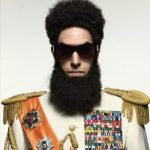

L'histoire est remplie de dictateurs machiavéliques, et bien qu'ils avaient de nombreux défauts, on ne peut nier qu'ils étaient efficaces pour accomplir les choses. Voici ce que nous pouvons apprendre d'eux, malgré leur nature mauvaise.

## Forcer les gens à prendre des décisions difficiles lorsque leur volonté est faible

 Travailler lorsque vous êtes fatigué conduit souvent à prendre de mauvaises décisions. Un bon dictateur sait exactement comment exploiter cela.

Le dictateur cubain Fidel Castro adorait organiser des réunions à quatre heures du matin où souvent il sortait les gens de leur lit, afin de les mettre dans une situation de désavantage. Le dictateur russe Joseph Staline utilisait également cette tactique, rencontrant même Winston Churchill tard dans la nuit pour élaborer des plans dans le but d'attaquer l'Allemagne.

**Comment vous pouvez utiliser cette technique**: Dans ces deux cas, l'idée est d'aborder vos ennemis (ou alliés) lorsque leur volonté est faible et qu'ils sont prêts à tout pour travailler avec vous. D'un autre côté, c'est un rappel que la "fatigue décisionnelle" est réelle et facilement exploitable par n'importe qui, quelque soit le but. Tant que possible, évitez ces réunions à quatre heures du matin avec votre patron (ou donnez-vous assez de temps pour vous réveiller à l'avance).

## Créer un plan sur 5 ans pour vos objectifs personnels

 Popularisé par Joseph Staline, le plan quinquennal était un plan économique qui cherchait à parvenir à une finalité spécifique, comme l'industrialisation, la baisse du chômage, et la résolution générale pour les problèmes possibles. En plus d'être adopté en Russie soviétique, l'idée d'un plan quinquennal a été utilisée en République populaire de Chine, de Cuba, du Pakistan, du Vietnam et d'autres.

**Comment vous pouvez utiliser cette technique**: Bien que votre plan quinquennal sera probablement moins ambitieux que ceux des dictateurs, l'idée elle-même reste toujours une fondation solide. Afin de savoir ce que vous voulez, et comment vous organiser et travailler afin d'achever ce ou ces objectifs, le blog spécialisé **The Simple Dollar** vous conseille de créer un "schéma sur 5 ans". Voici quelques éléments pour vous aider à créer ce plan:

> À quoi ressemblera votre travail ? À quoi votre famille ressemblera ? Comment sera votre apparence physique ? Comment sera votre maison ? À quoi ressemblera une journée typique ? De quoi aurez vous envie ? Comment sera votre cercle social ?
>
> Je vous encourage à écrire au moins 10 réponses à chacune de ces questions, qui décriront comment vous voudrez que votre vie soit dans 5 ans.

La planification sur cinq ans est une excellente façon de comprendre ce que vous voulez, et comment vous voulez l'obtenir.

Photo par singkham.

## Éliminer les menaces à votre pouvoir

 Afin de s'accrocher au pouvoir, le dictateur a souvent besoin de se débarrasser des menaces. Cela signifie purger vos plus proches amis et conseillers quand ils sont trop proches de vous lorsque vous sentez qu'ils veulent votre pouvoir.

Presque tous les dictateurs utilisent cette tactique dans une certaine mesure, mais Fidel Castro et Alberto Fujimori du Pérou étaient particulièrement bons dans ce domaine. Comme Steven Levitsky le souligne dans le "Journal of Democracy", Fujimori est le plus célèbre pour son auto-coup d'état en 1992, où il a fermé le Congrès, a suspendu la constitution et s'est débarrassé de l'appareil judiciaire afin qu'il puisse prendre le contrôle total.

Dans leur livre "Le Guide du dictateur: Pourquoi le mauvais comportement est presque toujours de bonne politique", les auteurs Bruce Bueno de Mesquita et Alastair Smith décrivent cette idée comme "la Règle numéro 1:. Gardez votre équipe gagnante aussi petite que possible".

Fidel Castro était légendaire à ce sujet. Après que la révolution cubaine ait été un succès, 12 de ses 20 ministres avaient démissionné (ou ont été chassés). Y compris le camarade révolutionnaire de Castro, Che Guevara. Castro envoya Guevara en Bolivie pour une mission en 1967, puis il coupa son financement et le laissé en rade parce qu'il voyait Guevara comme une menace.

**Comment vous pouvez utiliser cette technique**: Si quelqu'un conteste votre autorité, la meilleure façon de traiter ce souci est de se débarrasser de la personne en question. Soyez prudent et gardez un œil sur tous ceux qui lorgnent sur votre position. A l'inverse, si vous cherchez à monter en rang, soit vous devez être extrêmement gentil envers la personne dont vous visez la position, afin qu'elle ne se sente pas menacée. Sinon, vous pouvez essayer de vous débarrasser d'elle avant qu'elle ne se débarrasse de vous, mais c'est beaucoup plus risqué (et pas aussi sympa).

Photo par imagerymajestic

## Développez votre "culte de la personnalité"

Le culte de la personnalité est une astuce de dictateur bien connu. L'idée est de se présenter comme la chose la plus incroyable possible. Pour ce faire, les dictateurs se parent d'habitudes ridicules, plaquent leurs photos partout dans le pays, ou se donnent même des surnoms.

Le plus grand exemple de cette technique était Kim-Jong-Il, de Corée du Nord, alias le "Guide suprême de la Corée du Nord".Le culte de la personnalité de Kim Jong-il a atteint le point où, selon l'auteur Chol-hwan Kang et Pierre Rigoulot dans leur livre "Les Aquariums de Pyongyang: dix ans au Goulag nord-coréen", les gens croyaient vraiment que Kim Jong-Il pourrait contrôler la temps avec ses tenues.

Cette pratique est courante chez les dictateurs. Le dictateur communiste Nicolae Ceauşescu de Roumanie se surnomma "Le génie des Carpates", l'italien Benito Mussollini s'est fait paraître plus grand en autorisant uniquement les photos sous un certains angle, Mouammar Kadhafi de Lybie n'employait que des gardes du corps féminins connus sous le nom "Garde Amazonienne", et le cambodgien Pol Pot n'autorisait carrément presque aucune photo de lui.

**Comment vous pouvez utiliser cette technique**: Votre propre culte de la personnalité n'est pas susceptible d'obtenir un impact aussi vaste que celui d'un dictateur, mais l'idée que vous pouvez l'embrasser et le contrôler est importante pour des choses comme la recherche d'emploi. Comme nous l'avons mentionné précédemment, l'auto-promotion éhontée lors des entretiens n'est pas une mauvaise chose. Le plus important est d'établir et de maintenir votre identité en ligne, qui est essentiellement la version non-dictateur de votre "culte de la personnalité". Si vous contrôlez ce que les autres voient, vous pouvez contrôler leur perception de vous, et vous finirez par paraître encore mieux que vous l'êtes réellement.

## Faites des discours forts et directs

 L'histoire nous apprend qu'Adolf Hitler était l'un des meilleurs orateurs de l'histoire des dictateurs. Au moins une partie de cela est dû à son timing. Avant qu'Hitler ne commence à prendre le pouvoir, les discours publics étaient souvent une chose intellectuelle, complexe, telles que les conférences. Les prestations d'Hitler, en revanche, étaient excitées, émotives et remplie de slogans. Dans Richard J Evan, dans son livre "L'avènement du 3ème Reich", décrit l'art oratoire d'Hitler ainsi:

> (Hitler) a gagné une grande partie de son succès oratoire en disant à ses auditoires ce qu'ils voulaient entendre. Il a utilisé un langage simple et direct que les gens ordinaires peuvent comprendre, des phrases courtes, puissantes, des slogans émotifs. Souvent, il commençait son discours tranquillement, pour capter l'attention de son auditoire, puis il l'amenait progressivement à un point culminant, où sa voix profonde et un peu rauque augmenterait de hauteur, et escaladerait dans un crescendo vers une finale vive avec des cris, accompagnés soigneusement de gestes dramatiques répétés... alors qu'il emmenait son auditoire dans une émotion de frénésie Il n'y avait pas de qualification ou de graduations dans ce qu'il disait, tout était absolu, sans compromis, irrévocable, inflexible, immuable, définitif ... il respirait la confiance en soi, l'agressivité, la croyance dans le triomphe final de son parti, même un sentiment de destinée.

Bien sûr, les discours d'Hitler étaient tous sur la rhétorique et l'absolution. Bien que le contenu en lui-même était horrible, il était incontestablement bon pour amener les gens à se mettre d'accord avec lui, même quand il les qualifiait ouvertement de stupide. Bruce Loeb, du ministère de la Communication et études rhétorique à l'Université d'état de l'Idaho, souligne qu'Hitler a utilisé quelques astuces pour amener les gens de son côté. Il s'agissait principalement d'arguments qui utilisaient la passion plutôt que la raison, le raisonnement "noir et blanc" comme propagande, et bien sûr, la répétition.

**Comment vous pouvez utiliser cette technique**: À certains égards, les discours d'Hitler étaient semblables au techniques psychologiques pour implanter des idées dans l'esprit de quelqu'un, mais Hitler en faisait plus que beaucoup trop. Pourtant, beaucoup peut être appris de son style de discours. Hitler revoyait obsessionnellement ses discours, et il a toujours su les livrer dans un langage simple que tout le monde puisse comprendre. Gardez cela à l'esprit lorsque vous donnez une présentation au travail, relevez le moral du bureau après une mauvaise journée, ou même présentez un argument à un ami. Simplifiez votre discours (plutôt qu'essayer de paraître intelligent), mettez un peu d'émotion, mettez-le en place lentement, et votre auditoire vous mangera dans la main.

## Apprenez de l'expérience, pas des livres

Les dictateurs les plus fort et qui ont tenu le plus longtemps ont embrassé l'idée que "la pratique rend parfait", et sont "allés au front" à un moment donné afin d'acquérir de l'expérience. Jules César, par exemple, a combattu sur le front avec ses soldats, dormi dans le même lit, et apprit d'eux avant de trouver la citation: "L'expérience est le maître de toutes choses."

Napoléon Bonaparte, bien sûr, passa par la même chose lorsqu'il fit son chemin à travers la Révolution française (avant de finalement s'installer comme un dictateur). Vladimir Lénine lisait beaucoup et avait une grande culture, mais a passé son temps à pratiquer son métier, écrivant des pamphlets, et parlant avec son peuple. Mao a pris un peu plus loin et a utilisé son éducation de paysan non seulement comme une excuse pour ne pas prendre de douches, mais aussi comme moyen de contrôle sur les paysans.

**Comment vous pouvez utiliser cette technique**: le fait établi est que l'expérience est plus nécessaire que toute documentation afin d'accomplir un travail avec succès. Les nouvelles expériences sont importantes, et avec la pratique vous finirez par devenir le meilleur possible.

Comme nous le savons, l'expérience est souvent meilleure que les diplômes ou l'éducation dans le marché du travail. Les stages sont plus précieux que les diplômes, car quand vous avez de l'expérience, vous êtes un meilleur candidat pour le poste. Si vous ne disposez pas d'expériences, faites tout ce que vous pouvez pour en avoir.

Photo par Michal Marcol

Traduit de l'anglais. Par Thorin Klosowski
