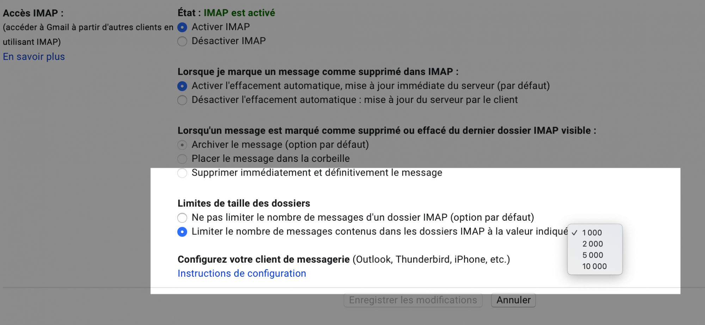

Possesseur d'un MacBook Air avec 128 Go de disque dur (autant dire : pas beaucoup), je me suis récemment aperçu que mon espace disque diminuait tout seul. Après m'être trituré les méninges quelques temps, j'ai compris d'où ça venait : je venais de configurer Mail, le client email natif de macOS, pour [récupérer tous les emails de mon compte Gmail](https://support.apple.com/fr-fr/guide/mail/mail35803/mac).

<!--more-->

J'en avais marre de passer par l'application web de Gmail, je voulais une application native (mais c'est une autre histoire). Toujours est-il que, l'un des avantages avec une application native, c'est qu'on peut acccéder à ses emails même sans connexion. Je sais qu'il existe [Gmail hors connexion](https://support.google.com/mail/answer/1306849?hl=fr), mais je trouve ça moins intuitif qu'une application native dédiée.

Alors pouvoir lire ses mails hors-ligne c'est cool, mais cela implique forcément de télécharger l'ensemble de ses mails. D'où mon espace disque qui rétrécissait tout seul. J'avais plusieurs gigas d'archives mail qui s'étaient téléchargées suite à la configuration de mon compte Gmail dans l'application Mail. Et si vous êtes comme moi, avec un "petit" disque dur, les mails vont vite prendre beaucoup de place.

Si vous êtes dans ce cas, réjouissez-vous, car je vais vous proposer deux solutions pour récupérer de l'espace disque.

## Limiter le nombre de messages IMAP

La première solution (et la plus rapide à mettre en place), consiste simplement à modifier un paramètre de configuration dans Gmail.

Rendez-vous sur votre compte Gmail, allez dans les paramètres, et allez dans la partie **Transfert POP et IMAP**, puis sélectionnez l'opton **Limiter le nombre de messages contenus dans les dossiers IMAP à la valeur indiquée**, et choisissez entre 1 000, 2 000, 5 000 et 10 000.

[](https://tobal.fr/wp-content/uploads/2020/06/CleanShot-2020-06-02-at-19.49.48@2x.png)

Sachant que moins la valeur sera grande et plus vous gagnerez de la place, mais qu'en revanche, moins de messages seront accessibles. Par exemple, en choisissant 1000, seuls les 1000 derniers messages reçus seront visibles dans mail. Tout dépend de votre utilisation: si vous n'avez pas souvent besoin de consulter vos anciens messages, une petite valeur suffira.

## Déplacer les fichiers Mail vers une carte SD

Avant de procéder à cette manipulation, je vous suggère de [sauvegarder vos emails](https://tobal.fr/sauvegarder-ses-emails-gmail-en-local-avec-gmvault/) d'abord.

Si vous disposez d'une carte SD, ou d'un disque dur externe constamment branché, vous pouvez également y déplacer l'ensemble des fichiers de Mail.

On ne peut pas modifier l'emplacement des fichiers directement dans les paramètres de l'application, mais on peut contourner le problème subtilement grâce aux [liens symboliques](https://fr.wikipedia.org/wiki/Lien_symbolique).

Créer un lien symbolique est une fonctionnalité extrêmement pratiques de macOS (et des systèmes Unix en général) qui va nous permettre de "simuler" la présence d'un fichier ou d'un dossier à un certain emplacement, alors qu'en vrai il se trouve ailleurs. C'est ce qui va nous permettre de faire croire à Mail que les fichiers n'ont pas bougé, alors qu'en réalité nous les avons déplacé ailleurs.

Pour y parvenir, il faut procéder en deux étapes.

- Assurez-vous que Mail est bien fermé, et allez dans le dossier **~/Library/Mail/** (astuce: dans le Finder, appuyez sur **CMD+MAJ+G** pour faire apparaitre la fenêtre de navigation, et copiez coller le chemin). Dans le dossier vous verrez un sous-dossier **IMAP-votre@email.com**. _Déplacez_ ce dossier à l'endroit désiré - sur la carte SD, en l'occurence.
- Une fois le dossier déplacé, lancez le terminal et copiez la commande ci-dessous, en prenant soin de remplacer "votre@email.com" par votre adresse réelle, et "Transcend" par le nom de volume de votre carte mémoire (la mienne est une Transcend, d'où le nom):

    ```
    ln -s /Volumes/Transcend/IMAP-votre@email.com ~/Library/Mail/IMAP-votre@email.com
    ```

    Validez en appuyant sur Entrée, et le tour est joué


Voilà, si vous avez bien suivi ces deux étapes, vous aurez crée un lien symbolique pour faire croire à Mail que votre dossier d'emails se trouve toujours au même endroit, alors qu'en réalité vous l'avez déplacé ailleurs.

À noter que cette astuce marche pour beaucoup d'autres dossiers et applications. À vous de tester !

## Conclusion

Mail est un excellent logiciel qui permet de se passer de l'application web Gmail. Cependant, quand on dispose d'un espace de stockage limité - ce qui est souvent le cas quand on a un MacBook avec un petit disque dur - et qu'on a [beaucoup de mails](https://tobal.fr/comment-bien-gerer-ses-emails-reprenez-le-controle-de-votre-boite-de-reception/), Mail a vite tendance à occuper notre précieux espace. Heureusement, avec un peu d'ingéniosité, il est possible de récupérer de la place pour nos photos de vacances ainsi que nos GIFs de chats ;).
